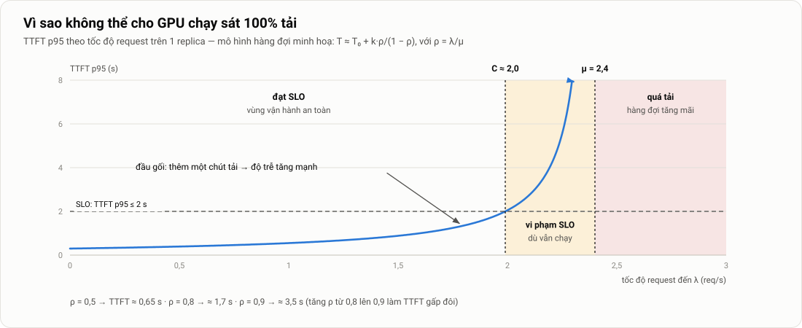

# 1. Bài toán, yêu cầu và phạm vi

> Thuộc [bộ tài liệu đồ án](../mo-ta-chi-tiet-do-an.md#bộ-tài-liệu) · Dùng cho chương 1 và mục 3.1 của luận văn · Giá trị các yêu cầu và chỉ tiêu: [Thông số và chỉ tiêu](00-thong-so.md)

**Tóm tắt nhanh**
- Chi phí chính của một dịch vụ LLM là **GPU**. Nhu cầu GPU phụ thuộc vào số request đang được xử lý cùng lúc, và con số này dao động mạnh theo thời gian.
- Lý thuyết hàng đợi cho thấy độ trễ **tăng vọt khi tải tiến gần năng lực tối đa**. Vì vậy hệ thống luôn phải chừa dư năng lực; cấp phát tĩnh theo mức tải đỉnh thì lãng phí GPU phần lớn thời gian.
- Autoscaling giải được bài toán lãng phí, nhưng với LLM nó gặp ba trở ngại riêng: **cold start kéo dài hàng phút**, **metric quen thuộc (GPU utilization, VRAM) không phản ánh tải**, và **đơn vị tài nguyên rời rạc, đắt**. Các thao tác vận hành quen thuộc như scale-down hay rolling update cũng có cạm bẫy riêng với GPU.
- Bài toán của đồ án là một **bài toán vận hành**: xây dựng một nền tảng để doanh nghiệp tự host LLM, giữ được chất lượng phục vụ với số GPU ít nhất có thể, và vận hành được hằng ngày.
- Đồ án thuộc dạng **thiết kế – triển khai – đánh giá**. Bảy mục tiêu trong đề cương được giữ nguyên và cụ thể hoá thành **F1–F7** và **N1–N8**. Mỗi yêu cầu có cách kiểm chứng; kết quả cuối cùng là một **bảng nghiệm thu**.
- Phạm vi có ranh giới rõ, kèm giả định, hạn chế, và các **điều kiện so sánh công bằng** (cùng máy, cùng tải, cùng phiên bản, cùng trạng thái đầu).

---

## 1. LLM serving là gì và vì sao tốn GPU

### 1.1. Một request đi qua những bước nào

Khi người dùng gửi một câu hỏi tới dịch vụ LLM, hệ thống làm bốn việc:

1. **Tokenize**: chuyển văn bản thành chuỗi token. Mỗi token trung bình tương ứng khoảng 3–4 ký tự tiếng Anh; tiếng Việt thường tốn nhiều token hơn cho cùng lượng nội dung.
2. **Prefill**: đưa toàn bộ prompt qua model **một lần**. Kết quả là token đầu tiên của câu trả lời, cùng với **KV-cache** (bộ nhớ đệm lưu trạng thái attention của các token đã xử lý).
3. **Decode**: sinh lần lượt **từng token** của câu trả lời. Mỗi bước decode đọc lại toàn bộ trọng số (weights) của model và KV-cache.
4. **Detokenize và stream**: chuyển token thành văn bản rồi gửi dần về cho người dùng.

Chi tiết từng pha nằm trong [Kiến thức nền §1](02-kien-thuc-nen.md#1-llm-inference-cơ-bản).

### 1.2. VRAM bị chiếm vào đâu

Lấy ví dụ một GPU 24 GB chạy Qwen2.5-7B-Instruct ở định dạng BF16, với `--gpu-memory-utilization 0.9`:

| Thành phần | Dung lượng | Ghi chú |
|---|---|---|
| Weights | ~15,2 GB | 7,6 tỷ tham số × 2 byte |
| Bộ nhớ trung gian (activation), CUDA graph | ~1–2 GB | vLLM đo lúc khởi động |
| **KV-cache** | **~4–5 GB** | Phần còn lại trong ngân sách 0,9 × 24 GB |
| Phần chừa lại | ~2,4 GB | 10% VRAM không cấp phát |

Mỗi token trong KV-cache của Qwen2.5-7B chiếm khoảng 56 KiB (cách tính ở [Kiến thức nền §1.3](02-kien-thuc-nen.md#13-kv-cache)). Vậy 4,5 GB KV-cache chứa được khoảng **80 nghìn token**. Nếu mỗi request dài trung bình 1.000 token (prompt cộng câu trả lời), một GPU chỉ giữ được khoảng **80 request cùng lúc**. Request thứ 81 phải chờ trong hàng đợi.

### 1.3. Vì sao "số request đồng thời" là đơn vị tiền tệ của LLM serving

Pha decode bị **giới hạn bởi băng thông bộ nhớ**: mỗi bước phải đọc toàn bộ 15 GB weights, bất kể batch có 1 request hay 32 request.

Ví dụ trên GPU A10 (băng thông khoảng 600 GB/s), một bước decode mất tối thiểu khoảng 15,2 GB ÷ 600 GB/s ≈ **25 ms**:
- Batch chỉ có 1 request: khoảng 40 token/s cho cả GPU.
- Batch 32 request: gần 32 × 35 ≈ **1.100 token/s**. Thời gian mỗi bước tăng không đáng kể vì vẫn chỉ đọc weights một lần.

Như vậy **gộp nhiều request vào cùng một batch** là cách duy nhất để khai thác GPU hiệu quả. Khi số request vượt quá khả năng chứa của batch và KV-cache, request mới phải chờ. Đây là lý do đồ án chọn **số request đồng thời** làm tín hiệu scale chính (cấu hình A2, xem [Kiến trúc §10](03-kien-truc-autoscaling.md#10-phân-tích-từng-metric)).

---

## 2. Đặc điểm của tải thực tế

| Đặc điểm | Mô tả | Hệ quả cho hệ thống |
|---|---|---|
| **Theo chu kỳ** | Tải cao vào giờ làm việc, thấp vào ban đêm và cuối tuần | Cấp phát theo đỉnh thì lãng phí vào giờ thấp điểm |
| **Có đợt tăng đột biến (burst)** | Tải tăng nhanh trong vài phút, ví dụ khi có sự kiện hoặc một chiến dịch | Hệ thống phải phản ứng nhanh hơn thời gian khởi động một replica |
| **Request không đồng nhất** | Prompt dài từ vài chục đến hàng nghìn token; câu trả lời cũng vậy | Thời gian phục vụ mỗi request chênh nhau hàng chục lần; "số request/giây" không phản ánh đúng lượng việc |
| **Phân phối đuôi dài** | Một ít request rất dài chiếm phần lớn tài nguyên | Độ trễ p99 nhạy cảm hơn nhiều so với trung bình |

Các bộ trace công khai như BurstGPT [5] và Azure LLM Inference Trace [3], [18] cho thấy những đặc điểm trên có thật. Ba kịch bản tải của đồ án (thấp ổn định, tăng đột ngột, cao kéo dài) tái hiện các pha chính của một ngày tải. Phát lại trace thật là hướng mở rộng ([E13](06-ke-hoach-quan-ly.md#e13-đánh-giá-mở-rộng-trace-thật-nhiều-lượt-độ-nhạy-tham-số)).

---

## 3. Góc nhìn hàng đợi: vì sao không thể cho GPU chạy sát 100%



*Hình 10. Độ trễ theo tốc độ request trên một replica. Đồ thị được vẽ từ mô hình hàng đợi đơn giản để minh hoạ; đường cong thật sẽ được đo ở bước đo năng lực (Hình 15).*

Gọi μ là thông lượng tối đa của một replica (số request/giây nó xử lý được) và λ là tốc độ request đến. **Mức sử dụng** là ρ = λ/μ. Trong mô hình hàng đợi M/M/1 cổ điển, thời gian trung bình trong hệ thống là:

$$
W = \frac{1}{\mu - \lambda} = \frac{1/\mu}{1-\rho}
$$

Công thức này nói lên ba điều:
- Khi ρ nhỏ, độ trễ gần bằng thời gian phục vụ thuần.
- Khi ρ tiến tới 1, độ trễ **tăng không giới hạn**. Chỉ cần tăng ρ từ 0,8 lên 0,9 là thời gian chờ đã tăng gấp đôi.
- Khi λ > μ, hàng đợi **tăng mãi**. Hệ thống không bao giờ tự hồi phục được cho tới khi tải giảm.

LLM serving phức tạp hơn M/M/1 ở hai điểm. Thứ nhất, thông lượng μ **tăng theo kích thước batch** cho tới khi KV-cache đầy. Thứ hai, thời gian phục vụ phụ thuộc độ dài request. Tuy vậy, hình dạng "đầu gối" của đường cong vẫn giữ nguyên, và dữ liệu đo năng lực sẽ cho thấy điều đó.

**Hệ quả thực tế:** năng lực dùng được **C** (tốc độ lớn nhất còn đạt SLO) luôn nhỏ hơn μ. Hệ thống phải giữ ρ ở mức 0,7–0,85, tức là **luôn có dư năng lực**. Câu hỏi đặt ra là dư bao nhiêu và vào lúc nào, và autoscaling chính là cách điều chỉnh lượng dư này theo thời gian.

---

## 4. Bối cảnh giả định và ba cách cấp phát


*Hình 1. Cùng một tải thay đổi theo thời gian, ba cách cấp phát cho ba kết quả khác nhau. C là năng lực của một replica.*

**Bối cảnh.** Một doanh nghiệp vài nghìn nhân viên muốn có trợ lý AI nội bộ: hỏi đáp tài liệu, soạn thảo, hỗ trợ viết code. Dữ liệu nội bộ **không được gửi ra API bên ngoài**, nên phải tự host một model mã nguồn mở trên GPU của mình hoặc GPU thuê. Đây là tình huống rất gần với nơi làm việc của hai thành viên (một công ty cloud và một công ty an ninh mạng). Đội platform nhận ba yêu cầu:
- Người dùng không phải chờ lâu, kể cả lúc 9 giờ sáng khi mọi người cùng mở trợ lý.
- Không trả tiền cho GPU chạy không vào ban đêm và cuối tuần.
- Đội vận hành ít người, nên nền tảng phải tự xử lý phần lớn tình huống, và khi có sự cố thì phải biết ngay và có sẵn hướng dẫn xử lý.

GPU có ba đặc điểm gây khó cho việc cấp phát:
- **Đắt.** Thuê một GPU 24 GB trên cloud tốn vài trăm đến hơn một nghìn USD mỗi tháng nếu chạy liên tục.
- **Rời rạc.** Nếu không chia sẻ GPU, mỗi replica chiếm trọn một GPU.
- **Tải không ổn định.** Tải của trợ lý nội bộ cao vào giờ làm việc, gần như bằng 0 ban đêm, và có những đợt tăng đột biến.

Ba cách cấp phát trong Hình 1:
- **Static-min**, tức cấp ít tài nguyên cố định: khi tải tăng, request phải xếp hàng, độ trễ tăng vọt và SLO bị vi phạm.
- **Static-max**, tức cấp đủ cho mức tải đỉnh: SLO luôn đạt, nhưng phần lớn thời gian GPU nhàn rỗi.
- **Autoscaling**: năng lực phục vụ bám theo tải, nên dùng ít GPU-giờ hơn Static-max. Đổi lại, có một **khoảng trễ scale-up**, gồm thời gian phát hiện tải tăng cộng với thời gian khởi động pod mới. Trong khoảng này hệ thống vẫn bị quá tải.

**Ví dụ có số liệu.** Giả sử dịch vụ có mỗi ngày **8 giờ cao điểm** với tải 3C và **16 giờ thấp điểm** với tải 0,5C. Target là 80% năng lực mỗi replica, tức mỗi replica gánh 0,8C:
- Giờ cao điểm cần ⌈3 ÷ 0,8⌉ = 4 replica.
- Giờ thấp điểm cần 1 replica.

| Cách cấp phát | GPU-giờ/ngày | Chi phí/tháng (0,7 USD/GPU-giờ) | Chất lượng dịch vụ |
|---|---|---|---|
| Static-min (1 replica) | 24 | ~504 USD | **Vi phạm SLO suốt 8 giờ cao điểm** (33% thời gian) |
| Static-max (4 replica) | 96 | ~2.016 USD | Đạt SLO |
| Autoscaling lý tưởng | 8 × 4 + 16 × 1 = 48 | ~1.008 USD | Đạt SLO, trừ các **khoảng trễ khi scale-up** |

Trên giấy, autoscaling tiết kiệm **50%** chi phí so với Static-max. Nhưng con số đó chỉ đạt được nếu nền tảng giải quyết được các khó khăn ở §5. Đồ án xây dựng nền tảng làm việc này, rồi đo trên thực tế:
- Khoảng trễ scale-up dài bao nhiêu và gây vi phạm SLO đến mức nào.
- Phần tiết kiệm thực tế còn lại bao nhiêu, sau khi trừ các yếu tố như pod đang khởi động vẫn giữ GPU và việc chờ ổn định trước khi scale-down.

---

## 5. Vì sao vận hành LLM trên GPU khó

### 5.1. So với web service thông thường

| Đặc điểm | Web service thông thường | LLM inference trên GPU |
|---|---|---|
| Thời gian khởi động một replica | Vài giây | **1–8 phút**: pull image ~10 GB, nạp weights ~15 GB, compile và CUDA graph |
| Metric phản ánh tải | CPU utilization phản ánh khá tốt | GPU utilization **bão hoà sớm**; VRAM luôn ở mức ~90% vì vLLM cấp phát trước |
| Đơn vị tài nguyên | CPU chia nhỏ được (millicore) | Nguyên một GPU cho mỗi replica |
| Thời gian xử lý một request | Mili-giây, khá đồng đều | Vài giây đến vài chục giây, phụ thuộc độ dài prompt và output |
| Scale-down | Pod tắt gần như ngay | Phải chờ các stream đang mở xong, nếu không request bị cắt |
| Rolling update | `maxSurge: 1, maxUnavailable: 0` là đủ | Pod mới cần thêm một GPU trống; hết GPU thì cập nhật **bị kẹt** |
| Chi phí một replica dư thừa | Thấp | Cao (một GPU mỗi giờ) |

Vì vậy không thể áp nguyên công thức quen thuộc "HPA theo CPU 70%, rolling update mặc định" cho LLM.

### 5.2. Cold start tính bằng phút
Một pod web thông thường sẵn sàng sau vài giây. Một pod vLLM phải pull image khoảng 10 GB, tải và nạp khoảng 15 GB weights, rồi compile và capture CUDA graph, tổng cộng **từ 1 đến 8 phút** (Hình 12). Trong khoảng thời gian đó, tải tăng đột ngột sẽ dồn hết lên các replica hiện có. → Chi tiết ở [Kiến trúc §7](03-kien-truc-autoscaling.md#7-cold-start-chi-tiết).

### 5.3. Metric quen thuộc chỉ sai hướng
- **VRAM:** vLLM cấp phát trước khoảng 90% VRAM ngay khi khởi động, nên metric bộ nhớ gần như là một đường thẳng.
- **GPU utilization** (`DCGM_FI_DEV_GPU_UTIL`) chỉ đo tỷ lệ thời gian *có ít nhất một kernel đang chạy*. Với continuous batching, GPU gần như lúc nào cũng có kernel chạy, nên metric này bão hoà gần 100% ngay cả khi tải còn thấp.

→ Phân tích chi tiết ở [Kiến trúc §10](03-kien-truc-autoscaling.md#10-phân-tích-từng-metric).

### 5.4. Tài nguyên rời rạc và đắt
Mỗi lần scale là thêm hoặc bớt **nguyên một GPU**. Khác với CPU chia được theo millicore, GPU không có mức "thêm 10%". Một bước scale thừa tốn cả một GPU trong suốt thời gian chờ ổn định trước khi scale-down (mặc định 5 phút).

### 5.5. Request dài và có trạng thái
Một request có thể kéo dài hàng chục giây, và trạng thái của nó (KV-cache) nằm trên đúng GPU đang xử lý. Khi scale-down, không thể "chuyển" request sang pod khác. Pod phải được xử lý xong các request đang chạy (*drain*) trước khi bị xoá, và nếu làm sai thì request bị cắt ngang. → Xem [Kiến trúc §8](03-kien-truc-autoscaling.md#8-scale-down-và-graceful-shutdown).

### 5.6. Cân bằng tải không biết trạng thái của pod
Service của Kubernetes chia request gần như ngẫu nhiên, không biết pod nào đang có hàng đợi dài. Hệ quả là có pod quá tải trong khi pod khác còn rảnh, nên năng lực thực tế thấp hơn tổng năng lực danh nghĩa. → Được đưa vào hướng mở rộng [E1](06-ke-hoach-quan-ly.md#e1-định-tuyến-có-nhận-biết-llm).

### 5.7. Thao tác vận hành quen thuộc không còn đúng
Với web service, rolling update thường đặt `maxSurge: 1, maxUnavailable: 0`: tạo pod mới trước, rồi mới xoá pod cũ. Với GPU, khi mọi GPU đều đang có pod, pod mới **không có GPU để chạy** và nằm Pending, nên lần cập nhật bị kẹt. Tương tự, đặt trường `replicas` trong Git khiến Argo CD và HPA "giành nhau" số replica. → Xem [Vận hành §5](04-van-hanh.md#5-cập-nhật-phiên-bản-khi-gpu-đã-dùng-hết) và [Kiến trúc §18.3](03-kien-truc-autoscaling.md#183-cạm-bẫy-argo-cd-và-hpa-tranh-nhau-replicas).

---

## 6. Phát biểu bài toán

**Bài toán.** Xây dựng và vận hành một nền tảng phục vụ LLM tự host trên Kubernetes, với một nhóm N GPU cố định (trong đồ án N = 4, xem [Thông số §9.3](00-thong-so.md#93-keda-và-hpa)), sao cho:

1. **Chất lượng phục vụ:** phần lớn request đạt SLO về độ trễ (TTFT, TPOT), kể cả khi tải thay đổi theo giờ hoặc tăng đột ngột.
2. **Hiệu quả tài nguyên:** số GPU-giờ bị giữ chỉ ở mức cần thiết. Lúc tải thấp, GPU được giải phóng cho việc khác hoặc ngừng tính tiền.
3. **Vận hành được hằng ngày:** cập nhật phiên bản và scale-down không làm rớt request. Có cảnh báo khi chất lượng giảm, và mỗi cảnh báo có hướng dẫn xử lý. Toàn bộ nền tảng dựng lại được từ Git.

Ba yêu cầu này kéo nhau theo các hướng khác nhau. Chất lượng phục vụ muốn giữ nhiều GPU; hiệu quả muốn giữ ít. Muốn giữ ít GPU thì phải scale thường xuyên, mà mỗi lần scale lại là một thao tác có rủi ro (cold start, cắt request). Hình 1 minh hoạ sự đánh đổi này.

**Cách đồ án giải bài toán:**
- **Tín hiệu scale đúng:** dùng metric của chính vLLM (số request đang xử lý cộng đang chờ) thay vì GPU utilization (§5.3, [Kiến trúc §10](03-kien-truc-autoscaling.md#10-phân-tích-từng-metric)).
- **Rút ngắn cold start:** tải sẵn image, đặt model trên ổ NVMe cục bộ, giữ compile cache (§5.2, [Kiến trúc §7](03-kien-truc-autoscaling.md#7-cold-start-chi-tiết)).
- **Thay đổi an toàn:** graceful shutdown cho request streaming; chiến lược rolling update phù hợp khi đã hết GPU trống (§5.5, §5.7).
- **Quan sát và phản ứng:** SLO, cảnh báo theo tốc độ tiêu hao ngân sách lỗi, runbook cho từng cảnh báo ([Vận hành](04-van-hanh.md)).
- **Tái lập:** IaC cho máy, GitOps cho mọi thứ chạy trên cluster.

Sau đó đồ án **đo** để nghiệm thu: so với hai cấu hình tĩnh Static-1 và Static-4, nền tảng giữ được bao nhiêu chất lượng và tiết kiệm được bao nhiêu GPU-giờ, phản ứng nhanh tới đâu, và các thao tác vận hành có an toàn không ([Môi trường và đánh giá](05-moi-truong-danh-gia.md)).

---

## 7. Ý nghĩa thực tiễn

- Doanh nghiệp tự vận hành LLM (vì dữ liệu, vì chi phí khi quy mô lớn, hoặc vì cần tuỳ biến) đều gặp đúng bài toán này. Nơi làm việc của hai thành viên cung cấp dịch vụ cloud và AI, nên nền tảng và quy trình vận hành của đồ án có thể đem vào thực tế.
- Đồ án chỉ dùng thành phần chuẩn (KEDA, HPA, Prometheus, Argo CD). Vì vậy cấu hình và runbook rút ra áp dụng được ngay cho các nền tảng dựa trên cùng cơ chế như KServe hay vLLM Production Stack.

---

## 8. Từ bài toán đến yêu cầu

**Mục tiêu tổng quát.** Xây dựng và vận hành một nền tảng phục vụ LLM mã nguồn mở trên Kubernetes có GPU. Nền tảng tự điều chỉnh số replica theo tải, được triển khai và cập nhật hoàn toàn bằng code (IaC, GitOps), có giám sát và cảnh báo theo SLO, và có quy trình xử lý sự cố. Sau đó đánh giá nền tảng bằng các kịch bản tải và kịch bản vận hành, so với cấu hình tài nguyên cố định.

Để giải bài toán ở §6, nền tảng phải làm được sáu việc. Mỗi việc ứng với các yêu cầu được định nghĩa ở [Thông số §3–§4](00-thong-so.md#3-yêu-cầu-chức-năng):

```text
Bài toán vận hành LLM tự host
   ├─ Phục vụ được, đúng chuẩn API                 → F1
   ├─ Tự co giãn theo tải, đúng tín hiệu            → F2, N1, N2a, N2b, N3
   ├─ Pod mới sẵn sàng nhanh                        → N5
   ├─ Thay đổi an toàn (scale-down, cập nhật)       → F3, N4
   ├─ Biết khi nào có vấn đề và phải làm gì         → F5, F6, N7
   └─ Dựng lại được, an toàn, biết chi phí          → F4, F7, N6, N8
```

Mỗi yêu cầu có **cách kiểm chứng**: một bài kiểm thử ở môi trường nhà hoặc trên simulator, một kịch bản vận hành (VH1–VH6), hoặc một phép đo trên GPU thuê (ĐG1–ĐG3). Ngưỡng nghiệm thu là **sơ bộ** cho tới khi được chốt một lần ở ADR-003.

Tỷ trọng công việc dự kiến: khoảng **70% xây dựng và vận hành**, **30% đánh giá**.

---

## 9. Đối chiếu với bảy mục tiêu của đề cương

| # | Mục tiêu trong đề cương | Yêu cầu tương ứng | Bằng chứng nghiệm thu |
|---|---|---|---|
| 1 | Triển khai LLM mã nguồn mở bằng vLLM trên Kubernetes | F1, F3, F4 | API chạy; triển khai qua Argo CD; VH5 |
| 2 | Cấu hình GPU cho inference | F1, N5 | Device plugin; mỗi pod 1 GPU; ĐG3 |
| 3 | Autoscaling theo metric tải/request | F2, N2a, N3 | Bài kiểm thử T1–T7; ĐG2 |
| 4 | Giám sát metric serving và GPU | F5, F6, N7 | Dashboard; cảnh báo; VH6 |
| 5 | Thử nghiệm với nhiều mẫu tải | N1–N3 | Ba kịch bản KB1–KB3 |
| 6 | So sánh với cấu hình tài nguyên cố định | N1, N3 | Static-1, Static-4 so với A1, A2 trong ĐG2 |
| 7 | Đánh giá trade-off hiệu năng và tài nguyên | N3 | Biểu đồ trade-off; khuyến nghị cấu hình |

Bảng đối chiếu nội dung đề cương với bản mô tả nằm ở [Phụ lục A của bản mô tả](../mo-ta-chi-tiet-do-an.md#phụ-lục-a-đối-chiếu-với-đề-cương-đã-nộp).

---

## 10. Ma trận truy vết

| Yêu cầu | Kiểm thử / đánh giá | Chỉ số chính | Biểu đồ hoặc bảng ([cách trình bày](05-moi-truong-danh-gia.md#16-trình-bày-kết-quả-và-bảng-nghiệm-thu)) | Mục luận văn |
|---|---|---|---|---|
| F2, N1, N2a, N2b, N3 | ĐG2 (ma trận autoscaling) | SLO attainment, thời gian phản ứng, thời gian hồi phục, GPU-giờ | C1, C2, C3, C4 | 5.3 |
| N5 | ĐG3 (cold start) | Thời gian từng pha và tổng | C5 | 5.4 |
| F3, N4 | VH1, VH2 | Số request lỗi, thời gian cập nhật | C6 | 5.5 |
| F6, N7 | VH6 | Thời gian tới khi có cảnh báo, số page giả | Bảng cảnh báo | 5.5 |
| F4, N6, N8 | VH3, VH4, VH5 | Thời gian hồi phục, thời gian dựng lại | Bảng vận hành | 5.5 |
| (nền) | ĐG1 (đo năng lực) | C, B\*, đường cong TTFT/ITL | Hình 15 | 5.2 |
| Tất cả | – | – | **Bảng nghiệm thu** | 5.6 |

---

## 11. Những gì không phải mục tiêu

- Không đề xuất thuật toán autoscaling mới, và không so tốc độ với các hệ thống nghiên cứu hàng đầu.
- Không tối ưu hiệu năng của bản thân vLLM (kernel, lượng tử hoá, speculative decoding…).
- Không kiểm định giả thuyết thống kê. Mỗi cấu hình chạy 1–3 lượt, đủ để nghiệm thu yêu cầu và thấy rõ khác biệt lớn. Phần đánh giá không nhằm chứng minh khác biệt nhỏ.
- Không chứng minh kết quả đúng cho mọi model và mọi GPU (xem §12.3).

---

## 12. Phạm vi

### 12.1. Ranh giới hệ thống

| Hạng mục | Trong / Ngoài | Lý do | Ảnh hưởng tới kết quả |
|---|---|---|---|
| Serving một model trên vLLM | **Trong** | Là trọng tâm của đề tài | – |
| Autoscaling mức pod (1 replica = 1 GPU) | **Trong** | Cơ chế phổ biến nhất, chạy được trên cluster tự dựng | Kết luận áp dụng cho autoscaling mức pod |
| Rút ngắn cold start | **Trong** | Quyết định tốc độ phản ứng của autoscaling | – |
| IaC, GitOps, CI | **Trong** | Để dựng lại được và giảm chi phí thuê GPU | – |
| Giám sát, SLO, cảnh báo, runbook | **Trong** | Là phần "vận hành" của nền tảng | – |
| Cập nhật phiên bản, xử lý sự cố, dựng lại | **Trong** | Là phần "vận hành" của nền tảng | – |
| Bảo mật tối thiểu (API key, giới hạn tốc độ, NetworkPolicy, bí mật) | **Trong**, ở mức tối thiểu | Không thể vận hành một API mà không có | Không đánh giá sâu về bảo mật |
| Sinh tải và đánh giá | **Trong** | Để nghiệm thu yêu cầu | – |
| Autoscaling mức node | Ngoài | Cần managed K8s có API cấp node GPU; thời gian cấp node thêm vài phút nữa | Thời gian phản ứng thực tế trên cloud công cộng có thể **dài hơn** con số đo được |
| Scale-to-zero | Ngoài | Cold start tính bằng phút không hợp với dịch vụ tương tác | Hướng mở rộng |
| Tensor/pipeline parallelism | Ngoài | Model cỡ 7–8B vừa với 1 GPU | Không áp dụng trực tiếp cho model hơn 30B |
| Tách prefill/decode | Ngoài | Kiến trúc khác hẳn, cần nhiều GPU và mạng nhanh | Hướng mở rộng |
| MIG / time-slicing | Ngoài | Đề cương đã loại trừ multi-tenant | Không có đơn vị scale nhỏ hơn 1 GPU |
| Định tuyến nhận biết LLM | Ngoài | Giữ kiến trúc đơn giản; mọi cấu hình đều dùng round-robin | Năng lực thực tế **có thể thấp hơn** so với khi dùng router thông minh |
| Nhiều model, LoRA | Ngoài | Làm phức tạp tải và trạng thái | Hướng mở rộng |
| Log tập trung (Loki), tracing | Ngoài | Metric và cảnh báo đủ cho các kịch bản của đồ án | Chẩn đoán dựa vào `kubectl logs` |
| Đa người dùng, phân quyền chi tiết, kiểm toán | Ngoài | Không phải trọng tâm | – |

### 12.2. Giả định

| # | Giả định | Vì sao hợp lý | Cách kiểm tra | Nếu sai thì sao |
|---|---|---|---|---|
| G1 | **Chi phí ≈ GPU-giờ cấp phát cho pod vLLM** | Trên cloud trả theo mức dùng (hoặc cluster dùng chung), GPU được giải phóng sẽ được dùng vào việc khác | Không kiểm chứng được bằng thực nghiệm; nêu rõ đây là quy ước | Trên một nhóm GPU cố định dành riêng, scale-down **không giảm tiền**. Khi đó kết quả chỉ còn nói về "GPU giải phóng được" |
| G2 | Model vừa với 1 GPU, mỗi replica dùng 1 GPU | 7B ở BF16 cần khoảng 15 GB trên GPU 24 GB; ở nhà dùng model 1,5B | Log vLLM: KV-cache còn đủ cho `max-num-seqs` | Phải dùng lượng tử hoá hoặc model nhỏ hơn |
| G3 | Máy tạo tải không làm nhiễu hệ thống được đo | Trên GPU thuê, chạy cùng VM nhưng trên **lõi CPU riêng** (CPU manager static); không đi qua mạng ngoài | CPU của pod máy tạo tải; độ lệch lịch gửi p99 < 50 ms; độ trễ event loop | Phải tách lõi hoặc đổi sang máy riêng |
| G4 | Phiên bản phần mềm cố định suốt đợt đánh giá | Ghim image digest và phiên bản Helm chart | `metadata.json` ghi digest | Kết quả giữa các lượt không so được với nhau |
| G5 | Năng lực C ổn định trong suốt phiên đo | **Cùng một máy** trong cả phiên V2; máy đã qua burn-in rút gọn | Chạy lại nhanh một mức tải giữa phiên (3 phút) | Nếu lệch hơn 10% thì đo năng lực lại và ghi vào nhật ký |
| G6 | Tải tổng hợp (Poisson, output cố định) đủ đại diện | Là cách làm chuẩn trong các benchmark serving; dễ kiểm soát | – | Tải thật đa dạng hơn; ghi thành hạn chế |
| G7 | Một node có 4 GPU đủ đại diện cho cluster nhiều node | Autoscaling mức pod không phụ thuộc số node | Kịch bản drain node chạy trên cluster nhà 2 node hoặc trên simulator | Chưa đo được độ trễ mạng giữa các node trên GPU thật |

### 12.3. Hạn chế sẽ ghi trong luận văn

1. **Chỉ một model, một loại GPU (RTX 4090, dòng consumer).** Kết luận về cơ chế (metric nào phản ánh tải, vì sao cold start dài) có khả năng khái quát. Con số cụ thể (bao nhiêu giây, bao nhiêu phần trăm) chỉ đúng cho cấu hình đã đo.
2. **Tối đa 4 replica.** Chưa kiểm tra được hành vi ở quy mô hàng chục replica, nơi scheduling và cân bằng tải phức tạp hơn.
3. **Tải tổng hợp** với độ dài output cố định, và chỉ ba kịch bản tải. Tải thật đa dạng hơn.
4. **Mỗi ô của ma trận chỉ có 1–3 lượt.** Đủ để nghiệm thu và thấy các khác biệt lớn, không đủ để khẳng định các khác biệt nhỏ. Đồ án không tính khoảng tin cậy thống kê.
5. **Không có autoscaling mức node.** Trên cloud công cộng, thời gian phản ứng thật cộng thêm thời gian cấp node GPU.
6. **Cân bằng tải round-robin.**
7. **Các kịch bản vận hành được dựng có chủ đích** (xoá pod, chặn Prometheus…). Chúng chưa bao quát mọi sự cố thật, ví dụ GPU hỏng dần hay mạng chập chờn.
8. **Môi trường nhà chỉ là môi trường chức năng** (1–2 GPU khác loại, VRAM nhỏ). Các kịch bản nhiều replica ở nhà chạy trên simulator.

### 12.4. Tiêu chí vào và ra phạm vi trong lúc làm

Khi xuất hiện một ý tưởng mới giữa chừng (ví dụ "thêm thử KServe" hay "thêm Loki"), cả nhóm tự hỏi ba câu sau trước khi đưa vào phạm vi:

1. Nó có giúp đáp ứng **một yêu cầu F hoặc N** mà hiện chưa đáp ứng được không?
2. Nó có làm thay đổi các cấu hình **đã đo** trong đợt đánh giá không?
3. Nó có vừa với **thời gian và ngân sách** còn lại mà không đẩy mốc tiếp theo lùi lại không?

Chỉ khi cả ba câu đều là "có, không, có" thì mới đưa vào. Nếu không, ghi vào [Hướng mở rộng](06-ke-hoach-quan-ly.md#12-hướng-mở-rộng).

### 12.5. Điều kiện để so sánh công bằng

Phần đánh giá so sánh các cấu hình với nhau, nên cần một số điều kiện tối thiểu. Đây là các biện pháp kỹ thuật đơn giản, không phải một thiết kế thí nghiệm thống kê.

| Điều kiện | Vì sao cần | Cách làm |
|---|---|---|
| **Cùng máy** | Máy trên marketplace có thể khác nhau về hiệu năng | Toàn bộ ĐG1–ĐG3 chạy trong **một lần thuê liền** (phiên V2), trên một máy đã qua burn-in rút gọn. Nếu phải dùng phiên dự phòng V3 trên máy khác: chạy lại **trọn bộ cấu hình** của kịch bản bị hỏng và đo lại ĐG1 trên máy mới; không trộn hai máy trong cùng một kịch bản; ghi `session_id` vào mọi lượt |
| **Cùng tải** | Để khác biệt đến từ cấu hình chứ không phải từ tải | Lịch gửi request sinh từ seed cố định; mọi cấu hình nhận đúng cùng một chuỗi request |
| **Cùng phiên bản và tham số** | Tham số vLLM đổi thì năng lực đổi | Ghim digest; chỉ đổi cấu hình autoscaling giữa các lượt |
| **Trạng thái đầu giống nhau** | Lượt trước có thể để lại pod đang khởi động hoặc hàng đợi | Reset về 1 replica, hàng đợi trống, chờ thêm 60 s |
| **Thứ tự xáo trộn** | Tránh việc một cấu hình luôn chạy vào giờ máy "mệt" | Xáo thứ tự các lượt bằng một seed ghi lại |
| **Không dùng số liệu máy nhà để kết luận** | GPU nhà khác loại, VRAM nhỏ | Máy nhà chỉ dùng cho phát triển, kiểm thử chức năng và kịch bản vận hành |
| **Page cache khi đo cold start** | Lần nạp model thứ hai đọc từ RAM nên nhanh bất thường | Xoá cache (`drop_caches`) trước mỗi lần đo |

Lượt chạy nào vi phạm các điều kiện trên thì được đánh dấu không hợp lệ và chạy lại ([Điều kiện hợp lệ của một lượt](05-moi-truong-danh-gia.md#17-điều-kiện-hợp-lệ-của-một-lượt)).

---

## 13. Câu hỏi hội đồng có thể đặt ra

**Sao không dùng API có sẵn (OpenAI, Gemini…) thay vì tự vận hành?**
Có ba lý do khiến doanh nghiệp tự vận hành: dữ liệu nhạy cảm không được gửi ra ngoài, chi phí ở quy mô lớn, và nhu cầu tuỳ biến hoặc dùng model riêng. Hơn nữa, đề tài là về **hạ tầng serving**, không phải bản thân model.

**Kubernetes đã có sẵn HPA, vậy nhóm làm thêm được gì?** (cũng là câu "đồ án có phải chỉ là cài đặt các công cụ có sẵn?")
HPA chỉ là cơ chế. Để autoscaling cho LLM chạy được trong thực tế, phải giải các vấn đề mà cấu hình mặc định không xử lý:
- HPA theo CPU hay GPU utilization không phản ánh tải.
- Cold start tính bằng phút.
- Request streaming dài bị cắt khi scale-down.
- Rolling update kiểu web bị kẹt khi đã hết GPU trống.
- Argo CD và HPA tranh nhau trường `replicas`.

Với mỗi vấn đề, đồ án nêu nguyên nhân, đưa ra cấu hình xử lý, và đo để chứng minh cấu hình đó có tác dụng.

**Sao không scale-to-zero để tiết kiệm tối đa?**
Với cold start 1–8 phút, request đầu tiên sau một khoảng nghỉ sẽ phải chờ vài phút. Điều này không chấp nhận được với dịch vụ tương tác. Scale-to-zero chỉ hợp lý khi cold start giảm được xuống vài giây, nên được đặt ở hướng mở rộng.

**Sao không scale theo lịch cố định (scheduled scaling)?**
Scale theo lịch hiệu quả khi tải lặp lại đều đặn, và có thể **kết hợp** với autoscaling (ví dụ KEDA cron scaler). Tuy nhiên nó không xử lý được các đợt tăng đột biến không báo trước (KB2). Đồ án chọn autoscaling phản ứng theo tải làm trọng tâm; autoscaling dự báo nằm ở hướng mở rộng.

**Sao không có câu hỏi nghiên cứu và giả thuyết?**
Đề tài là *Design and Evaluation* của một nền tảng. Cách đánh giá phù hợp là đặt **yêu cầu đo được** rồi **nghiệm thu bằng thực nghiệm**, giống cách một hệ thống được nghiệm thu trước khi đưa vào vận hành. Các so sánh (A2 với A1, autoscaling với cấu hình tĩnh) vẫn có, nhưng với vai trò **lý giải lựa chọn thiết kế**.

**Chỉ 1–3 lượt mỗi cấu hình thì có tin được không?** (cũng là câu "sao không làm thí nghiệm có khoảng tin cậy?")
Đủ cho mục đích nghiệm thu. Các khác biệt cần thấy đều lớn: ví dụ GPU-giờ của Static-4 gấp 3–4 lần A2 ở tải thấp, và A1 chạy tối đa replica gần như suốt lượt. Một thiết kế thống kê đầy đủ cần nhiều lượt hơn nhiều lần, tức nhiều tiền thuê GPU hơn, mà không thay đổi kết luận vận hành. Nhóm báo cáo **mọi lượt riêng lẻ**, và chỉ kết luận "khác nhau" khi mọi lượt đều cùng chiều và chênh lệch vượt ngưỡng thực tiễn. Với chỉ tiêu sát ngưỡng (N1 ở KB3, N2b), nhóm ghi rõ là "sát ngưỡng".

**Lấy đâu ra các ngưỡng 95%, 2 phút, 50%?**
Từ mức SLO phổ biến và từ ước lượng thời gian của từng thành phần ([Thông số §4](00-thong-so.md#4-chỉ-tiêu-nghiệm-thu)). Ngưỡng được chốt một lần trước khi chạy ma trận và ghi vào ADR, nên không bị chọn theo kết quả.

**Chỉ 4 GPU có đủ để nói về autoscaling không?**
Đủ để quan sát và xử lý các **cơ chế**: phát hiện tải, cold start, scale-down, cập nhật khi hết GPU. Hạn chế về quy mô được ghi rõ.

**Nếu cluster là của riêng mình thì scale-down đâu có tiết kiệm được gì?**
Đúng vậy, và đó là lý do có giả định G1. Trên cloud trả theo mức dùng, hoặc cluster dùng chung cho nhiều đội, GPU được giải phóng tương đương với tiền hoặc năng lực cho việc khác. Luận văn trình bày cả hai cách hiểu.

**Lấy gì chứng minh số liệu so sánh được với nhau, khi GPU thuê theo từng cuối tuần?**
Toàn bộ số liệu chính đến từ một lần thuê liền trên cùng một máy (§12.5). Chỉ khi phiên đó hỏng mới dùng máy khác, và khi đó cả kịch bản bị hỏng được chạy lại trọn bộ cấu hình trên máy mới, kèm ĐG1 riêng; không trộn số liệu hai máy trong cùng một kịch bản.

**Nếu cluster trộn nhiều loại GPU thì target "mỗi replica" của A2 còn đúng không?**
Không hoàn toàn. A2 cộng `running + waiting` của mọi pod rồi chia đều, trong khi Service chia request đều cho các pod. Khi các GPU khác năng lực, pod yếu quá tải trước. Đồ án đo trên các GPU cùng loại; ở nhà (hai GPU khác loại) chỉ kiểm thử chức năng và lấy target theo GPU yếu nhất. Định tuyến theo trạng thái pod (E1) là cách giải ở quy mô lớn.

---

## Đọc thêm
- [1] vLLM/PagedAttention; [3] Splitwise (Azure trace); [5] BurstGPT (danh mục đầy đủ ở [tài liệu tham khảo của bản mô tả](../mo-ta-chi-tiet-do-an.md#tài-liệu-tham-khảo)).
- M. Harchol-Balter, *Performance Modeling and Design of Computer Systems: Queueing Theory in Action*, Cambridge University Press, 2013, chương về M/M/1.
