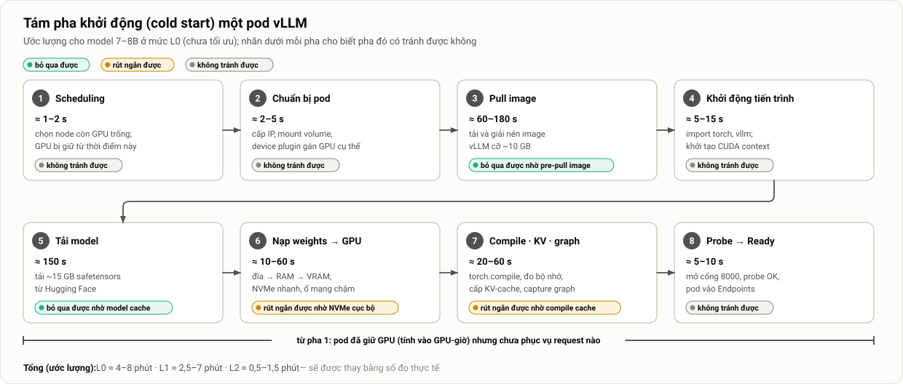
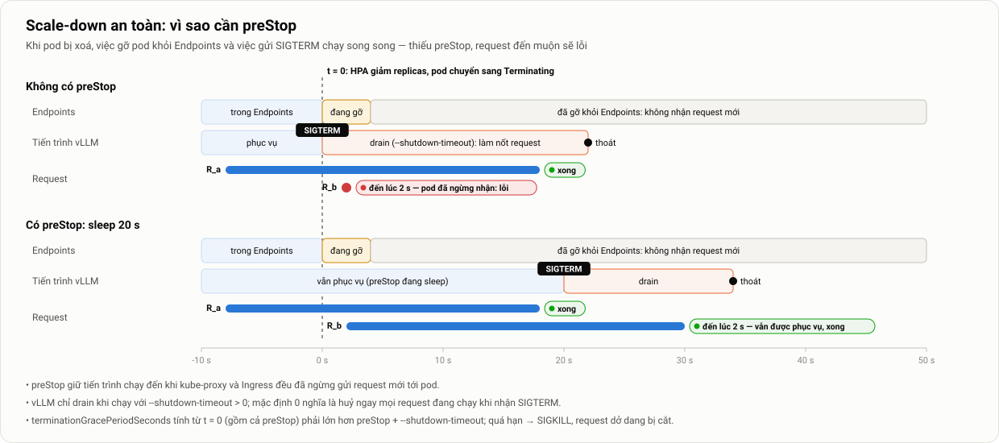
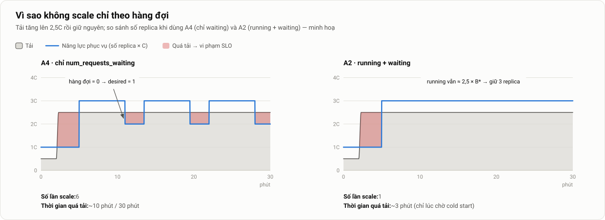

# 3. Kiến trúc hệ thống và thiết kế autoscaling

> Thuộc [bộ tài liệu đồ án](../mo-ta-chi-tiet-do-an.md#bộ-tài-liệu) · Dùng cho mục 3.2–3.3, 4.3–4.5 của luận văn · Giá trị tham số: [Thông số §8–§9](00-thong-so.md#8-cấu-hình-và-ma-trận-đánh-giá)

**Tóm tắt nhanh**
- Năm nguyên tắc thiết kế: **đơn giản và minh bạch, tái lập được, quan sát được, vận hành được, an toàn khi thay đổi**.
- Tầng serving: Deployment vLLM (mỗi pod 1 GPU), lưu trữ model theo môi trường, Service, Traefik (**không dùng ingress-nginx vì đã ngừng bảo trì**).
- Hai vòng đời quan trọng nhất của pod: **cold start 8 pha** (Hình 12) và **graceful shutdown** (Hình 13). vLLM chỉ làm nốt request khi bị tắt nếu có `--shutdown-timeout` > 0; mặc định là huỷ ngay.
- Mọi cấu hình autoscaling dùng **cùng một cơ chế**: KEDA đưa kết quả PromQL cho HPA, và HPA tính ⌈tổng ÷ target⌉. **Chỉ có metric là khác nhau.** **A2 (running + waiting)** là cấu hình vận hành chính thức; **A1 (GPU utilization)** là đối chứng; A3 là Could; A4 chỉ để minh hoạ **flapping** trên simulator.
- Target được **tính từ kết quả đo năng lực**, không chọn cảm tính.
- Kiến trúc giám sát (PodMonitor, recording rule, 3 dashboard) và GitOps, kèm hai cạm bẫy hay gặp: **Argo CD tranh quyền `replicas` với HPA**, và **PodMonitor không được Prometheus nhận** vì thiếu label.

---

## 1. Nguyên tắc thiết kế

| Nguyên tắc | Cụ thể hoá |
|---|---|
| **Đơn giản, minh bạch** | Dùng Deployment và KEDA thay vì một framework serving nhiều tầng. Mọi quyết định scale đều truy được về một câu PromQL |
| **Tái lập được** | Mọi thứ nằm trong Git: IaC dựng máy, Argo CD dựng nền tảng, runner chạy đánh giá. Không có bước làm tay; mọi phiên bản được ghim |
| **Quan sát được** | Mỗi pha của request, của cold start và của lần scale đều có metric hoặc timestamp; mỗi tầng có dashboard |
| **Vận hành được** | Mỗi tình huống bất thường có cảnh báo và runbook; mọi thay đổi đi qua PR và Argo CD ([Vận hành](04-van-hanh.md)) |
| **An toàn khi thay đổi** | Probe đúng, preStop, `--shutdown-timeout`, grace period đủ dài, chiến lược rolling update hợp với GPU; không để request bị cắt |

---

## 2. Tổng quan, thành phần và namespace


*Hình 2. Kiến trúc tổng thể. Request đi từ client qua Traefik (giới hạn tốc độ) và Service tới các pod vLLM (kiểm API key), mỗi pod gắn một GPU. Prometheus thu metric từ vLLM và exporter GPU; Alertmanager gửi cảnh báo. KEDA chạy PromQL và cung cấp external metric cho HPA; HPA cập nhật `spec.replicas` của Deployment. Pod mới chỉ nhận traffic sau khi đã Ready.*

| Thành phần | Vai trò | Ghi chú |
|---|---|---|
| Kubernetes (k3s) | Điều phối container | Một node trên VM thuê; 1–2 node ở nhà; dựng bằng Ansible |
| NVIDIA device plugin, exporter GPU | Công bố `nvidia.com/gpu`; metric GPU | Driver cài sẵn trên máy; GPU Operator chỉ dùng nếu cần (`driver.enabled=false`) |
| vLLM (Deployment) | Phục vụ model qua API OpenAI; kiểm API key | 1 GPU/pod; probe, preStop, `--shutdown-timeout`; rolling update `maxSurge: 0` |
| Lưu trữ model | Lưu weights để không phải tải lại | NVMe cục bộ (VM thuê) hoặc PVC (nhà); Job prefetch, DaemonSet pre-pull |
| Traefik (Ingress) | Điểm vào, giới hạn tốc độ | Có sẵn trong k3s; không dùng ingress-nginx (đã ngừng bảo trì từ 3/2026); bật metric |
| KEDA | Chuyển metric Prometheus thành external metric, tạo HPA | A2 là cấu hình chính thức |
| Prometheus, Alertmanager (kube-prometheus-stack) | Thu metric, tính SLI, gửi cảnh báo | Recording rule; cảnh báo theo burn rate tới Telegram |
| Grafana | Dashboard | 3 dashboard (§17.3) |
| Argo CD (bản core) | GitOps: đồng bộ cluster theo Git | Một App-of-Apps; mỗi môi trường một overlay |
| Sealed Secrets | Bí mật mã hoá trong Git | Khoá riêng của controller sao lưu ngoài Git |
| Script thuê VM (CLI `vastai`) + Ansible | Thuê/huỷ VM GPU; cài k3s và cấu hình máy | Dựng trọn bộ trong ≤ 30 phút sau khi thuê (N6) |
| Máy tạo tải + runner | Sinh tải, chạy đánh giá, thu dữ liệu | Python asyncio; máy tạo tải là pod có lõi CPU riêng |

| Namespace | Thành phần | Ghi chú |
|---|---|---|
| `llm-serving` | Deployment `vllm`, Service, PodMonitor, ScaledObject; PVC `model-cache` (chỉ ở nhà) | Workload chính |
| `keda` | KEDA operator, metrics API server, admission webhook | Helm chart `kedacore/keda` |
| `monitoring` | Prometheus Operator, Prometheus, **Alertmanager**, Grafana, kube-state-metrics, node-exporter | Helm chart `kube-prometheus-stack` |
| `gpu` | Device plugin, exporter GPU | Helm chart của NVIDIA |
| `argocd` | Argo CD (core) | Nền của GitOps |
| `kube-system` | Traefik (có sẵn trong k3s), CoreDNS, Sealed Secrets controller | Traefik bật metrics để đo tỷ lệ lỗi |

**Bảng phiên bản** (điền và ghim ở W2, rồi ghi vào `metadata.json`):

| Thành phần | Phiên bản | Cách ghim |
|---|---|---|
| k3s | `v1.xx.y+k3s1` | Biến `INSTALL_K3S_VERSION` |
| NVIDIA driver | `5xx.yy` | Gói hệ điều hành hoặc template VM |
| Device plugin / GPU Operator | `vXX.Y.Z` | Phiên bản Helm chart |
| vLLM | `vllm/vllm-openai@sha256:…` | **Digest** thay vì tag |
| Model | `Qwen/Qwen2.5-7B-Instruct@<commit>` | Revision trên Hugging Face |
| KEDA, kube-prometheus-stack, Argo CD | Phiên bản chart | `Chart.yaml` / Argo Application |

---

## 3. Tầng serving

### 3.1. Deployment vLLM: vì sao chọn từng trường

Giá trị cụ thể nằm ở [Thông số §9.2](00-thong-so.md#92-deployment-vllm). Bảng dưới giải thích lý do.

| Trường | Vì sao |
|---|---|
| `replicas` bỏ trống | Để HPA quản lý; nếu đặt thì Argo CD sẽ "sửa lại" (xem §18.3) |
| 1 GPU mỗi pod | Model vừa một GPU; đơn vị scale là 1 GPU |
| CPU 4–6 lõi | API server cần CPU để tokenize và stream ([Kiến thức nền §2.6](02-kien-thuc-nen.md#26-kiến-trúc-tiến-trình-của-vllm-v1)) |
| QoS **Guaranteed** (requests = limits, CPU nguyên) trên VM thuê | Với kubelet `cpu-manager-policy=static`, pod nhận **lõi CPU riêng**, không tranh với máy tạo tải chạy cùng VM ([Môi trường §3.5](05-moi-truong-danh-gia.md#35-cấu-hình-k3s-và-phân-bổ-cpu-trên-vm-thuê)) |
| Memory đủ lớn | Nạp weights qua RAM; nếu giới hạn quá thấp sẽ bị OOM lúc khởi động. Ở nhà RAM chỉ 16 GB nên đặt request nhỏ hơn |
| `/dev/shm` dùng `emptyDir: {medium: Memory}` | PyTorch và NCCL dùng shared memory; mặc định chỉ có 64 MiB |
| `startupProbe` rộng (tới 10 phút) | Cho phép cold start dài mà không bị kill |
| `readinessProbe` | Quyết định lúc nào pod nhận traffic |
| `livenessProbe` rộng tay | Tránh kill nhầm khi pod đang rất tải |
| `preStop: sleep` | Chờ Endpoints cập nhật trước khi gửi SIGTERM (xem §8) |
| `--shutdown-timeout` | Để vLLM làm nốt request đang chạy khi nhận SIGTERM; mặc định 0 là huỷ ngay (xem §8) |
| `terminationGracePeriodSeconds` | Lớn hơn preStop cộng `--shutdown-timeout` |
| `imagePullPolicy: IfNotPresent` | Để pre-pull có tác dụng |
| env `HF_HOME`, `VLLM_CACHE_ROOT` trỏ vào volume | Giữ lại cache model và compile cache (mức L2) |
| `strategy` `maxSurge: 0`, `maxUnavailable: 1` | Không bị kẹt khi mọi GPU đều đang có pod; khi chỉ có 1 replica thì cần thêm một bước trước khi cập nhật ([Vận hành §5](04-van-hanh.md#5-cập-nhật-phiên-bản-khi-gpu-đã-dùng-hết)) |
| `--no-enable-prefix-caching` khi đánh giá | Để số đo không phụ thuộc nội dung prompt; khi vận hành thật thì bật ([Kiến thức nền §2.4](02-kien-thuc-nen.md#24-prefix-caching)) |
| `--api-key` lấy từ Secret | Kiểm khoá ngay tại vLLM; Traefik chỉ giới hạn tốc độ ([ADR-005](../adr/005-sua-thiet-ke-sau-review.md) T4) |

### 3.2. Manifest mẫu

Deployment vLLM ở overlay `cloud` (rút gọn). Mọi giá trị lấy theo [Thông số §9](00-thong-so.md#9-tham-số-triển-khai):

```yaml
apiVersion: apps/v1
kind: Deployment
metadata:
  name: vllm
  namespace: llm-serving
spec:
  # không có trường replicas: HPA quản lý (§18.3)
  strategy:
    type: RollingUpdate
    rollingUpdate: {maxSurge: 0, maxUnavailable: 1}   # không kẹt khi hết GPU trống (Vận hành §5)
  progressDeadlineSeconds: 900
  selector:
    matchLabels: {app: vllm}
  template:
    metadata:
      labels: {app: vllm}
    spec:
      terminationGracePeriodSeconds: 180   # > preStop 20 s + shutdown-timeout 150 s
      nodeSelector:
        nvidia.com/gpu.present: "true"
      containers:
        - name: vllm
          image: vllm/vllm-openai@sha256:…  # ghim theo digest
          imagePullPolicy: IfNotPresent
          args:
            - --model=/models/Qwen2.5-7B-Instruct
            - --served-model-name=qwen2.5-7b
            - --max-model-len=8192
            - --max-num-seqs=64
            - --gpu-memory-utilization=0.90
            - --no-enable-prefix-caching    # chỉ khi đánh giá
            - --shutdown-timeout=150        # làm nốt request khi nhận SIGTERM (mặc định 0 = huỷ)
            - --api-key=$(VLLM_API_KEY)
          env:
            - name: VLLM_API_KEY
              valueFrom: {secretKeyRef: {name: vllm-api-key, key: key}}
            - {name: VLLM_CACHE_ROOT, value: /cache/vllm}
          ports:
            - {name: http, containerPort: 8000}
          resources:
            limits: {nvidia.com/gpu: 1, cpu: "6", memory: 24Gi}
            requests: {cpu: "6", memory: 24Gi}
          volumeMounts:
            - {name: models, mountPath: /models, readOnly: true}
            - {name: vllm-cache, mountPath: /cache/vllm}
            - {name: dshm, mountPath: /dev/shm}
          startupProbe:                     # cho phép tới 10 phút khởi động
            httpGet: {path: /health, port: http}
            periodSeconds: 5
            failureThreshold: 120
          readinessProbe:
            httpGet: {path: /health, port: http}
            periodSeconds: 5
          livenessProbe:
            httpGet: {path: /health, port: http}
            periodSeconds: 10
            failureThreshold: 6
          lifecycle:
            preStop:                        # chờ Endpoints cập nhật rồi mới SIGTERM
              exec: {command: ["sleep", "20"]}
      volumes:
        - name: models
          hostPath: {path: /mnt/nvme/models, type: Directory}
        - name: vllm-cache
          hostPath: {path: /mnt/nvme/vllm-cache, type: DirectoryOrCreate}
        - name: dshm
          emptyDir: {medium: Memory, sizeLimit: 8Gi}
```

### 3.3. Lưu trữ model: các phương án

| Phương án | Mô tả | Ưu điểm | Nhược điểm | Mức |
|---|---|---|---|---|
| Tải từ Hugging Face mỗi lần | `--model Qwen/...`, không mount gì | Đơn giản | Chậm, phụ thuộc mạng, dễ bị giới hạn tốc độ | L0 |
| PVC dùng chung (NFS, RWX) | Một bản model, mọi pod mount chung | Tải một lần | Đọc qua mạng chậm; NFS là điểm nghẽn khi nhiều pod cùng nạp | L1 |
| **NVMe cục bộ** (hostPath hoặc local PV) | Model nằm sẵn trên ổ của node | **Nạp nhanh nhất** | Phải chép lên từng node trước (Job hoặc DaemonSet) | L2 |
| Đóng model vào image | Image chứa luôn weights | Một artifact duy nhất | Image khoảng 25 GB, pull rất lâu | Không khuyến nghị |
| Stream từ object storage | `--load-format runai_streamer` | Không cần ổ cục bộ | Phụ thuộc băng thông object storage | Hướng mở rộng |

**Khuyến nghị:** ở nhà, dùng PVC `model-cache` (local-path, thực chất là ổ cục bộ). Trên VM thuê (một node), dùng L2: một Job `model-prefetch` tải model về `/mnt/nvme/models`, rồi Deployment mount `hostPath` ở chế độ chỉ đọc. Đồ án chỉ đo L0 và L2, vì trên một máy thuê không có ổ mạng tương đương để đo L1 một cách thực tế.

### 3.4. Service và cân bằng tải

- Service kiểu `ClusterIP`. kube-proxy (chế độ iptables) chọn endpoint **gần như ngẫu nhiên, đều nhau**, không biết pod nào đang có hàng đợi dài.
- Hệ quả: khi các request dài ngắn khác nhau, có lúc một pod bị dồn nhiều request dài trong khi pod khác rảnh. Năng lực thực tế vì thế thấp hơn N × C một chút.
- Trong đồ án, round-robin được **giữ nguyên cho mọi cấu hình** để so sánh công bằng. Nhóm theo dõi độ lệch `num_requests_running` giữa các pod để lượng hoá hiện tượng này.
- Có thể thay bằng Envoy Gateway với thuật toán `LEAST_REQUEST`, hoặc định tuyến nhận biết LLM. Đây là hướng mở rộng ([E1](06-ke-hoach-quan-ly.md#e1-định-tuyến-có-nhận-biết-llm)).

### 3.5. Ingress và giới hạn tốc độ

- **ingress-nginx** đã được Kubernetes cho **ngừng bảo trì từ tháng 3/2026**, nên không nên dùng cho hệ thống mới.
- **Traefik** có sẵn trong k3s và hỗ trợ SSE streaming tốt. Envoy Gateway (Gateway API) là lựa chọn thay thế nếu muốn dùng `LEAST_REQUEST`.
- Với streaming dài, cần kiểm tra **timeout** của entrypoint và route để stream không bị cắt giữa chừng, và kiểm tra rằng proxy không gom (buffer) response lại.
- **Khi đánh giá**, máy tạo tải vẫn đi qua Traefik như người dùng thật, để số đo gồm cả xác thực và giới hạn tốc độ. Vì middleware `rateLimit` tính theo header `Authorization` áp **cùng một mức** cho mọi khoá, máy tạo tải dùng **route riêng** (ví dụ host nội bộ `llm-eval`) gắn middleware có giới hạn cao. Nếu không, các lượt KB2, KB3 sẽ nhận 429 và bị tính là lỗi ([ADR-005](../adr/005-sua-thiet-ke-sau-review.md) T5).

Các biện pháp bảo mật và checklist nằm ở [Vận hành §8](04-van-hanh.md#8-bảo-mật-tối-thiểu).

---

## 4. Cấu trúc manifest (Kustomize)

```text
serving/
├── base/
│   ├── kustomization.yaml
│   ├── deployment.yaml      # không có trường replicas
│   ├── service.yaml
│   ├── podmonitor.yaml
│   ├── middleware.yaml      # rateLimit cho người dùng và cho máy tạo tải
│   ├── networkpolicy.yaml
│   ├── model-prefetch-job.yaml
│   └── prepull-daemonset.yaml
└── overlays/
    ├── home/                # model 1,5B, PVC model-cache, requests nhỏ
    └── cloud/               # model 7B, hostPath NVMe, QoS Guaranteed
```

Hai overlay chỉ khác các giá trị trong [Thông số §9.1–§9.2](00-thong-so.md#91-vllm). Cấu trúc toàn bộ repository nằm ở [Kế hoạch §10.2](06-ke-hoach-quan-ly.md#102-cấu-trúc-repository).

---

## 5. Luồng một request


*Hình 3. Vòng đời một request và các metric độ trễ. Khi tải tăng, thời gian chờ trong hàng đợi (queue time) tăng đầu tiên, kéo theo TTFT tăng. Đây là tín hiệu sớm nhất cho biết hệ thống cần scale.*

1. Client gửi `POST /v1/chat/completions` với `stream: true` và khoá API tới Traefik.
2. Traefik áp giới hạn tốc độ; Service chọn một pod đang Ready; vLLM kiểm khoá API rồi đưa request vào hàng đợi (*waiting*).
3. Khi còn chỗ trong batch và còn KV-cache, request chuyển sang *running*: prefill rồi decode.
4. Mỗi token sinh ra được gửi về dưới dạng Server-Sent Events.
5. Thời điểm vào hàng đợi, token đầu và kết thúc được vLLM ghi vào histogram; Prometheus dùng chúng để tính SLI.

| Bước | Diễn ra ở đâu | Thời gian | Có trong TTFT phía client? |
|---|---|---|---|
| Gửi HTTP, TCP | Pod máy tạo tải → Traefik | < 1 ms (cùng VM, dùng keep-alive) | Có |
| Chuyển tiếp qua Gateway, kube-proxy | Traefik → Service → pod | < 1 ms | Có |
| Parse JSON, tokenize | API server (CPU) | 1–10 ms tuỳ độ dài prompt | Có |
| **Chờ trong hàng đợi** | Scheduler | 0 → **vài giây** khi quá tải | Có (**thành phần biến động mạnh nhất**) |
| Prefill | GPU | ~50–300 ms (prompt 256–1024 token) | Có |
| Detokenize, gửi chunk SSE đầu tiên | API server → client | < 5 ms | Có |
| Các bước decode tiếp theo | GPU, chung batch | ~25–80 ms mỗi token | Không (thuộc TPOT) |

Định dạng stream mà máy tạo tải nhận được:

```text
data: {"id":"…","choices":[{"delta":{"content":"Xin"}}],…}
data: {"id":"…","choices":[{"delta":{"content":" chào"}}],…}
…
data: {"id":"…","choices":[],"usage":{"prompt_tokens":512,"completion_tokens":256,…}}
data: [DONE]
```

Để nhận được phần `usage` ở cuối stream, request phải gửi kèm `"stream_options": {"include_usage": true}`. Một chunk có thể chứa nhiều token, nên phải lấy số token từ `usage` (xem [Chỉ số và cách tính](05-moi-truong-danh-gia.md#15-chỉ-số-và-cách-tính)).

---

## 6. Vòng lặp autoscaling và mô hình thời gian


*Hình 4. Vòng lặp autoscaling chia thành pha phát hiện (bước 1–4) và pha thực thi (bước 5–8). Các con số thời gian là ước lượng và sẽ được đo thực tế.*

$$
T_{\text{phản ứng}} = \underbrace{T_{\text{scrape}} + T_{\text{HPA sync}} + T_{\text{PromQL}}}_{\text{phát hiện: } \sim 10\text{–}30\,s} + \underbrace{T_{\text{schedule}} + T_{\text{pull}} + T_{\text{load}} + T_{\text{compile}} + T_{\text{ready}}}_{\text{cold start: } \sim 1\text{–}8\text{ phút nếu chưa tối ưu}}
$$

Mô hình thời gian đã hiệu chỉnh theo đúng cơ chế KEDA/HPA (xem [Kiến thức nền §3.3](02-kien-thuc-nen.md#33-keda)):

| Thành phần | Mặc định | Sau khi chỉnh | Cách chỉnh |
|---|---|---|---|
| Chu kỳ scrape metric vLLM | 30 s (kube-prometheus-stack) | 5 s | `PodMonitor.podMetricsEndpoints[].interval` |
| Chu kỳ thu metric GPU | có thể 30 s | 5 s | Biến môi trường collect interval của exporter |
| Chu kỳ sync HPA (KEDA truy vấn khi HPA hỏi) | 15 s | 5 s | Cờ của k3s ([Thông số §9.3](00-thong-so.md#93-keda-và-hpa)) |
| Thời gian chạy PromQL | < 1 s | < 1 s | – |
| **Tổng độ trễ phát hiện (xấu nhất)** | **≈ 45 s** | **≈ 10 s** | – |
| Cold start | 1–8 phút (L0) | 0,5–1,5 phút (L2) | §7 |

Metric A2 và A3 là **gauge**, lấy giá trị tức thời, nên không có độ trễ do cửa sổ `rate()` hay `histogram_quantile()`. Đây là một ưu điểm nữa của metric tầng ứng dụng so với metric tính từ histogram.

**Ước lượng tổng thời gian phản ứng ở mức L2** (số ước lượng, sẽ đo ở ĐG2):

| Pha | Ước tính |
|---|---|
| Phát hiện: scrape ≤ 5 s + HPA sync ≤ 5 s + PromQL < 1 s + chờ metric vượt 1,1 × target (do tolerance) | 10–25 s |
| HPA tăng từ 1 lên 4 (policy mặc định cho phép +4 pod mỗi 15 s) | 0 s |
| Scheduling và chuẩn bị pod | 3–7 s |
| L2: khởi động tiến trình 5–15 s, nạp weights 10–60 s (tuỳ đĩa), compile cache 10–30 s, KV + CUDA graph 10–30 s | 35–135 s |
| Probe và Endpoints | 2–10 s |
| **Tổng** | **~50–175 s**, đạt N2a khi đĩa nhanh |

**Ví dụ tính số replica.** A2 đặt target 24 request đồng thời cho mỗi replica. Hiện có 1 replica, tổng `running + waiting` là 70. HPA tính ra ⌈70/24⌉ = 3 replica. Hai pod mới được tạo, và chỉ nhận traffic sau khi cold start xong.

**Giới hạn của scale-up:** request đã nằm trong hàng đợi của pod cũ **không chuyển sang pod mới được**. Pod mới chỉ nhận phần request đến sau. Vì vậy, sau một đợt tăng đột ngột, thời gian hồi phục SLO (N2b) dài hơn thời gian replica mới Ready (N2a).

---

## 7. Cold start chi tiết

### 7.1. Các mức tối ưu


*Hình 5. Phân rã cold start. Số liệu chỉ để minh hoạ khung đo; kết quả thực tế sẽ thay vào ở chương đánh giá.*

| Mức | Kỹ thuật | Pha được rút ngắn |
|---|---|---|
| L0 | Không tối ưu: image và model tải từ Internet mỗi lần tạo pod | – |
| L1 | Model nằm sẵn trên PVC, pod chỉ mount và đọc | Tải model |
| L2 | L1, cộng: **pre-pull image**, model trên **NVMe cục bộ**, giữ **compile cache** của vLLM trên volume | Pull image, nạp weights, compile |
| (tuỳ chọn) | Warm pool: đặt `minReplicaCount` > 1 | Bỏ hẳn cold start cho replica đầu tiên, nhưng tốn thêm GPU-giờ |

L2 là cấu hình vận hành; đồ án đo L0 và L2 để biết rút ngắn được bao nhiêu (N5).

### 7.2. Từng pha



*Hình 12. Tám pha khởi động một pod vLLM và khả năng tối ưu từng pha.*

**Pha 1. Scheduling (≈ 1–2 s).** HPA tăng `spec.replicas`, ReplicaSet tạo Pod mới ở trạng thái Pending. kube-scheduler lọc các node còn `nvidia.com/gpu` trống và đủ CPU/RAM, sau đó gán pod vào một node. **Từ thời điểm này GPU bị giữ.** Nếu hết GPU, pod nằm Pending mãi. Vì vậy `maxReplicaCount` phải bằng đúng số GPU có sẵn.

**Pha 2. Chuẩn bị pod (≈ 2–5 s).** Kubelet tạo sandbox, CNI cấp IP, mount volume (NFS mount qua mạng nên chậm hơn), gọi device plugin để chọn GPU cụ thể. NVIDIA toolkit đưa file thiết bị và thư viện driver vào container.

**Pha 3. Pull image (≈ 60–180 s, hoặc 0 s).** Image `vllm-openai` cỡ ~10 GB vì chứa CUDA, PyTorch và các kernel. Thời gian gồm **tải về** và **giải nén** từng layer; giải nén tốn CPU và nhiều khi chậm hơn cả tải. Nếu node đã có image và `IfNotPresent` thì mất 0 s. Kubelet ghi event dạng `Successfully pulled image … in 1m23s`.

**Pha 4. Khởi động tiến trình (≈ 5–15 s).** Chạy `vllm serve`: import `torch`/`vllm` (nặng), đọc tham số, khởi tạo CUDA context, tạo tiến trình EngineCore.

**Pha 5. Tải model (≈ 150 s, hoặc 0 s).** Chỉ xảy ra khi `--model` là tên repo trên Hugging Face và chưa có cache. Qwen2.5-7B gồm khoảng 15 GB file safetensors (4 shard); ở 100 MB/s mất khoảng 150 s.

**Pha 6. Nạp weights vào GPU (≈ 10–60 s).** Đọc file từ đĩa lên RAM, rồi copy qua PCIe vào VRAM. Tốc độ phụ thuộc chủ yếu vào ổ đĩa: NVMe cục bộ (2–3 GB/s) mất khoảng 10 s; NFS (100–300 MB/s) mất 50–150 s. Log có dòng `Loading weights took … seconds` và `Model loading took … GiB and … seconds`.

**Pha 7. Compile, KV-cache, CUDA graph (≈ 20–60 s).** Gồm ba việc nối tiếp:
- (a) Chạy thử một lượt forward để **đo bộ nhớ**. Trong lượt chạy thử đó, **torch.compile** biên dịch model; kết quả được lưu vào `$VLLM_CACHE_ROOT/torch_compile_cache`.
- (b) **Cấp phát KV-cache** bằng phần VRAM còn lại. Log: `GPU KV cache size: … tokens`.
- (c) **Capture CUDA graph** cho nhiều kích thước batch. Log: `Graph capturing finished in … secs`.

Cả pha có một dòng tổng: `init engine (profile, create kv cache, warmup model) took … seconds`. Câu chữ có thể khác theo phiên bản, nên runner cần có bộ phân tích log dễ chỉnh (`parse_vllm_log`).

**Pha 8. Probe → Ready → Endpoints (≈ 5–10 s).** API server chỉ mở cổng 8000 sau khi engine sẵn sàng; trước đó probe bị từ chối kết nối. Probe thành công thì condition `Ready=True`, EndpointSlice thêm IP của pod, và kube-proxy/Traefik cập nhật. Với `periodSeconds: 5`, có thể mất thêm tối đa 5 s chỉ để chờ lần probe kế tiếp.

### 7.3. Tối ưu theo pha

| Pha | L0 | L1 (model trên PVC) | L2 (tối ưu đầy đủ) | Cách làm cho L2 |
|---|---|---|---|---|
| 3 Pull image | ✓ | ✓ | **0 s** | DaemonSet pre-pull, hoặc image đã có sẵn; `IfNotPresent` |
| 5 Tải model | ✓ | **0 s** | **0 s** | Job prefetch tải về NVMe |
| 6 Nạp weights | nhanh | chậm (đọc qua mạng) | nhanh | hostPath trên NVMe |
| 7a Compile | đầy đủ | đầy đủ | **nhanh** | `VLLM_CACHE_ROOT` trên volume bền |
| 7b–c KV, graph | ✓ | ✓ | ✓ | Không tránh được (`--enforce-eager` bỏ được graph nhưng làm ITL tăng) |
| 8 Probe | ✓ | ✓ | ✓ | Có thể giảm `periodSeconds` xuống 2 s |

DaemonSet pre-pull tối giản:

```yaml
apiVersion: apps/v1
kind: DaemonSet
metadata: {name: prepull-vllm, namespace: llm-serving}
spec:
  selector: {matchLabels: {app: prepull-vllm}}
  template:
    metadata: {labels: {app: prepull-vllm}}
    spec:
      nodeSelector: {nvidia.com/gpu.present: "true"}
      initContainers:
        - name: pull
          image: vllm/vllm-openai@sha256:…     # đúng digest của Deployment
          command: ["true"]
      containers:
        - name: pause
          image: registry.k8s.io/pause:3.9
```

### 7.4. Cạm bẫy khi đo

1. **Page cache.** Lần nạp thứ hai trên cùng node đọc weights từ RAM nên nhanh bất thường. Khi đo mức "node lạnh", chạy `sync; echo 3 > /proc/sys/vm/drop_caches` trên node trước mỗi lần đo.
2. **Chỉ pull image một lần trên một node.** Trên VM thuê (một node), chỉ pod đầu tiên phải pull. Muốn đo L0 đúng, phải `crictl rmi <image>` trước mỗi lần đo.
3. **Compile cache mất hiệu lực** khi đổi phiên bản vLLM hoặc tham số (`max-model-len`…). Sau khi đổi, lần đầu sẽ compile lại, nên cần "làm ấm" cache trước khi đo L2.
4. **Pod giữ GPU từ pha 1**, nên GPU-giờ được tính cả trong lúc cold start.
5. **Tốc độ đĩa của VM thuê quyết định L2.** Bộ lọc máy đã yêu cầu đọc ≥ 1 GB/s; vẫn kiểm bằng `fio` khi burn-in. Nếu L2 nhanh nhờ page cache ấm chứ không nhờ đĩa, ghi rõ điều đó trong luận văn.

---

## 8. Scale-down và graceful shutdown



*Hình 13. Không có preStop, request đến trong lúc Endpoints chưa cập nhật sẽ lỗi. Có preStop, request đó vẫn được phục vụ. Pha "drain" chỉ có khi vLLM chạy với `--shutdown-timeout` > 0.*

### 8.1. Trình tự khi một pod bị xoá

1. HPA giảm `replicas`. ReplicaSet chọn pod để xoá, ưu tiên theo thứ tự: pod chưa được gán node, pod chưa Ready, rồi đến các tiêu chí khác. Có thể điều chỉnh bằng annotation `controller.kubernetes.io/pod-deletion-cost` ([E11](06-ke-hoach-quan-ly.md#e11-pod-deletion-cost-khi-scale-down)).
2. Pod được đánh dấu **Terminating**. Kể từ đây, **hai việc chạy song song**:
   - Controller EndpointSlice gỡ pod khỏi Service. kube-proxy và Traefik nhận thay đổi sau khoảng 1–5 s.
   - Kubelet chạy **preStop** (`sleep 20`), rồi gửi **SIGTERM**.
3. vLLM nhận SIGTERM. Hành vi phụ thuộc cờ `--shutdown-timeout`:
   - **Mặc định 0: huỷ ngay** mọi request đang chạy. Client đang nhận stream bị cắt ngang.
   - **N > 0** (đồ án dùng 150 s): ngừng nhận việc mới, làm nốt các request đang chạy trong tối đa N giây, rồi thoát. Quá N giây thì huỷ phần còn lại.
4. Nếu quá `terminationGracePeriodSeconds` (tính từ bước 2, **gồm cả thời gian preStop**) mà tiến trình chưa thoát, kubelet gửi **SIGKILL** và request dở dang bị cắt.

### 8.2. Chọn tham số

Giá trị nằm ở [Thông số §9.2](00-thong-so.md#92-deployment-vllm). Ràng buộc giữa chúng:

- `preStop sleep` (15–20 s) lớn hơn thời gian lan truyền thay đổi Endpoints.
- `--shutdown-timeout` lớn hơn thời gian chờ tối đa cộng thời gian sinh output dài nhất. Với output 256 token và TPOT 100 ms, riêng phần sinh đã là 26 s; 150 s để có biên an toàn.
- `terminationGracePeriodSeconds` > preStop + `--shutdown-timeout` (20 + 150 < 180). Nếu ngược lại, SIGKILL đến trước khi vLLM làm xong và request vẫn bị cắt.

### 8.3. Kiểm chứng

- **Khi ghim phiên bản (W2):** `vllm serve --help | grep shutdown` để chắc bản đã ghim có cờ này.
- **Ở nhà (W3):** mở khoảng 30 stream dài, chạy `kubectl delete pod <pod-vllm>`, đếm lỗi trong log client, lặp 3 lần. Chạy thêm một **ca đối chứng** (không preStop, `--shutdown-timeout=0`) để chứng minh 0 lỗi là nhờ cấu hình chứ không phải vì lúc đó ít request.
- **Chưa rõ:** khi drain, vLLM làm nốt cả request đang `waiting` hay chỉ request đang `running`. Phép thử trên sẽ cho biết; nếu request `waiting` bị huỷ thì ghi vào runbook và vào phần hạn chế.
- **Trên GPU thuê:** pha `drop` của KB2 và kịch bản VH1 (N4). Nếu có lỗi, sửa cấu hình (tăng preStop, chủ động gỡ pod khỏi Service trước) rồi đo lại, và ghi vào runbook.

---

## 9. Thiết kế autoscaling: cơ chế chung

```text
vLLM/GPU exporter ──scrape 5 s──► Prometheus ◄──PromQL── KEDA metrics server ◄──hỏi mỗi chu kỳ sync── HPA
                                                                                                 │
                                   desired = ceil( giá trị PromQL (tổng) ÷ threshold )             │
                                   → behavior (stabilization, policies) → [min, max]              ▼
                                                                                 Deployment.spec.replicas
```

- Chu kỳ sync của HPA đặt **5 s** (tham số của k3s). Mặc định là 15 s, và đó mới là bên quyết định tốc độ phát hiện khi scale giữa 1 và N.
- `pollingInterval` của KEDA vẫn đặt 5 s cho đồng bộ, nhưng tham số này chủ yếu ảnh hưởng việc kích hoạt 0 ↔ 1 (không dùng trong đồ án) và cache metric.
- `metricType: AverageValue` cho mọi trigger, để công thức thống nhất là ⌈tổng ÷ threshold⌉ và để `fallback` hoạt động.
- Danh sách cấu hình (S1, S4, A1–A4), PromQL và target nằm ở [Thông số §8.1](00-thong-so.md#81-các-cấu-hình). Ma trận đánh giá trên GPU thuê gồm S1, S4, A1 và A2 ([Thông số §8.2](00-thong-so.md#82-ma-trận-đg2-17-lượt)).

---

## 10. Phân tích từng metric

### 10.1. A1: GPU utilization

**Đo gì:** tỷ lệ thời gian GPU có kernel đang chạy (xem [Kiến thức nền §4.4](02-kien-thuc-nen.md#44-vì-sao-gpu_util-bão-hoà)).

**Hành vi dự đoán:**
- Chỉ cần có vài request, GPU util đã khoảng 90–100%. Với threshold 70 và 1 replica: desired = ⌈95 ÷ 70⌉ = 2. Với 2 replica, mỗi pod vẫn khoảng 95%: desired = ⌈190 ÷ 70⌉ = 3. Quá trình cứ thế **leo lên tối đa** ngay khi mỗi pod có tải, dù là tải nhẹ.
- Ngược lại, khi tải rất thấp (KB1, có những khoảng không có request), GPU util dao động theo từng đợt request, nên có thể scale lên rồi xuống thất thường.
- Dự đoán: A1 **gần như Static-4 cộng thêm độ trễ cold start**, tức là không tiết kiệm GPU-giờ. Tệ hơn, nó có thể dao động khi tải thấp. Ma trận đánh giá sẽ cho thấy dự đoán này đúng tới đâu.

**Trên GPU GeForce** (RTX 4090 thuê, GPU nhà): exporter `nvidia_gpu_exporter` không có label pod. A1 vẫn dùng được nếu node chỉ chạy vLLM, vì GPU rảnh cộng thêm 0. Ở nhà, RTX 5060 còn chạy màn hình nên số liệu bị nhiễu; vì vậy chạy Ubuntu không giao diện đồ hoạ ([ADR-005](../adr/005-sua-thiet-ke-sau-review.md) T9).

**Biến thể A1′ (không khả thi trên RTX 4090):** dùng `DCGM_FI_PROF_SM_ACTIVE` hoặc `DCGM_FI_PROF_DRAM_ACTIVE`, phản ánh mức làm việc thật tốt hơn. Chỉ làm được nếu phải chuyển sang GPU datacenter (ví dụ L4 ở phương án dự phòng GCP).

**Công bằng:** chu kỳ thu metric GPU phải là 5 s, giống vLLM (xem §6).

### 10.2. A2: số request đồng thời (running + waiting)

**Cơ sở lý thuyết: định luật Little.** Ở trạng thái ổn định, số request đang có trong hệ thống bằng tốc độ đến nhân thời gian trung bình mỗi request lưu lại:

$$
B = \lambda \times \overline{E2E}
$$

Khi hệ thống chưa quá tải, E2E gần như không đổi, nên **B tỷ lệ thuận với λ**. B là thước đo trực tiếp của lượng việc đang có trong hệ thống. Khi quá tải, request dồn vào hàng đợi, B tăng nhanh hơn λ, và HPA scale mạnh hơn. Đây đúng là hành vi mong muốn.

**Vì sao cộng cả running và waiting:**
- Chỉ `running` thì bị chặn trên bởi `max-num-seqs`: khi pod bão hoà, metric không tăng thêm nữa và không phản ánh phần tải vượt.
- Chỉ `waiting` thì bằng 0 khi chưa quá tải, gây flapping (§10.4).
- Tổng hai giá trị vừa tỷ lệ với tải khi bình thường, vừa "bùng lên" khi quá tải.

**Điểm yếu:**
- Request có output dài làm B lớn hơn ở cùng λ. Nhưng đó cũng là tải thật về số token phải sinh, nên có thể coi là ưu điểm. Nếu độ dài request thay đổi theo thời gian, B\* lấy từ bước đo năng lực có thể không còn đúng; khi vận hành phải đo lại B\* mỗi khi dạng tải thay đổi rõ rệt (§16).
- A2 chia đều tổng cho mọi replica, nên giả định các replica như nhau. Với GPU khác năng lực, target "mỗi replica" mất nghĩa.

### 10.3. A3: KV-cache usage

**Đo gì:** tỷ lệ số block KV đang được dùng, cộng trên các pod.

**Hành vi dự đoán:**
- Tỷ lệ với **tổng số token đang nằm trong hệ thống**, không phải số request. Prompt dài làm metric tăng nhanh; prompt ngắn làm nó tăng chậm.
- Trong một request, KV tăng dần theo từng token được sinh. Metric vì thế **đi sau** một nhịp so với lúc request đến, nhưng vẫn nhanh hơn TTFT tính từ histogram.
- Nếu nút thắt là **sức tính** (prompt ngắn, batch lớn) chứ không phải bộ nhớ, KV-cache có thể còn thấp trong khi TTFT đã tăng. Khi đó A3 scale **quá muộn**.
- Khi KV gần 1, preemption xảy ra. Đó là dấu hiệu quá tải rõ ràng nhưng đã muộn.

**Lưu ý:** khi bật prefix caching, cách tính "đang dùng" có thể bao gồm cả block đã cache. Đây thêm một lý do để tắt prefix caching khi đánh giá.

### 10.4. A4: chỉ hàng đợi (minh hoạ flapping)



*Hình 14. Khi tải ổn định ở mức cao, A4 scale-up xong thì hàng đợi về 0. HPA tính ra 1 replica, và sau cửa sổ ổn định lại scale-down, gây quá tải lần nữa. Chu kỳ này lặp lại.*

Diễn biến cụ thể: sau khi scale-up, 3 replica xử lý hết hàng đợi, nên `waiting = 0` và desired = ⌈0 ÷ 5⌉ = 0 → kẹp về minReplicas = 1. Stabilization giữ nguyên 5 phút, rồi scale-down từng pod mỗi 60 s. Khi năng lực giảm xuống dưới tải, hàng đợi tăng trở lại và hệ thống scale-up. Nhưng mỗi lần scale-up lại phải chịu thêm một lần cold start. A4 chỉ chạy trên simulator để làm hình minh hoạ cho luận văn.

### 10.5. Các tín hiệu đã cân nhắc nhưng không chọn

| Tín hiệu | Vì sao không chọn làm cấu hình chính |
|---|---|
| RPS (số request/giây) | Bỏ qua độ dài request; target phải đoán trước từ C; sai khi phân phối độ dài thay đổi |
| TTFT p95 (histogram) | **Tín hiệu trễ**: phải chờ request xong phần prefill và phải qua cửa sổ `rate()` 1 phút. Có vòng phản hồi (scale làm TTFT giảm, rồi lại scale-down). Hợp làm "chốt chặn" trong trigger phụ ([E6](06-ke-hoach-quan-ly.md#e6-scale-theo-slo-và-kết-hợp-nhiều-trigger)) |
| Token/s | Bão hoà khi GPU đầy, giống `running` |
| CPU của pod | Phản ánh API server, không phản ánh GPU |

### 10.6. Bảng so sánh

| | A1 GPU util | A2 running + waiting | A3 KV-cache | A4 waiting |
|---|---|---|---|---|
| Phản ánh | Có kernel chạy hay không | Số request trong hệ thống | Số token trong hệ thống | Phần quá tải |
| Tỷ lệ với tải? | Không (bão hoà) | **Có** (Little) | Gần đúng (phụ thuộc độ dài) | Không (0 khi chưa quá tải) |
| Độ trễ tín hiệu | Thấp (nếu chu kỳ thu 5 s) | Thấp (gauge) | Thấp–vừa | Thấp |
| Nguy cơ | Scale quá tay, luôn ở mức tối đa | Target sai khi độ dài request đổi | Scale muộn khi nút thắt là sức tính | Flapping |
| Dự đoán | ≈ S4 + cold start | Tốt nhất | Tốt, kém A2 khi prompt ngắn | Dao động |

---

## 11. Chọn target từ kết quả đo năng lực


*Hình 15. Quét tốc độ request trên 1 replica. C là mức lớn nhất còn đạt SLO; B\* là số request đồng thời tại C (số liệu minh hoạ).*

| Cấu hình | Giá trị đo tại C | threshold | Lý do |
|---|---|---|---|
| A1 | GPU util tại C (có thể khoảng 95–100) | 70 (phổ biến) | Giữ đúng cách "mọi người hay làm" để thấy hành vi thật của nó |
| A2 | B\* (ví dụ 30) | **0,8 × B\*** (ví dụ 24) | Chừa 20% để hấp thụ dao động trong lúc chờ cold start |
| A3 | KV\* (ví dụ 0,55) | 0,8 × KV\* (≈ 0,44) | Như A2 |

**Vì sao chọn hệ số 0,8?** Hệ số này giữ mỗi pod ở khoảng ρ ≈ 0,8 × (C/μ), dưới "đầu gối" của đường cong (Hình 10). Hệ số thấp hơn (0,6) thì an toàn hơn nhưng tốn GPU hơn; hệ số cao hơn (0,95) thì rẻ hơn nhưng dễ vi phạm SLO. Thử nhiều hệ số là hướng mở rộng ([E13](06-ke-hoach-quan-ly.md#e13-đánh-giá-mở-rộng-trace-thật-nhiều-lượt-độ-nhạy-tham-số)).

**Trước khi có B\* trên GPU thuê:** kiểm thử ở nhà dùng target tạm từ ĐG1-mini trên GPU yếu nhất (`capacity-home.json`, [ADR-005](../adr/005-sua-thiet-ke-sau-review.md) T13). Con số 24 trong các ví dụ chỉ là minh hoạ.

---

## 12. Tham số hành vi: vì sao chọn

Giá trị nằm ở [Thông số §9.3](00-thong-so.md#93-keda-và-hpa).

| Tham số | Lý do |
|---|---|
| `minReplicaCount` = 1 | Không scale về 0 (cold start dài) |
| `maxReplicaCount` = N | Bằng số GPU (hết GPU thì pod Pending) và bằng S4 để so sánh công bằng |
| scaleUp giữ mặc định | Cold start đã chậm, nên scale-up phải quyết đoán |
| scaleDown: cửa sổ 300 s | Tránh scale-down ngay sau một đợt giảm tải ngắn rồi lại phải chịu cold start |
| scaleDown: 1 pod mỗi 60 s | Giảm dần, dễ quan sát |
| HPA sync 5 s | Phát hiện nhanh |
| tolerance mặc định 10% | Giữ mặc định; theo dõi scale-up giả ở KB1 ([ADR-005](../adr/005-sua-thiet-ke-sau-review.md) T16) |
| `fallback` lên max | Nếu Prometheus sập thì cấp tối đa, an toàn cho SLO |

---

## 13. YAML cấu hình autoscaling

### 13.1. Cấu hình tĩnh

Runner đặt số replica trực tiếp, và **đảm bảo không còn ScaledObject nào** trỏ vào Deployment:

```bash
kubectl -n llm-serving delete scaledobject --all --wait
kubectl -n llm-serving scale deploy/vllm --replicas=4        # S4 (hoặc 1 cho S1)
kubectl -n llm-serving rollout status deploy/vllm --timeout=15m
```

### 13.2. A2 (cấu hình chính thức)

```yaml
apiVersion: keda.sh/v1alpha1
kind: ScaledObject
metadata:
  name: vllm-a2
  namespace: llm-serving
  labels: {experiment/config: A2}
spec:
  scaleTargetRef: {name: vllm}
  minReplicaCount: 1
  maxReplicaCount: 4
  pollingInterval: 5                  # chủ yếu cho kích hoạt 0↔1; tốc độ 1↔N do chu kỳ sync của HPA
  fallback: {failureThreshold: 3, replicas: 4}   # mất Prometheus thì ưu tiên chất lượng
  advanced:
    horizontalPodAutoscalerConfig:
      behavior:
        scaleDown:
          stabilizationWindowSeconds: 300
          policies: [{type: Pods, value: 1, periodSeconds: 60}]
        # scaleUp giữ mặc định của HPA: không có cửa sổ chờ
  triggers:
    - type: prometheus
      metricType: AverageValue
      metadata:
        serverAddress: http://prometheus-operated.monitoring.svc:9090
        query: |
          (sum(vllm:num_requests_running{namespace="llm-serving"}) or vector(0))
          + (sum(vllm:num_requests_waiting{namespace="llm-serving"}) or vector(0))
        threshold: "24"                      # = 0,8 × B*, lấy từ ADR-003
```

### 13.3. A1, A3, A4 chỉ khác phần `triggers`

```yaml
# A1: GPU utilization.
# Trên GPU GeForce (nvidia_gpu_exporter, không có label pod): node chỉ chạy vLLM nên cộng cả node.
query: (sum(nvidia_smi_utilization_gpu_ratio) * 100) or vector(0)
# Nếu dùng DCGM có label pod: sum(DCGM_FI_DEV_GPU_UTIL{exported_namespace="llm-serving"}) or vector(0)
threshold: "70"

# A3: KV-cache (Could)
query: sum(vllm:kv_cache_usage_perc{namespace="llm-serving"}) or vector(0)
threshold: "0.44"

# A4: chỉ hàng đợi (chỉ trên simulator)
query: sum(vllm:num_requests_waiting{namespace="llm-serving"}) or vector(0)
threshold: "5"
```

### 13.4. PromQL chống lỗi

- `or vector(0)`: khi chưa có pod nào xuất metric (ví dụ đúng lúc khởi động), truy vấn trả về rỗng. Không có vế này, KEDA sẽ báo lỗi và kích hoạt fallback.
- Luôn lọc theo `namespace` để không cộng nhầm metric của pod khác.
- Metric GPU: xác định đúng label chỉ pod vLLM (`pod`/`exported_pod`, `namespace`/`exported_namespace`) bằng cách chạy truy vấn thử trên Prometheus; nếu exporter không có label pod thì chỉ dùng được khi node chỉ chạy vLLM.
- Kiểm tra giá trị mà HPA đang thấy: `kubectl get hpa keda-hpa-vllm-a2 -o yaml`, phần `status.currentMetrics`.

---

## 14. Cạm bẫy khi vận hành autoscaling

| Cạm bẫy | Biểu hiện | Cách tránh |
|---|---|---|
| Argo CD tranh `replicas` với HPA | Số replica bị đặt lại liên tục | Bỏ `replicas` khỏi manifest hoặc dùng `ignoreDifferences` (§18.3) |
| Còn sót ScaledObject của lượt trước | Hai HPA cùng trỏ một Deployment và "đánh nhau"; admission webhook của KEDA chặn ScaledObject mới | Runner xoá mọi ScaledObject trước khi áp cái mới; sau đợt đánh giá, xoá mọi ScaledObject khác A2 trước khi bật lại auto-sync (§18.2) |
| Argo CD áp lại A2 giữa lúc đánh giá | Cấu hình đang thử bị thay bằng A2 | Tắt auto-sync của Application `autoscaling` trong đợt đánh giá (§18.2) |
| Chạm `maxReplicaCount` kéo dài | Hàng đợi tăng mà không scale thêm được | Cảnh báo `LLMAtMaxReplicas`; xem kế hoạch năng lực ([Vận hành §9](04-van-hanh.md#9-chi-phí-và-kế-hoạch-năng-lực)) |
| Pod Pending vì hết GPU | desired lớn hơn số GPU | `maxReplicaCount` = số GPU |
| Chu kỳ scrape và sync mặc định | Phát hiện chậm khoảng 45 s | Chỉnh về 5 s (§6) |
| KV-cache bị cache ảo | A3 cao dù ít request | Tắt prefix caching |
| Target sai sau khi đổi dạng tải | A2 scale lệch | Đo lại B\* nếu đổi phân phối độ dài prompt/output |
| Scale-up giả ở 1 replica do tolerance | Lên 2 replica dù tải thấp | Ghi nhận trong phân tích; nếu cần thì thêm cửa sổ chờ ngắn cho scaleUp và ghi ADR |

---

## 15. Kiểm thử nhanh cấu hình autoscaling

Làm trên simulator (`llm-d-inference-sim` trên kind) và trên GPU nhà **trước khi lên cloud**. Mỗi bài có kết quả mong đợi tính được bằng tay:

| Bài | Thao tác | Kết quả mong đợi | Môi trường |
|---|---|---|---|
| T1 | A2, tải bằng 0 | Giữ 1 replica | Simulator, nhà |
| T2 | A2, tạo khoảng 2,5 × threshold request đồng thời | desired = 3 trong vòng khoảng 10 s; `status.currentMetrics` đúng giá trị | Simulator |
| T3 | Tắt tải | Giữ 3 replica trong 300 s, rồi giảm 1 pod mỗi 60 s | Simulator |
| T4 | Chặn KEDA → Prometheus bằng NetworkPolicy ([ADR-005](../adr/005-sua-thiet-ke-sau-review.md) T6) | Sau 3 lần lỗi, fallback lên max replica | Simulator, nhà |
| T5 | Annotation `paused-replicas: "1"` | Giữ đúng 1 replica bất kể tải | Simulator |
| T6 | Chuyển từ A2 sang A1 | Chỉ còn một HPA; không có dao động ngoài ý muốn | Nhà |
| T7 | A4 (chỉ hàng đợi), tải ổn định ở mức cao | Thấy số replica dao động như Hình 14; ghi lại làm minh hoạ cho luận văn | Simulator |

Ghi kết quả vào nhật ký. Đây cũng là tư liệu cho chương "Triển khai và vận hành" trong luận văn.

---

## 16. Cấu hình khuyến nghị khi vận hành thật

Đây là cấu hình nằm trong Git sau khi xong đợt đánh giá, và là phần "khuyến nghị" của luận văn:

| Hạng mục | Khuyến nghị | Ghi chú |
|---|---|---|
| Tín hiệu | A2: `running + waiting` của vLLM | Gauge, không có độ trễ cửa sổ; tỷ lệ với tải |
| Target | 0,8 × B\*, với B\* lấy từ bước đo năng lực | **Đo lại** khi đổi model, GPU, tham số vLLM hoặc khi độ dài request thay đổi rõ rệt |
| min / max | 1 / số GPU | Nếu muốn rolling update không giảm năng lực thì đặt max = số GPU − 1 ([Vận hành §5](04-van-hanh.md#5-cập-nhật-phiên-bản-khi-gpu-đã-dùng-hết)) |
| scaleUp | Mặc định (không chờ) | Cold start đã chậm, không nên chờ thêm |
| scaleDown | Cửa sổ 300 s, giảm 1 pod mỗi 60 s | Tránh scale-down rồi lại phải chịu cold start |
| Chu kỳ scrape / sync HPA | 5 s / 5 s | Độ trễ phát hiện khoảng 10 s |
| `fallback` | 3 lần lỗi → số replica tối đa | Mất metric thì ưu tiên chất lượng |
| Graceful shutdown | preStop + `--shutdown-timeout` + grace period theo ràng buộc ở §8.2 | Thiếu `--shutdown-timeout` thì mọi lần scale-down đều cắt request |
| Cảnh báo đi kèm | `LLMAtMaxReplicas`, `KedaScalerErrors`, `LLMSLOBurnFast` | Biết khi autoscaling đã hết dư địa hoặc bị "mù" ([Vận hành §3](04-van-hanh.md#3-cảnh-báo)) |

---

## 17. Kiến trúc giám sát

### 17.1. Thu thập

```yaml
# PodMonitor cho vLLM: scrape mỗi 5 s
apiVersion: monitoring.coreos.com/v1
kind: PodMonitor
metadata:
  name: vllm
  namespace: llm-serving
  labels: {release: kube-prometheus-stack}   # BẮT BUỘC nếu Prometheus chọn theo label release
spec:
  selector: {matchLabels: {app: vllm}}
  podMetricsEndpoints:
    - port: http
      path: /metrics
      interval: 5s
```

> **Cạm bẫy:** mặc định, `kube-prometheus-stack` chỉ nhận ServiceMonitor/PodMonitor có label `release: <tên-release>`. Có hai cách xử lý: thêm label như trên, hoặc đặt `prometheus.prometheusSpec.podMonitorSelectorNilUsesHelmValues=false` (và tương tự cho ServiceMonitor).

Metric GPU:
- Nếu `dcgm-exporter` chạy được: bật ServiceMonitor (interval 5 s), chu kỳ thu 5000 ms.
- Trên GPU GeForce (RTX 4090, 5060, 4050), DCGM có thể không hỗ trợ đầy đủ và **không có** `DCGM_FI_PROF_*`. Khi đó dùng `nvidia_gpu_exporter` (đọc qua `nvidia-smi`), và truy vấn A1 đổi theo (§13.3).

### 17.2. Recording rule (tính sẵn cho dashboard)

```yaml
apiVersion: monitoring.coreos.com/v1
kind: PrometheusRule
metadata: {name: vllm-rules, namespace: monitoring, labels: {release: kube-prometheus-stack}}
spec:
  groups:
    - name: vllm.rules
      interval: 5s
      rules:
        - record: llm:concurrency:sum
          expr: sum(vllm:num_requests_running{namespace="llm-serving"}) + sum(vllm:num_requests_waiting{namespace="llm-serving"})
        - record: llm:kv_usage:sum
          expr: sum(vllm:kv_cache_usage_perc{namespace="llm-serving"})
        - record: llm:ttft_p95:1m
          expr: histogram_quantile(0.95, sum by (le) (rate(vllm:time_to_first_token_seconds_bucket{namespace="llm-serving"}[1m])))
        - record: llm:gen_tokens:rate1m
          expr: sum(rate(vllm:generation_tokens_total{namespace="llm-serving"}[1m]))
```

ScaledObject **nên dùng biểu thức gốc** thay vì recording rule. Recording rule được tính theo chu kỳ riêng, nên sẽ cộng thêm một khoảng trễ vào quá trình phát hiện. Các recording rule cho SLO và quy tắc cảnh báo nằm ở [Vận hành §2–§3](04-van-hanh.md#2-sli-và-slo).

### 17.3. Dashboard

| Dashboard | Panel chính |
|---|---|
| **Serving và GPU** | RPS; TTFT/ITL p50 và p95; running, waiting theo từng pod; KV-cache; token/s; preemption; GPU util; VRAM; công suất; nhiệt độ và xung nhịp |
| **Autoscaling** | desired so với current replicas; metric so với target (vẽ `threshold × replicas`); pod theo trạng thái (Pending, ContainerCreating, Running-not-ready, Ready); khi đánh giá: annotation ranh giới các pha của kịch bản tải do runner gửi qua Grafana API, độ lệch lịch gửi của máy tạo tải |
| **SLO và chi phí** | SLI so với SLO; ngân sách lỗi còn lại; cảnh báo đang bật; GPU-giờ theo ngày; chi phí ước tính và chi phí trên 1 triệu token |

Có thể dựng từ dashboard mẫu của vLLM để tiết kiệm thời gian.

### 17.4. Lưu trữ

- Retention theo [Thông số §9.4](00-thong-so.md#94-giám-sát); dữ liệu mỗi lượt đánh giá được runner xuất riêng ([Dữ liệu của một lượt](05-moi-truong-danh-gia.md#142-dữ-liệu-của-một-lượt)).
- Lượng series ít (4 pod, vài chục metric), nên chỉ cần khoảng 10–20 GB ổ cho Prometheus trên VM thuê.

---

## 18. GitOps và quản lý cấu hình

### 18.1. Mô hình App-of-Apps

```text
argocd/
├── root-app.yaml            # Application trỏ vào thư mục apps/
└── apps/
    ├── gpu.yaml             # device plugin + exporter GPU, values theo môi trường
    ├── monitoring.yaml      # kube-prometheus-stack + rules + dashboards
    ├── keda.yaml
    ├── serving.yaml         # Kustomize overlay home|cloud
    └── autoscaling.yaml     # chỉ trỏ autoscaling/official/ (A2)
```

Argo CD cài ở bản core (không có dex, notifications, applicationset) để nhẹ trên máy nhà. Cập nhật phiên bản được sync khi có người theo dõi; **không dùng sync window** ([ADR-005](../adr/005-sua-thiet-ke-sau-review.md) T2).

### 18.2. Cấu hình autoscaling: trong Git, tạm tách khi đánh giá

- **Khi vận hành:** cấu hình chính thức (A2) nằm trong `autoscaling/official/`, là Application riêng `autoscaling` do Argo CD quản lý như mọi thứ khác. Application chỉ trỏ tới thư mục này, không trỏ cả `autoscaling/` ([ADR-005](../adr/005-sua-thiet-ke-sau-review.md) T7).
- **Khi đánh giá:** cấu hình phải đổi theo từng lượt (S1, S4, A1, A2). Runner **tắt auto-sync** của Application `autoscaling`, rồi áp từng cấu hình bằng `kubectl apply` từ `autoscaling/eval/`. S1 và S4 dùng `kubectl scale`; Argo CD không đưa về, vì Git không có trường `replicas` [cần kiểm chứng với server-side diff].
- **Hết đợt đánh giá:** runner **xoá mọi ScaledObject khác A2**, rồi mới bật lại auto-sync. Nếu không, admission webhook của KEDA sẽ chặn A2 và Application ở trạng thái Degraded.

Cách này giữ đúng nguyên tắc "Git là nguồn sự thật" trong vận hành, mà vẫn đổi được cấu hình ngay lập tức khi đánh giá. Khi cluster đang lệch khỏi Git trong đợt đánh giá, đó là lệch có chủ đích.

### 18.3. Cạm bẫy: Argo CD và HPA tranh nhau replicas

Nếu Deployment trong Git có trường `replicas: 1` và Argo CD bật self-heal, thì mỗi khi HPA scale lên 3, Argo CD thấy trạng thái lệch với Git và **đặt lại về 1**. Kết quả là số replica dao động loạn.

Hai cách xử lý:
1. **Bỏ trường `replicas`** khỏi manifest. Nhóm khuyến nghị cách này.
2. Hoặc cấu hình Argo CD bỏ qua trường đó:

```yaml
spec:
  ignoreDifferences:
    - group: apps
      kind: Deployment
      jsonPointers: [/spec/replicas]
```

---

## 19. Câu hỏi hội đồng có thể đặt ra

**Vì sao không dùng KServe cho "chuẩn"?**
KServe thêm nhiều tầng (Knative, activator, CRD riêng). Các tầng này là thêm thành phần phải vận hành, và làm khó tách thời gian phản ứng thành từng phần. Deployment cộng KEDA là tối giản, và cấu hình vẫn áp dụng được cho KServe ở chế độ raw deployment.

**Vì sao liveness probe để rộng tay như vậy?**
Khi pod rất tải, `/health` có thể trả chậm. Liveness quá gắt sẽ **kill một pod đang làm việc** ngay lúc cần nó nhất, gây thêm một lần cold start.

**Sao không cho mọi pod đọc chung model qua NFS cho gọn?**
Hoàn toàn được (mức L1), và đây là cách phổ biến trong cluster nhiều node. Nhưng nạp 15 GB qua mạng chậm hơn NVMe nhiều. Trên một máy thuê, nhóm không có ổ mạng tương đương để đo L1, nên chỉ so L0 với L2.

**Sao không kết hợp nhiều metric trong một ScaledObject?**
KEDA hỗ trợ nhiều trigger, và HPA sẽ lấy giá trị desired **lớn nhất** trong các trigger. Khi đánh giá, nhóm tách riêng từng metric để thấy rõ hành vi của mỗi loại. Kết hợp A2 với một trigger theo TTFT là hướng mở rộng E6.

**Target 0,8 × B\* có phụ thuộc model không?**
Có. B\* phụ thuộc model, GPU và phân phối độ dài request. Vì vậy **quy trình để tìm ra target** (đo năng lực rồi nhân hệ số) mới là khuyến nghị, không phải con số 24.

**Nếu A1 cho SLO tốt thì sao?**
Khi đó phải xem **GPU-giờ**. Nếu A1 luôn chạy tối đa replica, SLO tốt chỉ vì nó hoạt động như Static-4, và A1 không đạt yêu cầu tiết kiệm (N3). Ma trận đánh giá đo cả hai đại lượng để làm rõ trường hợp này.

**Backlog đã nằm trong hàng đợi của pod cũ thì scale-up không giúp được. Nhóm đo "hồi phục SLO" thế nào, và vì sao không giới hạn hàng đợi?**
Đúng là pod mới chỉ nhận request đến sau (§6). Vì vậy N2 được tách: N2a đo thời gian replica mới Ready (phần nền tảng kiểm soát được), còn N2b chỉ báo cáo thời gian hồi phục. Giới hạn hàng đợi hoặc admission control làm giảm vi phạm nhưng đổi bằng việc từ chối request; đây là hướng mở rộng, cùng với định tuyến theo trạng thái pod (E1).

**"0 lỗi khi scale-down" là nhờ cấu hình, hay chỉ vì lúc đó ít request đang chạy?**
Nhóm chạy một ca đối chứng ở nhà: không preStop và `--shutdown-timeout=0`, với khoảng 30 stream dài đang mở (§8.3). Ca đối chứng có lỗi, ca có cấu hình không có lỗi; đó là bằng chứng cho tác dụng của cấu hình.
