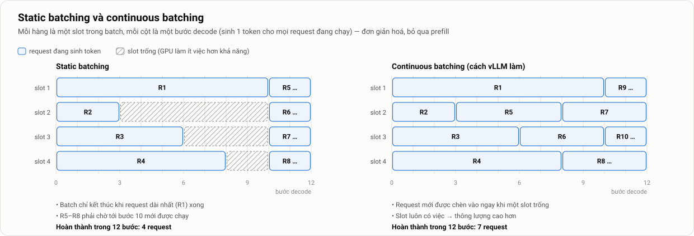

# 4. Kiến thức nền và các giải pháp liên quan: tài liệu chuyên sâu

> Thuộc [Mục 4 của bản mô tả chính](../mo-ta-chi-tiet-do-an.md#4-kiến-thức-nền-và-các-giải-pháp-liên-quan) · [Danh mục tài liệu chuyên sâu](README.md)

**Tóm tắt nhanh**
- **LLM inference**: prefill bị giới hạn bởi sức tính (*compute-bound*), decode bị giới hạn bởi băng thông bộ nhớ (*memory-bound*). KV-cache quyết định bao nhiêu request chạy song song được.
- **vLLM**: dùng PagedAttention, continuous batching, chunked prefill và prefix caching. Kiến trúc V1 tách tiến trình API và tiến trình engine. Các tham số chính quyết định năng lực phục vụ.
- **Autoscaling trên Kubernetes**: thuật toán HPA, `behavior`, cách KEDA gắn vào HPA (và điều hay bị hiểu nhầm về `pollingInterval`), Knative KPA.
- **GPU trên Kubernetes**: device plugin, GPU Operator, và ý nghĩa thật của từng metric DCGM.
- Tổng quan các hệ thống liên quan, và vị trí của đồ án giữa chúng.

Mục lục: [2. LLM inference](#2-llm-inference-cơ-bản) · [3. vLLM](#3-vllm) · [4. Autoscaling trên K8s](#4-autoscaling-trên-kubernetes) · [5. GPU trên K8s](#5-gpu-trên-kubernetes) · [6. Giải pháp liên quan](#6-các-giải-pháp-và-nghiên-cứu-liên-quan) · [7. Thuật ngữ](#7-bảng-thuật-ngữ)

---

## 2. LLM inference cơ bản

### 2.1. Sinh văn bản tự hồi quy

LLM dạng decoder-only sinh văn bản **từng token một**. Mỗi token mới được tính từ toàn bộ các token đứng trước nó, gồm cả prompt và các token đã sinh. Việc sinh dừng khi gặp token kết thúc (EOS) hoặc khi đạt `max_tokens`.

### 2.2. Prefill và decode

| | Prefill | Decode |
|---|---|---|
| Làm gì | Xử lý toàn bộ prompt **song song** trong một lượt | Sinh **1 token** mỗi bước cho mỗi request |
| Tài nguyên giới hạn | **Sức tính** (FLOPs): khoảng 2 × số tham số × số token prompt | **Băng thông bộ nhớ**: mỗi bước đọc toàn bộ weights và KV-cache |
| Ví dụ (7B, prompt 512 token) | ≈ 2 × 7,6·10⁹ × 512 ≈ 7,8 TFLOP → khoảng 0,1 s trên GPU cỡ 100 TFLOPS | ≈ 15 GB mỗi bước → khoảng 25 ms trên A10 (600 GB/s) |
| Ảnh hưởng tới người dùng | Quyết định **TTFT** (cùng với thời gian chờ) | Quyết định **ITL/TPOT** |

**Hệ quả quan trọng:** thời gian một bước decode **gần như không đổi** khi tăng batch từ 1 lên vài chục request, vì vẫn chỉ đọc weights một lần. Batching do đó tăng thông lượng gần như tuyến tính, cho tới khi (a) hết chỗ trong KV-cache, hoặc (b) bước decode chuyển sang bị giới hạn bởi sức tính.

### 2.3. KV-cache

Để khỏi phải tính lại cho các token cũ, mỗi lớp attention lưu vector Key và Value của từng token đã xử lý. Dung lượng mỗi token là:

$$
\text{KV/token} = 2 \times n_{\text{layers}} \times n_{\text{kv\_heads}} \times d_{\text{head}} \times \text{bytes}
$$

| Model | Số lớp | Số KV head | d_head | KV/token (BF16) | 8.192 token |
|---|---|---|---|---|---|
| Qwen2.5-1.5B | 28 | 2 | 128 | 28 KiB | 224 MiB |
| Qwen2.5-7B | 28 | 4 | 128 | 56 KiB | 448 MiB |
| Llama-3.1-8B | 32 | 8 | 128 | 128 KiB | 1 GiB |

Các model trên đều dùng **GQA** (grouped-query attention): nhiều head truy vấn dùng chung một KV head. Nhờ vậy KV-cache nhỏ hơn nhiều so với attention đầy đủ. Đây là lý do Qwen2.5-7B chứa được nhiều request đồng thời hơn Llama-3.1-8B trên cùng một GPU.

### 2.4. Ngân sách VRAM trên GPU 24 GB (ví dụ)

```text
24 GB × 0,90 (gpu-memory-utilization)          = 21,6 GB được phép dùng
 − weights Qwen2.5-7B (BF16)                    ≈ 15,2 GB
 − activation lúc chạy + CUDA graph             ≈  1,5 GB  (vLLM đo khi khởi động)
 = KV-cache                                     ≈  4,9 GB  ≈ 90.000 token
→ với request trung bình 1.000 token: ~90 request đồng thời (giới hạn cứng)
```

vLLM in con số thật khi khởi động (`GPU KV cache size: … tokens`, `Maximum concurrency …`). **Hãy ghi lại con số này** vào `metadata.json`.

### 2.5. Giới hạn trên của tốc độ decode theo GPU

Với batch nhỏ, thời gian một bước decode ≳ kích thước weights ÷ băng thông bộ nhớ. Bảng dưới tính cho model 7B ở BF16 (15,2 GB):

| GPU | VRAM | Băng thông | Bước decode tối thiểu | Token/s tối đa (1 request) |
|---|---|---|---|---|
| RTX 4060 Laptop | 8 GB | ~256 GB/s | (7B không vừa) | – |
| L4 | 24 GB | ~300 GB/s | ~51 ms | ~20 |
| A10 | 24 GB | ~600 GB/s | ~25 ms | ~40 |
| RTX A5000 | 24 GB | ~768 GB/s | ~20 ms | ~50 |
| RTX 4090 | 24 GB | ~1.008 GB/s | ~15 ms | ~66 |
| L40S | 48 GB | ~864 GB/s | ~18 ms | ~57 |
| A100 80GB | 80 GB | ~2.000 GB/s | ~8 ms | ~130 |

Đây là giới hạn lý thuyết; thực tế chậm hơn khoảng 20–40%. Bảng này là lý do nên **ưu tiên GPU có băng thông cao** khi thuê (xem [06 §3.1](06-moi-truong-chi-phi.md#31-chọn-loại-gpu)).

---

## 3. vLLM

### 3.1. PagedAttention

KV-cache của mỗi request được chia thành các **block** cố định, mặc định 16 token mỗi block. Mỗi request có một **bảng block** ánh xạ vị trí logic sang block vật lý, tương tự bảng trang của hệ điều hành [1]. Cách làm này mang lại ba lợi ích:
- Hầu như không phân mảnh bộ nhớ, vì không phải cấp trước một vùng liền mạch cho độ dài tối đa.
- Có thể **chia sẻ block** giữa các request có cùng tiền tố (prefix caching).
- Metric `kv_cache_usage_perc` chính là tỷ lệ số block đang được dùng.

### 3.2. Continuous batching



*Hình 11. Với static batching, cả batch phải chờ request dài nhất. Continuous batching (còn gọi là iteration-level scheduling, xuất phát từ Orca [20]) chèn request mới vào ngay khi có slot trống.*

Tác động tới đồ án:
- Thông lượng cao hơn nhiều, nhưng **các request ảnh hưởng lẫn nhau**: một request mới vào batch làm các request khác chậm đi một chút.
- GPU "luôn bận", và đây là lý do `GPU_UTIL` bão hoà (xem §5.4).

### 3.3. Chunked prefill

Một prompt dài có thể chiếm GPU trong vài trăm mili-giây, làm mọi request đang decode bị "khựng" (ITL tăng vọt). Chunked prefill [21] cắt prefill thành nhiều **khúc**, và mỗi bước chỉ xử lý tối đa `--max-num-batched-tokens` token, gồm cả prefill lẫn decode. Nhờ vậy ITL mượt hơn, đổi lại TTFT của prompt dài tăng nhẹ. Trong vLLM V1, **chunked prefill luôn được bật**.

### 3.4. Prefix caching

Khi nhiều request có chung phần đầu (ví dụ cùng một system prompt), vLLM dùng lại các block KV-cache đã tính thay vì prefill lại. Trong V1, tính năng này **bật mặc định**.

**Ảnh hưởng tới thí nghiệm:** nếu các prompt vô tình chung tiền tố, TTFT sẽ đẹp giả tạo. Có hai cách xử lý:
1. **Tắt tính năng** bằng `--no-enable-prefix-caching`. Nhóm khuyến nghị cách này cho thí nghiệm chính.
2. Sinh prompt ngẫu nhiên hoàn toàn và theo dõi tỷ lệ cache hit.

### 3.5. Preemption

Khi KV-cache đầy mà các request đang chạy vẫn cần thêm block, scheduler phải **tạm dừng** (*preempt*) một số request. V1 xử lý bằng cách tính lại (*recompute*): giải phóng block của request bị dừng, sau đó prefill lại từ đầu. Metric `vllm:num_preemptions_total` tăng là dấu hiệu rõ ràng của **quá tải bộ nhớ**.

### 3.6. Kiến trúc tiến trình của vLLM V1

```text
            HTTP (OpenAI API, SSE)
Client ─────────────────────────►  API server (FastAPI/uvicorn)
                                   • parse request, tokenize
                                   • detokenize, stream token về client
                                   • /metrics, /health
                                         │  ZeroMQ (IPC)
                                         ▼
                                   EngineCore (tiến trình riêng)
                                   • Scheduler: waiting/running, KV block
                                   • Executor → ModelRunner trên GPU
                                   • vòng lặp bước: schedule → forward → sample
```

**Hệ quả thực tế:** API server chạy bằng CPU (tokenize, detokenize, JSON, SSE). Ở số request/giây cao, **CPU có thể trở thành nút thắt** trước cả GPU. Vì vậy cần cấp đủ CPU cho pod, khoảng 4–6 vCPU, và theo dõi CPU của pod trong quá trình hiệu chỉnh.

### 3.7. Tham số quan trọng

| Tham số | Ý nghĩa | Giá trị đề xuất (7B, GPU 24 GB) | Ảnh hưởng |
|---|---|---|---|
| `--max-model-len` | Độ dài tối đa (prompt + output) | 8192 | Càng lớn thì mỗi request càng có thể chiếm nhiều KV |
| `--max-num-seqs` | Số request chạy song song tối đa | 64 | Giới hạn batch; vượt quá thì request phải chờ |
| `--max-num-batched-tokens` | Ngân sách token mỗi bước (chunked prefill) | Để mặc định, ghi lại giá trị | Đánh đổi giữa TTFT và ITL |
| `--gpu-memory-utilization` | Tỷ lệ VRAM vLLM được dùng | 0,90 | Quyết định dung lượng KV-cache |
| `--enable-prefix-caching` / `--no-…` | Bật hoặc tắt prefix caching | **Tắt** khi làm thí nghiệm | Tránh TTFT đẹp giả tạo |
| `--enforce-eager` | Tắt torch.compile và CUDA graph | Không dùng (trừ thí nghiệm cold start) | Khởi động nhanh hơn nhưng ITL tăng |
| `--dtype` | Kiểu số | `bfloat16` (hoặc `auto`) | – |
| `--served-model-name` | Tên model trả về trong API | `qwen2.5-7b` | Máy tạo tải dùng tên này |
| `--api-key` | Yêu cầu khoá khi gọi API | Tuỳ chọn | Bảo mật tối thiểu |

Mọi tham số (kể cả tham số để mặc định) phải được **ghi lại tường minh** trong `metadata.json`, vì giá trị mặc định có thể đổi giữa các phiên bản.

### 3.8. Ý nghĩa và cạm bẫy của metric vLLM

| Metric | Kiểu | Bản chất | Cạm bẫy |
|---|---|---|---|
| `num_requests_running` | gauge | Số request trong batch ở bước gần nhất | Bị chặn trên bởi `max-num-seqs` |
| `num_requests_waiting` | gauge | Số request trong hàng đợi | Bằng 0 khi chưa quá tải, **nên không dùng riêng để scale** (Hình 14) |
| `kv_cache_usage_perc` | gauge 0–1 | Tỷ lệ block KV đang được dùng | Phụ thuộc độ dài request; prompt ngắn thì tăng chậm |
| `time_to_first_token_seconds` | histogram | Tính từ khi request vào engine | **Không gồm** thời gian mạng và parse ở API server; client đo sẽ lớn hơn |
| `inter_token_latency_seconds` | histogram | Khoảng cách giữa các token | Tên cũ: `time_per_output_token_seconds` |
| `e2e_request_latency_seconds` | histogram | Toàn bộ request phía server | – |
| `request_queue_time_seconds` | histogram | Thời gian chờ trong hàng đợi | Tín hiệu quá tải rất tốt để chẩn đoán |
| `generation_tokens_total` | counter | Tổng token đã sinh | Dùng `rate()` để ra token/s |
| `num_preemptions_total` | counter | Số lần preempt | Tăng tức là KV-cache không đủ |

Với histogram, `histogram_quantile` **nội suy trong từng bucket**, nên p95 tính từ Prometheus chỉ là gần đúng. Kết quả chính thức của đồ án lấy từ **log phía client** (xem [09 §4](09-chi-so-danh-gia.md#4-phân-vị-và-cỡ-mẫu)).

---

## 4. Autoscaling trên Kubernetes

### 4.1. Thuật toán HPA

Cứ mỗi chu kỳ sync (tham số `--horizontal-pod-autoscaler-sync-period` của kube-controller-manager, **mặc định 15 s**), HPA thực hiện:

1. Lấy giá trị metric. Metric có thể là loại Resource (CPU/RAM), Pods, Object hoặc External.
2. Tính số replica đề xuất:
   $$\text{desired} = \left\lceil \text{current} \times \frac{\text{currentMetric}}{\text{targetMetric}} \right\rceil$$
   Với external metric kiểu `AverageValue`, currentMetric được tính bằng tổng chia cho số replica hiện có, nên công thức rút gọn thành **desired = ⌈tổng ÷ target⌉**.
3. **Bỏ qua** nếu tỷ lệ currentMetric/targetMetric nằm trong khoảng [0,9; 1,1] (*tolerance* 10%).
4. Áp dụng `behavior`:
   - **Stabilization window:** với scale-down, HPA lấy giá trị đề xuất **lớn nhất** trong cửa sổ (mặc định 300 s), nghĩa là chỉ giảm khi mọi đề xuất trong suốt 5 phút đều thấp. Với scale-up, cửa sổ mặc định là 0.
   - **Policies:** giới hạn tốc độ thay đổi theo số pod (`Pods`) hoặc tỷ lệ (`Percent`) trong mỗi `periodSeconds`. `selectPolicy: Max` (mặc định) chọn policy cho phép thay đổi nhiều nhất.
   - Scale-up mặc định cho phép tăng thêm 100% số pod **hoặc** thêm 4 pod mỗi 15 s, lấy giá trị lớn hơn.
5. Kẹp kết quả vào khoảng [minReplicas, maxReplicas], rồi cập nhật `spec.replicas` của Deployment.

**Ví dụ.** Target 24, có 2 replica, tổng `running + waiting` là 70:
- Tỷ lệ = (70 ÷ 2) ÷ 24 ≈ 1,46, nằm ngoài tolerance nên HPA hành động.
- desired = ⌈70 ÷ 24⌉ = 3.
- Policy mặc định cho phép tăng từ 2 lên 3, nên HPA đặt `replicas: 3`.

### 4.2. Các loại metric

| Loại | Nguồn | Ví dụ | Dùng trong đồ án |
|---|---|---|---|
| Resource | metrics-server | CPU 70% | Không (CPU không phản ánh tải GPU) |
| Pods | custom metrics API | Trung bình một metric trên mỗi pod | Có thể dùng (qua prometheus-adapter) |
| Object | custom metrics API | Metric của một object (ví dụ Ingress) | Không |
| **External** | external metrics API | Kết quả của một truy vấn PromQL bất kỳ | **Có (qua KEDA)** |

### 4.3. KEDA

```text
ScaledObject (CRD)  ──►  KEDA operator ──tạo/cập nhật──►  HPA "keda-hpa-<tên>"
                                                           │  mỗi chu kỳ sync HPA
                                                           ▼
                         KEDA metrics API server ◄── hỏi external metric
                                   │ chạy scaler (PromQL)
                                   ▼
                              Prometheus
```

Các điểm quan trọng (theo tài liệu KEDA):
- **`pollingInterval` (mặc định 30 s) chủ yếu dùng cho việc kích hoạt 0 ↔ 1.** Khi scale từ 1 lên N, **HPA** mới là bên hỏi metric theo chu kỳ sync của nó (15 s), và KEDA metrics server chạy truy vấn đúng lúc được hỏi. Tuỳ chọn `useCachedMetrics: true` cho phép trả kết quả đã cache theo `pollingInterval`.
  → Muốn phát hiện tải nhanh hơn khi đã có ít nhất 1 replica, phải **giảm chu kỳ sync của HPA**. Trên k3s làm được bằng `--kube-controller-manager-arg=horizontal-pod-autoscaler-sync-period=5s`.
- `cooldownPeriod` (mặc định 300 s) chỉ áp dụng khi scale **về 0**.
- `fallback`: số replica dự phòng khi scaler lỗi liên tục, ví dụ khi Prometheus sập.
- `activationThreshold`: ngưỡng để "thức dậy" từ 0 replica.
- Annotation `autoscaling.keda.sh/paused-replicas: "N"` **tạm dừng** autoscaling và giữ nguyên N replica. Experiment runner dùng annotation này để reset giữa các lượt chạy.

### 4.4. Knative KPA (dùng trong KServe serverless)

- Scale theo **số request đồng thời** trên mỗi pod (target mềm, mặc định 100, thường chỉnh nhỏ hơn cho LLM).
- Có hai cửa sổ: **stable** (mặc định 60 s) và **panic** (10% của stable, tức 6 s). Khi tải vượt 200% target, KPA vào chế độ panic và scale rất nhanh.
- Hỗ trợ scale về 0 thông qua *activator*, thành phần giữ request lại trong lúc pod khởi động.
- Về bản chất, KPA gần với chiến lược A2 (scale theo tải đồng thời). So sánh thực nghiệm với KPA là một hướng mở rộng ([15](15-huong-mo-rong.md#e4-so-sánh-với-kserve--knative-kpa)).

### 4.5. Những cơ chế khác không dùng

- **VPA** (Vertical Pod Autoscaler): không thay đổi được số GPU một cách có ý nghĩa, và phải khởi động lại pod.
- **Cluster Autoscaler / Karpenter**: thêm hoặc bớt node khi có pod Pending. Nằm ngoài phạm vi, nhưng đáng nhắc tới vì nó **cộng thêm vài phút** vào cold start khi chạy trên cloud công cộng.

---

## 5. GPU trên Kubernetes

### 5.1. Mô hình device plugin

- GPU được công bố dưới dạng **extended resource** `nvidia.com/gpu`. Tài nguyên này **chỉ nhận số nguyên** và không cho phép cấp vượt (overcommit).
- Scheduler chỉ đếm số GPU còn trống. Khi tạo container, kubelet gọi `Allocate` của device plugin để chọn GPU cụ thể, và NVIDIA container toolkit đưa `/dev/nvidia*` cùng thư viện driver vào container.

### 5.2. Các thành phần của NVIDIA GPU Operator

| Thành phần | Vai trò | Ghi chú cho đồ án |
|---|---|---|
| Driver (container) | Cài driver NVIDIA | Trên laptop hoặc VM đã có driver thì tắt đi (`driver.enabled=false`) |
| Container toolkit | Cho container runtime dùng được GPU | Với k3s cần trỏ đúng đường dẫn containerd (xem [06](06-moi-truong-chi-phi.md#2-tầng-1-laptop-rtx-4060)) |
| Device plugin | Công bố `nvidia.com/gpu` | Bắt buộc |
| GPU Feature Discovery | Gắn nhãn node (`nvidia.com/gpu.present`, model GPU…) | Dùng trong `nodeSelector` |
| DCGM exporter | Xuất metric GPU cho Prometheus | Chỉnh chu kỳ thu về 5 s |
| MIG manager, validator | Chia GPU (MIG); kiểm tra hệ thống | MIG ngoài phạm vi |

### 5.3. Ý nghĩa của các metric DCGM

| Metric | Đo gì | Có dùng cho autoscaling được không? |
|---|---|---|
| `DCGM_FI_DEV_GPU_UTIL` | % thời gian có **ít nhất một kernel** chạy trong chu kỳ lấy mẫu | Kém: bão hoà sớm (chiến lược A1 để minh hoạ điều này) |
| `DCGM_FI_DEV_FB_USED` | VRAM đã dùng | Không: vLLM cấp phát trước |
| `DCGM_FI_PROF_SM_ACTIVE` | Tỷ lệ chu kỳ có SM hoạt động (trung bình trên các SM) | Tốt hơn GPU_UTIL; chỉ có trên GPU datacenter |
| `DCGM_FI_PROF_SM_OCCUPANCY` | Mức lấp đầy warp trên SM | Để chẩn đoán |
| `DCGM_FI_PROF_DRAM_ACTIVE` | Tỷ lệ thời gian bus bộ nhớ đang hoạt động | **Rất đáng quan sát**, vì decode bị giới hạn bởi băng thông |
| `DCGM_FI_DEV_POWER_USAGE` | Công suất (W) | Chỉ báo gián tiếp về mức làm việc |
| `DCGM_FI_DEV_GPU_TEMP`, `SM_CLOCK` | Nhiệt độ, xung nhịp | Phát hiện giảm xung vì nhiệt |

DCGM exporter có thể mặc định thu metric **30 s một lần** (tham số collect interval). Cần chỉnh về 5 s để so sánh công bằng với metric của vLLM.

### 5.4. Vì sao GPU_UTIL bão hoà

GPU_UTIL trả lời câu hỏi *"trong chu kỳ lấy mẫu, có lúc nào GPU đang chạy kernel không?"*, chứ không trả lời *"GPU đang làm bao nhiêu phần việc so với khả năng?"*.

Với vLLM, chỉ cần có vài request là vòng lặp engine đã liên tục phát kernel decode. Khi đó GPU_UTIL gần 100%, dù một batch 4 request chỉ khai thác một phần nhỏ thông lượng mà GPU có thể đạt với batch 64. Hệ quả là metric này **không phân biệt được** "4 request" với "64 request".

---

## 6. Các giải pháp và nghiên cứu liên quan

### 6.1. Nền tảng mã nguồn mở

| Hệ thống | Cách autoscaling | Điểm đáng học |
|---|---|---|
| **KServe** | Serverless: Knative KPA (tải đồng thời, về 0). Raw deployment: HPA hoặc KEDA | Cache model cục bộ; hỗ trợ vLLM làm runtime |
| **vLLM Production Stack** | KEDA theo metric của vLLM | Router, Helm chart, dashboard mẫu |
| **llm-d** | Autoscaler nhận biết workload; scheduler theo trạng thái KV-cache (Gateway API Inference Extension) | Định tuyến thông minh; tách prefill/decode |
| **AIBrix** | Autoscaler chuyên cho LLM, kiểu KPA hoặc APA | Gateway, KV-cache phân tán |
| **NVIDIA Dynamo** | "Planner" scale theo SLO; serving phân tán | Tách prefill/decode quy mô lớn |
| **Ray Serve (LLM)** | Scale theo số request đang xử lý mỗi replica (`target_ongoing_requests`) | Cùng ý tưởng với A2 |

**Nhận xét:** các nền tảng trên hoặc dùng HPA/KEDA/KPA làm cơ chế nền, hoặc dùng **tải đồng thời hoặc hàng đợi** làm tín hiệu chính, trái hẳn với GPU utilization. Đồ án kiểm chứng xu hướng này bằng thực nghiệm có kiểm soát.

### 6.2. Nghiên cứu học thuật

| Công trình | Ý chính | Liên hệ |
|---|---|---|
| Orca (OSDI'22) [20] | Iteration-level scheduling (continuous batching) | Cơ sở của batching trong vLLM |
| vLLM (SOSP'23) [1] | PagedAttention | Engine được dùng |
| Sarathi-Serve (OSDI'24) [21] | Chunked prefill, cân bằng TTFT và ITL | Hiểu hành vi của V1 |
| DistServe (OSDI'24) [2] | Goodput theo SLO; tách prefill/decode | Định nghĩa goodput |
| Splitwise (ISCA'24) [3] | Tách pha theo phần cứng; công bố trace Azure | Nguồn trace cho KB5 |
| Llumnix (OSDI'24) [22] | Di chuyển request giữa các instance, lập lịch động | Hướng định tuyến và cân bằng |
| ServerlessLLM (OSDI'24) [4] | Nạp checkpoint nhanh, lưu trữ nhiều tầng | Cơ sở lý thuyết cho RQ2 |
| BurstGPT [5] | Trace tải thật, đặc tính burst | Mô hình tải |

### 6.3. Vị trí của đồ án

Các công trình trên hoặc **xây hệ thống mới**, hoặc **tối ưu engine**. Khoảng trống mà đồ án lấp là **đánh giá thực nghiệm có kiểm soát, tái lập được** trên hạ tầng chuẩn mà doanh nghiệp đang dùng (Kubernetes, KEDA, HPA), để trả lời những câu hỏi rất thực tế: nên scale theo metric nào, cold start ảnh hưởng thế nào, và thực sự tiết kiệm được bao nhiêu.

---

## 7. Bảng thuật ngữ

| Thuật ngữ | Giải thích ngắn |
|---|---|
| Token | Đơn vị văn bản mà model xử lý |
| Prefill / Decode | Pha xử lý prompt / pha sinh từng token |
| KV-cache | Bộ nhớ lưu Key/Value của các token đã xử lý |
| TTFT | Time To First Token: thời gian tới token đầu tiên |
| ITL / TPOT | Inter-Token Latency / Time Per Output Token: độ trễ giữa các token |
| SLO | Service Level Objective: mục tiêu chất lượng dịch vụ |
| SLO attainment | Tỷ lệ request đạt SLO |
| Goodput | Thông lượng tính trên các request đạt SLO |
| Replica | Một bản sao của pod vLLM (ở đây mỗi bản dùng 1 GPU) |
| Cold start | Thời gian từ lúc tạo pod đến khi pod phục vụ được |
| HPA | Horizontal Pod Autoscaler |
| KEDA | Kubernetes Event-driven Autoscaling |
| Stabilization window | Cửa sổ thời gian HPA "chờ ổn định" trước khi scale |
| Flapping | Số replica dao động lên xuống liên tục |
| Open-loop / closed-loop | Sinh tải không phụ thuộc / phụ thuộc vào phản hồi của hệ thống |
| Little's law | L = λ·W: số phần tử trong hệ thống bằng tốc độ đến nhân thời gian lưu lại |
| GQA | Grouped-Query Attention |

---

## 8. Câu hỏi hội đồng có thể đặt ra

**Vì sao không dùng metric CPU/RAM như bình thường?**
CPU của pod vLLM chủ yếu phục vụ API server (tokenize, SSE), còn RAM gần như cố định. Cả hai đều không phản ánh tải trên GPU (xem §3.6 và §5.4).

**Batch lớn hơn thì mỗi request có chậm đi không?**
Có, nhưng ít. Decode bị giới hạn bởi băng thông, nên tăng batch chỉ làm mỗi bước chậm hơn một chút. Hình 15 cho thấy ITL tăng gần tuyến tính theo tải, trong khi TTFT tăng vọt do phải chờ trong hàng đợi.

**Tại sao KEDA mà không phải prometheus-adapter?**
Cả hai đều cấp external metric cho HPA. KEDA được chọn vì cấu hình khai báo gọn trong một `ScaledObject`, có sẵn các tính năng `fallback`, `paused-replicas`, kích hoạt từ 0, và phổ biến trong các giải pháp serving LLM.

---

## Tham khảo bổ sung (ngoài danh mục của tài liệu chính)
- [20] G.-I. Yu et al., "Orca: A Distributed Serving System for Transformer-Based Generative Models," *OSDI*, 2022.
- [21] A. Agrawal et al., "Taming Throughput-Latency Tradeoff in LLM Inference with Sarathi-Serve," *OSDI*, 2024.
- [22] B. Sun et al., "Llumnix: Dynamic Scheduling for Large Language Model Serving," *OSDI*, 2024.
