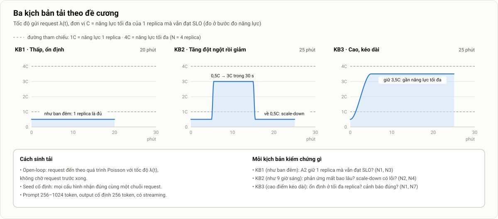
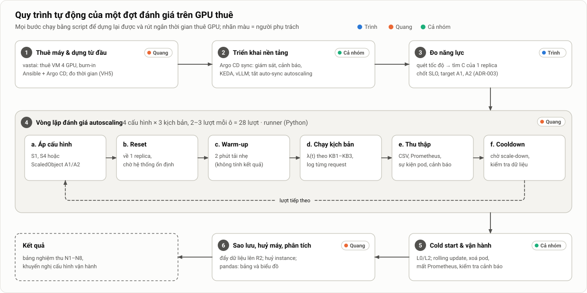

# 5. Môi trường triển khai và đánh giá

> Thuộc [bộ tài liệu đồ án](../mo-ta-chi-tiet-do-an.md#bộ-tài-liệu) · Dùng cho mục 3.6, 4.1, 4.11 và chương 5 của luận văn · Cấu hình máy, kịch bản, ma trận và ngân sách: [Thông số](00-thong-so.md) · Quyết định: [ADR-004](../adr/004-dieu-kien-thuc-te-va-pham-vi-rut-gon.md)

**Tóm tắt nhanh**
- **Tầng 1 (máy nhà và simulator):** PC RTX 5060, có thể thêm laptop RTX 4050, dựng k3s có GPU; máy không GPU dùng `llm-d-inference-sim`. Đây là **môi trường chức năng**: phát triển, kiểm thử, kịch bản vận hành; không dùng số liệu hiệu năng.
- **Tầng 2 (GPU thuê):** **Vast.ai chế độ VM, 4 × RTX 4090, thuê trọn máy**. Toàn bộ ĐG1–ĐG3 đo trong **một lần thuê liền** cuối tuần 07–08/11 (khoảng 20–22 giờ), runner chạy qua đêm. Dự phòng: máy Vast khác, rồi GCP g2/L4.
- **Chi phí:** ước tính 30–75 USD tiền thật cho 4 phiên thuê (V0–V3), dưới trần 150 USD.
- **Đánh giá để nghiệm thu**, không phải nghiên cứu thống kê. Ba lớp: kiểm thử chức năng, **kịch bản vận hành VH1–VH6**, và **ĐG1–ĐG3** trên GPU thuê. ĐG2 so sánh S1, S4, A1, A2 dưới **3 kịch bản tải của đề cương**, tổng **17 lượt**.
- Số liệu báo cáo dạng **trung bình kèm min–max**, có vẽ từng lượt. Sản phẩm cuối cùng là **bảng nghiệm thu**.

> Các lệnh dưới đây là **khung tham khảo**. Tên gói, cờ và đường dẫn có thể thay đổi theo phiên bản, nên luôn đối chiếu với tài liệu chính thức của k3s, NVIDIA, vLLM và Vast.ai tại thời điểm cài đặt.

---

## 1. Hai tầng, cùng một bộ manifest


*Hình 6. Xây dựng và vận hành thử trên máy nhà và simulator (gần như miễn phí), đánh giá trên GPU thuê theo giờ. Cả hai tầng triển khai từ cùng một Git repository và chỉ khác nhau ở overlay.*

| | Tầng 1: máy nhà và simulator | Tầng 2: GPU thuê |
|---|---|---|
| Mục đích | Phát triển; kiểm thử chức năng; kịch bản vận hành (rolling update, cảnh báo, sự cố); ĐG1-mini để lấy target tạm | Đo năng lực, đánh giá autoscaling, cold start, kịch bản vận hành trên GPU thật |
| GPU | PC RTX 5060 8 GB (+ laptop RTX 4050 6 GB nếu được); simulator không cần GPU | 4 × RTX 4090 24 GB (Vast.ai, chế độ VM) |
| Model | Qwen2.5-1.5B-Instruct (hoặc 3B AWQ) | Qwen2.5-7B-Instruct |
| Chi phí | ≈ 0 (tiền điện) | Theo giờ |
| Số liệu dùng trong chương đánh giá? | Chỉ kết quả đạt/không đạt của kiểm thử và kịch bản vận hành | **Có** |

Cấu hình máy và tiêu chí lọc máy thuê nằm ở [Thông số §10](00-thong-so.md#10-máy-và-môi-trường).

---

## 2. Tầng 1: máy nhà và simulator

### 2.1. Chuẩn bị máy

- **Hệ điều hành:** Ubuntu 22.04 hoặc 24.04 **bản server, không giao diện đồ hoạ**: tiết kiệm 1–2 GB RAM, và GPU không phải kết xuất màn hình nên metric GPU không bị nhiễu. WSL2 không phù hợp để dựng Kubernetes có GPU.
- **Laptop có hai GPU (Optimus):** đảm bảo GPU NVIDIA đang hoạt động (`prime-select nvidia` hoặc `on-demand`), và kiểm tra bằng `nvidia-smi`. Luôn cắm sạc, tắt chế độ ngủ.
- **Mạng:** đặt IP cố định trong LAN, mở các cổng k3s cần giữa hai máy: 6443/tcp (API), 8472/udp (flannel VXLAN), 10250/tcp (kubelet). Cài **Tailscale** để thành viên ở xa truy cập được API của cluster.

### 2.2. Driver, container toolkit và kiểm tra vLLM trên RTX 5060

```bash
sudo ubuntu-drivers install                 # RTX 5060 (Blackwell) cần nhánh driver mới, hỗ trợ CUDA 12.8 trở lên [cần kiểm chứng]
nvidia-smi                                  # phải thấy GPU và phiên bản CUDA
sudo apt-get install -y nvidia-container-toolkit   # theo hướng dẫn chính thức của NVIDIA
```

**Kiểm tra image vLLM chạy được trên RTX 5060 (sm_120)**, việc phải làm trong W1:

```bash
docker run --rm --gpus all --entrypoint python3 vllm/vllm-openai@sha256:… \
  -c "import torch; print(torch.cuda.get_arch_list())"          # phải có sm_120
docker run --rm --gpus all -p 8000:8000 vllm/vllm-openai@sha256:… \
  --model Qwen/Qwen2.5-1.5B-Instruct --max-model-len 4096 --gpu-memory-utilization 0.85
curl -N localhost:8000/v1/chat/completions -H 'Content-Type: application/json' \
  -d '{"model":"Qwen/Qwen2.5-1.5B-Instruct","stream":true,"messages":[{"role":"user","content":"Xin chào"}]}'
curl -s localhost:8000/metrics | grep vllm:num_requests_running
```

Nếu sau khoảng 4 giờ thử (kể cả image NGC hoặc tự build) vẫn không chạy: dùng laptop 4050 (sm_89) làm node GPU, hoặc thuê 1 GPU cho các bài cần GPU thật. Ghi kết quả (driver, arch list, digest, log khởi động, VRAM trống) vào nhật ký.

### 2.3. Cài k3s

```bash
# Node chủ (PC): giảm chu kỳ sync HPA xuống 5 s để phát hiện tải nhanh hơn
curl -sfL https://get.k3s.io | INSTALL_K3S_VERSION=v1.xx.y+k3s1 sh -s - server \
  --kube-controller-manager-arg=horizontal-pod-autoscaler-sync-period=5s \
  --write-kubeconfig-mode=644

sudo cat /var/lib/rancher/k3s/server/node-token     # token để máy khác join

# Node agent (laptop 4050, nếu có)
curl -sfL https://get.k3s.io | INSTALL_K3S_VERSION=v1.xx.y+k3s1 \
  K3S_URL=https://<ip-pc>:6443 K3S_TOKEN=<token> sh -
```

Khi có sẵn NVIDIA container toolkit, k3s thường tự phát hiện `nvidia-container-runtime` và tạo RuntimeClass `nvidia`. Kiểm tra bằng `kubectl get runtimeclass`.

### 2.4. Cho Kubernetes thấy GPU

Hai cách, chọn một:
- **Chỉ cài NVIDIA device plugin** (Helm) với `runtimeClassName: nvidia`, rồi cài riêng `nvidia_gpu_exporter`. Cách này gọn hơn, nên dùng ở nhà.
- **GPU Operator** với `driver.enabled=false`. Nếu dùng toolkit của Operator, phải trỏ tới containerd của k3s (config và socket nằm dưới `/var/lib/rancher/k3s/…` và `/run/k3s/containerd/…`) theo hướng dẫn "GPU Operator với k3s".

Kiểm tra:

```bash
kubectl describe node <node> | grep -A2 "nvidia.com/gpu"    # Capacity: nvidia.com/gpu: 1
kubectl run gpu-test --rm -it --restart=Never \
  --image=nvidia/cuda:12.8.0-base-ubuntu22.04 \
  --overrides='{"spec":{"runtimeClassName":"nvidia","containers":[{"name":"t","image":"nvidia/cuda:12.8.0-base-ubuntu22.04","command":["nvidia-smi"],"resources":{"limits":{"nvidia.com/gpu":1}}}]}}'
```

GPU dòng consumer không nằm trong danh sách hỗ trợ chính thức của GPU Operator và DCGM, nhưng device plugin thường vẫn chạy được.

### 2.5. vLLM trên GPU 6–8 GB

Overlay `home` dùng các giá trị ở [Thông số §9.1](00-thong-so.md#91-vllm). Nếu thiếu VRAM: dùng model lượng tử hoá AWQ, hoặc thêm `--enforce-eager` (bỏ CUDA graph để tiết kiệm bộ nhớ). Ghi lại dòng `GPU KV cache size` trong log khởi động để biết số request đồng thời tối đa.

### 2.6. Tài nguyên của node chủ

Ước lượng cho PC (RAM 16 GB, CPU 6 nhân/12 luồng); đo lại bằng `kubectl top` và `free -h`:

| Thành phần | CPU (request) | RAM thực (ước) |
|---|---|---|
| Ubuntu server + containerd | – | 0,8–1,2 GB |
| k3s server, Traefik, CoreDNS, local-path | 0,5 | 0,8–1,2 GB |
| kube-prometheus-stack (scrape 5 s, retention 3 ngày) + Grafana + Alertmanager + kube-state-metrics | 0,5–1 | 2–3 GB |
| Argo CD bản core | 0,3 | 0,6–1 GB |
| KEDA + Sealed Secrets | 0,25 | 0,3 GB |
| Device plugin + `nvidia_gpu_exporter` | 0,1 | 0,1 GB |
| vLLM 1,5B | 2 | 3–5 GB |
| Máy tạo tải + 3 pod simulator | 1,3 | 0,6–0,8 GB |
| **Tổng** | **~5–6** | **~8–13 GB → sát** |

Vì RAM sát, đặt request bộ nhớ của vLLM ở nhà nhỏ ([Thông số §9.2](00-thong-so.md#92-deployment-vllm)), chạy Ubuntu không giao diện đồ hoạ, giữ retention Prometheus ngắn và cài Argo CD bản core.

**Đĩa:** image vLLM (nén và giải nén) 20–40 GB; các image khác 3–5 GB; model 5–11 GB; TSDB 2–5 GB; hệ điều hành 15–25 GB. Tổng khoảng **45–85 GB**, cộng 20–40 GB nếu phải tự build vLLM cho sm_120. Đủ với 200 GB trống, sát với 100 GB.

### 2.7. Không có GPU vẫn phát triển được

`llm-d-inference-sim` giả lập API và metric của vLLM, cho phép cấu hình TTFT và ITL giả. Công cụ này chạy trên cluster `kind` hoặc k3d không có GPU, và là **công cụ phát triển chính** cho thành viên không có máy GPU. Dùng nó để:
- Viết và kiểm thử ScaledObject A2, bài kiểm thử T1–T7, scale 1 → 3 replica, và A4 (flapping).
- Thử drain node trên cluster kind nhiều node.
- Viết dashboard, quy tắc cảnh báo và runner đánh giá.
- Kiểm thử máy tạo tải ở tốc độ cao mà không tốn GPU.

Thành viên ở xa truy cập cluster nhà (có GPU thật) qua Tailscale khi cần.

---

## 3. Tầng 2: Vast.ai chế độ VM

### 3.1. Chọn loại GPU

| GPU | VRAM | Băng thông | Decode tối đa với 7B BF16 | Nhận xét |
|---|---|---|---|---|
| **RTX 4090** | 24 GB | ~1.008 GB/s | ~66 token/s | **Lựa chọn chính**: nhanh; khoảng 0,3–0,55 USD/GPU-giờ trên marketplace |
| RTX 3090 | 24 GB | ~936 GB/s | ~61 token/s | Dự phòng rẻ hơn; Ampere, có BF16 |
| RTX A5000 | 24 GB | ~768 GB/s | ~50 token/s | Dự phòng; card workstation, nhiệt độ và xung nhịp ổn định hơn |
| L4 | 24 GB | ~300 GB/s | ~20 token/s | Chỉ dùng nếu chuyển sang GCP (§5); TPOT có thể sát ngưỡng |
| A100 / H100 | 40–80 GB | 1,5–3,3 TB/s | 100+ token/s | Dư thừa cho 7B, đắt |

**Hệ quả của việc dùng GPU GeForce:**
- Không có metric profiling của DCGM (`DCGM_FI_PROF_*`), nên không làm A1′.
- DCGM có thể không hỗ trợ đầy đủ. Nếu vậy, dùng `nvidia_gpu_exporter`.
- Kết luận định lượng gắn với GPU consumer. Điều này được ghi vào phần hạn chế.

### 3.2. Chọn nền tảng

| Nền tảng | Chạy được K8s? | Ưu | Nhược |
|---|---|---|---|
| **Vast.ai, chế độ VM** | **Có**: VM KVM, có systemd | Rẻ; nhiều máy; **hiển thị chỉ số từng máy** (độ tin cậy, tốc độ ổ, PCIe, mạng) để lọc; nhóm đã có tài khoản | Ít máy hỗ trợ VM hơn máy container; khởi tạo chậm hơn; chỉ truy cập qua SSH; chưa chắc có máy 4 GPU vào cuối tuần |
| Vast.ai, chế độ container (mặc định) | **Không**: không có systemd, không chạy container lồng được | Rẻ, nhiều máy | Chỉ dùng để thử vLLM đơn lẻ |
| RunPod Pods | Không (container) | Dễ dùng | Không phù hợp |
| GCP (Compute Engine, g2/L4) | Có | Ổn định; SKU cố định; có 200 USD credit | Free trial chặn GPU; quota GPU mặc định 0; tài khoản cá nhân dễ bị từ chối (§5) |

TensorDock không còn là phương án dự phòng ([ADR-004](../adr/004-dieu-kien-thuc-te-va-pham-vi-rut-gon.md)).

### 3.3. Lọc máy

Tiêu chí ở [Thông số §10.2](00-thong-so.md#102-gpu-thuê). Lệnh tìm máy (kiểm tra lại tên trường bằng `vastai search offers --help`):

```bash
pip install vastai && vastai set api-key <KEY>
vastai search offers \
  'num_gpus=4 gpu_name=RTX_4090 vms_enabled=true rentable=true reliability>0.98 cpu_ram>=128 disk_space>=300 inet_down>=500' \
  -o 'dph'
```

Chạy lệnh vào **thứ Bảy và Chủ nhật** của hai cuối tuần trước hạn chọn cloud, ghi lại số offer và giá. Tiêu chí đạt và hạn quyết định nằm ở [ADR-004](../adr/004-dieu-kien-thuc-te-va-pham-vi-rut-gon.md) K6.

**Vì sao thuê trọn máy:** không ai khác dùng chung CPU, RAM, PCIe hay ổ đĩa của máy. Đây là nguồn nhiễu lớn nhất trên marketplace.

### 3.4. Burn-in rút gọn

Làm ngay sau khi thuê máy cho phiên V2, khoảng 30 phút. **Đạt thì giữ máy và chạy luôn.**

```bash
nvidia-smi -q | grep -iE "product name|link|power limit|clocks|driver|cuda"   # ghi vào burnin.json
fio --name=seqread --rw=read --bs=1M --size=8G --filename=/data/fio.tmp --direct=1   # yêu cầu ≥ 1 GB/s
# Chạy vLLM bằng Docker trên từng GPU, mỗi GPU khoảng 3 phút ở cùng λ:
for g in 0 1 2 3; do
  docker run --rm --gpus "device=$g" … vllm/vllm-openai@sha256:… --model /models/Qwen2.5-7B-Instruct &
  vllm bench serve … --request-rate 1.5 --num-prompts 270   # ghi TTFT p95, token/s
done
nvidia-smi -q -d PERFORMANCE,TEMPERATURE    # không có lý do throttle; nhiệt < 83 °C
```

| Kiểm tra | Ngưỡng đạt |
|---|---|
| Chênh lệch TTFT p95 và token/s giữa 4 GPU | ≤ 5% |
| Tốc độ đọc ổ | ≥ 1 GB/s |
| Throttle / nhiệt độ | Không có / < 83 °C |
| PCIe | Gen4 trở lên, đúng độ rộng khe cắm (thường x16) |

**Không đạt** thì huỷ ngay và thử máy tiếp theo, tối đa 2 máy. Kiểm tra độ trôi năng lực được thay bằng một lượt kiểm tra giữa phiên (§6.2).

### 3.5. Cấu hình k3s và phân bổ CPU trên VM thuê

```bash
curl -sfL https://get.k3s.io | INSTALL_K3S_VERSION=v1.xx.y+k3s1 sh -s - server \
  --kube-controller-manager-arg=horizontal-pod-autoscaler-sync-period=5s \
  --kubelet-arg=cpu-manager-policy=static \
  --kubelet-arg=reserved-cpus=0-3 \
  --write-kubeconfig-mode=644
```

Với `cpu-manager-policy=static`, pod có QoS **Guaranteed** (requests = limits, CPU là số nguyên) được cấp **lõi CPU riêng**, không bị pod khác chen vào. CPU manager chỉ bật trên VM thuê. Ví dụ với máy 48 vCPU:

| Nhóm | Lõi CPU | Ghi chú |
|---|---|---|
| Hệ thống, k3s (`reserved-cpus`) | 0–3 | Không cấp riêng cho pod nào |
| 4 pod vLLM | 4 × 6 lõi riêng | Theo [Thông số §9.2](00-thong-so.md#92-deployment-vllm) |
| Pod máy tạo tải | 4 lõi riêng | `cpu 4, memory 4Gi` |
| Các pod còn lại (Prometheus, Grafana, KEDA, Argo CD, Traefik) | Vùng CPU dùng chung | Không đòi lõi riêng |

Nếu máy chỉ có 32 vCPU: dùng 5 lõi cho mỗi pod vLLM và 3 lõi cho máy tạo tải.

### 3.6. Máy tạo tải chạy cùng VM

- Trên marketplace khó thuê được một máy CPU riêng nằm cùng datacenter. Nhóm vì thế đặt máy tạo tải **trong chính cluster**, dưới dạng pod Guaranteed có lõi riêng, và gửi request qua Traefik. Độ trễ mạng gần như bằng 0 và không dao động.
- **Kiểm chứng trong mỗi lượt:** CPU của pod máy tạo tải < 70% và **không bị giới hạn CPU** (đọc `nr_throttled` trong `cpu.stat` của cgroup); độ lệch lịch gửi p99 < 50 ms; độ trễ event loop (§9).
- Runner chạy dưới dạng dịch vụ `systemd` trên chính VM, ngoài cluster, dùng `kubectl` và API của Prometheus. Runner tốn rất ít CPU, và vẫn chạy tiếp khi mất SSH.

### 3.7. Tự động hoá bằng Makefile

| Lệnh | Việc làm |
|---|---|
| `make home-up` | Dựng k3s và toàn bộ nền tảng trên cluster nhà (Ansible + Argo CD) |
| `make find` | `vastai search offers` theo tiêu chí, in ra 5 máy rẻ nhất |
| `make rent OFFER=<id>` | `vastai create instance` (template VM Ubuntu có driver NVIDIA), chờ SSH, ghi instance id |
| `make burnin` | Ansible chạy các bước §3.4, xuất `burnin.json`; không đạt thì dừng |
| `make bootstrap` | Ansible: chrony, NVMe, k3s (tham số §3.5), GPU, Argo CD, nạp khoá Sealed Secrets, root-app; in thời gian từng bước (dùng cho VH5) |
| `make prefetch` | Job tải model, DaemonSet pre-pull image |
| `make capacity` | Đo năng lực một replica, sinh `capacity.json` |
| `make run MATRIX=…` | Chạy ma trận đánh giá autoscaling |
| `make ops-tests` | Chạy các kịch bản vận hành tự động hoá được (VH2–VH4) |
| `make backup` | `rclone` lên R2, kiểm tra checksum |
| `make release` | Huỷ instance; **từ chối chạy** nếu backup chưa xong |
| `make analysis` | Tạo bảng, chạy notebook, xuất hình |
| `make lint test` | Kiểm tra YAML, manifest, quy tắc cảnh báo, Python |

- Chỉ phần `find/rent/release` phụ thuộc Vast.ai. Nếu chuyển sang GCP thì chỉ viết lại ba lệnh này bằng `gcloud`; toàn bộ Ansible trở đi giữ nguyên.
- **Đồng bộ giờ:** mọi thứ chạy trên cùng một máy nên không lo lệch đồng hồ. Vẫn cài chrony để timestamp đúng giờ UTC.

### 3.8. Sao lưu dữ liệu

- Runner đẩy `runs/<run-id>/` lên **Cloudflare R2** ngay sau mỗi lượt (`rclone copy` kèm checksum). Nhóm đã có tài khoản R2.
- `make release` kiểm tra xem mọi lượt đã được sao lưu chưa; nếu chưa thì **từ chối huỷ instance**.

---

## 4. Chi phí

### 4.1. Công thức

$$
\text{Chi phí} = \sum_{\text{phiên}} h \times n_{\text{GPU}} \times p_{\text{GPU}} \;+\; \text{lưu trữ (GB × thời gian)} \;+\; \text{băng thông tải về}
$$

Trên Vast.ai, giá hiển thị cho mỗi máy thường đã gồm CPU và RAM. **Ổ đĩa tính tiền riêng**, kể cả khi instance đang dừng. Một số máy tính thêm phí băng thông (với khoảng 50 GB image và model thì không đáng kể).

### 4.2. Kiểm soát chi phí

1. **Tín dụng trả trước là giới hạn cứng.** Chỉ nạp đủ cho phiên kế tiếp; tổng không quá trần ở [Thông số §11](00-thong-so.md#11-ngân-sách).
2. **Không để số dư về 0.** Khi hết tiền, instance có thể bị dừng hoặc **xoá**. Trước V2 nạp sao cho số dư đủ mức tối thiểu ở [Thông số §11](00-thong-so.md#11-ngân-sách); runner kiểm tra số dư mỗi giờ (`vastai show user`) và báo động qua Telegram khi số dư thấp.
3. **Không phát triển trên máy thuê.** Chỉ V0, V1 dành cho thử nghiệm; mọi thứ phải chạy ổn ở nhà và trên simulator trước.
4. **Huỷ ngay khi xong phiên.** Không để instance ở trạng thái dừng giữa các cuối tuần, vì ổ đĩa vẫn tính tiền và khi bật lại chưa chắc GPU còn trống.
5. **Báo động tự động:** runner gửi thông báo Telegram khi xong mỗi nhóm lượt, khi có lượt không hợp lệ, hoặc khi số dư thấp.

---

## 5. Dự phòng: GCP và kế hoạch Z

**Dự phòng 1** là thuê một máy Vast khác ở cuối tuần kế tiếp (phiên V3, §6.1). **Dự phòng 2** là GCP, chỉ dùng nếu tới hạn chọn cloud mà Vast không đạt tiêu chí ([ADR-004](../adr/004-dieu-kien-thuc-te-va-pham-vi-rut-gon.md) K6). Thông tin dưới đây tra ngày 08/10/2026 và **cần kiểm chứng lại** khi dùng:

| Hạng mục | Thông tin |
|---|---|
| Điều kiện dùng GPU | Free trial chặn GPU và chặn xin quota; phải nâng cấp billing (credit còn lại vẫn dùng được) |
| Quota | `GPUS_ALL_REGIONS` và quota L4 theo region mặc định 0; duyệt mất từ 10 phút tới 3 ngày; tài khoản cá nhân có thể bị từ chối. Nên xin sớm vì không tốn tiền |
| Máy | g2-standard-48 (4 × L4, 48 vCPU, 192 GB) ≈ 4 USD/giờ; g2-standard-12 (1 × L4) ≈ 1 USD/giờ. 200 USD credit ≈ 50 giờ máy 4 GPU |
| Cách dựng | k3s trên Compute Engine, **không dùng GKE**, để chỉnh được chu kỳ sync HPA và dùng lại Ansible |
| Rủi ro riêng | TPOT của 7B BF16 trên L4 có thể sát 100 ms (băng thông chỉ ~300 GB/s): đo ở phiên smoke, nếu > 80 ms thì cân nhắc `--quantization fp8` hoặc bản AWQ; đĩa persistent có thể chậm cho L2; hết L4 khi tạo lại VM |
| Điểm cộng | L4 là GPU datacenter, có DCGM đầy đủ, nên làm được A1′ |
| Kiểm soát chi phí | Budget alert 50/100/150/190 USD (alert **không** tự chặn chi tiêu); runner `shutdown -h` khi xong |
| Quy tắc | Đo lại **toàn bộ** ĐG1–ĐG3 trên L4; không trộn với số liệu RTX 4090 |

**Kế hoạch Z** (hoàn toàn không thuê được GPU): chạy ma trận ở nhà với model 1,5B, N = 2 (PC và laptop), hoặc trên simulator. Phần vận hành gần như không bị ảnh hưởng; số liệu hiệu năng chỉ mang tính minh hoạ và được ghi trong phần hạn chế.

---

## 6. Các phiên thuê GPU

### 6.1. Bảng phiên

| Phiên | Ngày | Máy | Việc | Giờ | GPU-giờ | USD (0,30–0,50/GPU-giờ) |
|---|---|---|---|---|---|---|
| V0 smoke | 17–18/10 | VM 1 × 4090 | k3s trong VM, GPU, vLLM 7B, `fio`, TPOT ở batch 1/16/32, thử `make bootstrap` | 3–4 | 4 | 1–2 |
| V1 phát triển | 31/10–01/11 | VM 1 × 4090 | L2 (pre-pull, compile cache); runner chạy 2 lượt không cần can thiệp; ĐG1 thử (không dùng làm số liệu chính) | 6–8 | 6–8 | 2–4 |
| **V2 đợt chính** | T7 07/11 08:00 → CN 08/11 ~06:00 | VM 4 × 4090 | Burn-in rút gọn; VH5 từ VM trắng; **ĐG1 → ADR-003**; ĐG3; ma trận 17 lượt; VH2–VH4 trên GPU thật; quay video thô | 20–22 | 80–88 | 24–44 |
| V3 dự phòng | 14–15/11 | VM 4 × 4090 (máy khác) | Chỉ khi V2 hỏng: chạy lại trọn bộ cấu hình của kịch bản hỏng + ĐG1 | ≤ 10 | ≤ 40 | ≤ 20 |
| Đĩa, băng thông | – | – | – | – | – | ~3–6 |
| **Tổng** | | | | | ~90–140 | **~30–75** |

Giá Vast cho máy 4 × 4090 chế độ VM vào cuối tuần chưa kiểm chứng được (trang giá ngày 08/10/2026 không hiện offer); khoảng giá trên lấy theo ngưỡng lọc.

### 6.2. Tiến trình phiên V2 theo giờ

```text
Thứ Bảy 07/11
08:00–08:30  burn-in rút gọn (đạt → tiếp tục)
08:30–09:30  VH5: bootstrap từ VM trắng (đo thời gian từng bước), prefetch
09:30–11:30  ĐG1 → chốt C, B*, SLO, threshold, λ của KB1–KB3 → ADR-003   (cả nhóm online)
11:30–13:00  ĐG3: L0 × 2, L2 × 3
13:00–15:00  VH2 (4/4 GPU), VH3 (xoá pod, kill tiến trình), VH4; quay video thô
15:00–01:00  ma trận 17 lượt, thứ tự xáo trộn — runner tự chạy; VH1 và VH6 ghi trong các lượt
             (khoảng 22:00: chạy lại một mức tải 3 phút để kiểm tra năng lực không trôi)
Chủ nhật 08/11
01:00–04:00  chạy lại lượt hỏng (runner tự xếp hàng)
04:00–06:00  sao lưu, kiểm tra checksum, huỷ instance
```

- **Kiểm tra giữa phiên:** nếu năng lực lệch hơn 10% so với ĐG1, runner tạm dừng và báo động.
- **Chạy không người trực:** runner là dịch vụ `systemd` trên VM; lưu `progress.json` sau mỗi lượt để chạy tiếp được nếu bị ngắt; đẩy dữ liệu lên R2 sau mỗi lượt; báo Telegram khi có sự cố. Phần ban ngày cả nhóm online; đây cũng là dịp chạy thử quy trình trực và runbook.

### 6.3. Checklist

**Trước V2:** mốc M2 đạt; V1 thành công (runner chạy 2 lượt không cần can thiệp); file ma trận đã review; số dư đủ mức tối thiểu; Telegram nhận được thông báo thử; cả nhóm thống nhất giờ online.

**Sau burn-in:** `burnin.json` đạt mọi ngưỡng; ghi mã máy, GPU, CPU, RAM, PCIe và driver vào `metadata.json`.

**Trước khi huỷ:** mọi lượt đã sao lưu, checksum khớp; đã xuất snapshot Prometheus nếu cần; đã ghi nhật ký phiên (giờ bắt đầu và kết thúc, sự cố, chi phí thực tế).

---

## 7. Đánh giá để nghiệm thu

Đánh giá trả lời câu hỏi *"nền tảng có đạt yêu cầu không, và đánh đổi những gì?"*. Vì vậy:
- Mỗi phép đo gắn với ít nhất một yêu cầu ([Thông số §3–§4](00-thong-so.md#3-yêu-cầu-chức-năng)). Phép đo nào không phục vụ yêu cầu nào thì không làm.
- Ngưỡng nghiệm thu và SLO được chốt **trước** khi chạy ma trận (ADR-003), và không đổi sau khi đã thấy kết quả. Ngưỡng TTFT phải trùng một biên bucket để cảnh báo và nghiệm thu dùng chung ([Vận hành §2.1](04-van-hanh.md#21-chọn-sli)).
- Chỉ dùng số đo đủ để kết luận về **các khác biệt lớn**. Các khác biệt nhỏ được báo cáo là "không phân biệt được".
- So sánh công bằng nhờ một số điều kiện đơn giản ([Bài toán §12.5](01-bai-toan-yeu-cau.md#125-điều-kiện-để-so-sánh-công-bằng)).

| Lớp | Ở đâu | Nội dung | Kết quả |
|---|---|---|---|
| **Kiểm thử chức năng** | Simulator và máy nhà, từ W2 | API, probe, preStop, graceful shutdown; bài kiểm thử T1–T7 ([Kiến trúc §15](03-kien-truc-autoscaling.md#15-kiểm-thử-nhanh-cấu-hình-autoscaling)); quy tắc cảnh báo (`promtool test rules`); checklist bảo mật | Đạt / không đạt; chạy lại trong CI nếu tự động hoá được |
| **Kịch bản vận hành VH1–VH6** | Máy nhà và simulator trước (W3–W5), lặp lại trên GPU thuê những gì cần GPU thật (V2) | §13 | Đạt / không đạt, kèm số đo |
| **Đánh giá trên GPU thuê ĐG1–ĐG3** | VM 4 × RTX 4090, phiên V2 | §8, §11, §12 | Số liệu cho chương 5 |

---

## 8. ĐG1: Đo năng lực một replica

**Mục đích:** tìm **C**, tốc độ request lớn nhất mà một replica phục vụ được trong khi vẫn đạt SLO. Mọi kịch bản tải được tính theo bội số của C, và target của A1, A2 được suy ra từ đây ([Kiến trúc §11](03-kien-truc-autoscaling.md#11-chọn-target-từ-kết-quả-đo-năng-lực), Hình 15). Đây cũng chính là bước **capacity planning** của vận hành ([Vận hành §9](04-van-hanh.md#9-chi-phí-và-kế-hoạch-năng-lực)).

**Quy trình** (thiết lập ở [Thông số §8.3](00-thong-so.md#83-đg1-và-đg3)):
1. Cố định 1 replica (S1).
2. Quét λ tăng dần theo Poisson; mỗi mức có thời gian làm ấm (không tính) và thời gian đo; quét dày hơn quanh điểm bắt đầu vi phạm SLO.
3. Dừng khi TTFT p95 vượt 3 lần SLO, hoặc khi hàng đợi tăng liên tục.
4. Với mỗi mức, ghi: TTFT và TPOT p50/p95, **B** (trung bình `running + waiting`), KV-cache, GPU util, CPU của pod.
5. **C** = mức λ lớn nhất còn đạt SLO. Đọc **B\*** và **UTIL\*** tại C.
6. Kiểm tra nhanh bằng định luật Little: B\* ≈ C × E2E trung bình. Lệch hơn 15% thì xem lại cách đo.
7. Đối chiếu một mức tải với `vllm bench serve` để chắc máy tạo tải không sai lệch có hệ thống.

**Sản phẩm:** `capacity.json` = `{C, B_star, UTIL_star, slo, curves}`. Runner đọc file này để tính λ(t) và threshold. Kết quả và các giá trị chốt được ghi vào **ADR-003** ngay trong phiên V2.

**ĐG1-mini ở nhà** (W3): cùng quy trình, chạy khoảng 30 phút trên GPU yếu nhất, sinh `capacity-home.json` để có target tạm cho kiểm thử ở nhà. Số liệu này không dùng trong chương đánh giá.

---

## 9. Mô hình tải và máy tạo tải

Thuộc tính của request (prompt, output, streaming, timeout, đường đi) nằm ở [Thông số §7](00-thong-so.md#7-kịch-bản-tải).

**Open-loop và lịch gửi.** Với máy tạo tải kiểu **closed-loop** (N "người dùng", mỗi người chờ câu trả lời rồi mới gửi tiếp), khi hệ thống chậm thì tốc độ gửi tự giảm theo, che mất tình trạng quá tải [19]. Người dùng thật không chờ nhau. Vì vậy máy tạo tải chạy **open-loop**: thời điểm gửi được sinh trước theo λ(t) (quá trình Poisson có tốc độ thay đổi theo thời gian), độc lập với phản hồi của hệ thống. Lịch gửi và độ dài prompt sinh từ **seed**, nên **mọi cấu hình nhận đúng cùng một chuỗi request** ở cùng kịch bản và cùng số thứ tự lượt.

**Máy tạo tải** viết bằng Python asyncio và httpx, khoảng vài trăm dòng:

```python
async def one_request(client, i, t_sched, prompt):
    await sleep_until(t_sched)                       # lịch sinh trước; đến giờ thì gửi
    rec = {"id": i, "t_sched": t_sched, "t_send": now(), "n_in": prompt.n_tokens}
    try:
        async with client.stream("POST", URL, json=payload(prompt), timeout=120) as r:
            rec["status"] = r.status_code
            async for line in r.aiter_lines():
                if not line.startswith("data: ") or line == "data: [DONE]":
                    continue
                chunk = json.loads(line[6:])
                if chunk["choices"] and chunk["choices"][0]["delta"].get("content"):
                    rec.setdefault("t_first", now())     # chunk có nội dung đầu tiên
                    rec["t_last"] = now()
                if chunk.get("usage"):
                    rec["n_out"] = chunk["usage"]["completion_tokens"]
    except Exception as e:
        rec["error"] = type(e).__name__
    writer.write(rec)                                 # một dòng CSV cho mỗi request
```

**Tự kiểm tra ở mọi lượt:**
- Phía gửi: độ lệch `t_send − t_sched` p99 < 50 ms; CPU < 70% và không bị throttle.
- Phía nhận: **độ trễ event loop** được đo liên tục (một tác vụ nền đo độ trễ khi thức dậy). Nếu event loop nghẽn khi phân tích SSE, `t_first` bị trễ mà kiểm tra phía gửi không phát hiện.
- Đối chiếu TTFT phía client với histogram TTFT phía server trong cùng lượt; chênh lệch bất thường thì xem lại máy tạo tải.

Không đạt thì lượt đó không hợp lệ (§17).

---

## 10. Ba kịch bản tải



*Hình 8. Ba kịch bản tải theo đề cương, đơn vị là C (năng lực của một replica).*

Định nghĩa λ(t), thời lượng và các pha nằm ở [Thông số §7](00-thong-so.md#7-kịch-bản-tải).

**Vì sao ba kịch bản này?** Đây đúng là ba kịch bản trong đề cương. Gộp lại, chúng tái hiện các pha của một ngày tải ở bối cảnh của [Bài toán §4](01-bai-toan-yeu-cau.md#4-bối-cảnh-giả-định-và-ba-cách-cấp-phát): ban đêm (KB1), 9 giờ sáng (KB2) và giờ cao điểm kéo dài (KB3). KB2 được cho **giảm tải trở lại** ở phút 15, để cùng một lượt kiểm tra được cả scale-up lẫn scale-down an toàn.

**Vì sao KB3 dừng ở 0,75 × N × C.** Với target 0,8 × B\*, tải 3,5C cần ⌈3,5 ÷ 0,8⌉ = 5 replica, vượt 4 GPU: A2 sẽ chạy sát trần, `LLMAtMaxReplicas` kêu, và N1 trở nên sát biên vì hệ thống thiếu năng lực chứ không vì autoscaling kém. Ở 3C, HPA cần đúng 4 replica. N1 ở KB3 chỉ tính trên pha `sustain`, vì trong pha `ramp` pod đầu tiên chắc chắn quá tải trong lúc chờ cold start ([ADR-005](../adr/005-sua-thiet-ke-sau-review.md) T11).

---

## 11. ĐG2: Đánh giá autoscaling so với cấu hình tĩnh

Ma trận 17 lượt và lý do phân bổ nằm ở [Thông số §8.2](00-thong-so.md#82-ma-trận-đg2-17-lượt). KB2 có nhiều lượt nhất vì là kịch bản quan trọng nhất (phản ứng và scale-down).

**Đo gì từ ĐG2:**

| Yêu cầu | Số đo |
|---|---|
| N1 | SLO attainment của A2 ở KB1 (pha `steady`), KB3 (pha `sustain`) |
| N2a | Ở KB2: thời gian từ lúc tải tăng đến khi replica mới đầu tiên Ready |
| N2b | Ở KB2: thời gian hồi phục SLO |
| N3 | GPU-giờ của A2 so với S4 ở KB1, KB2; chênh lệch SLO attainment |
| N4 | Số request lỗi trong pha `drop` của KB2 |
| Lựa chọn thiết kế | A1 so với A2: số replica theo thời gian, GPU-giờ, SLO. Đây là bằng chứng cho việc chọn A2 ([Kiến trúc §10](03-kien-truc-autoscaling.md#10-phân-tích-từng-metric)) |
| N7 | Cảnh báo kích hoạt ở S1 × KB3, và không có page giả ở A2 × KB1, KB3 (ghi lại trong mọi lượt) |

---

## 12. ĐG3: Cold start

| Bước | L0 (không tối ưu) | L2 (tối ưu đầy đủ) |
|---|---|---|
| Chuẩn bị node | `crictl rmi` image vLLM; xoá model và compile cache | Image đã pre-pull; model trên NVMe; compile cache đã làm ấm |
| Làm lạnh RAM | `sync; echo 3 > /proc/sys/vm/drop_caches` | như L0 |
| Kích hoạt | Scale từ 1 lên 2 replica | như L0 |
| Đo | Mốc thời gian của 8 pha: pod conditions, event pull image, log vLLM ([Kiến trúc §7](03-kien-truc-autoscaling.md#7-cold-start-chi-tiết)) | như L0 |
| Số lần | Theo [Thông số §8.3](00-thong-so.md#83-đg1-và-đg3) | như cột bên |

Ảnh hưởng của cold start lên thời gian phản ứng trong tình huống thật được suy ra từ phân rã 8 pha cộng với các lượt A2 × KB2 của ma trận (đều ở L2). Đồ án không chạy riêng KB2 × A2 ở L0 ([ADR-004](../adr/004-dieu-kien-thuc-te-va-pham-vi-rut-gon.md) K8).

---

## 13. Kịch bản vận hành VH1–VH6

| # | Kịch bản | Ở đâu | Cách làm | Tiêu chí đạt | Yêu cầu |
|---|---|---|---|---|---|
| **VH1** | Scale-down an toàn | Nhà (KB2-mini); GPU thuê (pha `drop` của KB2) | Tắt tải đột ngột khi đang có nhiều replica; đếm request lỗi hoặc bị cắt stream trong cửa sổ scale-down | 0 request lỗi | N4 |
| **VH2** | Cập nhật phiên bản | Nhà (Must); GPU thuê, 1 lần ở 4/4 GPU (Should) | Đổi tham số hoặc digest qua PR → Argo CD. (a) Ca **1 replica**, làm theo quy trình có bước nâng `minReplicaCount` lên 2 ([Vận hành §5.3](04-van-hanh.md#53-quy-trình-cập-nhật-qua-gitops)); (b) mọi GPU đều có pod, phương án `maxSurge: 0`; (c) thử phương án kiểu web để thấy bị kẹt và `LLMPodPending` kêu. Sau đó rollback bằng `git revert` | (a), (b) hoàn tất, 0 request lỗi; ghi thời gian và SLO trong lúc cập nhật. (c) bị kẹt và có cảnh báo, đúng như phân tích | F3, N4 |
| **VH3** | Sự cố pod và node | Nhà và GPU thuê (xoá pod, kill tiến trình); nhà 2 node hoặc simulator (drain node) | Khi đang có tải: `kubectl delete pod`; `kill -9` tiến trình vLLM; `kubectl drain` một node | Pod mới Ready tự động; xoá êm thì 0 lỗi; kill thì chỉ lỗi các request đang chạy trên pod đó; có cảnh báo tương ứng | N6 |
| **VH4** | Mất nguồn metric | Nhà; GPU thuê | Khi đang có tải, áp NetworkPolicy chặn KEDA → Prometheus ([ADR-005](../adr/005-sua-thiet-ke-sau-review.md) T6); sau 5 phút gỡ bỏ | KEDA fallback lên max replica trong thời gian ở [N6](00-thong-so.md#4-chỉ-tiêu-nghiệm-thu); SLO không bị ảnh hưởng; gỡ chặn thì trở về bình thường | N6 |
| **VH5** | Dựng lại từ máy trắng | GPU thuê (đầu phiên V2); nhà | `make bootstrap prefetch` trên VM trắng; người thứ hai dựng lại cluster nhà qua Tailscale, hoặc cluster kind + simulator, chỉ theo README | Theo [N6, N8](00-thong-so.md#4-chỉ-tiêu-nghiệm-thu) | F4, N6, N8 |
| **VH6** | Cảnh báo đúng, không báo giả | Ghi lại trong mọi lượt ĐG2; nhà | So sánh thời điểm vi phạm SLO (từ log client) với thời điểm cảnh báo chuyển sang firing (truy vấn `ALERTS`) | Theo [N7](00-thong-so.md#4-chỉ-tiêu-nghiệm-thu), gồm định nghĩa "page giả" | F6, N7 |

Mỗi kịch bản có một mục trong `docs/nhat-ky/van-hanh.md`: ngày, môi trường, các bước, số đo, đạt hay không, và runbook đã dùng.

---

## 14. Quy trình tự động của một lượt



*Hình 17. Quy trình của phiên đánh giá chính trên GPU thuê: thuê và dựng từ máy trắng, đo năng lực, vòng lặp 17 lượt, cold start và kịch bản vận hành, sao lưu, huỷ máy và phân tích.*

### 14.1. Các bước của một lượt

| Bước | Việc làm | Lệnh hoặc chi tiết |
|---|---|---|
| **Áp cấu hình** | Tĩnh: xoá ScaledObject, đặt số replica. Autoscaling: áp ScaledObject rồi tạm dừng ở 1 replica | `kubectl apply -f autoscaling/eval/A2.yaml`; annotation `autoscaling.keda.sh/paused-replicas: "1"` |
| **Reset** | Chờ hệ thống yên | 1 pod Ready (S4: 4 pod Ready); hàng đợi trống; chờ thêm 60 s |
| **Warm-up** | Làm ấm | 0,3C trong 2 phút, không tính |
| **Chạy** | Bỏ tạm dừng, chạy kịch bản | Bỏ annotation; máy tạo tải chạy lịch; runner gửi annotation lên Grafana ở đầu mỗi pha |
| **Thu thập** | Lấy dữ liệu | CSV của máy tạo tải; chuỗi Prometheus trong cửa sổ lượt; sự kiện pod (thu ngay sau lượt, vì event của Kubernetes chỉ giữ khoảng 1 giờ); log vLLM; cảnh báo qua truy vấn `ALERTS{alertstate="firing"}` |
| **Cooldown** | Về trạng thái đầu | Chờ còn 1 replica (tối đa 10 phút) |
| **Kiểm tra, sao lưu** | | Ghi `checks.json` (§17); đẩy thư mục lượt lên R2; cập nhật `progress.json` |

**Trước phiên đánh giá**, runner **tắt auto-sync** của Application `autoscaling` trên Argo CD. **Sau phiên**, runner xoá mọi ScaledObject khác A2, rồi mới bật lại auto-sync ([Kiến trúc §18.2](03-kien-truc-autoscaling.md#182-cấu-hình-autoscaling-trong-git-tạm-tách-khi-đánh-giá)).

### 14.2. Dữ liệu của một lượt

```text
runs/<run-id>/
├── metadata.json     # cấu hình, kịch bản, seed, session_id, phiên bản (digest), tham số vLLM, máy, thời gian
├── requests.csv      # một dòng cho mỗi request: t_sched, t_send, t_first, t_last, n_in, n_out, status, error
├── metrics.parquet   # chuỗi Prometheus trong cửa sổ lượt (replicas, hàng đợi, KV-cache, GPU, CPU/RAM pod…)
├── events.jsonl      # pod conditions, sự kiện HPA, sự kiện Kubernetes
├── alerts.jsonl      # cảnh báo firing trong cửa sổ lượt (từ chuỗi ALERTS, cho VH6)
└── checks.json       # kết quả tự kiểm tra
```

Một script `analysis/build_tables.py` (có unit test) đọc các thư mục này và tạo một bảng mỗi lượt một dòng. Notebook vẽ biểu đồ từ bảng đó.

---

## 15. Chỉ số và cách tính

| Nhóm | Chỉ số | Cách tính | Nguồn |
|---|---|---|---|
| Hiệu năng | **TTFT** p50/p95/p99 | t_first − t_send | Log máy tạo tải |
| | **TPOT** p50/p95 | (t_last − t_first) ÷ (n_out − 1), với n_out lấy từ `usage` (một chunk có thể chứa nhiều token) | Log máy tạo tải |
| | **SLO attainment** | Số request đạt SLO ÷ **số request đã gửi** trong pha. Request lỗi vẫn nằm ở mẫu số | Log máy tạo tải |
| | **Throughput** | Token output mỗi giây | Log máy tạo tải, đối chiếu `vllm:generation_tokens_total` |
| | **Tỷ lệ lỗi** | Request lỗi HTTP, timeout, hoặc stream bị cắt (không có `usage`) | Log máy tạo tải |
| Tài nguyên | **GPU-giờ** | Tổng thời gian các pod vLLM giữ GPU, **tính cả lúc cold start và lúc drain** | Sự kiện pod (chính xác); `kube_deployment_status_replicas` (xấp xỉ) |
| | **GPU-giờ so với S4** | GPU-giờ của cấu hình ÷ GPU-giờ của S4 trong cùng kịch bản | Tính toán |
| | **Token / GPU-giờ** | Tổng token output ÷ GPU-giờ | Tính toán |
| | **GPU util trung bình, CPU và RAM của pod** | Trung bình trên cửa sổ lượt | Metric GPU, cAdvisor |
| Autoscaling | **Thời gian phản ứng** (N2a) | Từ lúc tải tăng (theo lịch) đến lúc replica mới đầu tiên Ready; tách thành phần phát hiện (đến khi `desiredReplicas` đổi) và phần cold start | Lịch tải, kube-state-metrics, sự kiện pod |
| | **Thời gian hồi phục SLO** (N2b) | Từ lúc tải tăng đến khi TTFT p95 (cửa sổ trượt 30 s) không vượt ngưỡng và giữ được ít nhất 60 s | Log máy tạo tải |
| | **Số lần scale, flapping** | Số lần `desiredReplicas` đổi; số lần đổi chiều trong vòng 5 phút | kube-state-metrics |
| Vận hành | **Thời gian tới cảnh báo** | Thời điểm cảnh báo firing − thời điểm SLO bắt đầu bị vi phạm | `alerts.jsonl`, log máy tạo tải |
| | **Page giả** | Page trong khi tỷ lệ request xấu theo log client, trên cùng cửa sổ, dưới ngưỡng ở [N7](00-thong-so.md#4-chỉ-tiêu-nghiệm-thu) | `alerts.jsonl`, log máy tạo tải |
| | **Thời gian dựng lại, thời gian cập nhật** | Theo các bước của VH2, VH5 | Runner, `kubectl rollout status` |

**Hai nguyên tắc tính:**
- Phân vị (p95, p99) tính trên **tất cả request** của pha, không lấy trung bình các p95 theo phút hay theo pod. Pha nào có ít hơn khoảng 200 request thì chỉ báo cáo p95 kèm số mẫu.
- Số liệu độ trễ trong luận văn lấy từ **log máy tạo tải** (chính xác tới từng request). Histogram của Prometheus nội suy theo bucket nên chỉ dùng cho dashboard và cảnh báo.

---

## 16. Trình bày kết quả và bảng nghiệm thu

**Cách báo cáo số liệu.** Mỗi ô (cấu hình × kịch bản) có 1–3 lượt. Báo cáo **trung bình kèm min–max**, và vẽ **từng lượt** thành chấm trên biểu đồ. Chỉ viết "A khác B" khi **mọi lượt đều cùng chiều** và chênh lệch vượt ngưỡng thực tiễn ở [Thông số §6](00-thong-so.md#6-slo). Kết quả sát ngưỡng được ghi rõ là "sát ngưỡng".

| Mã | Biểu đồ | Phục vụ |
|---|---|---|
| **C1** | **Chuỗi thời gian** của KB2 cho S4, A1, A2: λ(t), số replica, TTFT p95 trượt, độ dài hàng đợi, xếp dọc chung trục thời gian | N2a, N2b, N4, lựa chọn A2. Đây là biểu đồ trung tâm |
| **C2** | SLO attainment theo cấu hình × kịch bản (cột kèm chấm từng lượt) | N1 |
| **C3** | GPU-giờ (% so với S4) theo cấu hình × kịch bản | N3 |
| **C4** | Trade-off: trục hoành GPU-giờ (% S4), trục tung SLO attainment; mỗi cấu hình một điểm, mỗi kịch bản một ô | N3, khuyến nghị |
| **C5** | Cold start 8 pha ở L0 và L2 (cột ngang chồng) | N5 |
| **C6** | Dòng thời gian rolling update (VH2): số pod mỗi phiên bản, năng lực, TTFT p95, lỗi | F3, N4 |

Không dùng biểu đồ hai trục tung; màu gắn cố định với từng cấu hình; mọi biểu đồ có ghi số lượt.

**Bảng nghiệm thu** (khung, điền sau phiên V2):

| Yêu cầu | Chỉ tiêu ([Thông số §4](00-thong-so.md#4-chỉ-tiêu-nghiệm-thu)) | Kết quả đo | Đạt? | Ghi chú |
|---|---|---|---|---|
| N1 | SLO attainment của A2 ở KB1, KB3 (`sustain`) | … | … | … |
| N2a | Replica mới Ready (KB2) | … | … | … |
| N2b | Hồi phục SLO (KB2) | … | (báo cáo) | … |
| N3 | GPU-giờ A2 so với S4 ở KB1; chênh lệch SLO | … | … | … |
| N4 | 0 lỗi khi scale-down và rolling update | … | … | … |
| N5 | Cold start L2 so với L0 | … | … | … |
| N6 | Tự phục hồi; fallback; dựng lại | … | … | … |
| N7 | Thời gian tới cảnh báo; page giả | … | … | … |
| N8 | Phiên bản ghim; dựng lại theo README; chi phí | … | … | … |
| F1–F7 | Theo cách kiểm chứng ở [Thông số §3](00-thong-so.md#3-yêu-cầu-chức-năng) | … | … | … |

Yêu cầu không đạt **không bị giấu đi**. Luận văn phân tích nguyên nhân và nêu cách khắc phục; nếu đã sửa thì đo lại và ghi cả hai lần.

**Khung chương 5 của luận văn:**

```text
5.1 Môi trường, cách đánh giá, điều kiện thực hiện và cách bảo đảm so sánh được
5.2 Năng lực một replica (ĐG1)
5.3 Autoscaling so với cấu hình tĩnh (ĐG2): hành vi theo thời gian (C1), SLO và GPU-giờ (C2–C4),
    vì sao không chọn GPU utilization
5.4 Cold start (ĐG3, C5)
5.5 Kịch bản vận hành (VH1–VH6, C6)
5.6 Bảng nghiệm thu và khuyến nghị cấu hình
5.7 Hạn chế
```

---

## 17. Điều kiện hợp lệ của một lượt

| Kiểm tra | Ngưỡng |
|---|---|
| Độ lệch gửi p99 của máy tạo tải | < 50 ms |
| CPU máy tạo tải (tối đa) | < 70%, không bị throttle |
| Độ trễ event loop của máy tạo tải | Không có khoảng nghẽn bất thường |
| Khoảng trống scrape của Prometheus | ≤ 15 s |
| Node có sự cố, pod bị OOMKilled ngoài dự kiến | Không có |
| Trạng thái đầu đúng (1 replica, hàng đợi trống; S4: 4 replica) | Đúng |

Lượt không đạt được đánh dấu `invalid` kèm lý do và **chạy lại** ở cuối phiên V2 (§6.2) hoặc trong phiên V3. Dữ liệu lượt hỏng vẫn được giữ lại.

---

## 18. Câu hỏi hội đồng có thể đặt ra

**Sao không làm luôn trên máy nhà cho rẻ?**
GPU nhà chỉ có 6–8 GB VRAM, chỉ chạy được model khoảng 1,5B, và hai GPU khác loại nhau. Máy nhà phù hợp để phát triển, kiểm thử chức năng và kịch bản vận hành. Số liệu hiệu năng phải đo trên GPU 24 GB cùng loại.

**Marketplace như Vast.ai có đủ tin cậy cho việc đánh giá không?**
Có, với năm biện pháp:
1. Chỉ thuê máy chế độ VM, độ tin cậy cao, và **thuê trọn máy** (không chia với ai).
2. **Burn-in rút gọn** trước khi chốt: 4 GPU chênh nhau ≤ 5%, đĩa đủ nhanh, không giảm xung.
3. **Toàn bộ dữ liệu chính từ một lần thuê liền trên cùng một máy.**
4. Máy tạo tải nằm cùng VM với lõi CPU riêng, nên không có nhiễu mạng.
5. Xáo trộn thứ tự các lượt, và chạy lại nhanh một mức tải giữa phiên để chắc năng lực không bị trôi ([Bài toán §12.5](01-bai-toan-yeu-cau.md#125-điều-kiện-để-so-sánh-công-bằng)).

**Vì sao dùng RTX 4090 mà không dùng GPU datacenter?**
Vì ngân sách. RTX 4090 có 24 GB VRAM và băng thông khoảng 1 TB/s, đủ để phục vụ model 7B một cách thực tế. Các cơ chế mà đồ án xử lý (metric bão hoà, cold start, scale-down, cập nhật khi hết GPU) không phụ thuộc dòng GPU. Kết luận định lượng gắn với RTX 4090 được ghi vào phần hạn chế.

**Hết ngân sách hoặc không thuê được máy thì sao?**
Dự toán chỉ khoảng một nửa trần ngân sách, và có hai mức dự phòng (máy Vast khác, rồi GCP bằng credit). Nếu vẫn không được thì dùng kế hoạch Z (§5) và cắt giảm theo thứ tự Must/Should/Could ([Thông số §5](00-thong-so.md#5-mức-độ-thành-công)).

**Vì sao output cố định 256 token, trong khi thực tế độ dài output rất khác nhau?**
Để lượng việc giữa các cấu hình như nhau, và để E2E so sánh được. Đây là cách làm phổ biến trong benchmark serving, và được ghi thành hạn chế.

**Vì sao S1 vẫn chạy KB3, trong khi biết trước là quá tải?**
S1 ở KB3 là tình huống "thiếu GPU" thật. Nó cho thấy chất lượng sụp đổ ra sao khi cấp thiếu (một đầu của trade-off), và là phép thử cho cảnh báo SLO (VH6).

**Làm sao biết máy tạo tải không phải nút thắt?**
Máy tạo tải tự kiểm tra cả phía gửi (độ lệch lịch, CPU) lẫn phía nhận (độ trễ event loop) ở mọi lượt, đối chiếu TTFT với histogram phía server, và được đối chiếu với `vllm bench serve` ở bước đo năng lực (§9).

**Nếu một yêu cầu không đạt thì sao?**
Đó vẫn là một kết quả. Bảng nghiệm thu ghi rõ "không đạt", luận văn phân tích nguyên nhân và đề xuất cách sửa. Ví dụ nếu N2a không đạt vì cold start dài, phần phân tích dùng số đo 8 pha để chỉ ra pha nào cần tối ưu tiếp.
