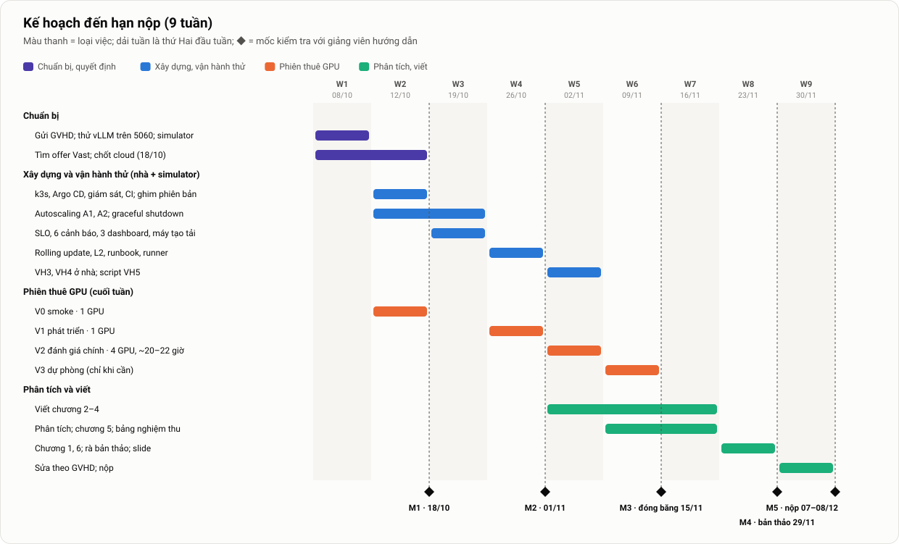

# 6. Kế hoạch, rủi ro, sản phẩm bàn giao và hướng mở rộng

> Thuộc [bộ tài liệu đồ án](../mo-ta-chi-tiet-do-an.md#bộ-tài-liệu) · Quyết định: [ADR-004](../adr/004-dieu-kien-thuc-te-va-pham-vi-rut-gon.md) · Phiên thuê GPU và chi phí: [Môi trường §6](05-moi-truong-danh-gia.md#6-các-phiên-thuê-gpu)

**Tóm tắt nhanh**
- Kế hoạch **9 tuần** từ 08/10 đến hạn nộp khoảng **08/12/2026**. Mỗi tuần có việc chính, sản phẩm kiểm chứng được và **điểm dừng** khi chậm.
- W1–W4 dành cho xây dựng và vận hành thử ở nhà và trên simulator, xen hai phiên thuê nhỏ (V0, V1). **Toàn bộ đánh giá trên GPU thuê dồn vào một lần thuê liền 07–08/11** (V2). **Đóng băng dữ liệu 15/11**, muộn nhất 22/11; sau đó chỉ viết.
- Khối lượng phạm vi rút gọn khoảng **169–251 người-giờ**, vừa quỹ giờ khi mỗi người làm khoảng 12–15 giờ/tuần. Phân công tạm chưa chốt.
- Sổ rủi ro gồm **28 rủi ro**; rủi ro lớn nhất là **thiếu thời gian viết**, **không có máy 4 × 4090 vào cuối tuần**, và **GVHD chưa duyệt phạm vi rút gọn**.
- 7 sản phẩm bàn giao kèm tiêu chí nghiệm thu; luận văn 55–65 trang, chương 4 "Triển khai và vận hành" dài nhất; 13 hướng mở rộng.

---

## 1. Lịch và mốc



*Hình 9. Kế hoạch 9 tuần đến hạn nộp. Thanh màu là nhóm việc; ô đậm là phiên thuê GPU; ◆ là mốc.*

| Tuần | Ngày | Tuần | Ngày |
|---|---|---|---|
| W1 | 08/10 – 11/10 | W6 | 09/11 – 15/11 (V3 nếu cần; **đóng băng dữ liệu 15/11**) |
| W2 (M1) | 12/10 – 18/10 (V0) | W7 | 16/11 – 22/11 (đóng băng muộn nhất 22/11) |
| W3 | 19/10 – 25/10 | W8 (M4) | 23/11 – 29/11 |
| W4 (M2) | 26/10 – 01/11 (V1) | W9 | 30/11 – 06/12 |
| W5 | 02/11 – 08/11 (**V2**) | M5 | 07/12 – 08/12 (nộp) |

| Mốc | Ngày | Tiêu chí hoàn thành (chi tiết ở §3) |
|---|---|---|
| **M1** | 18/10 | Nền tảng tối thiểu chạy ở nhà qua Argo CD; V0 đạt; đã chốt cloud; GVHD đã trả lời |
| **M2** | 01/11 | Vận hành thử đạt ở nhà và trên simulator; runner chạy 2 lượt không cần can thiệp trên V1 |
| **M3** | 15/11 (muộn nhất 22/11) | Dữ liệu đánh giá đầy đủ, đã sao lưu và đóng băng; có ADR-003 |
| **M4** | 29/11 | Bản thảo đủ 6 chương gửi GVHD |
| **M5** | 07–08/12 | Nộp luận văn; tag `v1.0`. Ngày bảo vệ: chưa có |

---

## 2. Kế hoạch từng tuần

| Tuần | Việc chính | Sản phẩm kiểm chứng được | Thuê GPU | Điểm dừng / cắt |
|---|---|---|---|---|
| **W1** (08–11/10) | Gửi GVHD email 1 trang (phạm vi rút gọn, kế hoạch, cloud, demo); Ubuntu + driver trên PC, **chạy thử vLLM trên RTX 5060**; kind + `llm-d-inference-sim` trên máy không GPU; Tailscale; tìm offer Vast thứ Bảy 10/10 và Chủ nhật 11/10; (tuỳ chọn) xin quota GPU của GCP | vLLM 1,5B trả lời có streaming trên 5060 (hoặc biên bản không chạy); bảng offer Vast; email đã gửi | Không | 5060 không chạy sau 4 giờ thử → dùng laptop 4050 hoặc thuê 1 GPU |
| **W2** (12–18/10) | k3s trên PC (+ agent laptop 4050); Argo CD core, App-of-Apps; kube-prometheus-stack + PodMonitor; khung repo và CI; ghim phiên bản; manifest vLLM cho nhà (probe, preStop, `--shutdown-timeout`); device plugin + exporter; T1–T5 trên simulator; script `vastai` + Ansible cho VM; tìm offer Vast 17–18/10 | vLLM triển khai **bằng Argo CD**; metric vào Prometheus; A2 scale pod simulator 1 → 3 | **V0** (17–18/10) | 16/10: GVHD trả lời. **18/10: chốt Vast hay GCP** |
| **W3** (19–25/10) | A1 + A2 trên GPU thật ở nhà; **test graceful shutdown** (30 stream + xoá pod, có ca đối chứng); bộ đọc log 8 pha; overlay `cloud`; máy tạo tải v1; recording rule + 6 cảnh báo + `promtool`; bot Telegram; 3 dashboard | KB2-mini ở nhà: 1 → 2 replica, cảnh báo tới Telegram, scale-down 0 lỗi; ĐG1-mini → target tạm | Không | Graceful shutdown còn lỗi → mở issue, N4 tạm ghi "báo cáo" |
| **W4** (26/10–01/11) | Rolling update theo ADR-005 + VH2 ở nhà (gồm ca 1 replica); L2 (pre-pull, compile cache); 6 runbook; runner (áp cấu hình, reset, thu thập, đẩy R2, checkpoint, tự dừng); Sealed Secrets; file ma trận | Runner chạy 2 lượt không cần can thiệp trên V1; ĐG1 thử | **V1** (31/10–01/11) | Runner chưa chạy trọn → V2 bỏ A1 × KB3 và bỏ L0 |
| **W5** (02–08/11) | VH3, VH4 ở nhà; script VH5; `build_tables.py`; bắt đầu viết chương 2–3; **nạp tiền Vast trước 06/11** | Dữ liệu V2 đã đẩy lên R2; ADR-003 | **V2** (07–08/11) | Sau 3 giờ chạy ma trận mà < 70% lượt hợp lệ → dừng, sửa, dồn sang V3 |
| **W6** (09–15/11) | Phân tích V2 (C1–C6 sơ bộ); viết chương 4 | **Đóng băng dữ liệu 15/11** nếu đủ | V3 chỉ khi V2 hỏng (14–15/11) | Thiếu ô nào → V3; vẫn thiếu thì ô đó chỉ có 1 lượt |
| **W7** (16–22/11) | Chương 5; bảng nghiệm thu; C1–C6 bản cuối; dựng video (nếu chốt demo bằng video) | Đóng băng muộn nhất 22/11 | Không | Sau 22/11 không đo thêm, bất kể kết quả |
| **W8** (23–29/11) | Chương 1, 6; rà chương 2–5; slide | **Bản thảo đủ 6 chương gửi GVHD (29/11)** | Không | – |
| **W9** (30/11–06/12) | Sửa theo GVHD; chèn hình; định dạng; tag `v1.0` | Bản cuối, slide | Không | – |
| 07–08/12 | Nộp | – | – | – |

Việc gắn với máy: các bước cài đặt trên PC (driver, k3s server) cần người ở cạnh PC; người không có GPU làm việc trên simulator và truy cập cluster nhà qua Tailscale.

---

## 3. Checklist các mốc

### M1 (18/10): nền tảng tối thiểu
- [ ] vLLM chạy trên GPU nhà (5060 hoặc 4050); đã ghim digest và revision model.
- [ ] vLLM được triển khai **bằng Argo CD** từ overlay `home`; gọi được API có streaming; có `--shutdown-timeout`.
- [ ] Prometheus có metric vLLM, GPU, Traefik (5 s).
- [ ] Simulator chạy trên kind; A2 scale 1 → 3 trên simulator.
- [ ] Repo có CI chạy xanh.
- [ ] V0 đạt: k3s có GPU trong VM Vast, vLLM 7B trả lời, đã đo `fio` và TPOT.
- [ ] Đã chốt cloud (ADR-004 K6); GVHD đã trả lời về phạm vi rút gọn.

### M2 (01/11): vận hành thử đạt
- [ ] A1, A2 qua bài kiểm thử T1–T7 (trên simulator và GPU nhà).
- [ ] Graceful shutdown: 0 lỗi trong 3 lần thử, ca đối chứng có lỗi.
- [ ] Đủ 3 dashboard; 6 cảnh báo có unit test, tới được Telegram; **mỗi cảnh báo có runbook**.
- [ ] Bảo mật tối thiểu đạt checklist ([Vận hành §8](04-van-hanh.md#8-bảo-mật-tối-thiểu)).
- [ ] VH1, VH2 (gồm ca 1 replica), VH6 đạt ở nhà.
- [ ] ĐG1-mini xong; có `capacity-home.json`.
- [ ] Máy tạo tải đạt tiêu chí tự kiểm tra; runner chạy 2 lượt **không cần can thiệp** trên V1; `make bootstrap` dựng xong VM dưới 30 phút.

### M3 (15/11, muộn nhất 22/11): xong đánh giá
- [ ] `capacity.json` đã chốt (C, B\*, SLO, threshold), có ADR-003 đi kèm.
- [ ] Cold start: L0 và L2 đủ số lần hợp lệ.
- [ ] Ma trận: mọi ô đủ số lượt hợp lệ.
- [ ] VH1–VH6 có kết quả trên môi trường tương ứng.
- [ ] Bảng nghiệm thu đã điền đủ.
- [ ] Toàn bộ dữ liệu đã sao lưu, có checksum; instance đã huỷ; chi phí thực tế đã ghi.

### M4 (29/11): bản thảo
- [ ] Đủ 6 chương; mọi hình và bảng có chú thích và được dẫn trong bài.
- [ ] Bảng nghiệm thu kèm số liệu cho mọi yêu cầu F1–F7, N1–N8.
- [ ] Có mục "Hạn chế".
- [ ] Hai thành viên đã review chéo toàn bộ.

### M5 (07–08/12): nộp
- [ ] Bản cuối đúng quy định trình bày của trường.
- [ ] Slide (15–20 trang) sẵn sàng; hình thức demo đã chốt.
- [ ] Repo gắn tag `v1.0`; README hướng dẫn tái lập.

---

## 4. Đường găng và phụ thuộc

```text
Thử vLLM trên 5060 (W1) ─► k3s + Argo CD + giám sát ở nhà (W2) ─► A1/A2, graceful shutdown, cảnh báo (W3)
      ─► rolling update, runbook, runner (W4) ─► V2: toàn bộ đánh giá (07–08/11) ─► phân tích (W6) ─► chương 5 (W7)
Simulator: A2, dashboard, cảnh báo, runner (W1–W4, song song) ──────────────────────┘
Tìm offer Vast (W1–W2) ─► V0 (17–18/10) ─► chốt cloud (18/10) ─► V1 (31/10–01/11) ─┘
Viết chương 2–4 (W5–W7) ─► bản thảo (29/11) ─► bản cuối (06/12)
```

- **Đường găng:** cài GPU nhà → nền tảng ở nhà → vận hành thử → V1 → **V2** → phân tích → chương 5 → bản thảo. Gần như không có độ dư; mỗi tuần có điểm dừng ở §2.
- **Có thời gian đệm:** dashboard, cảnh báo, runner và autoscaling làm trên simulator song song với phần GPU thật.
- **Phụ thuộc bên ngoài:** có máy 4 × 4090 chế độ VM vào cuối tuần 07–08/11; GVHD trả lời trước 16/10.

---

## 5. Gói công việc và ước lượng người-giờ

**Phân công:** tạm chưa chốt ([ADR-004](../adr/004-dieu-kien-thuc-te-va-pham-vi-rut-gon.md) K13). Trường thường yêu cầu luận văn ghi rõ đóng góp của từng người, nên phải chốt cách ghi trước khi viết (W5). Minh chứng đóng góp: lịch sử commit và PR (ai viết, ai review), issue được gán, nhật ký tuần và biên bản họp GVHD.

Ước lượng dưới đây giả định nhóm chưa từng dùng vLLM, GPU trên Kubernetes và Argo CD; thời gian học được tính vào từng gói.

| Gói | Nội dung | Phạm vi cũ (người-giờ) | Rút gọn (người-giờ) | Giả định chính |
|---|---|---|---|---|
| WP1 Hạ tầng | Máy nhà, k3s bằng Ansible, script `vastai`, lưu trữ, ngân sách | 30–45 | 14–20 | Một Ansible cho nhà và VM; bỏ TensorDock, burn-in đầy đủ |
| WP2 IaC, GitOps, CI | Repo, Kustomize, Argo CD, Sealed Secrets, CI, Makefile | 25–40 | 12–18 | Học Argo CD 6–8 giờ; CI ít job |
| WP3 GPU, vLLM, cold start | Device plugin, Deployment, lưu trữ model, L2, đo 8 pha | 40–65 | 25–38 | Học vLLM và GPU trên K8s 10–12 giờ; rủi ro sm_120 thêm 5–10 giờ |
| WP4 Autoscaling | ScaledObject, `behavior`, target, T1–T7 | 15–25 | 8–12 | Dùng simulator |
| WP5 Giám sát, SLO, cảnh báo | Prometheus, 3 dashboard, recording rule, 6 cảnh báo, Alertmanager | 30–45 | 15–22 | Dashboard mẫu của vLLM; `promtool` |
| WP6 Vận hành | 6 runbook; rolling update; sự cố; dựng lại; bảo mật tối thiểu; chi phí | 25–40 | 10–16 | Runbook nửa trang |
| WP7 Đánh giá | Máy tạo tải, runner, ĐG1–ĐG3, VH1–VH6, xử lý số liệu | 55–85 | 30–45 | Gồm khoảng 15–20 giờ trực các phiên thuê |
| WP8 Luận văn, slide, video | Viết, hình, slide, video | 110–170 | 55–80 | 1,2–1,5 giờ/trang khi đã có bản nháp từ bộ tài liệu này; video 8–12 giờ |
| **Tổng** | | **330–515** | **169–251** | Quỹ giờ 135–270 → chỉ vừa khi mỗi người làm ≥ 12 giờ/tuần |

---

## 6. Hợp đồng giao diện giữa các phần

Các phần của hệ thống được làm song song (một phần trên GPU thật, một phần trên simulator), nên giao diện giữa chúng được cố định trước và chỉ thay đổi qua PR có người kia duyệt:

| Giao diện | Bên cung cấp → bên dùng | Nội dung cố định |
|---|---|---|
| **Hạ tầng** | Hạ tầng → serving | Kubeconfig, danh sách node và nhãn, đường dẫn NVMe, tham số k3s; cách thuê và huỷ máy |
| **Metric** | Serving → giám sát, đánh giá | Tên metric vLLM và GPU (theo phiên bản đã ghim), label `namespace`, `pod`; **danh sách bucket** của histogram TTFT |
| **Cấu hình** | Autoscaling → runner | Mỗi cấu hình là một file `autoscaling/eval/<ID>.yaml` với ID ∈ {S1, S4, A1…A4}; A2 chính thức ở `autoscaling/official/`; tên ScaledObject `vllm-<id>`; cách tạm dừng và bỏ tạm dừng |
| **Tham số model** | Serving → đánh giá | `served-model-name`, `max-model-len`, tokenizer để sinh prompt |
| **Cảnh báo và runbook** | Giám sát → vận hành | Tên cảnh báo, nhãn `severity`, đường dẫn runbook; mẫu runbook |
| **Runner** | Đánh giá → mọi phần | `make run MATRIX=…`; runner đọc `capacity.json`; hook phân tích log vLLM là một hàm `parse_vllm_log(text) → dict` |
| **Dữ liệu** | Đánh giá → phân tích | Cấu trúc thư mục lượt chạy ([Môi trường §14.2](05-moi-truong-danh-gia.md#142-dữ-liệu-của-một-lượt)) |

Nhờ hợp đồng này, dashboard, cảnh báo, autoscaling và runner được viết với **simulator** trong khi vLLM thật đang được dựng, rồi ghép lại ở W3.

---

## 7. Quy trình làm việc và nhịp với GVHD

| Hoạt động | Nhịp | Công cụ | Kết quả |
|---|---|---|---|
| Quản lý việc | Liên tục | GitHub Projects: Todo / Doing / Review / Done; mỗi đầu việc là một issue (≤ 2 ngày) | Tiến độ nhìn thấy được |
| Nhánh và PR | Mỗi thay đổi | Nhánh `feat/…`, `fix/…`; PR nhỏ; **review trong 48 giờ** | Lịch sử rõ ràng; cả hai hiểu toàn hệ thống |
| CI | Mỗi PR | §10.4 | Không merge khi CI đỏ |
| Họp nhóm | Hằng tuần, 30 phút | Tuần trước làm gì, tuần này làm gì, đang vướng gì; rà rủi ro (5 phút) | Ghi chú trong `docs/nhat-ky/tuan-XX.md` |
| Nhật ký quyết định | Khi có quyết định lớn | `docs/adr/NNN-<ten>.md` | Giải thích được mọi lựa chọn khi bảo vệ |
| Nhật ký vận hành | Sau mỗi kịch bản VH, mỗi sự cố, mỗi phiên thuê | `docs/nhat-ky/van-hanh.md` | Bằng chứng cho chương 4 và 5 |

**Học chéo:** trước W8, mỗi người tự demo được toàn hệ thống: từ `make home-up`, qua một lần cảnh báo và xử lý theo runbook, tới biểu đồ C1.

**Nhịp với GVHD** (khoảng 2 tuần một lần):

| Buổi | Thời điểm | Nội dung |
|---|---|---|
| 1 | W1–W2 (email trước 12/10, trả lời trước 16/10) | Duyệt phạm vi rút gọn, kế hoạch 9 tuần, cloud, hình thức demo, bản mô tả 3.0, ADR-004 |
| 2 | Cuối W2 | Kết quả M1, V0; cloud đã chốt |
| 3 | Cuối W4 | Demo M2 (một lần cảnh báo và xử lý theo runbook); duyệt kế hoạch V2 và ngân sách |
| 4 | W6 | Kết quả V2: năng lực, cold start, ma trận sơ bộ, kịch bản vận hành |
| 5 | W8 | Nộp bản thảo (29/11) |
| 6 | W9 | Góp ý bản thảo, duyệt slide |

**Mẫu nội dung mỗi buổi (khoảng 30 phút):** (1) đã làm gì so với kế hoạch; (2) demo hoặc kết quả; (3) rủi ro và vấn đề đang vướng; (4) những điểm cần GVHD quyết định hoặc góp ý; (5) việc cần làm đến buổi sau.

---

## 8. Dự phòng và cắt giảm phạm vi

| Tình huống | Hành động |
|---|---|
| **vLLM không chạy trên RTX 5060** | Laptop 4050 làm node GPU; hoặc thuê 1 GPU cho các bài cần GPU thật; phần còn lại làm trên simulator |
| **GVHD không đồng ý phạm vi rút gọn** | Đòi ma trận đủ 28 lượt: thêm khoảng 6 giờ máy 4 GPU (~10–15 USD), vẫn trong ngân sách. Đòi demo trực tiếp với GPU: mang PC đi hoặc dùng Tailscale. Đòi lịch 16 tuần: không khả thi với hạn 08/12, cần GVHD và trường xác nhận lại hạn |
| **Tới 18/10 không có offer Vast đạt tiêu chí** | Chuyển sang GCP ([Môi trường §5](05-moi-truong-danh-gia.md#5-dự-phòng-gcp-và-kế-hoạch-z)); nếu chỉ được 2 GPU thì N = 2 và viết lại N3 theo N ở ADR-003 |
| **Trễ 1 tuần ở M2** | Bỏ các mục Could; nếu V2 vẫn chưa sẵn sàng thì dời V2 sang 14–15/11 (mất phiên dự phòng) |
| **Runner chưa chạy trọn ở V1** | V2 bỏ A1 × KB3 và bỏ L0 |
| **V2: sau 3 giờ chạy ma trận mà < 70% lượt hợp lệ** | Dừng VM, sửa, dồn phần còn lại sang V3 |
| **Máy hỏng giữa V2** | Giữ các kịch bản đã chạy trọn bộ cấu hình; V3 chạy lại trọn kịch bản bị hỏng và ĐG1 trên máy mới; ghi `session_id` |
| **Hoàn toàn không thuê được GPU** (kế hoạch Z) | Ở nhà với model 1,5B, N = 2, hoặc trên simulator; số liệu hiệu năng chỉ minh hoạ ([Môi trường §5](05-moi-truong-danh-gia.md#5-dự-phòng-gcp-và-kế-hoạch-z)) |
| **Một người phải nghỉ 1–2 tuần** | Người còn lại làm tiếp các việc thuộc đường găng; tạm dừng việc viết; báo GVHD |

Thứ tự cắt: Could → Should, theo [Thông số §5](00-thong-so.md#5-mức-độ-thành-công). **Không lùi ngày đóng băng dữ liệu quá 22/11**; bản thảo có thể thu hẹp chương 5 thay vì trễ hạn nộp.

---

## 9. Rủi ro

### 9.1. Phương pháp

- **Khả năng (K):** 1 thấp · 2 trung bình · 3 cao.
- **Ảnh hưởng (A):** 1 chậm vài ngày · 2 chậm một mốc hoặc giảm chất lượng một phần kết quả · 3 đe doạ việc hoàn thành đồ án.
- **Điểm = K × A.** Từ 6 trở lên là **ưu tiên cao**, phải có kế hoạch B chi tiết.
- Rà soát hằng tuần (5 phút cuối buổi họp nhóm), cập nhật trạng thái trên board.

### 9.2. Sổ đăng ký rủi ro

| ID | Nhóm | Rủi ro | Dấu hiệu sớm | K | A | Điểm | Phòng ngừa | Kế hoạch B |
|---|---|---|---|---|---|---|---|---|
| R1 | Chi phí | Tiền thuê GPU vượt dự toán | V2 kéo dài quá 24 giờ; nhiều lượt phải chạy lại | 1 | 2 | 2 | Phát triển ở nhà và trên simulator; V0, V1 trước; tín dụng trả trước làm giới hạn cứng; runner tự dừng | Bỏ lượt Could; V3 chỉ chạy phần tối thiểu |
| R2 | Hạ tầng | Không có máy 4 × 4090 chế độ VM đạt tiêu chí vào cuối tuần | Tìm offer 10–11/10, 17–18/10 thấy < 3 offer | 2 | 3 | **6** | Tìm từ W1; nới sang 4 × 3090/A5000; chỉ phần `find/rent/release` phụ thuộc nhà cung cấp | GCP g2/L4 bằng credit; kế hoạch Z |
| R3 | Hạ tầng | Thuê nhầm máy container (không chạy được K8s) | Không có systemd | 1 | 2 | 2 | Chỉ lọc máy `vms_enabled=true`; thử ở V0 | Huỷ, thuê máy khác |
| R4 | Hạ tầng | Máy lỗi hoặc bị thu hồi giữa V2 | Mất kết nối, node NotReady, GPU biến mất | 2 | 2 | 4 | Chỉ thuê on-demand; sao lưu sau mỗi lượt; `progress.json` | V3 trên máy khác, chạy lại trọn kịch bản hỏng |
| R5 | Kỹ thuật | Device plugin hoặc exporter GPU khó chạy trên k3s ở nhà | Tới cuối W2 vẫn chưa thấy `nvidia.com/gpu` | 2 | 2 | 4 | Theo hướng dẫn k3s; chỉ cài device plugin | Simulator cho phần lớn việc; thử GPU trên V0 |
| R6 | Kỹ thuật | Cold start quá dài làm autoscaling "vô dụng" ở KB2 | L2 vẫn ≥ 3 phút ở V1 | 2 | 1 | 2 | Tối ưu L2; đĩa VM đọc ≥ 1 GB/s | Ghi N2a "không đạt", dùng số đo 8 pha chỉ ra pha chậm; cân nhắc warm pool |
| R7 | Kỹ thuật | Scale-down hoặc rolling update làm lỗi request | Có lỗi ở test graceful shutdown hoặc VH2 ở nhà | 2 | 2 | 4 | `--shutdown-timeout`, preStop, grace period; bước nâng min = 2 khi cập nhật; kiểm thử từ W3 | Tăng preStop; chủ động gỡ pod khỏi Endpoints trước; ghi vào runbook và đo lại |
| R8 | Kỹ thuật | Tên, ý nghĩa metric hoặc cờ vLLM thay đổi | Truy vấn trả rỗng; cờ không có trong `--help` | 2 | 1 | 2 | Ghim digest ở W2; kiểm tra `/metrics`, `--help`, danh sách bucket | Cập nhật truy vấn, ghi vào phụ lục |
| R9 | Đo lường | Máy tạo tải là nút thắt hoặc đo sai | Độ lệch lịch gửi p99 > 50 ms; event loop nghẽn; TTFT lệch với `vllm bench` | 2 | 2 | 4 | Lịch sinh trước; tự kiểm tra phía gửi và phía nhận mọi lượt; đối chiếu công cụ chuẩn | Nhiều tiến trình; loại lượt hỏng |
| R10 | Đo lường | Kết quả dao động lớn giữa các lượt, khó nghiệm thu | Kiểm tra năng lực giữa phiên lệch > 10%; hai lượt cùng ô chênh nhiều | 2 | 2 | 4 | Cùng một máy; xáo trộn thứ tự; kiểm tra giữa phiên | Thêm lượt cho ô đó trong phần chạy lại; báo cáo đủ mọi lượt |
| R11 | Đánh giá | Một yêu cầu N không đạt | Lượt đầu tiên của ô đã cho thấy | 2 | 1 | 2 | Ngưỡng hợp lý, chốt sau ĐG1 | Ghi "không đạt", phân tích nguyên nhân; sửa và đo lại nếu còn thời gian |
| R12 | Đánh giá | SLO hoặc C chọn sai khiến mọi cấu hình đều "đạt" hoặc đều "trượt" | Vài lượt đầu: mọi cấu hình đều > 99% hoặc < 50% | 1 | 3 | 3 | ĐG1 ở đầu V2, cả nhóm theo dõi trực tiếp; ĐG1 thử ở V1 | Chỉnh SLO hoặc tải **một lần** (ghi ADR-003), chạy lại các lượt đã xong |
| R13 | Dữ liệu | Mất dữ liệu khi huỷ VM | Backup báo lỗi hoặc thiếu lượt | 1 | 3 | 3 | Backup sau mỗi lượt; `make release` kiểm tra backup trước | Chạy lại (tốn tiền); vì vậy không được bỏ qua bước kiểm tra |
| R14 | Tiến độ | Bận việc công ty, chậm tiến độ | Hai tuần liên tiếp không đạt sản phẩm của tuần | 3 | 2 | **6** | Issue nhỏ; điểm dừng mỗi tuần; họp tuần | Cắt phạm vi theo §8 |
| R15 | Tiến độ | Thành viên không có máy GPU bị kẹt vì phụ thuộc PC ở nhà người kia | Chờ quá 3 ngày | 2 | 2 | 4 | Tailscale; simulator; hợp đồng giao diện; lịch giờ dùng GPU | Hoán đổi việc trong cùng gói |
| R16 | Bảo vệ | Demo hỏng trong buổi bảo vệ | Hình thức demo chưa chốt; mạng không ổn định khi tập | 2 | 2 | 4 | Định hướng demo bằng video; phần live (nếu có) chạy simulator không cần GPU, không cần Internet | Video quay sẵn |
| R17 | Chi phí | Tín dụng Vast về 0 khiến instance bị dừng hoặc **xoá** | Số dư thấp | 1 | 3 | 3 | Nạp trước 06/11 đủ mức tối thiểu; runner kiểm tra số dư mỗi giờ và báo động | Nạp thêm ngay; nếu instance đã mất thì chạy lại các lượt chưa sao lưu |
| R18 | Kỹ thuật | DCGM không chạy trên GPU GeForce | `dcgm-exporter` lỗi hoặc thiếu metric | 3 | 1 | 3 | Dùng `nvidia_gpu_exporter` ngay từ đầu | Đổi truy vấn A1 |
| R19 | Đo lường | RTX 4090 giảm xung vì nhiệt giữa phiên | Xung nhịp giảm, nhiệt > 83 °C, TTFT tăng dần | 2 | 2 | 4 | Burn-in kiểm tra nhiệt độ; panel GPU; kiểm tra năng lực giữa phiên | Dừng, báo cáo; có thể khoá xung nhịp (`nvidia-smi -lgc`) |
| R20 | Phạm vi | Phần vận hành phình to | Có issue mới không gắn với yêu cầu F/N nào | 2 | 2 | 4 | Tiêu chí vào/ra phạm vi ([Bài toán §12.4](01-bai-toan-yeu-cau.md#124-tiêu-chí-vào-và-ra-phạm-vi-trong-lúc-làm)); Must/Should/Could | Đưa vào hướng mở rộng |
| R21 | Bảo vệ | Hội đồng đánh giá đồ án thiên về cài đặt, thiếu chiều sâu | GVHD nhận xét như vậy | 2 | 2 | 4 | Mỗi phần cài đặt gắn với một vấn đề riêng của GPU/LLM và có số đo; bảng nghiệm thu | Nhấn mạnh phần phân tích trong chương 5 |
| R22 | Kỹ thuật | Cảnh báo báo giả nhiều, hoặc không bao giờ kêu | Kênh chat bị "spam"; VH6 không thấy cảnh báo | 2 | 1 | 2 | `promtool test rules`; ngưỡng trùng biên bucket | Chỉnh ngưỡng hoặc cửa sổ; ghi lý do vào ADR |
| R23 | Kỹ thuật | vLLM không chạy trên RTX 5060 (sm_120) | Arch list không có `sm_120`; lỗi CUDA khi khởi động | 2 | 2 | 4 | Thử ngay W1; thử image NGC hoặc tự build trong ≤ 4 giờ | Laptop 4050; thuê 1 GPU |
| R24 | Tiến độ | Không đủ thời gian viết luận văn trước 08/12 | Tới 15/11 chưa có bản nháp chương 2–4 | 3 | 3 | **9** | Bắt đầu viết từ W5; dùng bộ tài liệu này làm bản nháp; đóng băng dữ liệu 15/11 | Thu hẹp chương 5; không đo thêm sau 22/11 |
| R25 | Phạm vi | GVHD không đồng ý phạm vi rút gọn hoặc demo bằng video | Không có trả lời trước 16/10; trả lời yêu cầu thêm | 2 | 3 | **6** | Xin xác nhận bằng văn bản trước 16/10; chuẩn bị phương án live bằng simulator | §8 |
| R26 | Đánh giá | N2b và N7 trượt vì backlog kẹt ở pod cũ | KB2-mini ở nhà cho thấy hồi phục lâu | 2 | 2 | 4 | Đo KB2-mini ở W3; tách N2a/N2b; định nghĩa "page giả" | Báo cáo kèm phân tích; hướng mở rộng E1 |
| R27 | Hạ tầng | Node chủ ở nhà thiếu RAM (16 GB) | OOM, pod bị evict | 2 | 1 | 2 | Ubuntu server; request vLLM nhỏ; Argo CD core; retention ngắn | Tách giám sát sang laptop; giảm stack |
| R28 | Hạ tầng | (Chỉ khi dùng GCP) quota bị từ chối, hết L4, hoặc bị trừ tiền thẻ | Yêu cầu quota bị từ chối; quên tắt VM | 2 | 2 | 4 | Xin quota sớm; budget alert; runner `shutdown -h` | Kế hoạch Z |

### 9.3. Phân tích sâu các rủi ro đáng chú ý

**R24. Không đủ thời gian viết luận văn**
- **Vì sao đáng chú ý:** hạn nộp chỉ còn khoảng 8,7 tuần, trong khi đánh giá rơi vào tuần thứ 5.
- **Phòng ngừa:** bộ tài liệu thiết kế này là bản nháp cho chương 1–3; viết chương 2–3 từ W5, chương 4 từ W6; đóng băng dữ liệu 15/11.
- **Kế hoạch B:** thu hẹp chương 5 (bỏ phần phân tích phụ), không đo thêm sau 22/11.

**R2. Không có máy 4 × 4090 chế độ VM vào cuối tuần**
- **Vì sao đáng chú ý:** cả phần đánh giá dồn vào một lần thuê; trang giá Vast ngày 08/10/2026 không hiện offer nào.
- **Phòng ngừa:** tìm offer hai cuối tuần trước hạn 18/10 theo tiêu chí ở [ADR-004](../adr/004-dieu-kien-thuc-te-va-pham-vi-rut-gon.md) K6; nới sang 3090/A5000; vẫn xin quota GCP (miễn phí).
- **Kế hoạch B:** GCP g2/L4. **Kế hoạch Z:** chạy ở nhà, chỉ rút kết luận định tính.

**R25. GVHD không đồng ý phạm vi rút gọn**
- **Phòng ngừa:** gửi email 1 trang trong W1 nêu rõ phạm vi, lịch, cloud, demo; xin trả lời trước 16/10.
- **Kế hoạch B:** các phương án ở §8; ma trận đủ 28 lượt vẫn nằm trong ngân sách.

**R21. Hội đồng cho rằng đồ án thiên về cài đặt**
- **Vì sao đáng chú ý:** đồ án chủ ý dành khoảng 70% cho xây dựng và vận hành. Nếu trình bày như một danh sách "đã cài X, đã cài Y", hội đồng dễ đánh giá thấp.
- **Phòng ngừa:** trình bày theo cặp **vấn đề → cách xử lý → số đo**. Ví dụ: "vLLM mặc định huỷ request khi bị tắt" → "`--shutdown-timeout` + preStop" → "VH1: 0 lỗi, ca đối chứng có lỗi". Bảng nghiệm thu là xương sống của chương 5.
- **Kế hoạch B:** tăng phần phân tích trong chương 5 bằng dữ liệu đã có (hành vi của A1, phân rã cold start).

### 9.4. Ngưỡng cảnh báo ngân sách

| Mức | Chi phí luỹ kế | Hành động |
|---|---|---|
| Xanh | Bám theo dự toán từng phiên ([Môi trường §6.1](05-moi-truong-danh-gia.md#61-bảng-phiên)) | Tiếp tục kế hoạch đầy đủ |
| Vàng | V2 kéo dài quá 24 giờ, hoặc tổng chi đã quá 75 USD | Rà soát; bỏ các lượt Could |
| Đỏ | Tổng chi quá 100 USD trước V3 | V3 chỉ chạy phần tối thiểu để đủ Must |
| Dừng | Chạm trần ở [Thông số §11](00-thong-so.md#11-ngân-sách) | Dừng thuê; phân tích với dữ liệu hiện có; báo GVHD |

### 9.5. Runbook xử lý sự cố trong phiên đánh giá

Runbook cho các cảnh báo của nền tảng nằm ở `docs/runbooks/` ([Vận hành §4](04-van-hanh.md#4-runbook)). Bảng dưới đây dành cho sự cố của **chính phiên đánh giá** (runner, dữ liệu, máy thuê).

| Sự cố | Nhận biết | Xử lý ngay | Sau đó |
|---|---|---|---|
| Pod vLLM CrashLoopBackOff | Runner thấy pod không Ready sau 15 phút | Xem log (OOM? thiếu `/dev/shm`? sai đường dẫn model?); đánh dấu lượt invalid | Sửa manifest, ghi ADR nếu đổi tham số |
| Node NotReady / GPU biến mất | `kubectl get nodes`; `nvidia-smi` lỗi | Dừng runner; khởi động lại node; kiểm tra lại năng lực | Chạy lại các lượt bị ảnh hưởng ở cuối phiên (hoặc trên máy mới ở V3) |
| Prometheus đầy ổ hoặc ngừng scrape | Khoảng trống scrape > 15 s; lỗi ghi | Tăng dung lượng hoặc giảm retention; khởi động lại Prometheus | Lượt bị ảnh hưởng là invalid |
| Máy tạo tải treo | Không có dòng CSV mới quá 60 s | Runner kill và đánh dấu invalid | Điều tra (hết file descriptor? hết RAM?) |
| KEDA hoặc HPA không scale | `kubectl get hpa`: `<unknown>` metrics | Kiểm tra PromQL, `serverAddress`, label, NetworkPolicy còn sót từ VH4 | Sửa và chạy lại |
| Mất SSH tới VM | Không truy cập được | Runner chạy như dịch vụ `systemd` trên chính VM nên vẫn tiếp tục; dữ liệu vẫn được đẩy lên R2 | Kiểm tra lại khi có kết nối |
| Hết ngân sách giữa phiên | Mức Đỏ ở §9.4 | Hoàn tất lượt đang chạy, backup, rồi `make release` | Theo §9.4 |

---

## 10. Sản phẩm bàn giao

### 10.1. Danh sách

| # | Sản phẩm | Tiêu chí nghiệm thu |
|---|---|---|
| P1 | **Git repository** (IaC, manifest, Helm values, cấu hình autoscaling) | Người thứ hai làm theo README dựng lại được cluster nhà (hoặc kind + simulator) trong dưới 1 giờ; CI xanh; tag `v1.0` |
| P2 | **Bộ vận hành**: 3 dashboard Grafana (JSON), recording rule, 6 quy tắc cảnh báo có unit test, cấu hình Alertmanager, runbook cho mọi cảnh báo | Import được; mỗi cảnh báo có runbook; `promtool test rules` xanh |
| P3 | **Công cụ đánh giá**: máy tạo tải open-loop, runner | Chạy lại được một lượt bằng một lệnh `make` |
| P4 | **Dữ liệu đánh giá** và **nhật ký vận hành** | Đủ các lượt hợp lệ; kết quả VH1–VH6; có README và checksum |
| P5 | **Hướng dẫn tái lập và vận hành** | Từ `make home-up` tới biểu đồ C1; quy trình cập nhật, rollback, dựng lại |
| P6 | **Luận văn** | Đủ 6 chương; có bảng nghiệm thu cho F1–F7, N1–N8; đúng quy định trình bày của trường |
| P7 | **Slide và demo** | 15–20 slide; demo theo hình thức đã chốt (định hướng: video) |

### 10.2. Cấu trúc repository

```text
llm-k8s-autoscaling/
├── README.md                      # giới thiệu, sơ đồ, quick start, liên kết tài liệu
├── Makefile                       # các lệnh ở Môi trường §3.7
├── infra/
│   ├── provision/                 # script thuê/burn-in/huỷ VM (CLI vastai)
│   └── ansible/
│       ├── inventory/             # máy nhà (tĩnh) và VM thuê (sinh tự động)
│       └── roles/                 # common, chrony, nvidia, k3s-server, k3s-agent, nvme, firewall, argocd-bootstrap
├── platform/                      # values Helm theo môi trường, quản lý bởi Argo CD
│   ├── gpu/values-{home,cloud}.yaml           # device plugin + exporter GPU
│   ├── kube-prometheus-stack/values.yaml       # gồm cấu hình Alertmanager
│   ├── keda/values.yaml
│   ├── sealed-secrets/
│   └── argocd/{root-app.yaml, apps/}
├── serving/
│   ├── base/                      # deployment (không có replicas), service, podmonitor, middleware Traefik, networkpolicy, prefetch job, prepull ds
│   └── overlays/{home,cloud}/
├── autoscaling/
│   ├── official/                  # A2 (Argo CD quản lý)
│   └── eval/                      # S1, S4, A1, A2, A3, A4 dùng khi đánh giá
├── observability/
│   ├── rules/                     # recording rule cho SLI
│   ├── alerts/                    # quy tắc cảnh báo + tests/ cho promtool
│   └── dashboards/*.json          # Serving và GPU, Autoscaling, SLO và chi phí
├── loadgen/                       # gói Python: schedule.py, prompts.py, client.py, cli.py, tests/
├── experiments/
│   ├── runner/                    # áp cấu hình, reset, chạy, thu thập, sao lưu, checkpoint
│   ├── ops/                       # script cho VH2–VH4
│   ├── matrix.yaml
│   └── capacity.yaml
├── analysis/
│   ├── build_tables.py            # + tests/
│   ├── notebooks/
│   └── figures/                   # hình xuất cho luận văn
├── runs/                          # (gitignore) dữ liệu thô, đồng bộ với R2
└── docs/
    ├── mo-ta-chi-tiet-do-an.md    # bản mô tả gửi GVHD
    ├── chi-tiet/                  # 7 tài liệu thiết kế và kế hoạch
    ├── adr/                       # nhật ký quyết định
    ├── review/                    # báo cáo review thiết kế
    ├── runbooks/                  # một file cho mỗi cảnh báo
    ├── diagrams/, images/         # mã sinh sơ đồ và ảnh
    └── nhat-ky/                   # nhật ký tuần, nhật ký vận hành, các phiên thuê
```

Hợp đồng giao diện giữa các phần nằm ở §6 của tài liệu này. Các lệnh `make` nằm ở [Môi trường §3.7](05-moi-truong-danh-gia.md#37-tự-động-hoá-bằng-makefile).

### 10.3. Quy ước

- **Nhánh:** `main` luôn chạy được; phát triển trên `feat/*`, `fix/*`; merge qua PR có review.
- **Commit:** tiếng Anh hoặc tiếng Việt, thống nhất một kiểu, dạng `<phạm vi>: <mô tả>`, ví dụ `alerts: add LLMPodPending`.
- **Ghim phiên bản:** image theo digest; chart theo phiên bản; Python bằng lockfile; model theo revision.
- **Bí mật:** không có bí mật dạng rõ trong Git; dùng Sealed Secrets. Khoá riêng của controller được sao lưu ngoài Git ([Vận hành §7](04-van-hanh.md#7-dựng-lại-từ-đầu-khôi-phục-sau-thảm-hoạ)).

### 10.4. CI (GitHub Actions)

| Job | Kiểm tra |
|---|---|
| `yaml` | yamllint; kubeconform cho `serving/`, `autoscaling/` (kèm schema CRD của KEDA, Traefik) |
| `helm` | `helm template` với các values trong `platform/` |
| `kustomize` | `kustomize build` cho từng overlay |
| `alerts` | `promtool check rules` và `promtool test rules` cho `observability/` |
| `python` | ruff và pytest cho `loadgen/`, `experiments/runner/`, `analysis/` |
| `docs` | Kiểm tra link hỏng trong `docs/`; mọi cảnh báo đều có file runbook tương ứng |
| `secrets` (Could) | `gitleaks` |

### 10.5. Phiên bản và phát hành

- `v0.x` cho các mốc M1, M2; `v1.0` khi nộp luận văn, gắn với commit dùng để tạo mọi hình trong luận văn.

### 10.6. Dữ liệu đánh giá và nhật ký vận hành

```text
dataset/
├── README.md             # mô tả, cấu trúc, cách dùng, giấy phép
├── capacity/             # các mức tải khi đo năng lực
├── coldstart/            # L0, L2
├── matrix/runs/<run-id>/ # metadata.json, requests.csv, metrics.parquet, events.jsonl, alerts.jsonl, checks.json
├── ops/                  # số đo của VH1–VH6
├── tables/               # bảng mỗi lượt một dòng
└── SHA256SUMS
```

- Cấu trúc một lượt: [Môi trường §14.2](05-moi-truong-danh-gia.md#142-dữ-liệu-của-một-lượt).
- **Kích thước ước tính:** khoảng 25 lượt × vài chục MB, tổng dưới 2 GB.
- **Giấy phép đề xuất:** CC BY 4.0 cho dữ liệu, Apache-2.0 hoặc MIT cho mã nguồn.
- **Không chứa dữ liệu cá nhân:** prompt hoàn toàn là dữ liệu tổng hợp.
- **Nhật ký vận hành** (`docs/nhat-ky/van-hanh.md`): mỗi kịch bản VH, mỗi sự cố thật và mỗi phiên thuê có một mục: ngày, môi trường, các bước, số đo, runbook đã dùng, chi phí, bài học.

### 10.7. Hướng dẫn tái lập và vận hành (dàn ý README)

1. **Yêu cầu:** phần cứng (máy có GPU NVIDIA, hoặc tài khoản Vast.ai), công cụ (vastai CLI, ansible, kubectl, helm, kubeseal, python, uv, tailscale).
2. **Chạy nhanh ở nhà:** `make home-up`, rồi `make run MATRIX=experiments/matrix-mini.yaml`, rồi `make analysis`. Không có GPU: dựng kind + simulator.
3. **Chạy đầy đủ trên máy thuê:** cấu hình `.env` (API key Vast.ai, R2), rồi lần lượt `make find rent burnin bootstrap prefetch capacity`, sau đó `make run`, `make ops-tests`, `make backup`, `make release`.
4. **Vận hành:** cập nhật phiên bản và rollback ([Vận hành §5.3](04-van-hanh.md#53-quy-trình-cập-nhật-qua-gitops)); xử lý cảnh báo (`docs/runbooks/`); dựng lại từ đầu ([Vận hành §7](04-van-hanh.md#7-dựng-lại-từ-đầu-khôi-phục-sau-thảm-hoạ)).
5. **Chỉ tái tạo hình và bảng từ dữ liệu đã công bố:** tải `dataset/`, rồi `make analysis DATA=dataset/`.
6. **Phiên bản đã dùng:** bảng phiên bản kèm digest.
7. **Các lỗi thường gặp:** Argo CD và `replicas`, label `release` của PodMonitor, `/dev/shm`, label của metric GPU, biên bucket của histogram TTFT, `--shutdown-timeout`.

---

## 11. Luận văn, slide và demo

### 11.1. Dàn ý luận văn (55–65 trang)

| Chương | Nội dung | Dựa trên | Số trang ước tính |
|---|---|---|---|
| 1. Giới thiệu và bài toán | Bối cảnh, bài toán vận hành, mục tiêu, đóng góp, cấu trúc | [Bài toán §1–§8](01-bai-toan-yeu-cau.md) | 4–5 |
| 2. Cơ sở lý thuyết | LLM inference, vLLM, autoscaling K8s, GPU trên K8s, SLO và GitOps, giải pháp liên quan | [Kiến thức nền](02-kien-thuc-nen.md) | 8–10 |
| 3. Phân tích yêu cầu và thiết kế | 3.1 Yêu cầu F/N · 3.2 Kiến trúc tổng thể · 3.3 Thiết kế serving và autoscaling · 3.4 Thiết kế giám sát, SLO, cảnh báo · 3.5 Thiết kế vận hành (cập nhật, sự cố, khôi phục) · 3.6 Môi trường | [Thông số](00-thong-so.md), [Bài toán](01-bai-toan-yeu-cau.md), [Kiến trúc](03-kien-truc-autoscaling.md), [Vận hành](04-van-hanh.md), [Môi trường](05-moi-truong-danh-gia.md) | 10–12 |
| **4. Triển khai và vận hành** | 4.1 Hạ tầng và cluster · 4.2 GitOps, CI, quản lý bí mật · 4.3 GPU và vLLM trên Kubernetes · 4.4 Autoscaling · 4.5 Rút ngắn cold start · 4.6 Giám sát và SLO · 4.7 Cảnh báo và runbook · 4.8 Cập nhật phiên bản khi hết GPU · 4.9 Sự cố và khôi phục · 4.10 Bảo mật tối thiểu · 4.11 Chi phí, năng lực và công cụ đánh giá | [Kiến trúc](03-kien-truc-autoscaling.md), [Vận hành](04-van-hanh.md), [Môi trường](05-moi-truong-danh-gia.md) | **18–22** |
| 5. Đánh giá | Môi trường và điều kiện thực hiện, năng lực, autoscaling so với tĩnh, cold start, kịch bản vận hành, bảng nghiệm thu, khuyến nghị, hạn chế | [Môi trường và đánh giá §7–§17](05-moi-truong-danh-gia.md#7-đánh-giá-để-nghiệm-thu), [Bài toán §12](01-bai-toan-yeu-cau.md#12-phạm-vi) | 10–12 |
| 6. Kết luận | Tổng kết, hạn chế, hướng phát triển | §12 | 2–3 |
| Phụ lục | Manifest chính, quy tắc cảnh báo, một số runbook, bảng phiên bản, số liệu đầy đủ | – | tuỳ |

Người viết từng phần chốt cùng phân công. Tính trên ba chương 3–5, phần xây dựng và vận hành (chương 3, 4) chiếm khoảng **70–75%**, phần đánh giá (chương 5) khoảng **25–30%**.

**Danh mục hình đề xuất cho luận văn:** Hình 1–17 của bộ tài liệu này (thay bản minh hoạ bằng số liệu thật ở Hình 5 và 15), cộng các biểu đồ kết quả C1–C6, ảnh chụp dashboard và một tin nhắn cảnh báo thật.

### 11.2. Slide bảo vệ (15–20 trang)

| # | Slide | Thời gian |
|---|---|---|
| 1 | Tên đề tài, nhóm | 0:30 |
| 2–3 | Bài toán: bối cảnh tự host, trade-off (Hình 1), vì sao khó với GPU (Hình 10, 12) | 2:00 |
| 4 | Yêu cầu F/N (tóm tắt) | 1:00 |
| 5–6 | Kiến trúc (Hình 2), vòng lặp autoscaling (Hình 4) | 2:00 |
| 7 | Chọn tín hiệu scale: vì sao A2 mà không phải GPU utilization (Hình 14, định luật Little) | 1:00 |
| 8–9 | Vận hành: SLO → cảnh báo → runbook (Hình 7); scale-down an toàn (Hình 13); cập nhật khi hết GPU (Hình 16) | 2:00 |
| 10–12 | Kết quả: C1, C4, C5, kịch bản vận hành | 3:00 |
| 13 | Bảng nghiệm thu, khuyến nghị cấu hình | 1:00 |
| 14 | Hạn chế, hướng phát triển | 1:00 |
| 15 | Ai làm gì | 0:30 |
| – | Demo (hình thức chốt sau) | 3–5:00 |

### 11.3. Demo

Hình thức demo **chốt sau** ([ADR-004](../adr/004-dieu-kien-thuc-te-va-pham-vi-rut-gon.md) K13). Định hướng hiện tại: **video 4–5 phút**, cộng một phần **live khoảng 2 phút bằng simulator** (không cần GPU hay Internet). Bản nháp các cảnh của video:

1. `make bootstrap` (tua nhanh, lấy từ VH5).
2. `curl` có streaming qua Traefik.
3. KB2-mini: hàng đợi tăng, desired 1 → 4, pod ContainerCreating → Ready.
4. `LLMSLOBurnFast` tới Telegram → mở runbook → chẩn đoán "đang cold start" → cảnh báo tự tắt.
5. Giảm tải → chờ 300 s (tua nhanh) → 4 → 1 replica, 0 lỗi.
6. PR đổi tham số → Argo CD sync → 0 lỗi; ở nhà: cấu hình kiểu web bị Pending, `LLMPodPending` kêu.
7. VH4: chặn Prometheus → fallback lên max replica.

Các cảnh dùng model 7B thật quay trong phiên V2 (phần ban ngày); phần còn lại quay ở nhà.

**Phần live bằng simulator:** trên laptop trình chiếu chạy kind + `llm-d-inference-sim` + KEDA + Grafana; bơm tải để thấy scale 1 → 3.

### 11.4. Checklist trước khi nộp

- [ ] Mọi số liệu trong luận văn đều truy được về `analysis/` và tag `v1.0`.
- [ ] Hình minh hoạ (Hình 5, 15) đã được thay bằng số đo thật, hoặc ghi rõ là minh hoạ.
- [ ] Mọi cảnh báo có runbook; runbook được review lần cuối sau phiên V2.
- [ ] Không còn TODO hay placeholder (`vX.Y.Z`, `<org>`) trong repo công khai.
- [ ] Link trong tài liệu không hỏng (CI `docs`).
- [ ] Bộ dữ liệu có README, checksum và giấy phép.
- [ ] Không có kubeconfig, token hay khoá Sealed Secrets trong lịch sử Git.
- [ ] Đã review chéo toàn bộ luận văn; đã kiểm tra chính tả.

---

## 12. Hướng mở rộng

### 12.1. Xếp hạng

| Mã | Hướng | Giá trị | Công sức | Điều kiện cần | Gợi ý |
|---|---|---|---|---|---|
| E1 | Định tuyến nhận biết LLM | Cao | Trung bình (1–2 tuần) | Envoy Gateway hoặc llm-d | **Nếu dư 2 tuần** |
| E5 | Autoscaling dự báo | Cao | Trung bình | Trace thật (E13) | **Nếu dư 2 tuần** |
| E6 | Scale theo SLO, nhiều trigger | Trung bình | **Thấp** (vài ngày) | Hạ tầng hiện có | **Nếu dư 1 tuần** |
| E11 | Pod deletion cost khi scale-down | Trung bình | **Thấp** | Hạ tầng hiện có | **Nếu dư 1 tuần** |
| E3 | Scale-to-zero và khởi động nhanh | Cao | Cao | Tối ưu cold start sâu | Luận văn tiếp theo |
| E4 | So sánh với KServe / Knative KPA | Trung bình | Trung bình | Cài KServe | – |
| E2 | Autoscaling mức node | Trung bình | Trung bình–cao | Managed K8s (GKE/EKS) | – |
| E7 | Chia sẻ GPU (MIG, time-slicing) | Trung bình | Trung bình | GPU hỗ trợ MIG (A100/H100) | – |
| E8 | Nhiều model, LoRA | Trung bình | Cao | – | – |
| E9 | Tách prefill/decode | Cao | Rất cao | Nhiều GPU, mạng nhanh | Nghiên cứu sâu |
| E10 | Tối ưu chi phí bằng spot | Trung bình | Trung bình | Cloud có spot GPU | – |
| E12 | A3 (KV-cache) và so sánh đầy đủ các tín hiệu | Trung bình | **Thấp** (thêm vài lượt) | Hạ tầng hiện có | **Nếu dư ngân sách** |
| E13 | Đánh giá mở rộng: trace thật, nhiều lượt, độ nhạy tham số | Trung bình | Trung bình (thêm GPU-giờ) | Trace công khai | Luận văn tiếp theo |

### 12.2. Viết mục "Hướng phát triển" trong luận văn

Mỗi hướng nên viết 3–5 câu theo thứ tự: **hạn chế hiện tại → hướng đề xuất → kỳ vọng → cách đánh giá**. Ví dụ:

> *Đồ án dùng round-robin nên các pod có thể lệch tải (quan sát được độ lệch `running` tới X ở KB3). Hướng tiếp theo là dùng định tuyến dựa trên độ dài hàng đợi (Gateway API Inference Extension). Kỳ vọng năng lực hiệu dụng tăng, cho phép target cao hơn và tiết kiệm thêm GPU-giờ. Có thể đánh giá bằng chính ma trận đánh giá và các chỉ số của đồ án.*

**Ưu tiên nêu:** E1, E5, E3 (liên hệ trực tiếp với kết quả về tín hiệu scale và cold start), rồi E2, E9 (mở rộng quy mô).

### 12.3. Chi tiết từng hướng

#### E1. Định tuyến có nhận biết LLM
- **Động cơ:** round-robin làm lệch tải giữa các pod ([Kiến trúc §3.4](03-kien-truc-autoscaling.md#34-service-và-cân-bằng-tải)), khiến năng lực thực tế thấp hơn N × C; request đã kẹt trong hàng đợi của pod cũ cũng không được chuyển sang pod mới.
- **Cách làm:** (a) Envoy Gateway dùng thuật toán `LEAST_REQUEST`; (b) Gateway API Inference Extension hoặc llm-d, định tuyến theo độ dài hàng đợi và KV-cache của từng pod.
- **Đo:** độ lệch `running` giữa các pod; SLO attainment và GPU-giờ ở KB3 và với trace thật; C "hiệu dụng" khi có N replica; thời gian hồi phục SLO ở KB2.
- **Kỳ vọng:** định tuyến thông minh làm tăng năng lực hiệu dụng, cho phép dùng target cao hơn, nên tiết kiệm thêm GPU-giờ.

#### E2. Autoscaling mức node
- **Động cơ:** trên cloud công cộng, thêm replica có thể cần thêm node GPU, và việc này cộng thêm vài phút.
- **Cách làm:** GKE hoặc EKS có node pool GPU, dùng Cluster Autoscaler hoặc Karpenter; đo thời gian từ lúc pod Pending tới khi node Ready và có GPU.
- **Đo:** phân rã cold start thành "cấp node" cộng 8 pha hiện tại; chi phí node chạy không (idle).

#### E3. Scale-to-zero và khởi động nhanh
- **Động cơ:** các model ít được dùng không nên giữ GPU suốt ngày.
- **Cách làm:** KEDA `minReplicaCount: 0` và `activationThreshold`; kết hợp các kỹ thuật khởi động nhanh: sleep mode của vLLM (dời weights sang CPU rồi "đánh thức"), stream weights (`--load-format runai_streamer`), snapshot hoặc checkpoint nhanh (ý tưởng từ ServerlessLLM [4]).
- **Đo:** TTFT của request đầu tiên sau khoảng nghỉ; GPU-giờ tiết kiệm được; độ trễ kích hoạt từ 0 lên 1.

#### E4. So sánh với KServe / Knative KPA
- **Cách làm:** triển khai cùng model bằng KServe ở chế độ serverless (KPA theo request đồng thời, có panic mode); chạy KB2 và KB3.
- **Đo:** so với A2 (cùng loại tín hiệu); ảnh hưởng của activator và panic mode.

#### E5. Autoscaling dự báo
- **Động cơ:** cold start dài thì phản ứng sau khi tải đã tăng luôn là muộn. **Dự báo** tải để scale trước.
- **Cách làm:** mô hình đơn giản (Holt-Winters, hồi quy theo giờ trong ngày) dự báo λ(t + D), với D là thời gian cold start. Đưa kết quả thành external metric (qua KEDA metrics-api scaler hoặc một exporter riêng); lấy giá trị lớn hơn giữa dự báo và A2.
- **Đo:** vi phạm SLO lúc tải tăng với trace thật; GPU-giờ thêm do dự báo sai.

#### E6. Scale theo SLO và kết hợp nhiều trigger
- **Cách làm:** ScaledObject có hai trigger: A2 (chính) và TTFT p95 (chốt chặn, ví dụ threshold 1,5 s). HPA lấy desired **lớn nhất** trong các trigger.
- **Đo:** có giảm vi phạm SLO ở KB2 không; có gây scale thừa do tín hiệu TTFT đi trễ không.
- **Ưu điểm:** hạ tầng hiện có dùng được luôn; làm trong vài ngày.

#### E7. Chia sẻ GPU (MIG, time-slicing)
- **Động cơ:** đơn vị scale nhỏ hơn 1 GPU cho model nhỏ.
- **Cách làm:** MIG trên A100/H100 (ví dụ `1g.10gb`), mỗi replica một lát MIG; hoặc time-slicing (không cô lập).
- **Đo:** độ mịn khi scale so với hiệu năng mỗi lát; cô lập hiệu năng giữa các replica.

#### E8. Nhiều model và LoRA
- **Cách làm:** vLLM phục vụ nhiều LoRA adapter trên một base model; hoặc nhiều Deployment, mỗi model một Deployment, dùng chung nhóm GPU.
- **Đo:** autoscaling khi các model tranh nhau GPU; chính sách ưu tiên.

#### E9. Tách prefill và decode
- **Động cơ:** prefill (nặng sức tính) và decode (nặng băng thông) có nhu cầu khác nhau, nên có thể scale riêng hai nhóm.
- **Cách làm:** llm-d hoặc NVIDIA Dynamo; hai nhóm pod và KV-cache được chuyển giữa chúng.
- **Đo:** SLO và GPU-giờ so với serving gộp; chi phí truyền KV-cache.

#### E10. Tối ưu chi phí bằng spot
- **Cách làm:** giữ replica nền trên máy on-demand, còn replica tăng thêm chạy trên spot; xử lý khi spot bị thu hồi (drain nhanh).
- **Đo:** chi phí trên 1 triệu token; vi phạm SLO khi bị thu hồi.

#### E11. Pod deletion cost khi scale-down
- **Động cơ:** ReplicaSet có thể xoá đúng pod đang **bận nhất**, làm nhiều request phải drain lâu.
- **Cách làm:** một controller nhỏ định kỳ gắn annotation `controller.kubernetes.io/pod-deletion-cost` theo `num_requests_running` của từng pod, để pod rảnh nhất bị xoá trước.
- **Đo:** thời gian drain, lỗi trong pha giảm tải của KB2.

#### E12. Cấu hình A3 và so sánh đầy đủ các tín hiệu
- **Động cơ:** đồ án chỉ đánh giá A1 và A2 trên GPU thuê. KV-cache (A3) phản ánh số token trong hệ thống, có thể tốt hơn A2 khi prompt rất dài.
- **Cách làm:** thêm A3 × KB1–KB3 vào ma trận; thêm một kịch bản prompt dài (2.000–4.000 token).
- **Đo:** như ĐG2; so sánh A2 và A3 theo độ dài prompt.

#### E13. Đánh giá mở rộng: trace thật, nhiều lượt, độ nhạy tham số
- **Động cơ:** đồ án dùng tải tổng hợp, mỗi ô 1–3 lượt, tham số cố định. Đủ để nghiệm thu, nhưng chưa đủ để khẳng định các khác biệt nhỏ.
- **Cách làm:** (a) phát lại trace Azure LLM Inference hoặc BurstGPT, nén thời gian về 30 phút, chuẩn hoá đỉnh theo năng lực tối đa; (b) 5–10 lượt mỗi ô, báo cáo khoảng tin cậy; (c) thử hệ số target của A2 ∈ {0,6; 0,8; 0,95}, `stabilizationWindowSeconds` ∈ {60, 300, 600}, chu kỳ sync HPA 5 s và 15 s.
- **Đo:** như ĐG2; kèm khoảng tin cậy cho hiệu số giữa các cấu hình.

---

## 13. Câu hỏi hội đồng có thể đặt ra

**Vì sao dồn toàn bộ phần đánh giá trên GPU thuê vào một lần thuê?**
Để mọi số liệu chính đến từ **cùng một máy**, và chỉ phải dựng cluster, tải image và model một lần. Đổi lại, nền tảng phải thật ổn định từ trước; điều này được đảm bảo bằng phần vận hành thử ở nhà và trên simulator, cùng hai phiên thuê nhỏ V0, V1.

**Nếu kết quả đo năng lực cho thấy SLO quá dễ hoặc quá khó thì sao?**
Đo năng lực nằm ở đầu phiên V2 và cả nhóm theo dõi trực tiếp; ĐG1 cũng đã được chạy thử ở V1. Nếu cần, nhóm chỉnh SLO **một lần** (ghi ADR-003) trước khi chạy ma trận.

**Vì sao viết luận văn song song với xử lý số liệu?**
Chương 2, 3 và 4 (lý thuyết, thiết kế, triển khai và vận hành) không phụ thuộc kết quả đánh giá, nên viết sớm để giảm áp lực cuối kỳ. Chương 5 chỉ viết sau khi dữ liệu đã đóng băng.

**Rủi ro lớn nhất của đồ án là gì?**
Là **thời gian** (R24) và **khả năng có máy GPU đúng loại vào đúng cuối tuần** (R2). Hai rủi ro này được giảm bằng phạm vi rút gọn, đóng băng dữ liệu sớm, và hai mức dự phòng cho máy thuê. Rủi ro lớn nhất khi bảo vệ là đồ án bị xem là thiên về cài đặt (R21), được giảm bằng cách trình bày theo cặp vấn đề – cách xử lý – số đo.

**Người khác có thực sự tái lập được không?**
Được. Toàn bộ hạ tầng và nền tảng được mô tả bằng code và dựng bằng vài lệnh `make`. Kịch bản VH5 đo chính việc này: một thành viên dựng lại cluster chỉ theo README, và nền tảng trên máy thuê được dựng từ VM trắng.

**Runbook và cảnh báo có phải chỉ để trưng bày?**
Không. Chúng được dùng trong các kịch bản VH, trong phiên đánh giá V2, và trong phần demo. Lịch sử sửa runbook nằm trong Git.

**Đóng góp của từng thành viên thể hiện ở đâu?**
Ở lịch sử commit và PR (ai viết, ai review), các issue được gán, nhật ký tuần và các mục luận văn của mỗi người. Mọi PR đều có người kia review, nên khi bảo vệ cả hai đều trả lời được về toàn hệ thống.

**Nếu có thêm thời gian, nhóm sẽ làm gì trước?**
E6 và E11: công sức thấp, dùng lại được toàn bộ hạ tầng, và nhắm thẳng vào hai điểm yếu dễ thấy nhất ở KB2 (vi phạm SLO lúc tải tăng, drain lúc scale-down). Sau đó là E1 hoặc E5.
