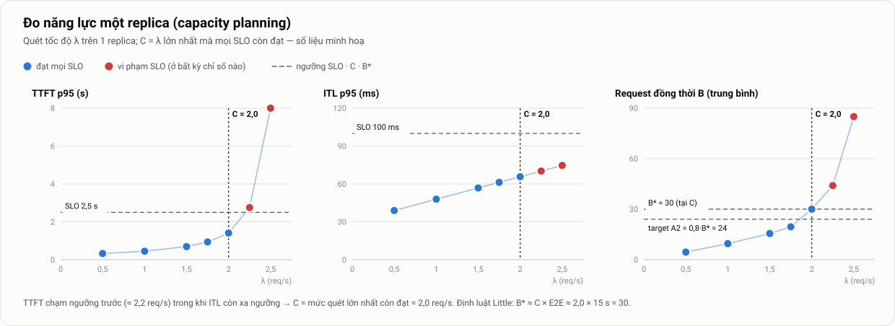

# 8. Thiết kế thí nghiệm: tài liệu chuyên sâu

> Thuộc [Mục 8 của bản mô tả chính](../mo-ta-chi-tiet-do-an.md#8-thiết-kế-thí-nghiệm) · [Danh mục tài liệu chuyên sâu](README.md)

**Tóm tắt nhanh**
- Thí nghiệm theo kiểu **so sánh có kiểm soát**: chỉ thay đổi cấu hình và kịch bản; mọi thứ khác được ghim; chạy lặp lại; xáo trộn thứ tự; **chia khối theo phiên** (randomized complete block design).
- Có quy trình **hiệu chỉnh năng lực** để tìm C và B\*, cùng lý do chọn SLO.
- Mô hình tải: prompt tổng hợp đúng số token, output cố định; request đến theo **Poisson không thuần nhất** (có thuật toán và mã giả).
- Máy tạo tải open-loop: thiết kế, cách đo, và cách tự kiểm tra độ chính xác.
- Runner chạy mỗi lượt như một **máy trạng thái**, kèm lệnh cụ thể; có tiêu chí hợp lệ cho mỗi lượt và quy trình thí nghiệm cold start.

---

## 1. Nguyên tắc

1. **Mỗi lần so sánh chỉ đổi một biến.** Các cấu hình chỉ khác nhau ở metric scale hoặc số replica.
2. **Tái lập được.** Chuỗi request (thời điểm, nội dung) được sinh từ seed; cấu hình và phiên bản được ghi vào metadata.
3. **Lặp lại và xáo trộn thứ tự** để tách được ảnh hưởng của cấu hình khỏi nhiễu môi trường.
4. **Phân tích được định trước.** Chỉ số, cửa sổ đo và quy tắc kết luận được cố định trước khi chạy (xem [10 §3](10-phan-tich-ket-qua.md#3-kế-hoạch-phân-tích-đăng-ký-trước)).
5. **Tự kiểm tra.** Mỗi lượt có bộ kiểm tra hợp lệ; lượt không đạt thì chạy lại, không "sửa tay" số liệu.

---

## 2. Các biến

| Loại | Biến | Giá trị |
|---|---|---|
| **Độc lập** | Cấu hình | S1, S4, A1, A2, A3 (A4 tuỳ chọn) |
| | Kịch bản tải | KB1–KB5 |
| | Mức cold start (chỉ cho RQ2) | L0, L1, L2 |
| **Phụ thuộc** | Hiệu năng | TTFT, TPOT, E2E (p50/p95/p99), SLO attainment, goodput, lỗi |
| | Tài nguyên | GPU-giờ, GPU utilization, token/GPU-giờ |
| | Autoscaling | Độ trễ phát hiện, thời gian cung cấp, thời gian hồi phục, số lần scale |
| **Kiểm soát** | Phần cứng | Loại VM, loại GPU, NVMe |
| | Phần mềm | Phiên bản k3s, driver, vLLM (digest), KEDA, Prometheus |
| | Model và tham số | Qwen2.5-7B-Instruct@revision; `max-model-len`, `max-num-seqs`, `gpu-memory-utilization`; tắt prefix caching |
| | Tải | Phân phối độ dài, seed, `max_tokens`, `ignore_eos` |
| | Hạ tầng autoscaling | Chu kỳ scrape và sync 5 s; min/max; `behavior` |

---

## 3. Hiệu chỉnh năng lực (calibration)



*Hình 15. Quét tốc độ request trên 1 replica để tìm C và B\* (số liệu minh hoạ).*

**Quy trình:**
1. Cố định **1 replica** (S1), bật mọi dashboard.
2. Quét λ ∈ {0,5; 1,0; 1,5; 2,0; 2,5; …} req/s theo **Poisson**. Mỗi mức gồm 2 phút warm-up (không tính) và **5 phút đo**. Sau mỗi mức, chờ hàng đợi về 0.
3. Khi thấy SLO bắt đầu bị vi phạm, **quét dày hơn** quanh ngưỡng (bước 0,25).
4. Dừng khi TTFT p95 vượt 3 lần SLO, hoặc khi hàng đợi tăng liên tục (hệ thống đã quá tải hẳn).
5. Với mỗi mức, ghi lại: TTFT/ITL p50 và p95, **B** (trung bình `running + waiting`), KV-cache trung bình, `GPU_UTIL`/`SM_ACTIVE` trung bình, CPU của pod, số preemption.
6. **C** = mức λ lớn nhất mà p95 của TTFT và của ITL đều đạt SLO. Đọc **B\***, **KV\*** và **UTIL\*** tại C.
7. **Kiểm tra chéo bằng định luật Little:** B\* ≈ C × E2E trung bình. Nếu lệch hơn 15%, xem lại cách đo.
8. Đối chiếu nhanh với `vllm bench serve` hoặc GuideLLM ở cùng λ, để chắc chắn máy tạo tải tự viết không sai lệch có hệ thống.

**Kiểm tra lại C ở đầu mỗi phiên cloud:** chạy 2 mức (0,8C và 1,0C), 3 phút mỗi mức. Nếu TTFT p95 lệch hơn 10% so với lúc hiệu chỉnh, ghi vào nhật ký và cân nhắc hiệu chỉnh lại.

**Sản phẩm của bước này:** `calibration.json` = `{C, B_star, KV_star, UTIL_star, slo, curves}`. Runner đọc file này để tính λ(t) theo đơn vị C và threshold của A1–A3.

---

## 4. Chọn SLO

| SLO | Giá trị sơ bộ | Lý do |
|---|---|---|
| TTFT p95 | ≤ 2 s | Với dịch vụ chat tương tác, người dùng bắt đầu thấy "chậm" khi phải chờ quá vài giây mà chưa có phản hồi. 2 s là mức vừa phải cho GPU tầm trung |
| TPOT p95 | ≤ 100 ms | Tương đương ít nhất 10 token/s, nhanh hơn tốc độ đọc của người, nên stream vẫn trôi chảy |
| (Không đặt SLO cho E2E) | – | E2E phụ thuộc độ dài output; đã được bao hàm trong TPOT |

- **Tiêu chí cho từng request:** đạt SLO khi TTFT ≤ 2 s **và** TPOT ≤ 100 ms **và** không lỗi.
- Nếu GPU thuê quá nhanh (TTFT luôn rất thấp) hoặc quá chậm, có thể điều chỉnh SLO **một lần, trước khi chạy ma trận**, và ghi lý do vào nhật ký quyết định.

---

## 5. Mô hình request

| Thuộc tính | Thiết lập | Lý do |
|---|---|---|
| Nội dung prompt | Văn bản tổng hợp (từ ngẫu nhiên hoặc đoạn trích), mỗi request **khác nhau hoàn toàn** | Tránh prefix cache (cùng với việc đã tắt tính năng này) |
| Độ dài prompt | Phân phối đều 256–1024 token, đếm bằng tokenizer của đúng model | Kiểm soát lượng việc prefill |
| Độ dài output | **Cố định 256 token** (`max_tokens=256`, `ignore_eos=true`) | Kiểm soát lượng việc decode; E2E so sánh được |
| Tham số sinh | `temperature=0` (không ảnh hưởng hiệu năng) | Ổn định |
| Streaming | `stream=true`, `stream_options.include_usage=true` | Đo TTFT và lấy số token chính xác |
| Timeout | 120 s mỗi request | Request quá hạn được tính là lỗi |

Mẫu request:

```json
{
  "model": "qwen2.5-7b",
  "messages": [{"role": "user", "content": "<prompt tổng hợp ~N token>"}],
  "max_tokens": 256,
  "ignore_eos": true,
  "temperature": 0,
  "stream": true,
  "stream_options": {"include_usage": true}
}
```

---

## 6. Quá trình request đến

### 6.1. Vì sao dùng open-loop

Với máy tạo tải kiểu **closed-loop** (N "người dùng", mỗi người chờ câu trả lời rồi mới gửi tiếp), khi hệ thống chậm thì tốc độ gửi **tự giảm theo**. Hàng đợi vì thế không bao giờ dài và độ trễ trông "đẹp" hơn thực tế. Hiện tượng này gọi là *coordinated omission* [19].

Người dùng thật không chờ người khác. Vì vậy đồ án dùng **open-loop**: thời điểm gửi được xác định trước theo λ(t), độc lập với phản hồi của hệ thống.

### 6.2. Sinh chuỗi thời điểm gửi: Poisson không thuần nhất (phương pháp thinning)

```python
import numpy as np

def arrival_times(rate_fn, duration_s, rate_max, seed):
    """Sinh thời điểm đến cho quá trình Poisson có tốc độ rate_fn(t) ≤ rate_max."""
    rng = np.random.default_rng(seed)
    t, out = 0.0, []
    while True:
        t += rng.exponential(1.0 / rate_max)          # ứng viên từ Poisson thuần nhất
        if t >= duration_s:
            return np.array(out)
        if rng.random() < rate_fn(t) / rate_max:      # giữ lại với xác suất λ(t)/λmax
            out.append(t)
```

- Seed được suy ra từ `(kịch bản, lượt r)`. **Mọi cấu hình trong cùng lượt r nhận đúng cùng một chuỗi request.** Đây là điều kiện để so sánh cặp.
- Độ dài prompt của từng request cũng được sinh từ cùng seed.

### 6.3. Định nghĩa các kịch bản (theo đơn vị C)


*Hình 7 (tài liệu chính). Năm kịch bản tải.*

| KB | λ(t) / C | Thời lượng | Các pha dùng khi phân tích |
|---|---|---|---|
| KB1 | 0,5 | 20 phút | `steady` [2, 20] |
| KB2 | 0,5 khi t < 5; tăng tuyến tính lên 3,0 trong [5; 5,5]; giữ 3,0 | 20 phút | `pre` [2, 5] · `spike` [5, 10] · `post` [10, 20] |
| KB3 | tăng tuyến tính 0,5 → 3,5 trong [0, 5]; giữ 3,5 | 30 phút | `ramp` [0, 5] · `sustain` [5, 30] |
| KB4 | 3,0 khi t < 10; giảm về 0,5 trong [10; 10,5]; giữ 0,5 | 25 phút | `high` [2, 10] · `drop` [10, 25] |
| KB5 | 2,0 + 1,5·sin(2πt/15 − π/2) | 30 phút | Hai chu kỳ đầy đủ; phân tích toàn bộ và từng pha lên/xuống |

(t tính bằng phút; hai phút đầu KB1 và KB2 là thời gian ổn định, không tính vào kết quả.)

### 6.4. Phát lại trace thật (tuỳ chọn)

Có thể thay KB5 bằng trace Azure LLM Inference hoặc BurstGPT:
1. Chọn một đoạn khoảng 2–4 giờ có biến động rõ.
2. **Nén thời gian** về 30 phút, giữ nguyên hình dạng tương đối.
3. **Chuẩn hoá tốc độ** sao cho đỉnh bằng 3,5C.
4. Lấy độ dài prompt/output từ trace nếu có, cắt vào khoảng [64, 2048] prompt token và [16, 512] output token. Khi đó output **không cố định** nữa, và phải ghi chú điều này khi so sánh với các kịch bản khác.

---

## 7. Máy tạo tải

### 7.1. Thiết kế

```text
schedule (t_i, prompt_i) sinh trước ──► vòng lặp asyncio: sleep đến t_i ──► task gửi request_i
                                                                 │
                                         httpx.AsyncClient (keep-alive, không giới hạn kết nối)
                                                                 │
                            đọc SSE: ghi t_first khi có chunk nội dung đầu, t_last khi chunk cuối
                                                                 ▼
                                    requests.csv (mỗi request một dòng, ghi nối liên tục)
```

- **Lịch được sinh trước**, vòng lặp chỉ việc "đến giờ thì bắn", để không lệ thuộc tốc độ xử lý của vòng lặp.
- Mỗi request chạy trong một task độc lập, nên request chậm không chặn request khác.
- Đo thời gian bằng `time.perf_counter_ns()` (đơn điệu), kèm một **mốc đồng hồ thực** lúc bắt đầu để quy đổi sang UTC khi ghép với dữ liệu Prometheus.
- Tốc độ tối đa cần đạt khoảng 4C × 1,2. Ví dụ C = 2 req/s thì cần khoảng 10 req/s với khoảng 150 stream mở cùng lúc. Một tiến trình asyncio đáp ứng dễ dàng; nếu cần thì chạy thêm tiến trình, chia lịch theo `i mod k`.

### 7.2. Mã giả phần đo

```python
async def one_request(client, i, t_sched, prompt):
    await sleep_until(t_sched)
    rec = {"id": i, "t_sched": t_sched, "t_send": now(), "n_in": prompt.n_tokens}
    try:
        async with client.stream("POST", URL, json=payload(prompt), timeout=120) as r:
            rec["status"] = r.status_code
            async for line in r.aiter_lines():
                if not line.startswith("data: ") or line == "data: [DONE]":
                    continue
                chunk = json.loads(line[6:])
                if chunk["choices"] and chunk["choices"][0]["delta"].get("content"):
                    rec.setdefault("t_first", now())
                    rec["t_last"] = now()
                    rec["n_chunks"] = rec.get("n_chunks", 0) + 1
                if chunk.get("usage"):
                    rec["n_out"] = chunk["usage"]["completion_tokens"]
    except Exception as e:
        rec["error"] = type(e).__name__
    rec["t_end"] = now()
    writer.write(rec)
```

### 7.3. Máy tạo tải tự kiểm tra

| Kiểm tra | Ngưỡng | Nếu không đạt |
|---|---|---|
| Độ lệch gửi `t_send − t_sched`, p99 | < 50 ms | Lượt không hợp lệ; tăng số tiến trình |
| CPU của máy tạo tải | < 70% | Tách thành nhiều tiến trình hoặc nhiều máy |
| Số request đã gửi so với lịch | lệch ≤ 0,5% | Tìm lỗi trong máy tạo tải |
| TTFT tại λ thấp so với `vllm bench serve` | lệch ≤ 10% | Kiểm tra cách đo |

---

## 8. Ma trận, thứ tự và khối

- **Ô ma trận:** 5 cấu hình × 5 kịch bản = 25 ô. Mỗi ô chạy 3 lần, tổng 75 lượt.
- **Thiết kế khối ngẫu nhiên đầy đủ:** mỗi **phiên cloud là một khối**, chứa **đúng một lượt của cả 25 ô**. Trong khối, thứ tự được xáo trộn bằng một seed ghi lại. Ba phiên tạo ra ba lần lặp.
  - Lợi ích: sai khác giữa các phiên (máy khác, giờ khác) ảnh hưởng đều lên mọi cấu hình. Khi so sánh A2 với A1, dùng **hiệu số trong cùng khối**, nhờ đó loại bỏ nhiễu do phiên.
  - Thời lượng một khối: 25 × (khoảng 25 phút chạy + 10 phút phụ) ≈ 14,6 giờ, vừa một đêm.
- **Chạy bổ sung:** các ô KB2 và KB5 với A1–A3 được thêm 2 lượt (tổng 5) nếu ngân sách cho phép, vì đây là các ô trả lời RQ1.
- **Thí nghiệm cold start** chạy ở phiên S2, tách khỏi các khối.

Mẫu file ma trận:

```yaml
# experiments/matrix-session-1.yaml
session: S3
block: 1
shuffle_seed: 20261201
calibration: runs/calibration-S2/calibration.json
configs: [S1, S4, A1, A2, A3]
scenarios: [KB1, KB2, KB3, KB4, KB5]
repeat_index: 1              # seed tải = hash(scenario, repeat_index)
warmup: {rate_C: 0.3, duration_s: 120}
reset: {replicas: 1, quiet_s: 60, timeout_s: 900}
cooldown: {until_replicas: 1, max_s: 600}
```

---

## 9. Quy trình một lượt chạy (máy trạng thái của runner)


*Hình 8 (tài liệu chính). Pipeline của một đợt thí nghiệm.*

| Trạng thái | Việc làm | Lệnh hoặc chi tiết |
|---|---|---|
| **PREPARE** | Áp cấu hình và giữ ở 1 replica | Tĩnh: xoá ScaledObject, `scale --replicas=1`. Autoscaling: `kubectl apply -f autoscaling/A2.yaml`, rồi `kubectl annotate scaledobject vllm-a2 autoscaling.keda.sh/paused-replicas="1" --overwrite` |
| **RESET** | Chờ hệ thống yên | Đúng 1 pod Ready; `running + waiting = 0`; chờ thêm 60 s. Với S4: scale lên 4 và chờ đủ 4 pod Ready **trước** warm-up |
| **WARMUP** | Làm ấm | 0,3C trong 2 phút, không tính kết quả |
| **UNPAUSE** | Bật autoscaling | `kubectl annotate scaledobject vllm-a2 autoscaling.keda.sh/paused-replicas-` |
| **RUN** | Chạy kịch bản | Máy tạo tải chạy lịch; runner gửi annotation Grafana ở đầu mỗi pha; theo dõi pod và events |
| **COLLECT** | Thu dữ liệu | Export Prometheus theo cửa sổ [start − 60 s, end + cooldown]; events; log vLLM; `metadata.json`, `phases.json` |
| **COOLDOWN** | Chờ về trạng thái đầu | Chờ replicas = 1 (tối đa 10 phút; nếu hết giờ thì ép bằng paused-replicas) |
| **VALIDATE** | Kiểm tra hợp lệ | Ghi `checks.json` (§10) |
| **BACKUP** | Sao lưu | `rclone copy runs/<id>` kèm checksum |

`metadata.json` tối thiểu gồm: `run_id, session, block, order_index, config, scenario, repeat_index, load_seed, C, B_star, thresholds, versions{k3s, driver, vllm_digest, model_revision, keda, prom}, vllm_args, gpu_model, node, start_utc, end_utc, loadgen_host, rtt_ms, clock_skew_ms`.

---

## 10. Tiêu chí hợp lệ của một lượt

| Kiểm tra | Ngưỡng |
|---|---|
| Độ lệch gửi p99 của máy tạo tải | < 50 ms |
| CPU máy tạo tải (tối đa) | < 70% |
| Số request gửi so với lịch | lệch ≤ 0,5% |
| Khoảng trống scrape của Prometheus (vLLM, DCGM, kube-state-metrics) | ≤ 15 s |
| Node có sự cố (NotReady, MemoryPressure), pod bị OOMKilled | Không có |
| Đồng hồ các máy lệch nhau | < 50 ms |
| Trạng thái đầu đúng (1 replica, hàng đợi trống) | Đúng |

Lượt không đạt được đánh dấu `invalid` kèm lý do, và **chạy lại trong phiên S6**. Không xoá dữ liệu lượt hỏng; giữ lại để minh bạch.

---

## 11. Thí nghiệm cold start

| Bước | L0 | L1 | L2 |
|---|---|---|---|
| Chuẩn bị node | `crictl rmi` image vLLM; xoá model và compile cache | `crictl rmi` image; model đã có trên PVC | Image đã pre-pull; model trên NVMe; compile cache đã được làm ấm |
| Làm lạnh RAM | `sync; echo 3 > /proc/sys/vm/drop_caches` | như L0 | như L0 (đo "node lạnh"); tuỳ chọn đo thêm "node ấm" |
| Kích hoạt | Scale từ 1 lên 2 replica (pod mới rơi vào GPU trống) | như L0 | như L0 |
| Đo | Mốc thời gian của 8 pha: pod conditions, event pull, log vLLM | như L0 | như L0 |
| Số lần | 5 | 5 | 5 |

Sau đó chạy **KB2 với A2** ở mức L0 và L2, mỗi mức 3 lần, để thấy cold start ảnh hưởng thế nào tới SLO trong tình huống thực tế.

---

## 12. Pilot trên laptop

**Mục tiêu:** kiểm tra **pipeline**, không lấy số liệu.
- Chạy đủ 5 cấu hình × KB2 rút gọn (λ nhỏ, 10 phút) trên cluster laptop.
- Kiểm tra: runner chuyển trạng thái đúng; dữ liệu đầy đủ; `checks.json` hoạt động; notebook đọc được và vẽ được biểu đồ C1.
- Tiêu chí đạt mốc M2: **một khối mini chạy trọn mà không có người can thiệp.**

---

## 13. Nhật ký thí nghiệm

Mỗi phiên tạo file `docs/nhat-ky/phien-<Sx>.md`:

```markdown
# Phiên S3 — khối 1 — 2026-12-01
- Nhà cung cấp / VM / GPU: …   · Giờ bật: 19:05 · Giờ tắt: 09:40 · Chi phí: …
- Kiểm tra nhanh C: TTFT p95 @0,8C = … s (lúc hiệu chỉnh: … s) → OK
- Sự cố: 02:14 lượt #17 (A3-KB5) invalid — scrape gap 22 s → chạy lại ở S6
- Quyết định: …
```

---

## 14. Câu hỏi hội đồng có thể đặt ra

**Vì sao output cố định 256 token, trong khi thực tế độ dài output rất khác nhau?**
Để **kiểm soát lượng công việc** và giữ E2E so sánh được giữa các cấu hình. Độ dài thay đổi được xét trong KB5 (trace thật), và được nêu thành hạn chế.

**Làm sao biết máy tạo tải không phải nút thắt?**
Có bộ kiểm tra độ lệch lịch gửi và CPU cho mọi lượt (§7.3), cùng với việc đối chiếu kết quả với `vllm bench serve`.

**Sao không chạy các cấu hình theo thứ tự cố định cho dễ quản lý?**
Thứ tự cố định làm lẫn ảnh hưởng của cấu hình với ảnh hưởng của thời điểm chạy, ví dụ máy chậm dần hay giờ cao điểm của nhà cung cấp. Xáo trộn thứ tự trong từng khối giúp tách hai ảnh hưởng này.
