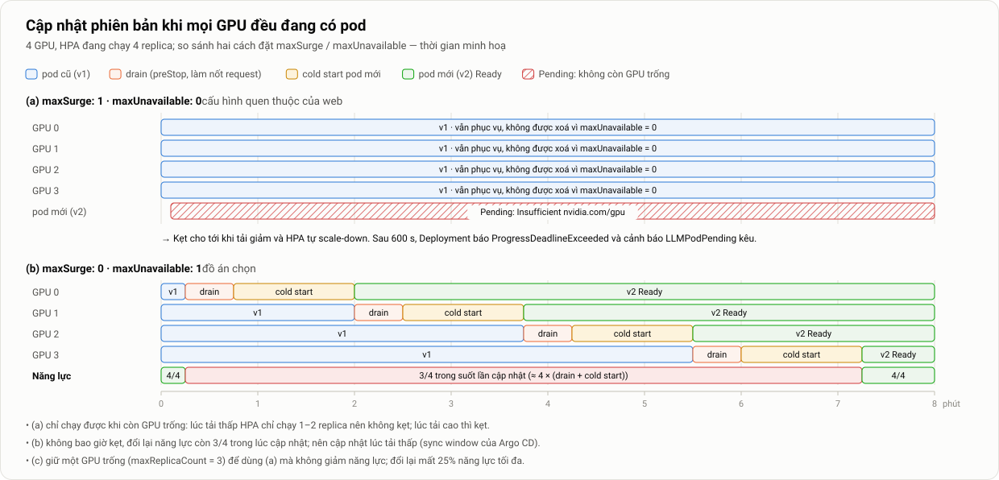

# 8. Vận hành nền tảng: tài liệu chuyên sâu

> Thuộc [Mục 8 của bản mô tả chính](../mo-ta-chi-tiet-do-an.md#8-vận-hành-nền-tảng) · [Danh mục tài liệu chuyên sâu](README.md)

**Tóm tắt nhanh**
- Vận hành ở đây là những việc phải làm **sau khi** nền tảng đã chạy: biết khi nào chất lượng giảm, biết phải làm gì, cập nhật phiên bản an toàn, xử lý sự cố, dựng lại khi mất cluster, giữ an toàn và biết mình đang tốn bao nhiêu.
- **SLO** đặt cho TTFT và tỷ lệ lỗi. **Cảnh báo** đặt theo tốc độ tiêu hao ngân sách lỗi (burn rate), chia hai mức page và ticket. **Mỗi cảnh báo có một runbook**.
- Vấn đề riêng của GPU: **rolling update kiểu web bị kẹt** khi mọi GPU đều đang có pod. Đồ án phân tích ba phương án và chọn `maxSurge: 0, maxUnavailable: 1`.
- **Dựng lại từ máy trắng** trong ≤ 30 phút nhờ IaC và GitOps. Thứ duy nhất phải sao lưu ngoài Git là khoá giải mã bí mật.
- Mỗi quy trình có một **kịch bản vận hành (VH1–VH6)** để kiểm chứng ([09 §9](09-kiem-thu-danh-gia.md#9-kịch-bản-vận-hành-vh1vh6)).

---

## 1. Vận hành gồm những việc gì

| Việc | Câu hỏi phải trả lời được | Công cụ | Sản phẩm trong repo | Kiểm chứng |
|---|---|---|---|---|
| Quan sát | Người dùng có đang được phục vụ tốt không? | Prometheus, Grafana | `observability/rules/`, `observability/dashboards/` | Mọi lượt đánh giá |
| Cảnh báo | Khi nào cần con người vào cuộc, gấp tới đâu? | Alertmanager, Telegram/Discord | `observability/alerts/` | VH6 |
| Xử lý | Nhận cảnh báo xong thì làm gì? | Runbook | `docs/runbooks/` | VH3, VH4, VH6 |
| Thay đổi | Cập nhật phiên bản thế nào cho an toàn, rollback thế nào? | Git, Argo CD | `serving/`, quy trình §5 | VH1, VH2 |
| Khôi phục | Mất cả cluster thì dựng lại thế nào, mất bao lâu? | Ansible, Argo CD, Makefile | `infra/`, `platform/` | VH5 |
| Bảo vệ | Ai được gọi API, gọi nhiều tới đâu, bí mật để ở đâu? | Traefik, NetworkPolicy, Sealed Secrets | `platform/`, `serving/` | Checklist §8 |
| Chi phí, năng lực | Đang tốn bao nhiêu GPU-giờ? Khi nào cần thêm GPU? | Grafana, recording rule | Dashboard SLO và chi phí | ĐG2 |


*Hình 7 (tài liệu chính). Đường đi từ metric tới hành động: SLI tính bằng recording rule, cảnh báo theo burn rate, Alertmanager định tuyến theo mức độ, người trực mở runbook, thay đổi đi qua Git.*

---

## 2. SLI và SLO

### 2.1. Chọn SLI

| SLI | Định nghĩa (tỷ lệ tốt / tổng) | Nguồn | Vì sao chọn |
|---|---|---|---|
| **TTFT** | Tỷ lệ request có thời gian tới token đầu ≤ ngưỡng | Histogram `vllm:time_to_first_token_seconds` | Người dùng cảm nhận rõ nhất; tăng đầu tiên khi quá tải |
| **Tỷ lệ lỗi** | Tỷ lệ request không trả 5xx | Metric của Traefik `traefik_service_requests_total` | Đo ở cửa vào, gồm cả lỗi khi không còn pod Ready |
| TPOT (theo dõi) | Thời gian trung bình giữa các token | Histogram `vllm:inter_token_latency_seconds` | Ít biến động hơn TTFT; chỉ đưa lên dashboard, không cảnh báo |

**Hai điểm cần lưu ý:**
- Histogram chỉ đếm được **theo biên bucket**. Ngưỡng SLO của TTFT phải **trùng một biên bucket có thật** trong `/metrics` của phiên bản vLLM đã ghim. Nếu ghi `le="2"` mà không có bucket đó, truy vấn trả về rỗng và cảnh báo **không bao giờ kêu**. Khi chốt SLO (ADR-003), chọn ngưỡng theo danh sách bucket, ví dụ 2,5 s.
- Request bị cắt **giữa stream** vẫn có mã 200, vì header đã gửi đi. Lỗi loại này không hiện trong tỷ lệ 5xx. Nó được theo dõi qua metric request bị huỷ của vLLM (ví dụ `vllm:request_success_total` theo `finished_reason`, kiểm tra tên theo phiên bản) và qua log của máy tạo tải khi đánh giá.

### 2.2. SLO và ngân sách lỗi

| SLO | Mục tiêu | Ngân sách lỗi |
|---|---|---|
| TTFT | 95% request có TTFT ≤ ngưỡng (khoảng 2 s, chốt theo biên bucket) | 5% request |
| Lỗi | 99% request không trả 5xx | 1% request |

Với một dịch vụ thật, SLO tính trên 30 ngày. Trong đồ án, mỗi lượt đánh giá chỉ dài 20–25 phút, nên các cửa sổ cảnh báo được rút ngắn (§3.3). Nguyên tắc vẫn giữ nguyên.

### 2.3. Recording rule

```yaml
# observability/rules/slo.yaml (trích)
- record: llm:ttft_bad_ratio:rate1m
  expr: |
    (
      sum(rate(vllm:time_to_first_token_seconds_count{namespace="llm-serving"}[1m]))
      - sum(rate(vllm:time_to_first_token_seconds_bucket{namespace="llm-serving", le="2.5"}[1m]))
    )
    / sum(rate(vllm:time_to_first_token_seconds_count{namespace="llm-serving"}[1m]))
# Tương tự cho [5m] và [30m]. Không có traffic thì phép chia ra NaN, và cảnh báo không kêu (đúng ý muốn).
# le="2.5": ví dụ biên bucket gần ngưỡng 2 s nhất; kiểm tra lại bằng curl <pod>:8000/metrics.

- record: llm:error_ratio:rate5m
  expr: |
    sum(rate(traefik_service_requests_total{service=~"llm-serving-.*", code=~"5.."}[5m]))
    / sum(rate(traefik_service_requests_total{service=~"llm-serving-.*"}[5m]))
```

Viết `tổng − tốt` chứ không viết `1 − tốt/tổng` là có chủ ý. Khi không có traffic, `1 − 0/ε` cho ra 100% request xấu và gây cảnh báo giả, còn `(0 − 0)/0` cho ra NaN và không kêu.

---

## 3. Cảnh báo

### 3.1. Nguyên tắc

1. **Mỗi cảnh báo phải dẫn tới một hành động.** Cảnh báo nào kêu mà không ai phải làm gì thì sửa hoặc bỏ.
2. **Hai mức:** *page* nghĩa là người dùng đang bị ảnh hưởng và cần người trực ngay; *ticket* nghĩa là cần xử lý trong giờ làm việc.
3. **Cảnh báo theo triệu chứng trước, nguyên nhân sau.** Cảnh báo SLO cho biết người dùng bị ảnh hưởng. Cảnh báo về pod, GPU, KEDA giúp tìm nguyên nhân nhanh hơn.
4. **Mỗi cảnh báo có `runbook_url`** trỏ tới một file trong `docs/runbooks/`.
5. **Quy tắc cảnh báo có unit test** bằng `promtool test rules`, chạy trong CI. Test này bắt được lỗi kiểu "biểu thức rỗng nên không bao giờ kêu".

### 3.2. Danh sách cảnh báo

| Cảnh báo | Điều kiện (rút gọn) | Mức | Ý nghĩa |
|---|---|---|---|
| `LLMSLOBurnFast` | Tỷ lệ request TTFT vượt ngưỡng ≥ 20% (burn rate 4) trên **cả** cửa sổ 5 phút và 1 phút | page | Người dùng đang phải chờ lâu |
| `LLMSLOBurnSlow` | ≥ 10% (burn rate 2) trên cả 30 phút và 5 phút | ticket | Chất lượng giảm kéo dài |
| `LLMErrorRateHigh` | Tỷ lệ 5xx ≥ 1% trong 5 phút | page | Request bị từ chối |
| `LLMAtMaxReplicas` | Số replica bằng max trong 15 phút **và** hàng đợi > 0 | ticket | Autoscaling đã hết dư địa; cần thêm GPU hoặc giới hạn tải |
| `LLMPodPending` | Pod vLLM ở trạng thái Pending > 10 phút | ticket | Thường do hết GPU: rolling update bị kẹt, hoặc max replica lớn hơn số GPU |
| `LLMPodNotReady` | Pod vLLM không Ready > 15 phút (lâu hơn cold start tối đa) | page | Pod không khởi động được |
| `LLMPodCrashLooping` | Container ở trạng thái `CrashLoopBackOff` > 5 phút | page | OOM, sai tham số, lỗi CUDA |
| `LLMPreemptions` | `num_preemptions_total` tăng trong 5 phút | ticket | KV-cache không đủ; xem lại `max-num-seqs` |
| `KedaScalerErrors` | Bộ đếm lỗi scaler của KEDA tăng (ví dụ `keda_scaler_errors_total`, kiểm tra tên theo phiên bản) | page | Autoscaling bị "mù", đang chạy chế độ fallback |
| `GPUTemperatureHigh` | Nhiệt độ GPU > 83 °C trong 5 phút | ticket | Sắp giảm xung |
| `GPUXidError` | `DCGM_FI_DEV_XID_ERRORS` > 0 | page | Lỗi phần cứng hoặc driver |
| (có sẵn) `TargetDown`, `Watchdog` | Từ kube-prometheus-stack | – | Mất nguồn metric; kiểm tra đường cảnh báo còn sống |

### 3.3. Quy tắc mẫu

```yaml
# observability/alerts/llm.yaml (trích)
- alert: LLMSLOBurnFast
  expr: |
    llm:ttft_bad_ratio:rate5m > (4 * 0.05)
    and
    llm:ttft_bad_ratio:rate1m > (4 * 0.05)
  for: 1m
  labels: {severity: page}
  annotations:
    summary: "Hơn 20% request phải chờ token đầu tiên quá ngưỡng SLO"
    runbook_url: "https://github.com/<org>/llm-k8s-autoscaling/blob/main/docs/runbooks/LLMSLOBurnFast.md"

- alert: LLMAtMaxReplicas
  expr: |
    kube_horizontalpodautoscaler_status_current_replicas{namespace="llm-serving"}
      >= kube_horizontalpodautoscaler_spec_max_replicas{namespace="llm-serving"}
    and on() sum(vllm:num_requests_waiting{namespace="llm-serving"}) > 0
  for: 15m
  labels: {severity: ticket}
  annotations:
    summary: "Đã chạy tối đa replica 15 phút mà vẫn có request phải chờ"
    runbook_url: "https://github.com/<org>/llm-k8s-autoscaling/blob/main/docs/runbooks/LLMAtMaxReplicas.md"
```

**Về các cửa sổ rút ngắn.** Với dịch vụ thật và SLO 99,9%, SRE Workbook [23] gợi ý page khi burn rate 14,4 trên cửa sổ 1 giờ và 5 phút. Ở đây SLO là 95%, nên burn rate tối đa có thể là 20 (khi 100% request xấu). Burn rate 4 tương đương 20% request xấu. Cửa sổ được rút xuống 5 phút và 1 phút để cảnh báo kịp kêu trong một lượt đánh giá 20–25 phút. Khi vận hành thật, chỉ cần đổi cửa sổ; công thức giữ nguyên.

### 3.4. Alertmanager: định tuyến

```yaml
route:
  receiver: ticket
  group_by: [alertname]
  group_wait: 30s
  routes:
    - matchers: [severity="page"]
      receiver: page
      repeat_interval: 1h
receivers:
  - name: page                       # nhóm Telegram của người trực
    telegram_configs:
      - chat_id: <id nhóm>
        bot_token: <lấy từ Secret>   # không ghi thẳng vào Git (xem §8)
        send_resolved: true
  - name: ticket                     # kênh Discord, xử lý trong giờ làm việc
    discord_configs:
      - webhook_url: <lấy từ Secret>
inhibit_rules:
  - source_matchers: [alertname="LLMSLOBurnFast"]
    target_matchers: [alertname="LLMSLOBurnSlow"]
```

- **Gom nhóm:** nhiều pod cùng lỗi chỉ tạo một tin nhắn.
- **Chặn trùng (inhibit):** đã có cảnh báo nhanh thì không gửi thêm cảnh báo chậm cho cùng một vấn đề.
- **Im lặng khi bảo trì:** trước khi cập nhật có chủ đích, tạo silence bằng `amtool silence add` cho các cảnh báo về pod, kèm thời hạn.

### 3.5. Khi chính hệ thống giám sát hỏng

Prometheus sập thì mọi cảnh báo cũng im lặng theo. kube-prometheus-stack có sẵn cảnh báo `Watchdog` **luôn luôn kêu**. Nếu gửi `Watchdog` tới một dịch vụ heartbeat bên ngoài (ví dụ healthchecks.io), dịch vụ đó sẽ báo khi **không còn nhận được** tín hiệu. Đây là phần tuỳ chọn; trong đồ án, kịch bản VH4 kiểm tra rằng KEDA chuyển sang fallback khi mất Prometheus.

---

## 4. Runbook

### 4.1. Mẫu

Mỗi cảnh báo có một file `docs/runbooks/<TênCảnhBáo>.md` theo cùng một khung:

```markdown
# <TênCảnhBáo>
**Ý nghĩa:** điều kiện kích hoạt, nói bằng lời.
**Ảnh hưởng:** người dùng thấy gì.
**Chẩn đoán nhanh (≤ 5 phút):** các panel và lệnh cần xem, theo thứ tự.
**Xử lý:** từng nguyên nhân thường gặp → hành động.
**Leo thang:** khi nào gọi người thứ hai; khi nào báo người dùng.
**Sau sự cố:** ghi nhật ký; cập nhật runbook nếu thiếu bước.
```

### 4.2. Ví dụ: `LLMSLOBurnFast`

**Ý nghĩa.** Trong cả 5 phút và 1 phút gần nhất, hơn 20% request phải chờ token đầu tiên lâu hơn ngưỡng SLO.

**Ảnh hưởng.** Một phần năm người dùng thấy trợ lý "đứng hình" vài giây trước khi trả lời.

**Chẩn đoán nhanh.**
1. Dashboard *Autoscaling*: số replica mong muốn có lớn hơn số replica đang có không? Có pod đang khởi động không?
2. Số replica đã bằng max chưa? (Nếu rồi, xem thêm cảnh báo `LLMAtMaxReplicas`.)
3. Dashboard *Serving*: hàng đợi tăng ở mọi pod hay chỉ một pod? Có preemption không?
4. Dashboard *GPU*: có GPU nào giảm xung hoặc quá nhiệt không?
5. Argo CD: có lần sync nào trong 30 phút gần đây không?

**Xử lý.**

| Nguyên nhân | Hành động |
|---|---|
| Tải vừa tăng, pod mới đang cold start | Theo dõi. Cảnh báo sẽ tự tắt khi pod mới Ready và hàng đợi rút hết, thường trong vài phút. Nếu cold start lâu hơn 3 phút, kiểm tra image đã có sẵn trên node chưa và model có nằm trên NVMe không |
| Đã chạy tối đa replica | Thắt giới hạn tốc độ ở Traefik để bảo vệ phần lớn người dùng; báo người dùng; đề xuất thêm GPU (§9) |
| Một pod chậm bất thường | Xem GPU của pod đó (nhiệt độ, XID); xoá pod để nó chuyển đi |
| Ngay sau một lần cập nhật | Rollback bằng `git revert` rồi để Argo CD sync (§5.4) |
| KEDA đang lỗi | Autoscaling đã fallback lên max; xử lý Prometheus hoặc KEDA theo runbook `KedaScalerErrors` |

**Leo thang.** Sau 15 phút chưa rõ nguyên nhân thì gọi người thứ hai.

### 4.3. Hành động đầu tiên cho các cảnh báo còn lại

| Cảnh báo | Hành động đầu tiên |
|---|---|
| `LLMErrorRateHigh` | Xem còn pod Ready nào không (`kubectl get pods`); xem log Traefik và log vLLM |
| `LLMAtMaxReplicas` | Xem đỉnh tải so với năng lực (§9); thắt giới hạn tốc độ nếu SLO đang bị vi phạm |
| `LLMPodPending` | `kubectl describe pod`: nếu báo `Insufficient nvidia.com/gpu` và đang có rollout thì xem §5; nếu không thì kiểm tra `maxReplicaCount` |
| `LLMPodNotReady` / `LLMPodCrashLooping` | `kubectl logs --previous`: OOM, thiếu `/dev/shm`, sai đường dẫn model, sai tham số sau cập nhật → rollback |
| `LLMPreemptions` | Giảm `--max-num-seqs` hoặc `--max-model-len`, hoặc chấp nhận và theo dõi |
| `KedaScalerErrors` | Kiểm tra Prometheus còn sống không, PromQL có trả về giá trị không (`kubectl get hpa`) |
| `GPUTemperatureHigh` | Kiểm tra quạt và nhiệt độ phòng (laptop); báo nhà cung cấp (máy thuê) |
| `GPUXidError` | `kubectl cordon` node, xoá pod trên GPU đó để chuyển đi, báo nhà cung cấp |

---

## 5. Cập nhật phiên bản khi GPU đã dùng hết



*Hình 16. Cập nhật khi cả 4 GPU đều đang có pod. Cấu hình quen thuộc của web (a) tạo pod mới trước nên bị kẹt ở Pending. Cấu hình cho GPU (b) xoá một pod cũ trước, đổi lại năng lực giảm một replica trong mỗi lần thay pod.*

### 5.1. Vấn đề

Cập nhật phiên bản xảy ra thường xuyên: đổi phiên bản vLLM, đổi revision của model, đổi tham số. Mỗi lần như vậy Deployment phải thay **toàn bộ** pod. Với web service, cấu hình phổ biến là `maxSurge: 1, maxUnavailable: 0` (xem [04 §6.4](04-kien-thuc-nen.md#64-rolling-update-của-deployment)): tạo pod mới trước, khi nó Ready mới xoá pod cũ.

Với GPU, pod mới cần **thêm một GPU trống**. Nếu lúc đó HPA đang chạy 4 replica trên 4 GPU, pod mới nằm Pending (`Insufficient nvidia.com/gpu`). Vì `maxUnavailable: 0`, Deployment cũng không được xoá pod cũ, nên lần cập nhật **kẹt** cho tới khi tải giảm và HPA tự scale-down. Sau 600 s, Deployment báo `ProgressDeadlineExceeded`, nhưng không tự rollback.

### 5.2. Ba phương án

| Phương án | Cấu hình | Ưu | Nhược |
|---|---|---|---|
| (a) Như web | `maxSurge: 1, maxUnavailable: 0` | Không giảm năng lực khi còn GPU trống | **Kẹt** khi mọi GPU đều đang có pod |
| **(b) Xoá trước, tạo sau** | `maxSurge: 0, maxUnavailable: 1` | Không bao giờ kẹt | Trong mỗi lần thay pod (drain + cold start, khoảng 1–2 phút), năng lực giảm một replica |
| (c) Giữ một GPU làm chỗ đệm | (a) cộng `maxReplicaCount` = số GPU − 1 | Cập nhật không giảm năng lực | Mất vĩnh viễn một replica năng lực tối đa (25% với 4 GPU) |

**Lựa chọn của đồ án: (b)**, kết hợp với **cập nhật vào lúc tải thấp** bằng *sync window* của Argo CD (chỉ cho phép sync tự động trong một khung giờ). Lúc tải thấp, HPA chỉ chạy 1–2 replica, nên việc giảm một replica gần như không ảnh hưởng. Nếu bắt buộc phải cập nhật lúc tải cao, (b) vẫn hoàn tất, chỉ với một khoảng giảm năng lực có giới hạn. Phương án (c) hợp với cluster lớn, nơi một GPU chỉ là phần nhỏ của năng lực.

```yaml
# serving/base/deployment.yaml (trích)
spec:
  strategy:
    type: RollingUpdate
    rollingUpdate: {maxSurge: 0, maxUnavailable: 1}
  progressDeadlineSeconds: 900     # đủ cho drain (≤ 180 s) cộng cold start
```

### 5.3. Quy trình cập nhật qua GitOps

1. **Chuẩn bị:** nếu đổi model, chạy Job prefetch cho revision mới trước, để pod mới không phải tải 15 GB giữa lúc cập nhật. Đổi phiên bản vLLM hoặc tham số thì compile cache cũ mất hiệu lực, nên lần khởi động đầu sẽ lâu hơn ([05 §7.3](05-kien-truc-he-thong.md#73-cạm-bẫy-khi-đo)).
2. **PR:** đổi digest của image hoặc tham số trong overlay. CI chạy `kustomize build`, kubeconform và `promtool test rules`.
3. **Merge và sync:** Argo CD sync trong sync window (hoặc bấm tay). Tạo silence cho `LLMPodNotReady` trong 30 phút.
4. **Theo dõi:** `kubectl rollout status deploy/vllm`, dashboard Serving và SLO. Cảnh báo SLO **không** bị tắt, vì nó cho biết cập nhật có làm hỏng trải nghiệm hay không.
5. **Ghi nhận:** thời gian cập nhật, SLO trong lúc cập nhật, số request lỗi. Đây chính là số đo của kịch bản VH2.

### 5.4. Rollback

- Rollback bằng **`git revert`** commit vừa merge, rồi để Argo CD sync. Rollback cũng là một lần rolling update, nên mất vài phút như lúc cập nhật.
- **Không dùng** `kubectl rollout undo`: Argo CD đang bật self-heal sẽ đưa cluster về đúng như Git, tức là về phiên bản lỗi.

---

## 6. Sự cố và tự phục hồi

| Tình huống | Nền tảng tự xử lý | Người trực làm gì | Kiểm chứng |
|---|---|---|---|
| Tiến trình vLLM chết (OOM, lỗi CUDA) | kubelet khởi động lại container; request đang chạy trên pod đó bị lỗi | Nếu lặp lại: runbook `LLMPodCrashLooping` | VH3 (kill tiến trình) |
| Pod bị xoá (`kubectl delete`) | ReplicaSet tạo pod mới; pod cũ được drain nên không cắt request | – | VH3 |
| Node bảo trì (`kubectl drain`) | Pod được tạo lại ở node khác nếu còn GPU trống; nếu không, năng lực giảm | Drain ngoài giờ cao điểm | VH3 (cluster laptop nhiều node) |
| GPU lỗi (XID) | Không tự xử lý được | Runbook `GPUXidError`: cordon, chuyển pod | Chỉ có cảnh báo, không giả lập |
| Prometheus sập | KEDA dùng `fallback`: lên số replica tối đa | Khôi phục Prometheus | VH4 |
| KEDA sập | HPA không lấy được metric, giữ nguyên số replica hiện có | Khôi phục KEDA | – |
| Argo CD sập | Cluster vẫn chạy; chỉ không cập nhật được | Khôi phục Argo CD | – |
| Mất model cache trên node | Pod mới phải tải lại model (cold start như L0) | Chạy lại Job prefetch | – |
| Tải vượt năng lực tối đa | Không | Runbook `LLMAtMaxReplicas` | ĐG2 (Static-1 ở KB3) |

---

## 7. Dựng lại từ đầu (khôi phục sau thảm hoạ)

**Trạng thái nằm ở đâu.** Nền tảng gần như không có trạng thái riêng, nên khôi phục chủ yếu là dựng lại:

| Thành phần | Nằm ở đâu | Khi mất cluster |
|---|---|---|
| Manifest, Helm values, dashboard, quy tắc cảnh báo, runbook | Git | Argo CD áp lại |
| Bí mật (khoá API, token, webhook) | Git, ở dạng Sealed Secret đã mã hoá | Giải mã được **chỉ khi còn khoá riêng của controller** |
| **Khoá riêng của Sealed Secrets controller** | **Sao lưu ngoài Git** (hai thành viên mỗi người giữ một bản) | Nạp lại trước khi Argo CD sync |
| Weights của model | Hugging Face (theo revision đã ghim) | Job prefetch tải lại |
| Dữ liệu Prometheus | Ổ của node | Không khôi phục; dữ liệu đánh giá đã được đẩy lên R2 sau mỗi lượt |

**Quy trình** (cũng là kịch bản VH5):

```text
make rent            → VM trắng (không tính vào thời gian khôi phục)
make bootstrap       → Ansible: chrony, NVMe, k3s, GPU; cài Argo CD; nạp khoá Sealed Secrets; áp root-app
                       Argo CD dựng: GPU Operator, giám sát, cảnh báo, KEDA, Traefik middleware, vLLM
make prefetch        → tải model về NVMe, pre-pull image
kiểm tra             → gọi API có streaming; dashboard có số liệu; gửi thử một cảnh báo
```

**Chỉ tiêu:** từ VM trắng tới khi API phục vụ được **≤ 30 phút** (N6). Runner ghi thời gian của từng bước để biết bước nào chiếm nhiều nhất, thường là tải image và model.

---

## 8. Bảo mật tối thiểu

| Lớp | Biện pháp | Cấu hình |
|---|---|---|
| Mạng | API chỉ mở trong mạng nội bộ; không có IP công khai | Traefik chỉ lắng nghe trên mạng riêng (máy thuê: chỉ SSH được mở ra ngoài) |
| Xác thực | Yêu cầu khoá API | `--api-key` của vLLM (một khoá dùng chung), hoặc `forwardAuth` ở Traefik nếu cần nhiều khoá |
| Giới hạn tốc độ | Mỗi khoá API bị giới hạn số request | Middleware `rateLimit` của Traefik, tính theo header `Authorization` |
| Cô lập trong cluster | Pod vLLM chỉ nhận kết nối từ Traefik và Prometheus | NetworkPolicy (k3s có sẵn bộ điều khiển NetworkPolicy) |
| Bí mật | Không có bí mật dạng rõ trong Git | Sealed Secrets: `kubeseal` mã hoá, controller trong cluster giải mã |
| Chuỗi cung ứng | Image ghim theo digest; chart ghim phiên bản | Kustomize, Argo CD |

```yaml
# Giới hạn tốc độ theo khoá API
apiVersion: traefik.io/v1alpha1
kind: Middleware
metadata: {name: llm-ratelimit, namespace: llm-serving}
spec:
  rateLimit:
    average: 2          # request/giây trung bình cho mỗi khoá
    burst: 10
    sourceCriterion:
      requestHeaderName: Authorization
---
# Chỉ Traefik và Prometheus được gọi vào pod vLLM
apiVersion: networking.k8s.io/v1
kind: NetworkPolicy
metadata: {name: vllm-ingress, namespace: llm-serving}
spec:
  podSelector: {matchLabels: {app: vllm}}
  policyTypes: [Ingress]
  ingress:
    - from:
        - namespaceSelector: {matchLabels: {kubernetes.io/metadata.name: kube-system}}
          podSelector: {matchLabels: {app.kubernetes.io/name: traefik}}
        - namespaceSelector: {matchLabels: {kubernetes.io/metadata.name: monitoring}}
      ports: [{port: 8000, protocol: TCP}]
```

**Checklist nghiệm thu F7:** gọi API không có khoá thì bị từ chối (401); vượt giới hạn tốc độ thì nhận 429; một pod thử trong namespace khác không gọi thẳng được pod vLLM; `git grep` không tìm thấy bí mật dạng rõ; `gitleaks` chạy sạch.

---

## 9. Chi phí và kế hoạch năng lực

**Theo dõi chi phí.** Dashboard *SLO và chi phí* có ba con số:

```promql
# GPU-giờ trong 24 giờ (lấy mẫu mỗi phút)
sum_over_time(kube_deployment_status_replicas{namespace="llm-serving", deployment="vllm"}[1d:1m]) / 60

# Token đã sinh trong 24 giờ
sum(increase(vllm:generation_tokens_total{namespace="llm-serving"}[1d]))

# Chi phí trên 1 triệu token = GPU-giờ × đơn giá ÷ (token ÷ 10^6)
# Đơn giá là biến của Grafana (ví dụ 0,45 USD/GPU-giờ), không phải metric.
```

**Kế hoạch năng lực.** Từ năng lực C của một replica (đo ở ĐG1) và tốc độ đỉnh dự kiến λ_đỉnh:

$$
N_{\text{cần}} = \left\lceil \frac{\lambda_{\text{đỉnh}}}{0{,}8 \times C} \right\rceil \;(+1 \text{ nếu chọn phương án (c) ở §5})
$$

Ví dụ C = 2 req/s và đỉnh 6 req/s thì cần ⌈6 ÷ 1,6⌉ = 4 GPU. Tín hiệu cần thêm GPU là cảnh báo `LLMAtMaxReplicas` xuất hiện thường xuyên, hoặc tỷ lệ thời gian chạy ở mức max tăng dần qua các tuần.

---

## 10. Các quy trình vận hành định kỳ

| Khi nào | Việc | Công cụ |
|---|---|---|
| Hằng ngày | Xem dashboard SLO: ngân sách lỗi còn lại, cảnh báo trong 24 giờ qua | Grafana |
| Hằng tuần | Rà cảnh báo: cảnh báo nào kêu mà không cần làm gì thì chỉnh hoặc bỏ; xem đỉnh tải và thời gian chạy ở mức max | Alertmanager, Grafana |
| Mỗi lần đổi phiên bản | Quy trình §5.3 | Git, Argo CD |
| Mỗi lần đổi model, GPU hoặc tham số vLLM | Đo lại năng lực; cập nhật target của A2 | `make capacity` |
| Hằng tháng (và trước buổi bảo vệ) | Diễn tập: dựng lại cluster laptop từ đầu; tắt một thành phần rồi làm theo runbook | `make laptop-up`, runbook |
| Sau mỗi sự cố | Ghi nhật ký sự cố; bổ sung runbook nếu thiếu bước | `docs/nhat-ky/` |

---

## 11. Câu hỏi hội đồng có thể đặt ra

**Cảnh báo theo burn rate có quá phức tạp cho một hệ thống nhỏ?**
Công thức chỉ là một phép chia, và chỉ cần hai recording rule. Đổi lại, cảnh báo gắn thẳng với trải nghiệm người dùng, ít báo giả hơn ngưỡng tĩnh, và có sẵn hai mức độ khẩn cấp. Kịch bản VH6 đo đúng hai điều này: cảnh báo kêu khi có vấn đề thật, và im lặng khi không có.

**Runbook có được dùng thật không, hay chỉ để nộp?**
Có. Trong đợt thuê GPU khoảng 37 giờ, hai thành viên trực theo ca và xử lý cảnh báo theo runbook. Các kịch bản VH3, VH4 và VH6 cũng được làm theo runbook. Chỗ nào runbook thiếu thì được bổ sung, và lịch sử sửa nằm trong Git.

**Phương án (b) làm giảm năng lực khi cập nhật, có chấp nhận được không?**
Khoảng giảm có giới hạn: một replica, trong 1–2 phút mỗi lần thay pod, và được đo trong VH2. Kết hợp với sync window để cập nhật lúc tải thấp, ảnh hưởng gần như bằng 0. Nếu không chấp nhận được thì dùng phương án (c), với cái giá đã nêu rõ.

**Sao không dùng Loki hay tracing?**
Các kịch bản của đồ án chẩn đoán được bằng metric, sự kiện Kubernetes và `kubectl logs`. Log tập trung là phần mở rộng hợp lý khi có nhiều dịch vụ hơn.
