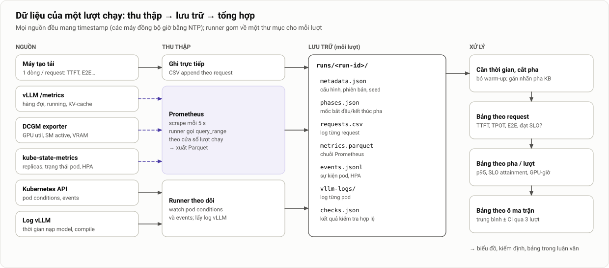

# 9. Chỉ số đánh giá và cách đo: tài liệu chuyên sâu

> Thuộc [Mục 9 của bản mô tả chính](../mo-ta-chi-tiet-do-an.md#9-chỉ-số-đánh-giá-và-cách-đo) · [Danh mục tài liệu chuyên sâu](README.md)

**Tóm tắt nhanh**
- **Log phía client là nguồn chính** cho độ trễ. Metric phía server dùng để chẩn đoán và đối chiếu.
- Mỗi chỉ số có **định nghĩa, công thức, nguồn, cách tính** và **cạm bẫy** riêng.
- Phân vị (p95, p99) phải tính **trên toàn bộ request** trong một cửa sổ, không lấy trung bình của các phân vị. Phải đủ số mẫu, và kèm khoảng tin cậy.
- Có lược đồ dữ liệu cho từng file, thư viện PromQL, và cách căn thời gian giữa các nguồn.

---

## 1. Nguyên tắc đo

1. **Đo ở nơi người dùng cảm nhận:** TTFT, TPOT, E2E lấy từ log của máy tạo tải.
2. **Giữ dữ liệu thô ở mức từng request.** Mọi chỉ số tổng hợp đều tính lại được từ dữ liệu thô.
3. **Chia theo pha.** Mỗi kịch bản được chia thành các pha có tên (xem [08 §6.3](08-thiet-ke-thi-nghiem.md#63-định-nghĩa-các-kịch-bản-theo-đơn-vị-c)); chỉ số được báo cáo **theo pha** và **cho cả lượt**.
4. **Gán request cho pha theo thời điểm gửi.** Một request thuộc pha mà `t_send` của nó rơi vào.

---

## 2. Nguồn dữ liệu



*Hình 16. Sáu nguồn dữ liệu của một lượt chạy và đường đi của chúng tới bảng kết quả.*

---

## 3. Định nghĩa chi tiết

### 3.1. TTFT (Time To First Token)

- **Định nghĩa:** TTFT = t_first − t_send, trong đó t_first là lúc nhận được chunk SSE đầu tiên **có nội dung**.
- **Gồm:** mạng, parse và tokenize, **chờ trong hàng đợi**, prefill, gửi chunk đầu.
- **Đối chiếu:** `vllm:time_to_first_token_seconds` (phía server) luôn nhỏ hơn, vì không gồm mạng và phần xử lý ở API server. Chênh lệch ổn định vài mili-giây là bình thường; chênh lớn cần điều tra.
- **Cạm bẫy:** chunk đầu tiên của stream có thể chỉ chứa `role` mà không có nội dung, nên phải bỏ qua chunk đó.

### 3.2. TPOT và ITL

- **TPOT (chỉ số chính):**
  $$\text{TPOT} = \frac{t_{\text{last}} - t_{\text{first}}}{n_{\text{out}} - 1}$$
  với n_out lấy từ `usage.completion_tokens`.
- **ITL:** khoảng cách giữa các chunk liên tiếp. **Cạm bẫy:** một chunk có thể chứa nhiều token, vì vLLM có thể gộp output. ITL tính theo chunk vì vậy **không bằng** ITL tính theo token. Nhóm chỉ dùng ITL để mô tả độ "giật" của stream, không dùng để kiểm tra SLO.
- SLO dùng **TPOT của từng request** (≤ 100 ms).

### 3.3. E2E latency

- E2E = t_last − t_send. Với output cố định 256 token, E2E ≈ TTFT + 255 × TPOT.

### 3.4. Thời gian chờ trong hàng đợi

- Chỉ đo được phía server, qua `vllm:request_queue_time_seconds`. Dùng để **giải thích** vì sao TTFT tăng: do chờ hay do prefill chậm.

### 3.5. SLO attainment

- **Cho từng request:** ok = (TTFT ≤ 2 s) ∧ (TPOT ≤ 100 ms) ∧ (không lỗi).
- **Cho một pha hoặc một lượt:**
  $$\text{SLO attainment} = \frac{\#\{\text{request ok}\}}{\#\{\text{request được gửi trong pha}\}}$$
- Request lỗi hoặc timeout **vẫn nằm ở mẫu số**. Nếu bỏ chúng ra khỏi mẫu số, cấu hình càng tệ sẽ càng trông tốt.

### 3.6. Goodput

Có hai định nghĩa, dùng cho hai mục đích khác nhau:
1. **Goodput theo thời gian:** số request đạt SLO mỗi giây trong một cửa sổ. Dùng trong chuỗi thời gian và khi so sánh các cấu hình.
2. **Goodput kiểu DistServe [2]:** tốc độ request **lớn nhất** mà SLO attainment vẫn ≥ 90%. Tính từ đường cong hiệu chỉnh; có ý nghĩa như một "năng lực hiệu dụng" của một replica.

### 3.7. Throughput

- Token output mỗi giây: `sum(rate(vllm:generation_tokens_total[1m]))`, hoặc từ log client (tổng n_out chia độ dài cửa sổ).
- Số request hoàn thành mỗi giây, lấy từ log client.

### 3.8. Tỷ lệ lỗi

| Loại | Nhận biết |
|---|---|
| Lỗi HTTP | `status ≥ 400` (ví dụ 503) |
| Từ chối kết nối | Lỗi `ConnectError` hoặc `ConnectionRefused` |
| Timeout | Quá 120 s |
| Stream bị cắt | Không nhận được `[DONE]` hoặc `usage` |

Báo cáo tổng và **tách theo loại**, đặc biệt trong cửa sổ scale-down ở KB4.

### 3.9. GPU-giờ

- **Định nghĩa:** tổng thời gian mà các pod vLLM **giữ GPU**, tính từ lúc pod được gán node (condition `PodScheduled`) đến khi container kết thúc hẳn (hoặc tới cuối cửa sổ đo). Cách tính này **gồm cả thời gian cold start và thời gian drain**.
- **Cách tính chính xác:** từ các mốc của pod mà runner ghi lại:
  $$\text{GPU-giờ} = \frac{1}{3600}\sum_{\text{pod}} \big(\min(t_{\text{end}}, T) - \max(t_{\text{scheduled}}, 0)\big)$$
- **Cách tính xấp xỉ bằng PromQL** (dùng cho dashboard):
  ```promql
  sum_over_time(kube_deployment_status_replicas{namespace="llm-serving",deployment="vllm"}[<cửa sổ>:5s]) * 5 / 3600
  ```
  `status.replicas` không đếm pod đang Terminating, nên cách này **đánh giá thấp** một chút so với cách chính xác.
- **Chuẩn hoá** theo S4 để dễ so sánh: GPU-giờ(cấu hình) ÷ GPU-giờ(S4) × 100%.

### 3.10. Mức sử dụng GPU và hiệu quả chi phí

- GPU_UTIL, SM_ACTIVE, DRAM_ACTIVE trung bình theo thời gian, **chỉ trên các GPU đang được cấp phát**.
- **Token/GPU-giờ** = tổng token output ÷ GPU-giờ.
- **Request đạt SLO/GPU-giờ** = số request ok ÷ GPU-giờ. Đây là chỉ số "đáng tiền" nhất, vì gộp được cả chất lượng lẫn chi phí.
- **Chi phí trên 1 triệu token** = (GPU-giờ × đơn giá) ÷ (token ÷ 10⁶), với đơn giá giả định ghi rõ.

### 3.11. Các chỉ số của autoscaling

| Chỉ số | Định nghĩa | Nguồn |
|---|---|---|
| **Độ trễ phát hiện** | t(`desiredReplicas` đổi lần đầu sau khi tải đổi) − t(tải đổi theo lịch) | `kube_horizontalpodautoscaler_status_desired_replicas` hoặc event HPA |
| **Thời gian cung cấp** | t(pod Ready) − t(pod được tạo), tách theo 8 pha | Pod conditions, events, log vLLM |
| **Thời gian phản ứng** | t(năng lực mới Ready) − t(tải đổi) = phát hiện + cung cấp | Hai dòng trên |
| **Thời gian hồi phục SLO** | Xem thuật toán dưới đây | Log client |
| **Số lần scale** | Số lần `desiredReplicas` thay đổi | kube-state-metrics |
| **Flapping** | Số lần **đổi chiều** (lên rồi xuống, hoặc ngược lại) trong vòng 5 phút | Như trên |
| **Tỷ lệ dư năng lực** | $\int \max(0,\, N(t)\cdot C - \lambda(t))\,dt \;/\; \int \lambda(t)\,dt$ | Lịch tải và số replica |

**Thuật toán tính thời gian hồi phục SLO:**

```python
def recovery_time(req, t_change, slo_ttft=2.0, win=30, hold=60):
    """Thời điểm đầu tiên sau t_change mà TTFT p95 (cửa sổ trượt 30 s) ≤ SLO và giữ được ≥ 60 s."""
    s = req.set_index("t_send").sort_index()["ttft"]
    p95 = s.rolling(f"{win}s").quantile(0.95)
    ok = p95[p95.index >= t_change] <= slo_ttft
    for t, good in ok.items():
        if good and ok[t : t + hold].all():
            return t - t_change
    return float("inf")          # không hồi phục trong lượt chạy
```

---

## 4. Phân vị và cỡ mẫu

- **Tính đúng:** p95 của một pha là phân vị 95 của **tất cả request trong pha**. Không lấy trung bình các p95 theo từng phút, và không lấy trung bình p95 của các pod.
- **Số mẫu cần có:** ước lượng p99 cần ít nhất khoảng 1.000 request để ổn định; p95 cần khoảng 200.
  - KB1 ở 0,5C với C = 2: 1 req/s × 18 phút ≈ 1.080 request, đủ cho p99.
  - Pha `spike` của KB2 (5 phút ở 3C ≈ 6 req/s) có khoảng 1.800 request, đủ.
  - Khi một pha có ít mẫu, chỉ báo cáo p95 và **ghi rõ số mẫu n**.
- **Khoảng tin cậy của phân vị trong một lượt:** bootstrap trên các request của pha đó (1.000 lần lấy mẫu lại).
- **`histogram_quantile` của Prometheus** nội suy tuyến tính trong bucket, nên sai số phụ thuộc cách chia bucket của vLLM. **Chỉ dùng cho dashboard**, không dùng cho kết quả chính thức.

---

## 5. Căn thời gian giữa các nguồn

- Mọi máy chạy **chrony**. Runner ghi độ lệch đồng hồ vào `metadata.json`, và lượt có độ lệch từ 50 ms trở lên là không hợp lệ.
- Máy tạo tải ghi thời gian đơn điệu (`perf_counter_ns`) cộng **một mốc UTC** lúc bắt đầu, rồi quy đổi toàn bộ sang UTC khi xuất dữ liệu.
- Prometheus lưu mẫu theo thời điểm scrape. Khi ghép với log client, dùng `merge_asof` (pandas) với dung sai bằng chu kỳ scrape (5 s).
- `phases.json` lưu mốc UTC bắt đầu và kết thúc từng pha **theo lịch**, và toàn bộ việc cắt pha dựa vào file này.

---

## 6. Thư viện PromQL

```promql
# --- Serving ---
sum(vllm:num_requests_running{namespace="llm-serving"})
sum(vllm:num_requests_waiting{namespace="llm-serving"})
avg(vllm:kv_cache_usage_perc{namespace="llm-serving"})
histogram_quantile(0.95, sum by (le) (rate(vllm:time_to_first_token_seconds_bucket{namespace="llm-serving"}[1m])))
histogram_quantile(0.95, sum by (le) (rate(vllm:request_queue_time_seconds_bucket{namespace="llm-serving"}[1m])))
sum(rate(vllm:generation_tokens_total{namespace="llm-serving"}[1m]))
sum(increase(vllm:num_preemptions_total{namespace="llm-serving"}[5m]))
# Độ lệch tải giữa các pod (đánh giá cân bằng round-robin)
max(vllm:num_requests_running{namespace="llm-serving"}) - min(vllm:num_requests_running{namespace="llm-serving"})

# --- GPU (kiểm tra tên label) ---
avg(DCGM_FI_DEV_GPU_UTIL)
avg(DCGM_FI_PROF_SM_ACTIVE)
avg(DCGM_FI_PROF_DRAM_ACTIVE)
max(DCGM_FI_DEV_GPU_TEMP)

# --- Autoscaling ---
kube_horizontalpodautoscaler_status_desired_replicas{namespace="llm-serving"}
kube_deployment_status_replicas{namespace="llm-serving",deployment="vllm"}
kube_deployment_status_replicas_ready{namespace="llm-serving",deployment="vllm"}
sum by (phase) (kube_pod_status_phase{namespace="llm-serving",pod=~"vllm-.*"})
```

---

## 7. Lược đồ dữ liệu

### 7.1. `requests.csv`

| Cột | Kiểu | Ý nghĩa |
|---|---|---|
| `id` | int | Số thứ tự trong lịch |
| `t_sched`, `t_send`, `t_first`, `t_last`, `t_end` | float (giây UTC) | Các mốc thời gian |
| `n_in`, `n_out` | int | Số token vào / ra |
| `n_chunks` | int | Số chunk SSE có nội dung |
| `status` | int | HTTP status |
| `error` | str / rỗng | Loại lỗi |
| `ttft`, `tpot`, `e2e` | float | Tính sẵn khi xuất |
| `ok` | bool | Đạt SLO |

### 7.2. `metrics.parquet` (dạng dài)

| Cột | Kiểu |
|---|---|
| `ts` | timestamp UTC |
| `metric` | str (ví dụ `vllm:num_requests_running`) |
| `labels` | str JSON (pod, gpu…) |
| `value` | float |

### 7.3. `events.jsonl`

Mỗi dòng là một sự kiện: `{ts, kind: "pod"|"hpa"|"k8s-event", object, field, old, new, message}`. Ví dụ: pod `vllm-7d…` có `Ready` chuyển từ `False` sang `True`.

### 7.4. `phases.json`, `metadata.json`, `checks.json`

Xem [08 §9](08-thiet-ke-thi-nghiem.md#9-quy-trình-một-lượt-chạy-máy-trạng-thái-của-runner) và [08 §10](08-thiet-ke-thi-nghiem.md#10-tiêu-chí-hợp-lệ-của-một-lượt).

---

## 8. Bảng dẫn xuất (đầu vào của phân tích)

| Bảng | Mỗi dòng là | Cột chính |
|---|---|---|
| `req` | 1 request | Toàn bộ cột của `requests.csv`, cộng `run_id`, `config`, `scenario`, `phase` |
| `phase_metrics` | 1 pha của 1 lượt | n, p50/p95/p99 của TTFT/TPOT/E2E, SLO attainment, goodput, lỗi, GPU-giờ, token/GPU-giờ |
| `run_metrics` | 1 lượt | Như trên cho cả lượt, cộng độ trễ phát hiện, thời gian phản ứng, hồi phục, số lần scale, flapping |
| `cell_summary` | 1 ô (cấu hình × kịch bản) | Trung bình, độ lệch chuẩn và khoảng tin cậy qua các lượt |
| `coldstart` | 1 lần đo cold start | Thời gian 8 pha, tổng, mức (L0/L2) |

---

## 9. Câu hỏi hội đồng có thể đặt ra

**Vì sao không lấy thẳng p95 từ Prometheus cho nhanh?**
`histogram_quantile` là **ước lượng nội suy** theo bucket, và không gồm độ trễ mạng. Log phía client chính xác đến từng request và phản ánh đúng trải nghiệm người dùng.

**GPU-giờ tính cả lúc pod đang khởi động có công bằng không?**
Có, vì trong khoảng đó GPU đã bị giữ và **vẫn tính tiền**. Nếu bỏ phần này ra, autoscaling sẽ trông rẻ hơn thực tế.

**Request lỗi có được tính vào độ trễ không?**
Không tính vào phân phối TTFT/TPOT, vì không có giá trị. Nhưng **có tính vào mẫu số** của SLO attainment như một request không đạt.
