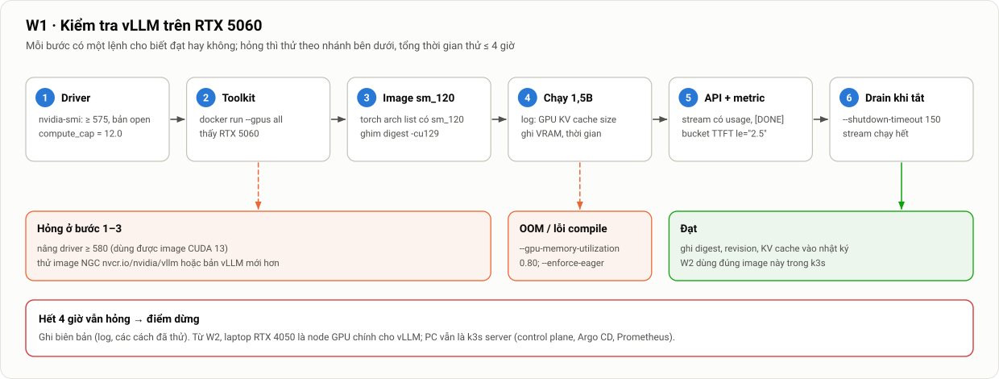

# Hướng dẫn W1 (08–11/10): chạy thử vLLM trên RTX 5060, dựng simulator, tìm máy Vast

> Thuộc [bộ tài liệu đồ án](../mo-ta-chi-tiet-do-an.md#bộ-tài-liệu) · Kế hoạch tuần: [Kế hoạch §2](../chi-tiet/06-ke-hoach-quan-ly.md#2-kế-hoạch-từng-tuần) · Tuần sau: [W2](w2.md)

**Tóm tắt nhanh**
- **Đã xong trước khi đọc file này:** Ubuntu trên PC, driver NVIDIA, email gửi GVHD. File này chỉ kiểm tra lại hai việc đầu ở §1.
- **Việc còn lại của W1:** Docker và NVIDIA Container Toolkit trên PC; **chạy thử vLLM trên RTX 5060** (việc khó và rủi ro nhất tuần); chuẩn bị laptop Ubuntu làm **máy làm việc chính** (công cụ, SSH tới PC) và để W2 join cluster; dựng kind và simulator trên laptop; Tailscale; tìm offer Vast vào **thứ Bảy 10/10 và Chủ nhật 11/10**.
- **Mọi lệnh chạy trên Ubuntu** (PC hoặc laptop). Mac chỉ dùng phụ: SSH vào laptop và mở trình duyệt xem Grafana, Argo CD.
- **Sản phẩm cuối tuần:** vLLM 1,5B trả lời có streaming trên 5060 (hoặc biên bản "không chạy được"), digest image đã ghim, bảng offer Vast, nhật ký `docs/nhat-ky/tuan-01.md`.
- **Điểm dừng:** thử 5060 quá **4 giờ** vẫn không chạy thì chuyển sang laptop (§3.7).
- Tổng thời gian ước tính: **9–12 giờ**.

---

## 0. Bức tranh của tuần

| # | Việc | Máy | Thời gian | Vì sao làm ngay tuần này |
|---|---|---|---|---|
| 1 | Kiểm tra lại PC (driver, IP tĩnh, ổ đĩa) | PC | 30 phút | Phiên bản driver quyết định chọn image vLLM nào |
| 2 | Docker + NVIDIA Container Toolkit | PC | 30 phút | Toolkit cũng là thứ k3s cần ở W2 |
| 3 | **vLLM trên RTX 5060** | PC | 1,5–4 giờ | Rủi ro R23: nếu hỏng thì cả kế hoạch W2–W3 phải đổi máy |
| 4 | Chuẩn bị laptop: Ubuntu, driver, công cụ, SSH tới PC | Laptop | 2–2,5 giờ | Laptop là máy làm việc chính (chạy Ansible, `kubectl`, `vastai`) và W2 join cluster làm node agent |
| 5 | kind + simulator trên laptop | Laptop | 1 giờ | Công cụ phát triển chính cho autoscaling, dashboard, cảnh báo |
| 6 | Tailscale | PC, laptop (Mac nếu muốn) | 30 phút | Truy cập cluster nhà từ ngoài, cho Trình vào được |
| 7 | Tìm offer Vast (T7 10/10, CN 11/10) | Laptop | 2 × 20 phút | Rủi ro R2: chưa chắc có máy 4 × 4090 chế độ VM |
| 8 | (Tuỳ chọn) xin quota GPU trên GCP | Trình duyệt | 20 phút | Duyệt quota có thể mất tới 3 ngày, xin miễn phí |
| 9 | Ghi nhật ký tuần | – | 20 phút | Bằng chứng cho chương 4 và cho buổi gặp GVHD |

**Máy và vai trò** (quyết định ngày 09/10):

| Máy | Vai trò từ W2 | Ghi chú |
|---|---|---|
| PC, RTX 5060 8 GB, RAM 16 GB, Ubuntu | k3s **server** kiêm node GPU; chạy Argo CD, Prometheus | Bật 24/7, cắm dây mạng. Ít khi phải gõ lệnh trực tiếp trên PC |
| Laptop, RTX 4050 6 GB ([Thông số §10.1](../chi-tiet/00-thong-so.md#101-máy-nhà)), Ubuntu | **Máy làm việc chính**: clone repo, chạy Ansible, `kubectl`, `helm`, `vastai`; **máy simulator cố định** (kind + `llm-d-inference-sim`); từ W2 là k3s **agent** có GPU | Cùng LAN với PC. Nếu thực tế là RTX 4060 8 GB thì vẫn dùng chung overlay `home`. Lý do chọn ở §5.1 |
| Mac | **Phụ:** SSH vào laptop, mở trình duyệt xem Grafana, Argo CD, Prometheus | Không cần cài công cụ nào ngoài Tailscale |



*Hình 18. Thứ tự kiểm tra vLLM trên RTX 5060 và các nhánh khi hỏng. Mỗi bước có một lệnh kiểm tra rõ đạt hay không; tổng thời gian thử giới hạn 4 giờ.*

---

## 1. Kiểm tra lại PC

Ubuntu và driver đã cài, nhưng cần ghi lại vài con số vì các bước sau phụ thuộc vào chúng.

```bash
# Phiên bản driver và CUDA tối đa mà driver hỗ trợ
nvidia-smi --query-gpu=name,driver_version,memory.total,compute_cap --format=csv
nvidia-smi | head -4                     # dòng đầu có "CUDA Version: 13.x" hoặc "12.x"

# Phải là kernel module bản open (Blackwell bắt buộc)
modinfo nvidia | grep -i license         # "Dual MIT/GPL" = bản open

# Không có giao diện đồ hoạ chiếm VRAM
nvidia-smi --query-compute-apps=pid,process_name,used_memory --format=csv
systemctl get-default                    # nên là multi-user.target

# Ổ đĩa và RAM
df -h / ; free -h
```

**Đọc kết quả:**

| Kiểm tra | Đạt khi | Nếu không đạt |
|---|---|---|
| `compute_cap` | `12.0` | Không phải RTX 50, kiểm tra lại máy |
| Driver | ≥ **575** (dùng image `-cu129`); ≥ **580** thì dùng được cả image mặc định CUDA 13 | `sudo apt install nvidia-driver-580-open` (hoặc nhánh mới hơn có hậu tố `-open`), rồi reboot |
| License | `Dual MIT/GPL` | Gỡ bản đóng, cài lại bản `-open` |
| Tiến trình dùng GPU | Không có (hoặc chỉ vài MB) | `sudo systemctl set-default multi-user.target && sudo reboot` |
| Ổ trống | ≥ 100 GB, tốt nhất 200 GB | Dọn ổ; image vLLM khoảng 11 GB nén, 25–30 GB sau giải nén |

> **Vì sao phiên bản driver quan trọng ngay lúc này.** Image vLLM chứa sẵn thư viện CUDA (user-space). Driver trên máy phải **mới hơn hoặc bằng** phiên bản CUDA đó, vì GPU GeForce không hỗ trợ "forward compatibility". Ngày 09/10/2026, vLLM v0.31.0 phát hành hai loại image:
> - `vllm/vllm-openai:v0.31.0`: CUDA 13.0, cần driver ≥ 580.
> - `vllm/vllm-openai:v0.31.0-cu129`: CUDA 12.9, cần driver ≥ 575.
>
> Cả hai đều có kernel cho `sm_120` (RTX 50) và `sm_89` (RTX 40). File này dùng **`-cu129`**: ít đòi hỏi driver hơn, chạy được trên cả PC lẫn laptop, và gần với driver của template VM trên Vast.

**Đặt IP tĩnh cho PC** (cần cho W2, vì laptop join cluster bằng IP này). Cách dễ nhất là đặt DHCP reservation trên router theo MAC của PC. Nếu không vào được router, dùng netplan:

```yaml
# /etc/netplan/01-static.yaml  (đổi tên card mạng, IP, gateway cho đúng mạng nhà)
network:
  version: 2
  ethernets:
    enp3s0:
      dhcp4: false
      addresses: [192.168.1.10/24]
      routes: [{to: default, via: 192.168.1.1}]
      nameservers: {addresses: [1.1.1.1, 8.8.8.8]}
```

```bash
sudo chmod 600 /etc/netplan/01-static.yaml && sudo netplan apply && ip -4 addr
```

Ghi IP của PC vào nhật ký. Từ đây trở đi, file này gọi nó là `<PC_IP>`.

**Chuẩn bị cho Ansible ở W2:** đảm bảo PC có `openssh-server` (`sudo apt install -y openssh-server`), và cho user sudo không cần mật khẩu: `echo "$USER ALL=(ALL) NOPASSWD:ALL" | sudo tee /etc/sudoers.d/90-$USER`. Lý do: Ansible chạy trên laptop, SSH vào PC rồi dùng `sudo`. Cách khác là chạy Ansible với `--ask-become-pass` và gõ mật khẩu mỗi lần. Khoá SSH từ laptop tới PC được tạo ở §4.

---

## 2. Docker và NVIDIA Container Toolkit trên PC

**Mục đích:** Docker chỉ dùng để **thử nhanh** vLLM trong W1. Từ W2, k3s dùng containerd riêng của nó, không dùng Docker. Còn **NVIDIA Container Toolkit** thì cả hai đều cần: đây là thành phần cho container nhìn thấy GPU. Ở W2, k3s tự phát hiện `nvidia-container-runtime` do toolkit cài, và tạo RuntimeClass `nvidia`.

```bash
# Docker từ kho của Ubuntu (đủ dùng để thử)
sudo apt-get update && sudo apt-get install -y docker.io
sudo usermod -aG docker $USER && newgrp docker

# NVIDIA Container Toolkit, theo hướng dẫn chính thức của NVIDIA
curl -fsSL https://nvidia.github.io/libnvidia-container/gpgkey \
  | sudo gpg --dearmor -o /usr/share/keyrings/nvidia-container-toolkit-keyring.gpg
curl -fsSL https://nvidia.github.io/libnvidia-container/stable/deb/nvidia-container-toolkit.list \
  | sed 's#deb https://#deb [signed-by=/usr/share/keyrings/nvidia-container-toolkit-keyring.gpg] https://#g' \
  | sudo tee /etc/apt/sources.list.d/nvidia-container-toolkit.list
sudo apt-get update && sudo apt-get install -y nvidia-container-toolkit

# Cho Docker dùng runtime của NVIDIA
sudo nvidia-ctk runtime configure --runtime=docker
sudo systemctl restart docker

# Kiểm tra: container thấy GPU
docker run --rm --gpus all nvidia/cuda:12.9.1-base-ubuntu24.04 nvidia-smi
```

**Đạt khi** lệnh cuối in bảng `nvidia-smi` có RTX 5060. Nếu báo `could not select device driver "" with capabilities: [[gpu]]`, nghĩa là bước `nvidia-ctk runtime configure` chưa chạy hoặc Docker chưa được khởi động lại.

---

## 3. Chạy thử vLLM trên RTX 5060

Đây là bước rủi ro nhất của tuần. Mục tiêu là trả lời **có/không** trong tối đa 4 giờ, và nếu có thì ghi lại đủ thông tin để W2 dùng đúng image đó trong Kubernetes.

### 3.1. Kéo image và ghim digest

```bash
IMG=vllm/vllm-openai:v0.31.0-cu129
docker pull $IMG                                         # ~11 GB, khoảng 6–10 phút ở 30 MB/s
docker inspect --format '{{index .RepoDigests 0}}' $IMG  # → vllm/vllm-openai@sha256:…
```

**Vì sao ghim theo digest chứ không theo tag:** tag có thể bị đẩy đè (một số dự án build lại tag cũ để vá lỗi). Digest là mã băm của chính nội dung image, nên dùng digest đảm bảo PC, laptop và VM trên Vast chạy **đúng một bản**, kể cả nhiều tuần sau. Đây là yêu cầu N8 (mọi phiên bản được ghim).

Giá trị tham chiếu tra trên Docker Hub ngày 09/10/2026: `v0.31.0-cu129` có digest `sha256:ff29e51a9457f191deb332b96fa6440584fa941aa2a548449b604e2b1e5e1eeb`. Nếu lệnh trên cho ra giá trị khác, dùng giá trị **bạn thấy** và ghi lại.

### 3.2. Image có kernel cho sm_120 không

```bash
docker run --rm --gpus all --entrypoint python3 $IMG -c \
  "import torch; print(torch.__version__, torch.version.cuda); print(torch.cuda.get_arch_list()); \
   print(torch.cuda.get_device_name(0), torch.cuda.get_device_capability(0))"
```

**Đạt khi** danh sách arch có `sm_120` và dòng cuối là `NVIDIA GeForce RTX 5060 (12, 0)`. Nếu thiếu `sm_120`, mọi kernel CUDA sẽ lỗi `no kernel image is available for execution on the device`. Khi đó không cần thử tiếp với image này; chuyển sang §3.7.

### 3.3. Chạy model 1,5B

```bash
mkdir -p ~/hf-cache
docker run --rm --name vllm-test --gpus all --ipc=host -p 8000:8000 \
  -v ~/hf-cache:/root/.cache/huggingface \
  $IMG \
  --model Qwen/Qwen2.5-1.5B-Instruct \
  --revision 989aa7980e4cf806f80c7fef2b1adb7bc71aa306 \
  --served-model-name qwen2.5-1.5b \
  --max-model-len 4096 --max-num-seqs 32 \
  --gpu-memory-utilization 0.85 \
  --no-enable-prefix-caching \
  --shutdown-timeout 150 \
  2>&1 | tee ~/vllm-5060.log
```

Giải thích các cờ (giá trị lấy từ [Thông số §9.1](../chi-tiet/00-thong-so.md#91-vllm), cột "Nhà"):

| Cờ | Ý nghĩa | Vì sao chọn giá trị này |
|---|---|---|
| `--ipc=host` | Cho container dùng shared memory của máy | PyTorch cần `/dev/shm` lớn hơn 64 MB mặc định của Docker. Trong Kubernetes, việc này làm bằng `emptyDir: {medium: Memory}` |
| `-v ~/hf-cache:…` | Giữ model đã tải giữa các lần chạy | Lần sau khởi động không phải tải lại (đây chính là ý tưởng của mức cold start L2) |
| `--revision <sha>` | Ghim đúng commit của model trên Hugging Face | Repo model có thể được cập nhật; `<sha>` tra ngày 09/10/2026, kiểm tra lại bằng `curl -s https://huggingface.co/api/models/Qwen/Qwen2.5-1.5B-Instruct \| jq -r .sha` |
| `--served-model-name` | Tên model trong API | Mọi client, dashboard và máy tạo tải gọi đúng tên này |
| `--max-model-len 4096` | Độ dài ngữ cảnh tối đa | Prompt 256–1024 + output 256 token là đủ; ngữ cảnh ngắn thì KV-cache chứa được nhiều request hơn |
| `--gpu-memory-utilization 0.85` | Phần VRAM vLLM được dùng | Chừa VRAM cho driver và các tiến trình khác; hạ xuống 0,80 nếu GPU còn chạy màn hình |
| `--no-enable-prefix-caching` | Tắt cache tiền tố | Khi đánh giá, số đo không được phụ thuộc vào nội dung prompt |
| `--shutdown-timeout 150` | Khi nhận SIGTERM, làm nốt request đang chạy trong tối đa 150 s | Mặc định là 0, tức **huỷ ngay** mọi request. Đây là nền của yêu cầu N4 (0 lỗi khi scale-down); thử ở §3.5 |

**Theo dõi log khởi động.** Các dòng cần thấy (ghi lại vào nhật ký):
- `GPU KV cache size: N tokens` và `Maximum concurrency for 4096 tokens per request: X x`: cho biết GPU chứa được bao nhiêu request cùng lúc. Con số này sẽ dùng khi chọn target autoscaling cho ở nhà.
- Thời gian nạp model và thời gian `torch.compile` / CUDA graph: tư liệu cho phần cold start.
- `Application startup complete`: server đã sẵn sàng.

Ở terminal khác, xem VRAM: `nvidia-smi --query-gpu=memory.used,memory.total --format=csv`.

### 3.4. Kiểm tra API, streaming và metric

```bash
# 1) Health và danh sách model
curl -s localhost:8000/health -o /dev/null -w '%{http_code}\n'      # 200
curl -s localhost:8000/v1/models | jq .

# 2) Streaming: phải thấy nhiều dòng "data: …" hiện dần, dòng cuối có "usage", rồi [DONE]
curl -N localhost:8000/v1/chat/completions -H 'Content-Type: application/json' -d '{
  "model": "qwen2.5-1.5b", "stream": true, "stream_options": {"include_usage": true},
  "max_tokens": 64, "messages": [{"role": "user", "content": "Giới thiệu ngắn về Kubernetes."}]}'

# 3) Metric mà autoscaling A2 dùng
curl -s localhost:8000/metrics | grep -E '^vllm:num_requests_(running|waiting)'

# 4) Biên bucket của histogram TTFT: phải có le="2.5" (SLO TTFT ≤ 2,5 s ở Thông số §6)
curl -s localhost:8000/metrics | grep '^vllm:time_to_first_token_seconds_bucket' | grep -o 'le="[^"]*"' | tr '\n' ' '

# 5) Các cờ mà manifest sẽ dùng có tồn tại trong bản đã ghim
docker run --rm --entrypoint vllm $IMG serve --help=all 2>/dev/null \
  | grep -E -- '--shutdown-timeout|--no-enable-prefix-caching|--api-key' | head
```

**Vì sao kiểm tra bucket (bước 4):** histogram của Prometheus chỉ đếm theo các biên có sẵn. Nếu SLO là 2,5 s mà không có biên `le="2.5"`, cảnh báo và nghiệm thu sẽ phải nội suy, nên kém chính xác. Trong mã nguồn vLLM v0.31.0, các biên TTFT gồm `… 1.0, 2.5, 5.0 …`, nên SLO 2,5 s dùng được. Bước này xác nhận lại trên đúng image đã ghim (rủi ro R8).

**Đo nhanh tốc độ (không dùng làm số liệu đánh giá, chỉ để biết máy chạy hợp lý):**

```bash
docker exec vllm-test vllm bench serve --backend openai-chat \
  --base-url http://localhost:8000 --endpoint /v1/chat/completions \
  --model qwen2.5-1.5b --tokenizer Qwen/Qwen2.5-1.5B-Instruct \
  --dataset-name random --random-input-len 512 --random-output-len 256 --ignore-eos \
  --max-concurrency 8 --num-prompts 64
```

Ghi lại TTFT p50/p99, TPOT và output token/s. Ở W2, khi vLLM chạy trong Kubernetes, chạy lại đúng lệnh này để chắc chắn không bị chậm đi do cấu hình pod.

### 3.5. Thử nhanh `--shutdown-timeout` (khoảng 15 phút, nên làm)

**Mục đích:** biết sớm cơ chế "làm nốt request khi bị tắt" có hoạt động trên bản đã ghim hay không. Cơ chế này là nền của scale-down an toàn (N4), và W3 sẽ kiểm thử kỹ trong Kubernetes.

```bash
# Terminal A: mở một stream dài (khoảng 1000 token)
curl -N localhost:8000/v1/chat/completions -H 'Content-Type: application/json' -d '{
  "model":"qwen2.5-1.5b","stream":true,"stream_options":{"include_usage":true},
  "max_tokens":1000,"ignore_eos":true,"messages":[{"role":"user","content":"Đếm từ 1 đến 1000."}]}' \
  | tail -3

# Terminal B: ngay khi terminal A bắt đầu chạy chữ, gửi SIGTERM và cho Docker chờ tối đa 160 s
docker stop -t 160 vllm-test
```

**Kết quả mong đợi:** log có dòng `[shutdown] … mode=drain timeout=150s`; terminal A vẫn chạy tiếp tới hết và in dòng `usage` cùng `[DONE]`; container chỉ thoát sau khi stream xong. Nếu chạy lại với `--shutdown-timeout 0`, stream bị cắt ngang ngay. Đó chính là "ca đối chứng" sẽ làm lại trong Kubernetes ở W3.

### 3.6. Ghi kết quả

Ghi vào `docs/nhat-ky/tuan-01.md` (mẫu ở §9):
- driver, `compute_cap`, CUDA của image;
- image tag **và digest**; revision model;
- dòng `GPU KV cache size` và `Maximum concurrency`; VRAM đã dùng;
- thời gian khởi động (từ lúc `docker run` tới `Application startup complete`, và từ lúc có sẵn model trong cache);
- kết quả §3.4 (bucket có `2.5` không, cờ có tồn tại không) và §3.5.

### 3.7. Nếu không chạy được

Bấm giờ từ lúc bắt đầu §3.1. Thử theo thứ tự dưới đây, **dừng ở 4 giờ**:

| Triệu chứng | Nguyên nhân hay gặp | Thử |
|---|---|---|
| `CUDA driver version is insufficient` | Driver cũ hơn CUDA của image | Dùng `-cu129`; hoặc nâng driver lên ≥ 580 |
| `no kernel image is available` | Image không có `sm_120` | Thử bản vLLM mới hơn; thử image NGC `nvcr.io/nvidia/vllm` (có hỗ trợ Blackwell) |
| OOM khi khởi động hoặc khi capture CUDA graph | 8 GB không đủ cho phần dự trữ | `--gpu-memory-utilization 0.80`; thêm `--enforce-eager` (bỏ CUDA graph, chậm hơn một chút) |
| Lỗi Triton/FlashInfer khi compile | Thư viện chưa hỗ trợ đủ sm_120 | Thêm `--enforce-eager`; nếu vẫn lỗi, ghi log và chuyển nhánh |
| Tải model chậm hoặc lỗi 429 | Giới hạn của Hugging Face | Tạo token HF miễn phí, thêm `-e HF_TOKEN=…` |

**Hết 4 giờ vẫn không chạy:** ghi **biên bản không chạy được** (log, các cách đã thử) vào nhật ký. Từ W2, **laptop là node GPU chính** cho vLLM thật; PC vẫn là k3s server (control plane, Argo CD, Prometheus). Phương án cuối là thuê 1 GPU cho các bài cần GPU thật ([Kế hoạch §8](../chi-tiet/06-ke-hoach-quan-ly.md#8-dự-phòng-và-cắt-giảm-phạm-vi)).

Xong thì dừng container: `docker stop vllm-test`. Từ W2 không dùng Docker để chạy vLLM nữa.

---

## 4. Chuẩn bị laptop: máy làm việc chính

Từ tuần này, **laptop là nơi gõ lệnh**: clone repo, chạy Ansible, `kubectl`, `helm`, `vastai`, chạy simulator. PC chỉ làm server và ít khi phải đụng tới. Từ W2, laptop cũng join cluster làm node agent có GPU.

### 4.1. Hệ điều hành và GPU

1. **Ubuntu 24.04**, cài trực tiếp (không dùng WSL2: WSL2 không chạy được k3s có GPU một cách ổn định).
   - Laptop là máy bạn ngồi làm việc, nên **bản Desktop dùng được** (có trình duyệt để xem Grafana, Argo CD).
   - Khi dùng Desktop, màn hình phải chạy trên **GPU tích hợp**, để GPU NVIDIA dành trọn cho vLLM. Kiểm tra ở bước 3.
2. **Driver:** `sudo ubuntu-drivers install`, reboot, kiểm tra `nvidia-smi`. Nên dùng cùng nhánh driver với PC (≥ 575), để một image vLLM chạy được trên cả hai máy.
3. **Laptop hai GPU (Optimus):** đặt `sudo prime-select on-demand` rồi reboot. Ở chế độ này, desktop vẽ bằng GPU tích hợp và GPU NVIDIA chỉ chạy khi có chương trình xin nó. Kiểm tra: `nvidia-smi` không được có `Xorg` hay `gnome-shell` chiếm vài trăm MB VRAM. Nếu có, xem lại `prime-select query`.
4. **Không cho laptop ngủ khi gập máy:** node ngủ thì cluster coi như mất node. Từ W2, role Ansible `common` tự làm việc này; trong W1 có thể làm tay:

   ```bash
   sudo sed -i 's/^#\?HandleLidSwitch=.*/HandleLidSwitch=ignore/; s/^#\?HandleLidSwitchExternalPower=.*/HandleLidSwitchExternalPower=ignore/' /etc/systemd/logind.conf
   sudo systemctl mask sleep.target suspend.target hibernate.target hybrid-sleep.target
   sudo systemctl restart systemd-logind      # trên Desktop lệnh này đăng xuất phiên đồ hoạ; lưu việc trước
   ```

5. **IP tĩnh** (như PC ở §1). Luôn **cắm sạc**, đặt ở chỗ thoáng vì GPU laptop dễ nóng khi chạy lâu.
6. **Sudo không mật khẩu** (Ansible ở W2 chạy cả trên chính laptop): `echo "$USER ALL=(ALL) NOPASSWD:ALL" | sudo tee /etc/sudoers.d/90-$USER`.

### 4.2. Công cụ

Cài **trước** khi k3s lên laptop ở W2. Lý do: script cài k3s tạo lệnh `kubectl` riêng của k3s nếu máy chưa có `kubectl`, và lệnh đó dễ gây nhầm kubeconfig.

```bash
sudo apt-get update
sudo apt-get install -y git make jq bc curl pipx gh hey openssh-client docker.io
pipx ensurepath && exec $SHELL                       # thêm ~/.local/bin vào PATH
pipx install --include-deps ansible                  # ansible-core mới hơn bản trong apt
pipx install vastai
pipx install yamllint
sudo snap install kubectl --classic --channel=1.36/stable
sudo snap install helm --classic
mkdir -p ~/.local/bin
curl -fsSLo ~/.local/bin/kind https://kind.sigs.k8s.io/dl/v0.33.0/kind-linux-amd64
curl -fsSLo ~/.local/bin/argocd https://github.com/argoproj/argo-cd/releases/download/v3.5.4/argocd-linux-amd64
chmod +x ~/.local/bin/kind ~/.local/bin/argocd
sudo usermod -aG docker $USER && newgrp docker       # dùng docker không cần sudo (kind cần)

kubectl version --client; helm version; kind version; ansible --version | head -1; argocd version --client --short
```

> Nếu `apt` không có gói `hey`: `sudo apt install golang-go && go install github.com/rakyll/hey@latest`, rồi thêm `~/go/bin` vào PATH.

**Vì sao `kubectl` bản 1.36:** khớp với k3s `v1.36.5` sẽ cài ở W2. `kubectl` chỉ được lệch tối đa một minor so với API server.

### 4.3. SSH tới PC và repo

```bash
ssh-keygen -t ed25519 -C "llm-thesis"                # bỏ qua nếu đã có ~/.ssh/id_ed25519
ssh-copy-id <user>@<PC_IP>
ssh <user>@<PC_IP> 'sudo -n true && nvidia-smi -L'   # không hỏi mật khẩu, in ra RTX 5060

gh auth login                                        # đăng nhập GitHub (HTTPS)
git clone https://github.com/bi6-cat/llm-k8s-autoscaling.git ~/llm-k8s-autoscaling
```

Từ Mac (nếu muốn ngồi máy Mac), chỉ cần `ssh <user>@<LAPTOP_IP>` rồi làm mọi việc trong shell của laptop.

---

## 5. Simulator trên laptop

### 5.1. Vì sao chọn laptop làm máy simulator cố định

| Lựa chọn | Ưu | Nhược | Kết luận |
|---|---|---|---|
| **Laptop (Docker + kind)** | Là máy làm việc chính nên lúc nào cũng có; cluster kind **tách biệt** với cluster nhà, nên các bài phá hỏng (chặn Prometheus ở T4, drain node) không ảnh hưởng gì tới vLLM thật; là máy mang đi **demo live** khi bảo vệ ([Kế hoạch §11.3](../chi-tiet/06-ke-hoach-quan-ly.md#113-demo)); cùng kiến trúc amd64 như mọi máy khác | Chia RAM với node agent k3s (đủ: agent + pod vLLM khoảng 4–6 GB, kind + giám sát + simulator khoảng 3 GB) | **Chọn** |
| PC (kind, hoặc namespace riêng trên k3s) | Luôn bật | PC chỉ 16 GB RAM, đã sát giới hạn ([Môi trường §2.6](../chi-tiet/05-moi-truong-danh-gia.md#26-tài-nguyên-của-node-chủ)); chạy chung k3s thì các bài kiểm thử phá hỏng ảnh hưởng tới vLLM thật | Không chọn |
| Mac | Có sẵn | Bạn muốn mọi thứ chạy trên Ubuntu; chip ARM khác kiến trúc với các máy còn lại | Không chọn |

> **Docker và k3s trên cùng laptop.** Từ W2, laptop chạy cả Docker (cho kind) lẫn k3s agent (containerd riêng). Hai thứ dùng hai mạng khác nhau nên không xung đột dải IP. Điểm cần để ý: Docker có thể đặt chính sách `iptables FORWARD` mặc định là `DROP`. Ở W2, sau khi laptop join cluster, kiểm tra pod trên PC gọi được pod trên laptop ([W2 §3.5](w2.md#35-chạy-và-kiểm-tra)). Nếu không gọi được, chạy `sudo iptables -P FORWARD ACCEPT`, và để giữ sau reboot thì thêm `{"ip-forward-no-drop": true}` vào `/etc/docker/daemon.json` (Docker ≥ 28), rồi `sudo systemctl restart docker`.

Kiểm tra Docker trên laptop chạy được: `docker run --rm hello-world`. Cấp cho kind đủ tài nguyên bằng cách giữ ít nhất **6 GB RAM trống** khi chạy simulator (`free -h`).

### 5.2. Chạy simulator bằng Docker (5 phút)

**Mục đích:** thấy simulator trả lời giống vLLM thật (cùng API, cùng tên metric) trước khi đưa vào Kubernetes.

```bash
docker run --rm -d --name sim -p 8100:8000 ghcr.io/llm-d/llm-d-inference-sim:v0.12.0 \
  --model qwen2.5-1.5b --served-model-name qwen2.5-1.5b --port 8000 \
  --force-dummy-tokenizer --max-num-seqs 16 --max-model-len 4096 \
  --time-to-first-token 200ms --inter-token-latency 50ms

curl -s localhost:8100/v1/chat/completions -H 'Content-Type: application/json' \
  -d '{"model":"qwen2.5-1.5b","max_tokens":50,"messages":[{"role":"user","content":"hi"}]}' | jq .usage
hey -z 20s -c 30 -m POST -T application/json \
  -d '{"model":"qwen2.5-1.5b","max_tokens":200,"messages":[{"role":"user","content":"hi"}]}' \
  http://localhost:8100/v1/chat/completions &
sleep 5; curl -s localhost:8100/metrics | grep -E '^vllm:num_requests_(running|waiting)'
wait; docker rm -f sim
```

**Đọc kết quả:** khi `hey` mở 30 kết nối đồng thời, `running` tối đa là 16 (đúng `--max-num-seqs`) và `waiting` khoảng 14. Tổng `running + waiting` chính là tín hiệu A2. Simulator mô phỏng đúng hiện tượng "đầy batch thì phải xếp hàng" của vLLM, nên viết autoscaling trên nó là có ý nghĩa.

Lưu ý về các cờ:
- `--force-dummy-tokenizer`: không tải tokenizer thật. Nếu `--model` là tên một repo Hugging Face thật, simulator sẽ đòi một dịch vụ tokenizer riêng (`--render-url`), không cần cho đồ án.
- `--time-to-first-token`, `--inter-token-latency`: độ trễ giả, đặt gần với GPU nhà để dashboard trông hợp lý.
- Readiness của simulator là `/health/ready`. Kết hợp với `--startup-duration 90s` để giả lập cold start (dùng ở W3).

### 5.3. Tạo cluster kind

Ở W2, file cấu hình này sẽ được đưa vào repo (`infra/kind/kind-config.yaml`). Trong W1 chỉ cần tạo thử để chắc kind chạy được trên laptop.

```bash
cat > /tmp/kind-llm.yaml <<'YAML'
kind: Cluster
apiVersion: kind.x-k8s.io/v1alpha4
name: llm-sim
nodes:
  - role: control-plane
    kubeadmConfigPatches:
      - |
        kind: ClusterConfiguration
        controllerManager:
          extraArgs:
            - name: horizontal-pod-autoscaler-sync-period
              value: "5s"
  - role: worker
  - role: worker
YAML
kind create cluster --config /tmp/kind-llm.yaml
kubectl --context kind-llm-sim get nodes
kubectl --context kind-llm-sim -n kube-system get pod -l component=kube-controller-manager \
  -o jsonpath='{.items[0].spec.containers[0].command}' | tr ',' '\n' | grep sync-period
```

Giải thích cấu hình:
- **3 node (1 control-plane, 2 worker):** đủ để thử drain node và để các pod simulator nằm trên nhiều node. Mỗi node kind chỉ là một container, tốn ít RAM.
- **`horizontal-pod-autoscaler-sync-period=5s`:** HPA mặc định chỉ tính lại mỗi 15 s. Đồ án đặt 5 s ở mọi môi trường ([Thông số §9.3](../chi-tiet/00-thong-so.md#93-keda-và-hpa)), nên simulator cũng phải giống, nếu không thì bài kiểm thử T2 ("scale trong khoảng 10 s") sẽ sai.
- Kind ≥ 0.33 dùng kubeadm API v1beta4, nên `extraArgs` là **danh sách** `name/value`. Ở các bản cũ hơn, nó là map `key: value`.
- Nếu `kind create` báo lỗi `too many open files`, tăng giới hạn inotify: `sudo sysctl fs.inotify.max_user_instances=1024 fs.inotify.max_user_watches=524288`. Role Ansible `common` ở W2 sẽ ghi cố định giá trị này.

Xong thì có thể xoá: `kind delete cluster --name llm-sim`. W2 tạo lại bằng `make sim-up`.

---

## 6. Tailscale

**Mục đích:** k3s giữa PC và laptop vẫn đi qua LAN. Tailscale dùng để **truy cập cluster nhà từ ngoài** (khi bạn ở công ty, hoặc khi Trình cần `kubectl` vào), mà không phải mở cổng trên router.

```bash
# PC và laptop (Ubuntu)
curl -fsSL https://tailscale.com/install.sh | sh
sudo tailscale up --ssh            # --ssh: SSH qua Tailscale, không cần mở cổng 22 ra ngoài
tailscale ip -4                    # ghi lại địa chỉ 100.x.y.z

# (Tuỳ chọn) Mac: cài app Tailscale, đăng nhập cùng tài khoản để SSH vào laptop và mở Grafana từ xa
tailscale status
```

Sau đó, trong trang quản trị Tailscale:
- **Disable key expiry** cho PC và laptop. Nếu không, sau 180 ngày máy tự rời tailnet đúng lúc bảo vệ.
- **Mời Trình** vào tailnet (Share node, hoặc thêm user), chỉ chia sẻ PC là đủ.
- Bật **MagicDNS** để gọi máy bằng tên (ví dụ `pc-quang`) thay vì IP.

Ghi tên MagicDNS và IP `100.x` của PC vào nhật ký. Ở W2, chứng chỉ API server của k3s sẽ có thêm tên này (`tls-san`), để `kubectl` qua Tailscale không báo lỗi chứng chỉ.

---

## 7. Tìm offer Vast (thứ Bảy 10/10 và Chủ nhật 11/10)

**Mục đích:** rủi ro R2 (điểm 6, ưu tiên cao) là **không có máy 4 × RTX 4090 chế độ VM** vào cuối tuần đánh giá. Tìm offer vào bốn ngày cuối tuần (10, 11, 17, 18/10) cho ra dữ liệu để **chốt cloud ngày 18/10**: Vast hay GCP. Mỗi lần tìm khoảng 20 phút.

### 7.1. Tài khoản và CLI

```bash
pipx install vastai          # hoặc: pip install --user vastai
vastai set api-key <KEY>     # lấy key ở console.vast.ai → Account → API Keys
                             # key được lưu trong ~/.config/vastai, KHÔNG đưa vào Git
vastai show user --raw | jq '{email, credit, balance}'
vastai create ssh-key "$(cat ~/.ssh/id_ed25519.pub)"    # để SSH vào VM ở V0
```

Chưa cần nạp tiền. Theo [Thông số §11](../chi-tiet/00-thong-so.md#11-ngân-sách), đã nạp 800.000 VND nhưng chưa rõ nạp vào Vast hay GCP: kiểm tra số dư bằng lệnh trên rồi ghi lại.

### 7.2. Lệnh tìm

Tiêu chí lấy từ [Thông số §10.2](../chi-tiet/00-thong-so.md#102-gpu-thuê). Mỗi lần tìm chạy **ba truy vấn**:

```bash
mkdir -p ~/vast-offers && D=$(date +%Y%m%d-%H%M)

# (a) Máy cho V2: đúng 4 × RTX 4090, chế độ VM, đạt mọi tiêu chí
vastai search offers 'num_gpus=4 gpu_name=RTX_4090 vms_enabled=true rentable=true reliability>0.98
  cpu_cores_effective>=32 cpu_ram>=128 disk_space>=300 disk_bw>=1000 inet_down>=500 dph_total<=2.0' \
  -o 'dph_total' --raw > ~/vast-offers/$D-v2-4090.json

# (b) Dự phòng cho V2: 4 × RTX 3090 hoặc A5000
vastai search offers 'num_gpus=4 gpu_name in [RTX_3090, RTX_A5000] vms_enabled=true rentable=true
  reliability>0.98 cpu_ram>=128 disk_space>=300 inet_down>=500 dph_total<=2.0' \
  -o 'dph_total' --raw > ~/vast-offers/$D-v2-backup.json

# (c) Máy cho V0 (17–18/10): 1 × RTX 4090, chế độ VM
vastai search offers 'num_gpus=1 gpu_name=RTX_4090 vms_enabled=true rentable=true reliability>0.98
  cpu_cores_effective>=12 cpu_ram>=48 disk_space>=150 inet_down>=500' \
  -o 'dph_total' --raw > ~/vast-offers/$D-v0.json

# Tóm tắt từng file: số offer, giá thấp nhất, 3 offer rẻ nhất
for f in ~/vast-offers/$D-*.json; do
  echo "== $(basename $f): $(jq length $f) offer"
  jq -r '.[:3][] | "\(.id)  \(.num_gpus)x\(.gpu_name)  $\(.dph_total|.*100|round/100)/h  rel=\(.reliability2*100|round)%  cpu=\(.cpu_cores_effective)  ram=\(.cpu_ram/1024|round)GB  disk_bw=\(.disk_bw|round)MB/s  \(.geolocation)"' $f
done
```

Giải thích các tiêu chí khó hiểu:

| Tiêu chí | Vì sao |
|---|---|
| `vms_enabled=true` | Máy Vast mặc định chạy **container**, không có systemd, nên không chạy được k3s. Chỉ máy chế độ VM mới dựng được Kubernetes (rủi ro R3) |
| `num_gpus=4`, thuê trọn máy | Không ai dùng chung CPU, RAM, PCIe, ổ đĩa; đây là nguồn nhiễu lớn nhất trên marketplace |
| `dph_total<=2.0` | Tương đương ≤ 0,50 USD/GPU-giờ với 4 GPU |
| `disk_bw>=1000` | Đọc ổ ≥ 1 GB/s để nạp model 15 GB nhanh (cold start L2, N2a) |
| `reliability>0.98` | Giảm khả năng máy bị lỗi giữa phiên 20 giờ (R4) |

> Tên trường có thể đổi theo phiên bản CLI. Nếu lệnh báo lỗi trường, xem `vastai search offers --help`. Nếu `jq` báo thiếu `reliability2`, đổi thành `reliability`.

### 7.3. Ghi kết quả

Tạo `docs/nhat-ky/vast-offers.md` và thêm một dòng cho mỗi lần tìm:

```markdown
| Thời điểm (giờ VN) | (a) 4×4090 VM đạt | Giá thấp nhất (a) | (b) 3090/A5000 | (c) 1×4090 VM | Giá (c) | Ghi chú |
|---|---|---|---|---|---|---|
| T7 10/10 09:00 | 0 | – | 2 | 7 | 0,38 $/h | Có 4×4090 nhưng chỉ chế độ container |
```

Nên tìm vào **hai khung giờ** mỗi ngày (sáng và tối), vì số máy rảnh thay đổi theo giờ ở Mỹ và châu Âu. Cuối W2 (18/10), bảng này là căn cứ để chốt cloud ([W2 §12](w2.md#12-chốt-cloud-gvhd-và-mốc-m1)).

---

## 8. (Tuỳ chọn) Xin quota GPU trên GCP

**Mục đích:** GCP là dự phòng cuối cho V2 ([Môi trường §5](../chi-tiet/05-moi-truong-danh-gia.md#5-dự-phòng-gcp-và-kế-hoạch-z)). Quota GPU mặc định là 0, duyệt mất từ 10 phút tới 3 ngày, và việc xin không tốn tiền. Xin từ bây giờ thì tới 18/10 đã biết có dùng được không.

1. Nâng tài khoản từ free trial lên billing đầy đủ: free trial chặn cả GPU lẫn việc xin quota. Credit 200 USD còn lại vẫn dùng được.
2. IAM & Admin → Quotas → lọc `GPUS_ALL_REGIONS` → xin **4**.
3. Lọc `NVIDIA_L4_GPUS` ở một region có L4 (ví dụ `asia-southeast1` hoặc `us-central1`) → xin **4**.
4. Billing → Budgets: tạo budget alert 50/100/150/190 USD. Alert chỉ gửi email, **không** tự chặn chi tiêu.

Ghi kết quả (được duyệt, bị từ chối, đang chờ) vào nhật ký.

---

## 9. Nhật ký tuần và đóng W1

Tạo `docs/nhat-ky/tuan-01.md` theo mẫu, commit lên nhánh `feat/w1-notes`:

```markdown
# Tuần 1 (08–11/10/2026)

## Đã làm
- …

## Kết quả kiểm tra vLLM trên RTX 5060
| Mục | Giá trị |
|---|---|
| Driver / compute_cap | 580.xx / 12.0 |
| Image | vllm/vllm-openai:v0.31.0-cu129@sha256:… |
| Model | Qwen/Qwen2.5-1.5B-Instruct@989aa79… |
| GPU KV cache size / Maximum concurrency | … tokens / … x |
| VRAM khi chạy | … / 8151 MiB |
| Khởi động (lần đầu / có cache) | … s / … s |
| Bucket TTFT có le="2.5" | có / không |
| --shutdown-timeout drain được stream | có / không |
| vllm bench (c=8): TTFT p50, TPOT, tok/s | … |

## Máy và mạng
- PC: <PC_IP>, Tailscale 100.x.y.z (pc-quang); laptop: <LAPTOP_IP>, …

## Vast
- Xem docs/nhat-ky/vast-offers.md. Số dư: …

## Vướng mắc / rủi ro
- …

## Tuần sau
- W2: k3s, Argo CD, giám sát, vLLM qua Argo CD, simulator T1–T5, V0 (17–18/10).
```

**Xong W1 khi** (đối chiếu sản phẩm tuần ở [Kế hoạch §2](../chi-tiet/06-ke-hoach-quan-ly.md#2-kế-hoạch-từng-tuần)):
- [ ] vLLM 1,5B trả lời có streaming trên 5060, **hoặc** có biên bản không chạy và đã chuyển sang laptop.
- [ ] Digest image và revision model đã ghi; bucket `le="2.5"` và cờ `--shutdown-timeout` đã xác nhận.
- [ ] Laptop đã có Ubuntu, driver (`prime-select on-demand`), IP tĩnh, đủ công cụ ở §4.2, SSH bằng khoá tới PC, đã clone repo (nếu chưa kịp: làm đầu W2, trước bước Ansible).
- [ ] kind tạo được cluster 3 node trên laptop; simulator trả lời và có metric `vllm:*`.
- [ ] PC và laptop cùng tailnet (Mac nếu muốn); đã tắt key expiry.
- [ ] Bảng offer Vast có số liệu của 10/10 và 11/10.
- [ ] Email GVHD đã gửi (đã xong); nhắc lịch: cần trả lời trước 16/10.

---

## 10. Lỗi thường gặp

| Lỗi | Nguyên nhân | Cách xử lý |
|---|---|---|
| `docker: permission denied` | User chưa vào nhóm `docker` | `newgrp docker` hoặc đăng xuất rồi vào lại |
| `Failed to initialize NVML: Unknown Error` trong container | Docker chưa cấu hình runtime NVIDIA | `sudo nvidia-ctk runtime configure --runtime=docker && sudo systemctl restart docker` |
| vLLM dừng ở "Loading weights" rất lâu | Đang tải model lần đầu | Xem `du -sh ~/hf-cache`; lần sau sẽ nhanh |
| `ValueError: … max_model_len … larger than … KV cache` | VRAM không đủ cho 4096 token | Hạ `--max-model-len 2048` để thử, hoặc tắt các tiến trình đang dùng GPU |
| kind báo lỗi `extraArgs` | Dùng kind cũ với cú pháp danh sách | Tải kind v0.33.0 (§4.2), hoặc đổi sang dạng map `horizontal-pod-autoscaler-sync-period: "5s"` |
| `hey` báo nhiều lỗi `connection reset` | Giới hạn số file mở của shell | `ulimit -n 4096` trong terminal đó |
| `docker: permission denied` trên laptop khi chạy kind | User chưa vào nhóm `docker` | `sudo usermod -aG docker $USER`, đăng xuất rồi vào lại |
| `vastai` trả về danh sách rỗng | Tiêu chí quá chặt, hoặc tên trường đổi | Bỏ dần từng điều kiện để xem điều kiện nào loại hết offer; ghi lại vào bảng |
