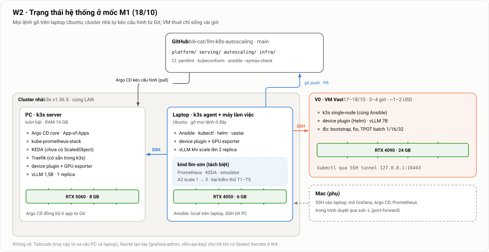

# Hướng dẫn W2 (12–18/10): k3s, Argo CD, giám sát, vLLM qua GitOps, simulator, phiên V0 — mốc M1

> Thuộc [bộ tài liệu đồ án](../mo-ta-chi-tiet-do-an.md#bộ-tài-liệu) · Tuần trước: [W1](w1.md) · Kế hoạch tuần: [Kế hoạch §2](../chi-tiet/06-ke-hoach-quan-ly.md#2-kế-hoạch-từng-tuần) · Checklist mốc: [M1](../chi-tiet/06-ke-hoach-quan-ly.md#m1-1810-nền-tảng-tối-thiểu)

**Tóm tắt nhanh**
- **Đích đến là mốc M1 (18/10):** vLLM chạy trên GPU nhà, **được triển khai bằng Argo CD** từ Git; Prometheus có metric vLLM, GPU, Traefik; simulator trên laptop scale 1 → 3 bằng A2; CI xanh; phiên thuê **V0** đạt; đã chốt cloud; GVHD đã trả lời.
- **Thứ tự dựng:** khung repo → Ansible dựng k3s (PC server + laptop agent) → Argo CD core → các app: GPU, giám sát, KEDA, serving → simulator trên laptop và bài kiểm thử T1–T5 → CI → script Vast + V0.
- **Mọi lệnh chạy trên laptop Ubuntu** (máy làm việc chính, đã chuẩn bị ở [W1 §4](w1.md#4-chuẩn-bị-laptop-máy-làm-việc-chính)), trừ khi ghi rõ "trên PC". Mac chỉ dùng phụ để SSH vào laptop hoặc mở trình duyệt.
- File này có **nội dung đầy đủ** của mọi file cần tạo trong repo. Mỗi khối code bắt đầu bằng dòng `# <đường dẫn>`, chép đúng vào đường dẫn đó.
- Tổng thời gian ước tính **16–22 giờ**. Việc ít quan trọng nhất là CI (§10); nếu chậm, CI có thể trễ sang đầu W3 mà không chặn việc khác.

---

## 0. Bức tranh của tuần



*Hình 19. Trạng thái hệ thống ở mốc M1. Laptop vừa là máy làm việc (chạy Ansible tới PC, tới chính nó và tới VM thuê), vừa là node agent có GPU, vừa chạy cluster simulator kind tách biệt. Cluster nhà tự kéo cấu hình từ GitHub qua Argo CD. VM của V0 chỉ sống vài giờ. Mac chỉ dùng để xem giao diện.*

### 0.1. Lịch gợi ý

| Ngày | Việc | Mục | Giờ |
|---|---|---|---|
| T2 12/10 | Đưa tài liệu vào `main`, quy ước nhánh; khung repo, Makefile, bảng phiên bản | §1, §2 | 2 |
| T3 13/10 | Ansible: dựng k3s trên PC và laptop; lấy kubeconfig về laptop | §3 | 2–3 |
| T4 14/10 | Argo CD core, App-of-Apps; GPU (device plugin + exporter) | §4, §5 | 2–3 |
| T5 15/10 | kube-prometheus-stack, KEDA; vLLM qua Argo CD | §6, §7, §8 | 3 |
| T6 16/10 | Simulator trên laptop + T1–T5. **Hạn GVHD trả lời**: nếu chưa có thì nhắc | §9, §12 | 2–3 |
| T7 17/10 | CI; script Vast; **V0** (3–4 giờ trên máy thuê) | §10, §11 | 4–5 |
| CN 18/10 | Dự phòng cho V0; tìm offer lần 4; **chốt cloud**; rà M1, tag `v0.1`; nhật ký | §11, §12 | 2 |

### 0.2. Điều kiện trước khi bắt đầu

Đã xong ở [W1](w1.md):
- vLLM chạy trên 5060, có digest image;
- laptop đã có Ubuntu, driver, IP tĩnh;
- laptop SSH được tới PC bằng khoá; sudo không mật khẩu trên cả hai máy;
- laptop đã có `git make jq bc docker kubectl helm kind hey ansible argocd vastai gh` và đã clone repo về `~/llm-k8s-autoscaling` ([W1 §4.2–§4.3](w1.md#42-công-cụ)).

**Xem giao diện từ Mac (tuỳ chọn):** các lệnh `port-forward` và `argocd admin dashboard` trong file này mở cổng trên `localhost` của laptop. Nếu laptop có desktop thì mở trình duyệt ngay trên laptop; nếu muốn xem trên Mac thì chuyển tiếp cổng qua SSH: `ssh -L 3000:localhost:3000 -L 8080:localhost:8080 -L 9090:localhost:9090 <SSH_USER>@<LAPTOP_IP>`.

Nếu laptop chưa sẵn sàng, vẫn làm được toàn bộ với một node (PC). Bỏ laptop khỏi inventory ở §3.2, rồi thêm lại sau.

Trong file này dùng các giá trị mẫu sau, **thay bằng giá trị thật** của bạn:

| Ký hiệu | Mẫu | Lấy từ |
|---|---|---|
| `<PC_IP>` | `192.168.1.10` | W1 §1 |
| `<LAPTOP_IP>` | `192.168.1.11` | W1 §4 |
| `<SSH_USER>` | `quang` | user trên Ubuntu |
| Tên MagicDNS của PC | `pc-quang` | W1 §6 |
| IP Tailscale của PC | `100.64.0.10` | W1 §6 |

---

## 1. Git: đưa tài liệu vào `main` và quy ước làm việc

Hiện tại `main` (và `dev`) mới có commit đầu tiên; toàn bộ tài liệu nằm ở nhánh `feat/project-structure`. Argo CD sẽ đọc cấu hình từ `main`, nên `main` phải là nhánh "luôn chạy được" ([Kế hoạch §10.3](../chi-tiet/06-ke-hoach-quan-ly.md#103-quy-ước)).

```bash
# Trên laptop, trong ~/llm-k8s-autoscaling
git push -u origin feat/project-structure
gh pr create --base main --head feat/project-structure \
  --title "docs: design documents v3.0 and W1–W2 guides" --body "Bộ tài liệu thiết kế và hướng dẫn W1, W2."
gh pr merge --merge --delete-branch=false
git switch main && git pull
```

**Bảo vệ nhánh `main`** (GitHub → Settings → Branches → Add rule cho `main`):
- Bật *Require a pull request before merging*. **Required approvals = 0** trong W2.
- Bật *Require status checks to pass*, chọn các job CI sau khi §10 đã chạy lần đầu.

> **Vì sao chưa bắt buộc review ở W2.** Quy ước của nhóm là review trong 48 giờ. Nhưng trong tuần dựng hạ tầng, gần như mỗi bước đều phải merge rồi mới thấy Argo CD sync được hay không. Chờ duyệt sẽ chặn cả tuần. Cách dung hoà: vẫn đi qua PR (để CI chạy và để có lịch sử), Trình review **sau khi merge** và mở issue nếu thấy vấn đề. Từ W3 nâng lên 1 approval.

**Nhánh `dev`:** quy ước chỉ dùng `main` + `feat/*` + `fix/*`, nên xoá `dev` cho đỡ nhầm: `git push origin --delete dev`.

**Board:** tạo GitHub Project với các cột Todo / Doing / Review / Done. Mỗi mục `§` trong file này là một issue. Từ đây, mỗi việc làm trên nhánh riêng, ví dụ `feat/ansible-k3s`, `feat/argocd`, `feat/monitoring`, `feat/serving-home`, `feat/sim`, `feat/ci`, `feat/vast`.

---

## 2. Khung repository

### 2.1. Cấu trúc sau W2

Theo [Kế hoạch §10.2](../chi-tiet/06-ke-hoach-quan-ly.md#102-cấu-trúc-repository), chỉ tạo những gì W2 dùng tới:

```text
llm-k8s-autoscaling/
├── Makefile
├── .gitignore  .yamllint.yaml  .env.example
├── .github/workflows/ci.yaml
├── infra/
│   ├── ansible/
│   │   ├── ansible.cfg  site.yml
│   │   ├── inventory/{home.yaml, group_vars/{all,home,cloud}.yaml}   # cloud.yaml do script sinh
│   │   └── roles/{common, nvidia, k3s-server, k3s-agent, argocd-bootstrap}/
│   ├── kind/kind-config.yaml
│   └── provision/vast.sh
├── platform/
│   ├── argocd/{root-app-home.yaml, apps/home/*.yaml}
│   ├── gpu/{device-plugin-values.yaml, exporter/}
│   ├── kube-prometheus-stack/{values.yaml, values-home.yaml, values-sim.yaml, extras/}
│   └── keda/values.yaml
├── serving/{base/, overlays/{home, cloud, sim}/}
├── autoscaling/
│   ├── official/{base/, overlays/sim/}
│   └── tests/                      # tải và NetworkPolicy cho T1–T5
└── docs/{phien-ban.md, nhat-ky/tuan-02.md, …}
```

**Khác với tài liệu thiết kế ở ba điểm** (ghi vào nhật ký, và sửa tài liệu thiết kế trong một PR riêng):
1. Có thêm overlay **`sim`** cho `serving/` và `autoscaling/official/`, để simulator dùng **đúng** Deployment và ScaledObject như vLLM thật, chỉ khác image và tham số.
2. `autoscaling/official/` tách `base/` + `overlays/`, vì `maxReplicaCount` và `threshold` khác nhau theo môi trường (nhà 2, simulator 3, cloud 4).
3. Ở nhà, cache model dùng **`hostPath` trên từng node** thay cho PVC `model-cache`. PVC `local-path` chỉ gắn được vào **một** node, nên pod vLLM thứ hai chạy trên laptop sẽ bị Pending ([Thông số §9.2](../chi-tiet/00-thong-so.md#92-deployment-vllm) cần sửa theo).

### 2.2. File gốc

```gitignore
# .gitignore
__pycache__/
.venv/
runs/
.env
.vast/
*.kubeconfig
kubeconfig*
infra/ansible/inventory/cloud.yaml
```

```bash
# .env.example
# Chép thành .env (đã gitignore) rồi điền. Không commit .env.
VAST_VM_TEMPLATE=        # hash template VM Ubuntu có driver NVIDIA trên Vast (§11.1)
```

```yaml
# .yamllint.yaml
extends: default
ignore: |
  docs/
  infra/ansible/roles/*/templates/
rules:
  line-length: disable
  document-start: disable
  comments: {min-spaces-from-content: 1}
  truthy: {allowed-values: ["true", "false", "on"], check-keys: false}
  indentation: {spaces: 2, indent-sequences: whatever}
```

```makefile
# Makefile
SHELL := /bin/bash
ANSIBLE_DIR := infra/ansible
KIND_CLUSTER := llm-sim
SIM := --context kind-$(KIND_CLUSTER)
KPS_VERSION := 92.1.1
KEDA_VERSION := 2.21.0
MODE ?= v0

.PHONY: help home-up sim-up sim-down sim-test-load find rent bootstrap release lint

help: ## In danh sách lệnh
	@grep -E '^[a-z-]+:.*## ' $(MAKEFILE_LIST) | awk -F':.*## ' '{printf "  %-16s %s\n", $$1, $$2}'

home-up: ## Dựng k3s + Argo CD trên PC và laptop (Ansible)
	cd $(ANSIBLE_DIR) && ansible-playbook -i inventory/home.yaml site.yml

sim-up: ## Dựng kind + Prometheus + KEDA + simulator + A2 trên laptop
	kind get clusters | grep -qx $(KIND_CLUSTER) || kind create cluster --config infra/kind/kind-config.yaml
	helm repo add prometheus-community https://prometheus-community.github.io/helm-charts --force-update >/dev/null
	helm repo add kedacore https://kedacore.github.io/charts --force-update >/dev/null
	kubectl $(SIM) create namespace monitoring --dry-run=client -o yaml | kubectl $(SIM) apply -f -
	kubectl $(SIM) -n monitoring get secret grafana-admin >/dev/null 2>&1 || \
	  kubectl $(SIM) -n monitoring create secret generic grafana-admin \
	    --from-literal=admin-user=admin --from-literal=admin-password=$$(openssl rand -hex 12)
	helm --kube-context kind-$(KIND_CLUSTER) upgrade --install kps prometheus-community/kube-prometheus-stack \
	  --version $(KPS_VERSION) -n monitoring \
	  -f platform/kube-prometheus-stack/values.yaml -f platform/kube-prometheus-stack/values-sim.yaml \
	  --wait --timeout 10m
	helm --kube-context kind-$(KIND_CLUSTER) upgrade --install keda kedacore/keda \
	  --version $(KEDA_VERSION) -n keda --create-namespace -f platform/keda/values.yaml --wait
	kubectl $(SIM) apply -k serving/overlays/sim
	kubectl $(SIM) -n llm-serving rollout status deploy/vllm --timeout=5m
	kubectl $(SIM) apply -k autoscaling/official/overlays/sim

sim-down: ## Xoá cluster simulator
	kind delete cluster --name $(KIND_CLUSTER)

sim-test-load: ## Tải đồng thời cho T2 (C=25, DUR=120s); cần port-forward ở terminal khác
	hey -z $${DUR:-120s} -c $${C:-25} -m POST -T application/json -D autoscaling/tests/request-sim.json \
	  http://localhost:8000/v1/chat/completions

find: ## Tìm offer Vast: make find MODE=v0|v2
	infra/provision/vast.sh find $(MODE)

rent: ## Thuê offer: make rent OFFER=<id> MODE=v0|v2
	infra/provision/vast.sh rent $(OFFER) $(MODE)
	infra/provision/vast.sh wait

bootstrap: ## Dựng k3s trên VM thuê (Ansible), in thời gian
	infra/provision/vast.sh inventory
	cd $(ANSIBLE_DIR) && time ansible-playbook -i inventory/cloud.yaml site.yml

release: ## Huỷ instance Vast đang thuê
	infra/provision/vast.sh release

lint: ## yamllint, kubectl kustomize, ansible syntax-check
	yamllint -s .
	for d in serving/overlays/* autoscaling/official/overlays/* platform/gpu/exporter platform/kube-prometheus-stack/extras; do \
	  kubectl kustomize $$d >/dev/null || exit 1; done
	cd $(ANSIBLE_DIR) && ansible-playbook -i inventory/home.yaml site.yml --syntax-check

NOT_YET := burnin prefetch capacity run ops-tests backup analysis test
.PHONY: $(NOT_YET)
$(NOT_YET):
	@echo "make $@: chưa làm (xem kế hoạch W3–W5)"; exit 1
```

**Vì sao các lệnh chưa làm vẫn có mặt:** tên lệnh đã cố định trong [Môi trường §3.7](../chi-tiet/05-moi-truong-danh-gia.md#37-tự-động-hoá-bằng-makefile), và đây là "giao diện" giữa các phần. Có tên sẵn (dù trả lỗi) giúp README và kế hoạch luôn khớp với repo.

### 2.3. Bảng phiên bản

**Mục đích:** yêu cầu N8 đòi mọi phiên bản phải được ghim, và [Kiến trúc §2](../chi-tiet/03-kien-truc-autoscaling.md#2-tổng-quan-thành-phần-và-namespace) yêu cầu điền bảng này trong W2. Mọi file khác dùng đúng các giá trị ở đây.

```markdown
<!-- docs/phien-ban.md -->
# Phiên bản đã ghim

Tra ngày 09/10/2026. Đổi phiên bản: sửa ở đây và ở file dùng nó trong cùng một PR.

| Thành phần | Phiên bản | Dùng ở |
|---|---|---|
| Ubuntu (PC, laptop) | 24.04 LTS server | – |
| NVIDIA driver PC / laptop | (điền từ `nvidia-smi`) | – |
| NVIDIA Container Toolkit | (điền từ `nvidia-ctk --version`) | role `nvidia` |
| k3s | `v1.36.5+k3s1` (kênh stable) | `infra/ansible/inventory/group_vars/all.yaml` |
| Argo CD | `v3.5.4` (`core-install.yaml`) | `group_vars/all.yaml` |
| kube-prometheus-stack (chart) | `92.1.1` | `platform/argocd/apps/home/monitoring.yaml`, `Makefile` |
| KEDA (chart) | `2.21.0` | `platform/argocd/apps/home/keda.yaml`, `Makefile` |
| NVIDIA device plugin (chart) | `0.20.1` | `platform/argocd/apps/home/gpu-device-plugin.yaml` |
| nvidia_gpu_exporter | `1.15.1` | `platform/gpu/exporter/daemonset.yaml` |
| vLLM | `vllm/vllm-openai:v0.31.0-cu129@sha256:ff29e51a…eeb` | `serving/base/kustomization.yaml` |
| Model nhà | `Qwen/Qwen2.5-1.5B-Instruct@989aa7980e4cf806f80c7fef2b1adb7bc71aa306` | `serving/overlays/home` |
| Model cloud | `Qwen/Qwen2.5-7B-Instruct@a09a35458c702b33eeacc393d103063234e8bc28` | `serving/overlays/cloud` |
| llm-d-inference-sim | `v0.12.0` | `serving/overlays/sim` |
| kind / node image | `v0.33.0` / `kindest/node:v1.37.0` | laptop |
```

**Vì sao k3s `v1.36.5` mà không phải `v1.37.1`:** kênh `stable` của k3s ngày 09/10/2026 trỏ tới `v1.36.5+k3s1`. Bản minor mới nhất thường được vá nhiều trong vài tuần đầu, và đồ án cần ổn định hơn là tính năng mới. Cluster kind trên laptop dùng 1.37; chênh một minor không ảnh hưởng tới các API mà đồ án dùng.

---

## 3. Ansible: dựng k3s trên PC và laptop

### 3.1. Vì sao dùng Ansible ngay từ ở nhà

Cài k3s bằng một dòng `curl | sh` thì nhanh hơn. Nhưng yêu cầu **F4/N6** đòi dựng lại từ máy trắng bằng vài lệnh, và VM trên Vast (V0, V1, V2) phải được dựng **giống hệt** máy nhà. Viết Ansible một lần, chạy cho cả nhà và cloud:
- Mọi tham số k3s nằm trong Git, không phải trong trí nhớ.
- Chạy lại lần hai không thay đổi gì (idempotent), nên dùng được để "sửa trôi cấu hình".
- V0 thứ Bảy này chính là lần thử đầu tiên cho kịch bản VH5 (dựng lại từ đầu).

Ansible chạy **trên laptop** (*control node*): SSH tới PC, và chạy trực tiếp trên chính laptop (`ansible_connection: local`). PC không cần cài gì thêm ngoài Python có sẵn của Ubuntu.

### 3.2. Inventory và biến

```ini
# infra/ansible/ansible.cfg
[defaults]
roles_path = roles
interpreter_python = auto_silent
callback_result_format = yaml
retry_files_enabled = False

[ssh_connection]
pipelining = True
```

```yaml
# infra/ansible/inventory/home.yaml
all:
  children:
    home:
      children:
        k3s_server:
          hosts:
            pc:
              ansible_host: 192.168.1.10      # <PC_IP>
        k3s_agent:
          hosts:
            laptop:
              ansible_host: 192.168.1.11      # <LAPTOP_IP>; xoá host này nếu chưa có laptop
              ansible_connection: local       # Ansible đang chạy trên chính laptop
              is_laptop: true
      vars:
        ansible_user: quang                   # <SSH_USER>
```

```yaml
# infra/ansible/inventory/group_vars/all.yaml
# Phiên bản: xem docs/phien-ban.md
k3s_version: v1.36.5+k3s1
argocd_version: v3.5.4
repo_url: https://github.com/bi6-cat/llm-k8s-autoscaling.git

# IP mà k3s dùng cho node: IP của card mạng có default route (LAN ở nhà, IP nội bộ trên VM)
node_ip: "{{ ansible_default_ipv4.address }}"
gpu_node: true
is_laptop: false
k3s_kubelet_args: []
k3s_tls_sans: []
argocd_enabled: false

# Kubeconfig lấy về máy chạy Ansible (laptop)
kubeconfig_local_dir: "{{ lookup('env', 'HOME') }}/.kube"
```

```yaml
# infra/ansible/inventory/group_vars/home.yaml
env_name: home
argocd_enabled: true
kubeconfig_name: llm-home
kubeconfig_server: "https://{{ hostvars[groups['k3s_server'][0]].ansible_host }}:6443"
# Tên/IP thêm vào chứng chỉ API server để kubectl qua Tailscale không lỗi chứng chỉ
k3s_tls_sans:
  - pc-quang                # tên MagicDNS của PC
  - 100.64.0.10             # IP Tailscale của PC
```

```yaml
# infra/ansible/inventory/group_vars/cloud.yaml
env_name: cloud
argocd_enabled: false       # V0 triển khai tay; Argo CD trên VM bật từ W4
kubeconfig_name: llm-cloud
kubeconfig_server: https://127.0.0.1:16443   # đi qua SSH tunnel (vast.sh tunnel)
# Lõi CPU riêng cho pod Guaranteed (Môi trường §3.5)
k3s_kubelet_args:
  - cpu-manager-policy=static
  - reserved-cpus=0-3
```

### 3.3. Playbook và các role

```yaml
# infra/ansible/site.yml
- name: Chuẩn bị mọi node
  hosts: all
  become: true
  roles: [common, nvidia]

- name: k3s server
  hosts: k3s_server
  become: true
  roles: [k3s-server]

- name: k3s agent
  hosts: k3s_agent
  become: true
  roles: [k3s-agent]

- name: Argo CD và App-of-Apps
  hosts: k3s_server
  become: true
  roles:
    - role: argocd-bootstrap
      when: argocd_enabled | bool
```

**Role `common`:** những thiết lập hệ điều hành mà Kubernetes cần.

```yaml
# infra/ansible/roles/common/tasks/main.yml
- name: Gói cơ bản
  ansible.builtin.apt:
    name: [curl, jq, ca-certificates, gnupg, chrony, fio]
    update_cache: true
    cache_valid_time: 3600

- name: Tắt swap ngay
  ansible.builtin.command: swapoff -a
  when: ansible_swaptotal_mb > 0
  changed_when: true

- name: Tắt swap vĩnh viễn (comment dòng swap trong fstab)
  ansible.builtin.replace:
    path: /etc/fstab
    regexp: '^([^#].*\sswap\s.*)$'
    replace: '# \1'

- name: Giới hạn inotify đủ cho nhiều pod (Prometheus, Grafana sidecar, kubelet)
  ansible.posix.sysctl:
    name: "{{ item.k }}"
    value: "{{ item.v }}"
    sysctl_file: /etc/sysctl.d/90-k8s.conf
  loop:
    - {k: fs.inotify.max_user_instances, v: "1024"}
    - {k: fs.inotify.max_user_watches, v: "524288"}

- name: Laptop không ngủ khi gập máy
  when: is_laptop | bool
  block:
    - name: logind bỏ qua nắp máy
      ansible.builtin.lineinfile:
        path: /etc/systemd/logind.conf
        regexp: "^#?{{ item }}="
        line: "{{ item }}=ignore"
      loop: [HandleLidSwitch, HandleLidSwitchExternalPower, HandleLidSwitchDocked]
      notify: Restart logind
    - name: Chặn các chế độ ngủ
      ansible.builtin.systemd_service:
        name: "{{ item }}"
        masked: true
      loop: [sleep.target, suspend.target, hibernate.target, hybrid-sleep.target]

- name: Xem ufw có bật không
  ansible.builtin.command: ufw status
  register: ufw_status
  changed_when: false
  failed_when: false

- name: Mở cổng k3s trong LAN (chỉ khi ufw đang bật)
  community.general.ufw:
    rule: allow
    port: "{{ item.port }}"
    proto: "{{ item.proto }}"
  loop:
    - {port: "6443", proto: tcp}    # API server
    - {port: "10250", proto: tcp}   # kubelet (metrics, logs, exec)
    - {port: "8472", proto: udp}    # flannel VXLAN giữa các node
  when: "'Status: active' in ufw_status.stdout"

- name: Thư mục cache model trên VM thuê
  ansible.builtin.file:
    path: /mnt/nvme/cache
    state: directory
    mode: "0755"
  when: env_name == 'cloud'
```

```yaml
# infra/ansible/roles/common/handlers/main.yml
- name: Restart logind
  ansible.builtin.systemd_service:
    name: systemd-logind
    state: restarted
```

**Role `nvidia`:** driver đã cài tay ở W1 (ở nhà) hoặc có sẵn trong template VM (trên Vast). Role chỉ **kiểm tra** driver và cài **Container Toolkit**.

```yaml
# infra/ansible/roles/nvidia/tasks/main.yml
- name: Driver phải chạy được (cài tay ở nhà, có sẵn trong template VM)
  ansible.builtin.command: nvidia-smi --query-gpu=name,driver_version --format=csv,noheader
  register: smi
  changed_when: false

- name: In GPU
  ansible.builtin.debug:
    msg: "{{ inventory_hostname }}: {{ smi.stdout }}"

- name: Khoá ký của kho NVIDIA Container Toolkit
  ansible.builtin.shell: |
    set -o pipefail
    curl -fsSL https://nvidia.github.io/libnvidia-container/gpgkey \
      | gpg --dearmor -o /usr/share/keyrings/nvidia-container-toolkit-keyring.gpg
  args:
    executable: /bin/bash
    creates: /usr/share/keyrings/nvidia-container-toolkit-keyring.gpg

- name: Kho apt của NVIDIA Container Toolkit
  ansible.builtin.copy:
    dest: /etc/apt/sources.list.d/nvidia-container-toolkit.list
    content: |
      deb [signed-by=/usr/share/keyrings/nvidia-container-toolkit-keyring.gpg] https://nvidia.github.io/libnvidia-container/stable/deb/$(ARCH) /
    mode: "0644"

- name: Cài NVIDIA Container Toolkit
  ansible.builtin.apt:
    name: nvidia-container-toolkit
    update_cache: true
  notify: Restart k3s

- name: Toolkit có runtime cho containerd
  ansible.builtin.command: which nvidia-container-runtime
  changed_when: false
```

```yaml
# infra/ansible/roles/nvidia/handlers/main.yml
# k3s chỉ dò nvidia-container-runtime lúc khởi động, nên cài toolkit sau k3s thì phải restart k3s
- name: Restart k3s
  ansible.builtin.shell: |
    if systemctl list-unit-files k3s.service >/dev/null 2>&1; then systemctl restart k3s; fi
    if systemctl list-unit-files k3s-agent.service >/dev/null 2>&1; then systemctl restart k3s-agent; fi
  changed_when: true
```

**Role `k3s-server`:** phần quan trọng nhất là file cấu hình k3s.

```jinja
# infra/ansible/roles/k3s-server/templates/config.yaml.j2
# Quản lý bởi Ansible (role k3s-server). Sửa trong Git, không sửa tay trên máy.
write-kubeconfig-mode: "0644"
node-ip: {{ node_ip }}
tls-san:
  - {{ node_ip }}

  - {{ s }}


node-label:
  - nvidia.com/gpu.present=true

kube-controller-manager-arg:
  - horizontal-pod-autoscaler-sync-period=5s

kubelet-arg:

  - {{ a }}


```

```yaml
# infra/ansible/roles/k3s-server/tasks/main.yml
- name: Thư mục cấu hình k3s
  ansible.builtin.file: {path: /etc/rancher/k3s, state: directory, mode: "0755"}

- name: File cấu hình k3s server
  ansible.builtin.template:
    src: config.yaml.j2
    dest: /etc/rancher/k3s/config.yaml
    mode: "0600"
  register: k3s_config

- name: Phiên bản k3s đang cài (nếu có)
  ansible.builtin.command: k3s --version
  register: k3s_installed
  changed_when: false
  failed_when: false

- name: Tải script cài k3s
  ansible.builtin.get_url:
    url: https://get.k3s.io
    dest: /usr/local/bin/k3s-install.sh
    mode: "0755"

- name: Cài hoặc nâng k3s server
  ansible.builtin.command: /usr/local/bin/k3s-install.sh
  environment:
    INSTALL_K3S_VERSION: "{{ k3s_version }}"
    INSTALL_K3S_EXEC: server
  when: k3s_installed.rc != 0 or k3s_version not in k3s_installed.stdout
  changed_when: true

- name: Áp cấu hình mới nếu file cấu hình đổi
  ansible.builtin.systemd_service: {name: k3s, state: restarted}
  when: k3s_config.changed and k3s_installed.rc == 0 and k3s_version in k3s_installed.stdout

- name: Chờ node Ready
  ansible.builtin.command: k3s kubectl wait node --all --for=condition=Ready --timeout=300s
  changed_when: false

- name: RuntimeClass nvidia phải tồn tại (k3s tạo khi thấy nvidia-container-runtime)
  ansible.builtin.command: k3s kubectl get runtimeclass nvidia
  changed_when: false

- name: Đọc token để agent join
  ansible.builtin.slurp: {src: /var/lib/rancher/k3s/server/node-token}
  register: node_token

- name: Lưu token cho play của agent
  ansible.builtin.set_fact:
    k3s_token: "{{ node_token.content | b64decode | trim }}"

- name: Lấy kubeconfig về máy chạy Ansible
  ansible.builtin.fetch:
    src: /etc/rancher/k3s/k3s.yaml
    dest: "{{ kubeconfig_local_dir }}/{{ kubeconfig_name }}.yaml"
    flat: true

- name: Sửa địa chỉ API server trong kubeconfig
  ansible.builtin.replace:
    path: "{{ kubeconfig_local_dir }}/{{ kubeconfig_name }}.yaml"
    regexp: 'https://127\.0\.0\.1:6443'
    replace: "{{ kubeconfig_server }}"
  delegate_to: localhost
  become: false

- name: Đổi tên cluster/user/context "default" thành tên môi trường
  ansible.builtin.replace:
    path: "{{ kubeconfig_local_dir }}/{{ kubeconfig_name }}.yaml"
    regexp: '(name|cluster|user|current-context): default$'
    replace: '\1: {{ kubeconfig_name }}'
  delegate_to: localhost
  become: false
```

**Role `k3s-agent`:**

```jinja
# infra/ansible/roles/k3s-agent/templates/config.yaml.j2
# Quản lý bởi Ansible (role k3s-agent).
server: https://{{ hostvars[groups['k3s_server'][0]].node_ip }}:6443
token: {{ hostvars[groups['k3s_server'][0]].k3s_token }}
node-ip: {{ node_ip }}

node-label:
  - nvidia.com/gpu.present=true

```

```yaml
# infra/ansible/roles/k3s-agent/tasks/main.yml
- name: Thư mục cấu hình k3s
  ansible.builtin.file: {path: /etc/rancher/k3s, state: directory, mode: "0755"}

- name: File cấu hình k3s agent (chứa token, chỉ root đọc được)
  ansible.builtin.template:
    src: config.yaml.j2
    dest: /etc/rancher/k3s/config.yaml
    mode: "0600"
  register: k3s_config

- name: Phiên bản k3s đang cài (nếu có)
  ansible.builtin.command: k3s --version
  register: k3s_installed
  changed_when: false
  failed_when: false

- name: Tải script cài k3s
  ansible.builtin.get_url:
    url: https://get.k3s.io
    dest: /usr/local/bin/k3s-install.sh
    mode: "0755"

- name: Cài hoặc nâng k3s agent
  ansible.builtin.command: /usr/local/bin/k3s-install.sh
  environment:
    INSTALL_K3S_VERSION: "{{ k3s_version }}"
    INSTALL_K3S_EXEC: agent
  when: k3s_installed.rc != 0 or k3s_version not in k3s_installed.stdout
  changed_when: true

- name: Áp cấu hình mới nếu file cấu hình đổi
  ansible.builtin.systemd_service: {name: k3s-agent, state: restarted}
  when: k3s_config.changed and k3s_installed.rc == 0 and k3s_version in k3s_installed.stdout

- name: Chờ node này Ready (hỏi từ server)
  ansible.builtin.command: k3s kubectl wait node {{ ansible_hostname }} --for=condition=Ready --timeout=300s
  delegate_to: "{{ groups['k3s_server'][0] }}"
  changed_when: false
```

Role `argocd-bootstrap` ở §4.2.

### 3.4. Giải thích các tham số k3s

| Tham số | Vì sao |
|---|---|
| `node-ip` | Máy có nhiều card mạng (LAN, Tailscale, Docker). Không chỉ rõ thì k3s có thể chọn nhầm, khiến flannel giữa hai node không thông |
| `tls-san` | Thêm tên và IP vào chứng chỉ của API server. Thiếu thì `kubectl` qua Tailscale báo `x509: certificate is valid for …` |
| `node-label: nvidia.com/gpu.present=true` | Device plugin của NVIDIA chỉ chạy trên node có nhãn này (hoặc nhãn do NFD gắn). Gắn sẵn lúc join thì không cần cài thêm NFD/GFD, tiết kiệm RAM |
| `horizontal-pod-autoscaler-sync-period=5s` | HPA tính lại mỗi 5 s thay vì 15 s; cùng với scrape 5 s, độ trễ phát hiện tải khoảng 10 s ([Kiến trúc §6](../chi-tiet/03-kien-truc-autoscaling.md#6-vòng-lặp-autoscaling-và-mô-hình-thời-gian)) |
| `write-kubeconfig-mode: 0644` | Đọc được kubeconfig mà không cần sudo (để `fetch` về laptop). Chấp nhận được với máy cá nhân |
| `kubelet-arg` (chỉ cloud) | CPU manager static: pod vLLM có QoS Guaranteed được lõi CPU riêng ([Môi trường §3.5](../chi-tiet/05-moi-truong-danh-gia.md#35-cấu-hình-k3s-và-phân-bổ-cpu-trên-vm-thuê)) |

**Vì sao toolkit phải cài trước k3s:** k3s chỉ tìm `nvidia-container-runtime` trong PATH **lúc khởi động**. Nếu thấy, nó tự thêm runtime vào containerd và tạo RuntimeClass `nvidia`. Thứ tự trong `site.yml` (role `nvidia` trước `k3s-server`) và handler `Restart k3s` đảm bảo điều này.

### 3.5. Chạy và kiểm tra

```bash
# Trên laptop, tại gốc repo
ansible-galaxy collection install ansible.posix community.general   # một lần
ansible -i infra/ansible/inventory/home.yaml all -m ping            # kết nối SSH ổn
ansible-playbook -i infra/ansible/inventory/home.yaml infra/ansible/site.yml --syntax-check
```

Lần đầu, **tạm tắt Argo CD** để kiểm tra k3s riêng: `make home-up` với `-e argocd_enabled=false`, hoặc chạy `cd infra/ansible && ansible-playbook -i inventory/home.yaml site.yml -e argocd_enabled=false`.

```bash
# Dùng kubeconfig vừa lấy về
echo 'export KUBECONFIG=$HOME/.kube/config:$HOME/.kube/llm-home.yaml' >> ~/.bashrc && source ~/.bashrc
kubectl config get-contexts                       # có llm-home (và kind-llm-sim nếu đã tạo)
kubectl --context llm-home get nodes -o wide      # 2 node Ready, INTERNAL-IP là IP LAN
kubectl --context llm-home get nodes -L nvidia.com/gpu.present
kubectl --context llm-home get runtimeclass       # có nvidia
```

**Mạng pod giữa hai node** (bắt buộc kiểm tra, vì laptop chạy cả Docker lẫn k3s; xem [W1 §5.1](w1.md#51-vì-sao-chọn-laptop-làm-máy-simulator-cố-định)):

```bash
K="kubectl --context llm-home"
$K run net-pc --image=busybox:1.37 --restart=Never \
  --overrides='{"spec":{"nodeSelector":{"node-role.kubernetes.io/control-plane":"true"}}}' -- sleep 600
$K run net-laptop --image=busybox:1.37 --restart=Never \
  --overrides='{"spec":{"affinity":{"nodeAffinity":{"requiredDuringSchedulingIgnoredDuringExecution":{"nodeSelectorTerms":[{"matchExpressions":[{"key":"node-role.kubernetes.io/control-plane","operator":"DoesNotExist"}]}]}}}}}' -- sleep 600
$K wait pod net-pc net-laptop --for=condition=Ready --timeout=120s
$K exec net-pc -- ping -c3 "$($K get pod net-laptop -o jsonpath='{.status.podIP}')"   # phải có trả lời
$K delete pod net-pc net-laptop
```

Nếu `ping` không có trả lời: trên laptop chạy `sudo iptables -L FORWARD -n | head -3`. Nếu policy là `DROP` (do Docker), xử lý như ở W1 §5.1.

**Chạy lại lần hai** `ansible-playbook … site.yml -e argocd_enabled=false`: mọi task phải là `ok`, không có `changed` (trừ các task có `changed_when: true` vì được gọi qua handler). Đây là phép kiểm tra tính idempotent.

**Nhập image vLLM sẵn có vào k3s (tuỳ chọn, tiết kiệm khoảng 10 phút tải):** k3s dùng containerd riêng, không thấy image đã kéo bằng Docker ở W1.

```bash
# Trên PC
docker save vllm/vllm-openai:v0.31.0-cu129 | sudo k3s ctr images import -
sudo k3s ctr images ls | grep vllm-openai
```

---

## 4. Argo CD bản core và App-of-Apps

### 4.1. Ý tưởng

- **GitOps:** cluster tự kéo cấu hình từ Git và sửa cho khớp. Không ai `kubectl apply` tay lên cluster nhà nữa (F3). Đổi cấu hình = PR vào `main`.
- **Bản core:** chỉ có application-controller, repo-server, applicationset-controller và redis; **không có** API server, UI và dex. Bản này nhẹ hơn khoảng 300–400 MB RAM, quan trọng với PC 16 GB. Xem UI bằng `argocd admin dashboard`, chạy tạm trên laptop (§4.4).
- **App-of-Apps:** Ansible chỉ áp đúng **một** Application gốc (`root-home`). Application này trỏ vào thư mục `platform/argocd/apps/home/`, nơi mỗi file là một Application con. Thêm một thành phần mới = thêm một file vào thư mục đó.

### 4.2. Role cài Argo CD

```yaml
# infra/ansible/roles/argocd-bootstrap/tasks/main.yml
- name: Namespace argocd
  ansible.builtin.shell: |
    set -o pipefail
    k3s kubectl create namespace argocd --dry-run=client -o yaml | k3s kubectl apply -f -
  args: {executable: /bin/bash}
  changed_when: false

- name: Cài Argo CD bản core (ghim phiên bản)
  ansible.builtin.command: >
    k3s kubectl apply -n argocd --server-side --force-conflicts
    -f https://raw.githubusercontent.com/argoproj/argo-cd/{{ argocd_version }}/manifests/core-install.yaml
  changed_when: true

- name: Chờ các thành phần Argo CD sẵn sàng
  ansible.builtin.command: "{{ item }}"
  loop:
    - k3s kubectl -n argocd wait --for=condition=Available deploy --all --timeout=300s
    - k3s kubectl -n argocd rollout status statefulset/argocd-application-controller --timeout=300s
  changed_when: false

- name: Chép Application gốc lên server
  ansible.builtin.copy:
    src: "{{ playbook_dir }}/../../platform/argocd/root-app-{{ env_name }}.yaml"
    dest: /tmp/root-app.yaml
    mode: "0644"

- name: Áp Application gốc
  ansible.builtin.command: k3s kubectl apply -f /tmp/root-app.yaml
  changed_when: true
```

`--server-side` là bắt buộc: CRD của Argo CD rất lớn, vượt giới hạn 256 KB của annotation `last-applied-configuration` khi apply kiểu thường.

### 4.3. Application gốc và các Application con

Mọi Application có cùng `syncPolicy`. Các lựa chọn được giải thích ngay sau các khối code.

```yaml
# platform/argocd/root-app-home.yaml
apiVersion: argoproj.io/v1alpha1
kind: Application
metadata:
  name: root-home
  namespace: argocd
spec:
  project: default
  source:
    repoURL: https://github.com/bi6-cat/llm-k8s-autoscaling.git
    targetRevision: main
    path: platform/argocd/apps/home
  destination:
    server: https://kubernetes.default.svc
    namespace: argocd
  syncPolicy:
    automated: {prune: true, selfHeal: true}
```

```yaml
# platform/argocd/apps/home/gpu-device-plugin.yaml
apiVersion: argoproj.io/v1alpha1
kind: Application
metadata:
  name: gpu-device-plugin
  namespace: argocd
spec:
  project: default
  sources:
    - repoURL: https://nvidia.github.io/k8s-device-plugin
      chart: nvidia-device-plugin
      targetRevision: 0.20.1
      helm:
        releaseName: nvdp
        valueFiles: [$values/platform/gpu/device-plugin-values.yaml]
    - repoURL: https://github.com/bi6-cat/llm-k8s-autoscaling.git
      targetRevision: main
      ref: values
  destination: {server: https://kubernetes.default.svc, namespace: gpu}
  syncPolicy:
    automated: {prune: true, selfHeal: true}
    syncOptions: [CreateNamespace=true]
    retry: {limit: 10, backoff: {duration: 15s, factor: 2, maxDuration: 5m}}
```

```yaml
# platform/argocd/apps/home/gpu-exporter.yaml
apiVersion: argoproj.io/v1alpha1
kind: Application
metadata:
  name: gpu-exporter
  namespace: argocd
spec:
  project: default
  source:
    repoURL: https://github.com/bi6-cat/llm-k8s-autoscaling.git
    targetRevision: main
    path: platform/gpu/exporter
  destination: {server: https://kubernetes.default.svc, namespace: gpu}
  syncPolicy:
    automated: {prune: true, selfHeal: true}
    syncOptions: [CreateNamespace=true, SkipDryRunOnMissingResource=true]
    retry: {limit: 10, backoff: {duration: 15s, factor: 2, maxDuration: 5m}}
```

```yaml
# platform/argocd/apps/home/monitoring.yaml
apiVersion: argoproj.io/v1alpha1
kind: Application
metadata:
  name: monitoring
  namespace: argocd
spec:
  project: default
  sources:
    - repoURL: https://prometheus-community.github.io/helm-charts
      chart: kube-prometheus-stack
      targetRevision: 92.1.1
      helm:
        releaseName: kps
        valueFiles:
          - $values/platform/kube-prometheus-stack/values.yaml
          - $values/platform/kube-prometheus-stack/values-home.yaml
    - repoURL: https://github.com/bi6-cat/llm-k8s-autoscaling.git
      targetRevision: main
      ref: values
  destination: {server: https://kubernetes.default.svc, namespace: monitoring}
  syncPolicy:
    automated: {prune: true, selfHeal: true}
    syncOptions: [CreateNamespace=true, ServerSideApply=true]
    retry: {limit: 10, backoff: {duration: 15s, factor: 2, maxDuration: 5m}}
```

```yaml
# platform/argocd/apps/home/monitoring-extras.yaml
apiVersion: argoproj.io/v1alpha1
kind: Application
metadata:
  name: monitoring-extras
  namespace: argocd
spec:
  project: default
  source:
    repoURL: https://github.com/bi6-cat/llm-k8s-autoscaling.git
    targetRevision: main
    path: platform/kube-prometheus-stack/extras
  destination: {server: https://kubernetes.default.svc, namespace: monitoring}
  syncPolicy:
    automated: {prune: true, selfHeal: true}
    syncOptions: [SkipDryRunOnMissingResource=true]
    retry: {limit: 10, backoff: {duration: 15s, factor: 2, maxDuration: 5m}}
```

```yaml
# platform/argocd/apps/home/keda.yaml
apiVersion: argoproj.io/v1alpha1
kind: Application
metadata:
  name: keda
  namespace: argocd
spec:
  project: default
  sources:
    - repoURL: https://kedacore.github.io/charts
      chart: keda
      targetRevision: 2.21.0
      helm:
        releaseName: keda
        valueFiles: [$values/platform/keda/values.yaml]
    - repoURL: https://github.com/bi6-cat/llm-k8s-autoscaling.git
      targetRevision: main
      ref: values
  destination: {server: https://kubernetes.default.svc, namespace: keda}
  syncPolicy:
    automated: {prune: true, selfHeal: true}
    syncOptions: [CreateNamespace=true, ServerSideApply=true]
    retry: {limit: 10, backoff: {duration: 15s, factor: 2, maxDuration: 5m}}
```

```yaml
# platform/argocd/apps/home/serving.yaml
apiVersion: argoproj.io/v1alpha1
kind: Application
metadata:
  name: serving
  namespace: argocd
spec:
  project: default
  source:
    repoURL: https://github.com/bi6-cat/llm-k8s-autoscaling.git
    targetRevision: main
    path: serving/overlays/home
  destination: {server: https://kubernetes.default.svc, namespace: llm-serving}
  syncPolicy:
    automated: {prune: true, selfHeal: true}
    syncOptions: [CreateNamespace=true, SkipDryRunOnMissingResource=true]
    retry: {limit: 10, backoff: {duration: 15s, factor: 2, maxDuration: 5m}}
```

**Giải thích các lựa chọn:**

| Lựa chọn | Vì sao |
|---|---|
| `sources` (hai nguồn) với `ref: values` | Chart lấy từ kho Helm chính thức (ghim `targetRevision`), còn file values lấy từ repo của mình qua `$values/…`. Nhờ vậy không phải chép chart vào repo, mà values vẫn nằm trong Git |
| `automated: {prune, selfHeal}` | Git là nguồn sự thật: xoá khỏi Git thì xoá khỏi cluster; ai sửa tay thì Argo CD đưa về như cũ |
| `ServerSideApply=true` (monitoring, keda) | CRD của Prometheus Operator và KEDA quá lớn cho kiểu apply thường (cùng lý do như ở §4.2) |
| `SkipDryRunOnMissingResource=true` + `retry` | `PodMonitor` là CRD do kube-prometheus-stack cài. Nếu app `serving` sync trước khi CRD có mặt thì dry-run báo lỗi. Hai tuỳ chọn này cho phép app chờ rồi tự thử lại, thay vì phải sắp thứ tự bằng tay |
| Không có `replicas` trong Deployment vLLM | Tránh cạm bẫy Argo CD và HPA tranh nhau `replicas` ([Kiến trúc §18.3](../chi-tiet/03-kien-truc-autoscaling.md#183-cạm-bẫy-argo-cd-và-hpa-tranh-nhau-replicas)) |
| `targetRevision: main` | Chỉ những gì đã merge mới lên cluster. Muốn thử một nhánh trước khi merge: `argocd app set serving --revision feat/xyz --core`, thử xong đặt lại `main` |

Repo đang **public** nên Argo CD đọc được mà không cần khoá. Nếu sau này chuyển sang private, phải thêm một Secret repository (deploy key chỉ đọc).

### 4.4. Chạy và xem Argo CD

Chuẩn bị hai Secret **trước** khi bật Argo CD. Đây là bí mật, nên không nằm trong Git; Sealed Secrets sẽ thay cách làm tay này ở W4.

```bash
K="kubectl --context llm-home"
$K create namespace monitoring  --dry-run=client -o yaml | $K apply -f -
$K create namespace llm-serving --dry-run=client -o yaml | $K apply -f -
$K -n monitoring create secret generic grafana-admin \
  --from-literal=admin-user=admin --from-literal=admin-password="$(openssl rand -hex 12)"
$K -n llm-serving create secret generic vllm-api-key --from-literal=key="$(openssl rand -hex 24)"
# Lưu hai mật khẩu vào trình quản lý mật khẩu:
$K -n monitoring  get secret grafana-admin -o jsonpath='{.data.admin-password}' | base64 -d; echo
$K -n llm-serving get secret vllm-api-key  -o jsonpath='{.data.key}' | base64 -d; echo
```

Merge các file ở §4.3, §5, §6, §7, §8 vào `main` (một hoặc vài PR), rồi:

```bash
make home-up                                   # lần này có Argo CD
kubectl --context llm-home -n argocd get applications -w
```

Các app lần lượt chuyển `Synced` / `Healthy` trong khoảng 5–10 phút (lâu nhất là kéo image vLLM). Xem UI:

```bash
kubectl config use-context llm-home
argocd admin dashboard -n argocd               # mở http://localhost:8080
```

---

## 5. GPU trong Kubernetes: device plugin và exporter

**Mục đích:**
- **Device plugin** công bố tài nguyên `nvidia.com/gpu` cho scheduler. Không có nó, pod không xin được GPU và Kubernetes không biết node nào có GPU.
- **Exporter** cho Prometheus metric GPU (utilization, VRAM, nhiệt độ, công suất). Đây là tín hiệu của cấu hình A1 và là các panel GPU trên dashboard.

Hai thành phần được tách riêng thay vì dùng GPU Operator: driver đã có sẵn trên máy, và GPU Operator nặng hơn nhiều so với nhu cầu ([Môi trường §2.4](../chi-tiet/05-moi-truong-danh-gia.md#24-cho-kubernetes-thấy-gpu)).

```yaml
# platform/gpu/device-plugin-values.yaml
# Chart nvidia-device-plugin 0.20.1. Node đã có nhãn nvidia.com/gpu.present=true (gắn lúc join k3s),
# nên affinity mặc định của chart chọn đúng node GPU mà không cần NFD/GFD.
runtimeClassName: nvidia
gfd:
  enabled: false
nfd:
  enabled: false
```

Exporter là DaemonSet viết thẳng (không qua chart), vì chart của `nvidia_gpu_exporter` đã chuyển sang dạng OCI. Viết tay chỉ khoảng 40 dòng và tránh thêm một loại nguồn cho Argo CD.

```yaml
# platform/gpu/exporter/kustomization.yaml
apiVersion: kustomize.config.k8s.io/v1beta1
kind: Kustomization
namespace: gpu
resources:
  - daemonset.yaml
  - podmonitor.yaml
```

```yaml
# platform/gpu/exporter/daemonset.yaml
apiVersion: apps/v1
kind: DaemonSet
metadata:
  name: nvidia-gpu-exporter
  labels: {app: nvidia-gpu-exporter}
spec:
  selector:
    matchLabels: {app: nvidia-gpu-exporter}
  template:
    metadata:
      labels: {app: nvidia-gpu-exporter}
    spec:
      runtimeClassName: nvidia
      nodeSelector:
        nvidia.com/gpu.present: "true"
      securityContext:
        runAsNonRoot: true
        seccompProfile: {type: RuntimeDefault}
      containers:
        - name: exporter
          image: docker.io/utkuozdemir/nvidia_gpu_exporter:1.15.1
          env:
            # Thấy mọi GPU qua runtime NVIDIA mà KHÔNG xin nvidia.com/gpu,
            # nếu không exporter sẽ chiếm luôn GPU của vLLM
            - {name: NVIDIA_VISIBLE_DEVICES, value: all}
            - {name: NVIDIA_DRIVER_CAPABILITIES, value: utility}
          ports:
            - {name: metrics, containerPort: 9835}
          resources:
            requests: {cpu: 20m, memory: 32Mi}
            limits: {memory: 128Mi}
          securityContext:
            allowPrivilegeEscalation: false
            capabilities: {drop: [ALL]}
```

```yaml
# platform/gpu/exporter/podmonitor.yaml
apiVersion: monitoring.coreos.com/v1
kind: PodMonitor
metadata:
  name: nvidia-gpu-exporter
spec:
  selector:
    matchLabels: {app: nvidia-gpu-exporter}
  podMetricsEndpoints:
    - port: metrics
      interval: 5s
```

**Kiểm tra:**

```bash
K="kubectl --context llm-home"
$K -n gpu get pods -o wide                      # mỗi node GPU một pod device plugin và một pod exporter
$K get nodes -o custom-columns=NODE:.metadata.name,GPU:.status.allocatable.nvidia\\.com/gpu   # mỗi node: 1

# Pod thử xin 1 GPU rồi chạy nvidia-smi
$K run gpu-test --rm -it --restart=Never --image=nvidia/cuda:12.9.1-base-ubuntu24.04 \
  --overrides='{"spec":{"runtimeClassName":"nvidia","containers":[{"name":"t","image":"nvidia/cuda:12.9.1-base-ubuntu24.04","command":["nvidia-smi","-L"],"resources":{"limits":{"nvidia.com/gpu":1}}}]}}'

$K -n gpu port-forward ds/nvidia-gpu-exporter 9835 &
curl -s localhost:9835/metrics | grep -E '^nvidia_smi_(utilization_gpu_ratio|memory_used_bytes|temperature_gpu)'
kill %1
```

Nếu node không có `nvidia.com/gpu`, xem log: `$K -n gpu logs ds/nvdp-nvidia-device-plugin`. Lỗi hay gặp nhất là `could not load NVML library`: pod không chạy bằng runtime `nvidia` (kiểm tra `runtimeClassName`, và RuntimeClass `nvidia` đã có chưa).

---

## 6. Giám sát: kube-prometheus-stack

### 6.1. Values

```yaml
# platform/kube-prometheus-stack/values.yaml
# Dùng chung cho home, cloud, sim. Tham số: Thông số §9.4
fullnameOverride: kps
crds:
  enabled: true

# k3s và kind không mở metric của etcd, scheduler, controller-manager, kube-proxy ra ngoài.
# Không tắt thì các target này luôn "down" và sinh cảnh báo giả.
kubeEtcd: {enabled: false}
kubeControllerManager: {enabled: false}
kubeScheduler: {enabled: false}
kubeProxy: {enabled: false}
defaultRules:
  rules:
    etcd: false
    kubeControllerManager: false
    kubeSchedulerAlerting: false
    kubeSchedulerRecording: false
    kubeProxy: false

prometheus:
  prometheusSpec:
    scrapeInterval: 15s        # mặc định cho các target hệ thống; vLLM, GPU, Traefik đặt 5 s riêng
    evaluationInterval: 15s
    # Nhận MỌI PodMonitor/ServiceMonitor/PrometheusRule, không đòi label release=<tên release>
    podMonitorSelectorNilUsesHelmValues: false
    serviceMonitorSelectorNilUsesHelmValues: false
    ruleSelectorNilUsesHelmValues: false
    probeSelectorNilUsesHelmValues: false
    enableAdminAPI: true       # cho phép chụp snapshot TSDB khi kết thúc phiên đánh giá

alertmanager:
  alertmanagerSpec:
    retention: 72h

grafana:
  admin:
    existingSecret: grafana-admin
    userKey: admin-user
    passwordKey: admin-password
  sidecar:
    dashboards:
      enabled: true
      label: grafana_dashboard
      searchNamespace: ALL
  defaultDashboardsTimezone: browser
```

```yaml
# platform/kube-prometheus-stack/values-home.yaml
# PC 16 GB RAM: giới hạn bộ nhớ, retention ngắn, giữ mọi thứ trên node luôn bật (PC)
prometheus:
  prometheusSpec:
    retention: 3d
    retentionSize: 4GB
    resources:
      requests: {cpu: 200m, memory: 1Gi}
      limits: {memory: 2560Mi}
    nodeSelector: {node-role.kubernetes.io/control-plane: "true"}
    storageSpec:
      volumeClaimTemplate:
        spec:
          storageClassName: local-path
          accessModes: [ReadWriteOnce]
          resources: {requests: {storage: 10Gi}}
alertmanager:
  alertmanagerSpec:
    resources:
      requests: {cpu: 10m, memory: 32Mi}
      limits: {memory: 128Mi}
    nodeSelector: {node-role.kubernetes.io/control-plane: "true"}
grafana:
  resources:
    requests: {cpu: 50m, memory: 128Mi}
    limits: {memory: 384Mi}
  nodeSelector: {node-role.kubernetes.io/control-plane: "true"}
prometheusOperator:
  resources:
    requests: {cpu: 50m, memory: 64Mi}
    limits: {memory: 256Mi}
kube-state-metrics:
  resources:
    requests: {cpu: 20m, memory: 64Mi}
    limits: {memory: 192Mi}
```

```yaml
# platform/kube-prometheus-stack/values-sim.yaml
# Cluster kind trên laptop: không cần lưu lâu, không cần ổ bền
prometheus:
  prometheusSpec:
    retention: 1d
    resources:
      requests: {cpu: 100m, memory: 512Mi}
      limits: {memory: 1536Mi}
```

**Giải thích các lựa chọn đáng chú ý:**
- **`*SelectorNilUsesHelmValues: false`**: mặc định, Prometheus chỉ nhận PodMonitor có label `release: kps`. Đây là cạm bẫy ở [Kiến trúc §17.1](../chi-tiet/03-kien-truc-autoscaling.md#171-thu-thập). Tắt đi thì mọi PodMonitor trong cluster đều được nhận, không phải nhớ gắn label.
- **`fullnameOverride: kps`**: tên Service cố định và ngắn, như `kps-prometheus` và `kps-grafana`. ScaledObject của KEDA dùng `prometheus-operated`, Service do Operator tạo, có cùng tên ở mọi môi trường.
- **`nodeSelector` control-plane**: PVC `local-path` gắn chặt với node đã tạo nó. Ghim Prometheus vào PC (luôn bật) để không mất dữ liệu khi laptop tắt.
- **Retention 3 ngày và tối đa 4 GB**: đúng [Thông số §9.4](../chi-tiet/00-thong-so.md#94-giám-sát) cho máy 16 GB RAM. Ở nhà chỉ cần dữ liệu vài ngày để phát triển dashboard và cảnh báo.

### 6.2. Thu metric Traefik

Traefik có sẵn trong k3s (chart 40.x, Traefik 3.7) và đã bật metric Prometheus trên một cổng riêng của pod. Chỉ cần một PodMonitor:

```yaml
# platform/kube-prometheus-stack/extras/kustomization.yaml
apiVersion: kustomize.config.k8s.io/v1beta1
kind: Kustomization
resources:
  - traefik-podmonitor.yaml
```

```yaml
# platform/kube-prometheus-stack/extras/traefik-podmonitor.yaml
apiVersion: monitoring.coreos.com/v1
kind: PodMonitor
metadata:
  name: traefik
  namespace: monitoring
spec:
  namespaceSelector:
    matchNames: [kube-system]
  selector:
    matchLabels: {app.kubernetes.io/name: traefik}
  podMetricsEndpoints:
    - port: metrics
      interval: 5s
```

Trước khi merge, kiểm tra tên cổng thật của pod Traefik:

```bash
kubectl --context llm-home -n kube-system get pod -l app.kubernetes.io/name=traefik \
  -o jsonpath='{range .items[0].spec.containers[0].ports[*]}{.name}={.containerPort}{"\n"}{end}'
# mong đợi có dòng metrics=9100 (hoặc 8082 tuỳ phiên bản chart)
kubectl --context llm-home -n kube-system port-forward deploy/traefik 9100 &
curl -s localhost:9100/metrics | grep -m3 '^traefik_'; kill %1
```

Nếu không có cổng tên `metrics`, đặt `port` trong PodMonitor bằng đúng tên đang có.

### 6.3. Kiểm tra

```bash
kubectl --context llm-home -n monitoring get pods
kubectl --context llm-home -n monitoring port-forward svc/kps-prometheus 9090 &
# mở trình duyệt: http://localhost:9090/targets   # podMonitor/gpu/nvidia-gpu-exporter, podMonitor/monitoring/traefik: UP
kubectl --context llm-home -n monitoring port-forward svc/kps-grafana 3000:80 &
# mở trình duyệt: http://localhost:3000           # đăng nhập admin + mật khẩu trong Secret grafana-admin
```

Truy vấn thử trong Prometheus: `nvidia_smi_utilization_gpu_ratio`, `traefik_entrypoint_requests_total`. `vllm:num_requests_running` sẽ có sau §8.

**Đo RAM thực tế của PC** (rủi ro R27): `kubectl --context llm-home top nodes` và `free -h` trên PC. Ghi lại vào nhật ký. Nếu RAM dùng quá 13 GB khi vLLM đã chạy, giảm `limits` của Prometheus hoặc tắt Grafana trên cluster nhà (xem trực tiếp bằng giao diện của Prometheus).

---

## 7. KEDA

KEDA được cài ở cả cluster nhà lẫn simulator ngay trong W2. Tuy vậy, ở nhà **chưa** có ScaledObject nào: A1 và A2 trên GPU thật là việc của W3. Cài sớm để W3 chỉ còn phải thêm file cấu hình.

```yaml
# platform/keda/values.yaml
# Chart KEDA 2.21.0. Ít tài nguyên vì chỉ có vài ScaledObject.
resources:
  operator:
    requests: {cpu: 50m, memory: 100Mi}
    limits: {memory: 512Mi}
  metricServer:
    requests: {cpu: 50m, memory: 100Mi}
    limits: {memory: 512Mi}
  webhooks:
    requests: {cpu: 10m, memory: 50Mi}
    limits: {memory: 256Mi}
```

Kiểm tra: `kubectl --context llm-home get apiservice v1beta1.external.metrics.k8s.io` phải `Available=True`. Đây là API mà HPA dùng để hỏi KEDA giá trị metric.

---

## 8. vLLM triển khai bằng Argo CD

### 8.1. Base: phần chung cho mọi môi trường

```yaml
# serving/base/kustomization.yaml
apiVersion: kustomize.config.k8s.io/v1beta1
kind: Kustomization
resources:
  - namespace.yaml
  - deployment.yaml
  - service.yaml
  - podmonitor.yaml
images:
  - name: vllm/vllm-openai
    newTag: v0.31.0-cu129
    digest: sha256:ff29e51a9457f191deb332b96fa6440584fa941aa2a548449b604e2b1e5e1eeb   # thay bằng digest bạn ghi ở W1
```

```yaml
# serving/base/namespace.yaml
apiVersion: v1
kind: Namespace
metadata:
  name: llm-serving
```

```yaml
# serving/base/deployment.yaml
apiVersion: apps/v1
kind: Deployment
metadata:
  name: vllm
  namespace: llm-serving
  labels: {app: vllm}
spec:
  # Không đặt replicas: HPA của KEDA quản lý (Kiến trúc §18.3)
  strategy:
    type: RollingUpdate
    rollingUpdate: {maxSurge: 0, maxUnavailable: 1}   # không kẹt khi mọi GPU đã có pod (Vận hành §5)
  progressDeadlineSeconds: 900
  selector:
    matchLabels: {app: vllm}
  template:
    metadata:
      labels: {app: vllm}
    spec:
      runtimeClassName: nvidia
      nodeSelector:
        nvidia.com/gpu.present: "true"
      terminationGracePeriodSeconds: 180       # > preStop 20 s + shutdown-timeout 150 s
      containers:
        - name: vllm
          image: vllm/vllm-openai
          imagePullPolicy: IfNotPresent
          args:                                # overlay thêm model và tham số theo GPU
            - --port=8000
            - --no-enable-prefix-caching
            - --shutdown-timeout=150
          env:
            - name: VLLM_API_KEY               # vLLM tự đọc biến này, khoá không lộ trên dòng lệnh
              valueFrom: {secretKeyRef: {name: vllm-api-key, key: key}}
            - {name: HF_HOME, value: /cache/hf}
            - {name: VLLM_CACHE_ROOT, value: /cache/vllm}
          ports:
            - {name: http, containerPort: 8000}
          resources:
            limits: {nvidia.com/gpu: 1}
          volumeMounts:
            - {name: cache, mountPath: /cache}
            - {name: dshm, mountPath: /dev/shm}
          startupProbe:                        # cho phép khởi động tới 10 phút
            httpGet: {path: /health, port: http}
            periodSeconds: 5
            failureThreshold: 120
          readinessProbe:
            httpGet: {path: /health, port: http}
            periodSeconds: 5
          livenessProbe:
            httpGet: {path: /health, port: http}
            periodSeconds: 10
            failureThreshold: 6
          lifecycle:
            preStop:
              sleep: {seconds: 20}             # chờ Endpoints cập nhật rồi mới gửi SIGTERM
      volumes:
        - name: cache
          emptyDir: {}                         # overlay thay bằng hostPath
        - name: dshm
          emptyDir: {medium: Memory, sizeLimit: 8Gi}
```

```yaml
# serving/base/service.yaml
apiVersion: v1
kind: Service
metadata:
  name: vllm
  namespace: llm-serving
  labels: {app: vllm}
spec:
  selector: {app: vllm}
  ports:
    - {name: http, port: 8000, targetPort: http}
```

```yaml
# serving/base/podmonitor.yaml
apiVersion: monitoring.coreos.com/v1
kind: PodMonitor
metadata:
  name: vllm
  namespace: llm-serving
spec:
  selector:
    matchLabels: {app: vllm}
  podMetricsEndpoints:
    - port: http
      path: /metrics
      interval: 5s
```

**Những điểm khác với manifest mẫu ở [Kiến trúc §3.2](../chi-tiet/03-kien-truc-autoscaling.md#32-manifest-mẫu), và lý do:**

| Điểm | Ở đây | Vì sao |
|---|---|---|
| Khoá API | Biến môi trường `VLLM_API_KEY` | vLLM v0.31 tự đọc biến này (`vllm/envs.py`). Không cần `--api-key=$(VLLM_API_KEY)`, nên khoá không hiện trong `ps` hay trong `kubectl describe` |
| `preStop` | `sleep: {seconds: 20}` (hành động có sẵn của Kubernetes) | Không phụ thuộc image có lệnh `sleep` hay không. Image của simulator không có shell, nên `exec: sleep` sẽ lỗi |
| `runtimeClassName: nvidia` | Có | k3s không đặt runtime NVIDIA làm mặc định. Thiếu dòng này, container không thấy GPU dù đã xin `nvidia.com/gpu` |
| Một volume `cache` | `HF_HOME` và `VLLM_CACHE_ROOT` chung một volume | Giữ cả model lẫn compile cache giữa các lần khởi động (nền của mức L2) |

`/health` và `/metrics` **không** cần khoá API: vLLM chỉ kiểm khoá với đường dẫn bắt đầu bằng `/v1`. Vì vậy probe và Prometheus vẫn hoạt động.

### 8.2. Overlay `home`

```yaml
# serving/overlays/home/kustomization.yaml
apiVersion: kustomize.config.k8s.io/v1beta1
kind: Kustomization
resources:
  - ../../base
  - ingress.yaml
patches:
  - path: patch-vllm.yaml
    target: {kind: Deployment, name: vllm}
```

```yaml
# serving/overlays/home/patch-vllm.yaml
# Giá trị cột "Nhà" ở Thông số §9.1–§9.2. Model 1,5B vừa cả RTX 5060 8 GB và RTX 4050 6 GB.
- op: add
  path: /spec/template/spec/containers/0/args/-
  value: --model=Qwen/Qwen2.5-1.5B-Instruct
- op: add
  path: /spec/template/spec/containers/0/args/-
  value: --revision=989aa7980e4cf806f80c7fef2b1adb7bc71aa306
- op: add
  path: /spec/template/spec/containers/0/args/-
  value: --served-model-name=qwen2.5-1.5b
- op: add
  path: /spec/template/spec/containers/0/args/-
  value: --max-model-len=4096
- op: add
  path: /spec/template/spec/containers/0/args/-
  value: --max-num-seqs=32
- op: add
  path: /spec/template/spec/containers/0/args/-
  value: --gpu-memory-utilization=0.85
- op: replace
  path: /spec/template/spec/containers/0/resources
  value:
    requests: {cpu: "2", memory: 5Gi}
    limits: {nvidia.com/gpu: 1, memory: 8Gi}
# Cache trên ổ của từng node: pod chạy trên PC hay laptop đều có cache riêng
- op: replace
  path: /spec/template/spec/volumes/0
  value:
    name: cache
    hostPath: {path: /var/lib/llm-cache, type: DirectoryOrCreate}
# /dev/shm dạng Memory tính vào giới hạn RAM của pod; 1 GiB là đủ cho 1 GPU
- op: replace
  path: /spec/template/spec/volumes/1
  value:
    name: dshm
    emptyDir: {medium: Memory, sizeLimit: 1Gi}
```

```yaml
# serving/overlays/home/ingress.yaml
# Đường vào qua Traefik có sẵn của k3s. Giới hạn tốc độ (F7) thêm ở W4.
apiVersion: networking.k8s.io/v1
kind: Ingress
metadata:
  name: vllm
  namespace: llm-serving
spec:
  ingressClassName: traefik
  rules:
    - host: llm.home
      http:
        paths:
          - path: /
            pathType: Prefix
            backend:
              service:
                name: vllm
                port: {name: http}
```

**Vì sao dùng JSON patch (`op: add/replace`) chứ không phải patch kiểu "merge":**
- Với danh sách `args`, merge sẽ **thay cả danh sách**, làm mất các tham số chung ở base. JSON patch `add …/args/-` thì nối thêm vào cuối.
- Với `volumes`, merge theo `name` sẽ **giữ** `emptyDir` cũ và **thêm** `hostPath`, tạo ra một volume có hai nguồn, và Kubernetes từ chối volume đó. `replace` theo chỉ số thì thay hẳn.

Đổi lại, JSON patch phụ thuộc thứ tự trong base (`volumes/0` là `cache`, `volumes/1` là `dshm`). Đừng đổi thứ tự trong base mà không sửa các overlay. CI (`kubectl kustomize`) sẽ bắt được lỗi đường dẫn sai.

### 8.3. Triển khai và kiểm tra

Kiểm tra cục bộ trước khi đẩy lên Git:

```bash
kubectl kustomize serving/overlays/home | less          # xem manifest cuối cùng
kubectl kustomize serving/overlays/home | kubectl --context llm-home apply --dry-run=server -f -
```

Merge PR → Argo CD tự sync app `serving` (tối đa 3 phút, hoặc bấm *Refresh* trên dashboard).

```bash
K="kubectl --context llm-home -n llm-serving"
$K get pods -o wide -w                     # ContainerCreating (kéo image) → Running → READY 1/1
$K logs deploy/vllm -f | grep -E 'KV cache size|Maximum concurrency|startup complete'
```

**Gọi API có streaming qua Traefik** (từ laptop, trong LAN):

```bash
KEY=$(kubectl --context llm-home -n llm-serving get secret vllm-api-key -o jsonpath='{.data.key}' | base64 -d)
curl -N --resolve llm.home:80:<PC_IP> http://llm.home/v1/chat/completions \
  -H "Authorization: Bearer $KEY" -H 'Content-Type: application/json' -d '{
  "model":"qwen2.5-1.5b","stream":true,"stream_options":{"include_usage":true},"max_tokens":64,
  "messages":[{"role":"user","content":"Xin chào"}]}'
# Không có khoá → phải bị từ chối
curl -s -o /dev/null -w '%{http_code}\n' --resolve llm.home:80:<PC_IP> http://llm.home/v1/models   # 401
```

**Metric vào Prometheus:** trong Prometheus, chạy `vllm:num_requests_running{namespace="llm-serving"}`; target `podMonitor/llm-serving/vllm/0` phải UP.

**So tốc độ với Docker ở W1** (để chắc cấu hình pod không làm chậm, ví dụ do thiếu `/dev/shm`):

```bash
$K exec deploy/vllm -- env OPENAI_API_KEY=$KEY vllm bench serve --backend openai-chat \
  --base-url http://localhost:8000 --endpoint /v1/chat/completions \
  --model qwen2.5-1.5b --tokenizer Qwen/Qwen2.5-1.5B-Instruct \
  --dataset-name random --random-input-len 512 --random-output-len 256 --ignore-eos \
  --max-concurrency 8 --num-prompts 64
```

TTFT và TPOT phải gần với số đo ở W1 (lệch ±10%).

**Thử GitOps thật sự hoạt động** (một phần của F3):
1. `$K delete deploy vllm` → Argo CD tạo lại trong vòng vài giây (`selfHeal`).
2. Sửa tay `kubectl edit` một tham số → Argo CD đưa về như trong Git.
3. Đổi `--max-num-seqs=32` thành `16` qua một PR → sau khi merge, pod được thay bằng bản mới. Xong thì revert PR.

Ghi kết quả ba thử nghiệm vào nhật ký: đây là tư liệu cho chương 4.

**Với 2 GPU (PC + laptop):** Deployment chưa có HPA nên mặc định 1 replica. Thử nhanh 2 replica: `$K scale deploy/vllm --replicas=2`, xem pod thứ hai lên trên laptop (`-o wide`), rồi `--replicas=1`. Argo CD không đưa về vì Git không có trường `replicas`.

---

## 9. Simulator trên laptop và bài kiểm thử T1–T5

### 9.1. File cho simulator

```yaml
# infra/kind/kind-config.yaml
kind: Cluster
apiVersion: kind.x-k8s.io/v1alpha4
name: llm-sim
nodes:
  - role: control-plane
    kubeadmConfigPatches:
      - |
        kind: ClusterConfiguration
        controllerManager:
          extraArgs:
            - name: horizontal-pod-autoscaler-sync-period
              value: "5s"
  - role: worker
  - role: worker
```

```yaml
# serving/overlays/sim/kustomization.yaml
apiVersion: kustomize.config.k8s.io/v1beta1
kind: Kustomization
resources:
  - ../../base
patches:
  - path: patch-sim.yaml
    target: {kind: Deployment, name: vllm}
```

```yaml
# serving/overlays/sim/patch-sim.yaml
# Cùng Deployment, Service, PodMonitor với vLLM thật; chỉ đổi image và tham số.
- op: replace
  path: /spec/template/spec/containers/0/image
  value: ghcr.io/llm-d/llm-d-inference-sim:v0.12.0
- op: replace
  path: /spec/template/spec/containers/0/args
  value:
    - --model=qwen2.5-1.5b
    - --served-model-name=qwen2.5-1.5b
    - --port=8000
    - --force-dummy-tokenizer
    - --max-num-seqs=16
    - --max-model-len=4096
    - --time-to-first-token=200ms
    - --inter-token-latency=50ms
- op: remove
  path: /spec/template/spec/runtimeClassName
- op: remove
  path: /spec/template/spec/nodeSelector
- op: replace
  path: /spec/template/spec/terminationGracePeriodSeconds
  value: 60
- op: replace
  path: /spec/template/spec/containers/0/env
  value:
    - name: POD_NAME
      valueFrom: {fieldRef: {fieldPath: metadata.name}}
    - name: POD_NAMESPACE
      valueFrom: {fieldRef: {fieldPath: metadata.namespace}}
- op: replace
  path: /spec/template/spec/containers/0/resources
  value:
    requests: {cpu: 50m, memory: 64Mi}
    limits: {memory: 256Mi}
- op: remove
  path: /spec/template/spec/containers/0/volumeMounts
- op: remove
  path: /spec/template/spec/volumes
# Simulator báo "chưa sẵn sàng" qua /health/ready (giả lập thời gian nạp model khi có --startup-duration)
- op: replace
  path: /spec/template/spec/containers/0/startupProbe/httpGet/path
  value: /health/ready
- op: replace
  path: /spec/template/spec/containers/0/readinessProbe/httpGet/path
  value: /health/ready
```

```yaml
# autoscaling/official/base/kustomization.yaml
apiVersion: kustomize.config.k8s.io/v1beta1
kind: Kustomization
resources:
  - scaledobject-a2.yaml
```

```yaml
# autoscaling/official/base/scaledobject-a2.yaml
# A2: tổng số request đồng thời (running + waiting). Kiến trúc §13.2, Thông số §9.3.
apiVersion: keda.sh/v1alpha1
kind: ScaledObject
metadata:
  name: vllm-a2
  namespace: llm-serving
  labels: {experiment/config: A2}
spec:
  scaleTargetRef: {name: vllm}
  minReplicaCount: 1
  maxReplicaCount: 4
  pollingInterval: 5
  fallback: {failureThreshold: 3, replicas: 4}
  advanced:
    horizontalPodAutoscalerConfig:
      behavior:
        scaleDown:
          stabilizationWindowSeconds: 300
          policies: [{type: Pods, value: 1, periodSeconds: 60}]
  triggers:
    - type: prometheus
      metricType: AverageValue
      metadata:
        serverAddress: http://prometheus-operated.monitoring.svc:9090
        query: |
          (sum(vllm:num_requests_running{namespace="llm-serving"}) or vector(0))
          + (sum(vllm:num_requests_waiting{namespace="llm-serving"}) or vector(0))
        threshold: "24"          # tạm; chốt ở ADR-003
```

```yaml
# autoscaling/official/overlays/sim/kustomization.yaml
apiVersion: kustomize.config.k8s.io/v1beta1
kind: Kustomization
resources:
  - ../../base
patches:
  - target: {kind: ScaledObject, name: vllm-a2}
    patch: |
      - op: replace
        path: /spec/maxReplicaCount
        value: 3
      - op: replace
        path: /spec/fallback/replicas
        value: 3
      - op: replace
        path: /spec/triggers/0/metadata/threshold
        value: "10"
```

```json
// autoscaling/tests/request-sim.json   (xoá dòng chú thích này khi tạo file: JSON không có comment)
{"model": "qwen2.5-1.5b", "max_tokens": 200, "messages": [{"role": "user", "content": "Xin chào"}]}
```

```yaml
# autoscaling/tests/t4-block-keda-to-prometheus.yaml
# T4: chặn KEDA gọi Prometheus để thử fallback. Chỉ dùng trên simulator; xoá ngay sau khi thử.
apiVersion: networking.k8s.io/v1
kind: NetworkPolicy
metadata:
  name: t4-block-keda
  namespace: monitoring
spec:
  podSelector:
    matchLabels: {app.kubernetes.io/name: prometheus}
  policyTypes: [Ingress]
  ingress:
    - from:
        - namespaceSelector:
            matchExpressions:
              - {key: kubernetes.io/metadata.name, operator: NotIn, values: [keda]}
```

**Vì sao threshold của simulator là 10:** mỗi pod simulator xử lý tối đa 16 request cùng lúc (`--max-num-seqs=16`). Target bằng khoảng 0,6 lần năng lực, để T2 dễ tính tay: 25 request đồng thời → ⌈25 / 10⌉ = **3** replica. Ở nhà và trên cloud, threshold sẽ lấy từ đo năng lực (W3, V2), không phải số này.

### 9.2. Dựng

```bash
make sim-up                                   # 5–8 phút lần đầu (kéo image)
kubectl --context kind-llm-sim -n llm-serving get pods,scaledobject,hpa
```

Kết quả mong đợi: 1 pod `vllm-…` Ready; `scaledobject/vllm-a2` có `READY=True`; HPA `keda-hpa-vllm-a2` có `TARGETS 0/10 (avg)`.

### 9.3. Các bài kiểm thử

Mở ba terminal trên laptop. Mọi lệnh dùng context `kind-llm-sim`:

```bash
kubectl config use-context kind-llm-sim
# Terminal 1: theo dõi số replica, kèm giờ (để đo thời gian)
while true; do echo "$(date +%T) desired=$(kubectl -n llm-serving get hpa keda-hpa-vllm-a2 -o jsonpath='{.status.desiredReplicas}') \
ready=$(kubectl -n llm-serving get deploy vllm -o jsonpath='{.status.readyReplicas}') \
metric=$(kubectl -n llm-serving get hpa keda-hpa-vllm-a2 -o jsonpath='{.status.currentMetrics[0].external.current.averageValue}')"; sleep 5; done
# Terminal 2: đường vào cho máy tạo tải
kubectl -n llm-serving port-forward svc/vllm 8000:8000
# Terminal 3: chạy các bài
```

| Bài | Thao tác (terminal 3) | Đạt khi |
|---|---|---|
| **T1** Không tải | Không làm gì trong 2 phút | `desired=1`, `metric=0` |
| **T2** Tải 2,5 × threshold | `make sim-test-load C=25 DUR=180s` | `desired=3` trong **≤ 15 s** kể từ lúc bắt đầu tải; `kubectl -n llm-serving get hpa keda-hpa-vllm-a2 -o yaml` có `currentMetrics` ≈ 25 ÷ số replica |
| **T3** Tắt tải | Chờ `hey` kết thúc | Giữ 3 replica **300 s** (cửa sổ ổn định), rồi giảm 3 → 2 → 1, mỗi bước cách **60 s** |
| **T4** Mất Prometheus | `kubectl apply -f autoscaling/tests/t4-block-keda-to-prometheus.yaml` | Sau khoảng 3 lần lỗi (15–30 s), số replica lên **3** (fallback); `kubectl -n llm-serving get so vllm-a2 -o jsonpath='{.status.health}'` thấy `numberOfFailures` tăng. Xong: `kubectl delete -f …` và replica tự giảm như T3 |
| **T5** Tạm dừng autoscaling | `kubectl -n llm-serving annotate so vllm-a2 autoscaling.keda.sh/paused-replicas="1"` rồi `make sim-test-load C=25 DUR=60s` | Giữ đúng **1** replica dù có tải. Bỏ tạm dừng: `kubectl -n llm-serving annotate so vllm-a2 autoscaling.keda.sh/paused-replicas-` |

**Giải thích để hiểu khi đọc kết quả:**
- **T2 cần ≤ 15 s:** KEDA hỏi Prometheus; Prometheus có số liệu mới nhất sau tối đa 5 s (chu kỳ scrape); HPA tính lại sau tối đa 5 s (chu kỳ sync). Tổng khoảng 10 s cộng thời gian tạo pod simulator (vài giây). Nếu mất khoảng 30 s, gần như chắc chắn chu kỳ sync HPA chưa phải 5 s (xem lại `kind-config.yaml`).
- **`metricType: AverageValue`:** HPA so `tổng ÷ số replica` với threshold, nên desired = ⌈tổng ÷ threshold⌉. Khi đã lên 3 replica, `metric` hiển thị khoảng 25 ÷ 3 ≈ 8,3.
- **Giới hạn của cách bơm tải này:** `kubectl port-forward svc/…` chỉ chuyển tới **một** pod, nên toàn bộ tải dồn vào pod đầu tiên và các pod mới không nhận request. Tín hiệu A2 vẫn đúng, vì đó là tổng của mọi pod, nên T1–T5 vẫn hợp lệ. Máy tạo tải thật (W3) chạy **trong** cluster và đi qua Service, nên tải được chia đều.
- **T4 không thấy fallback?** Có thể CNI của kind không thực thi NetworkPolicy. Kiểm tra: `kubectl -n keda exec deploy/keda-operator -- wget -qO- -T 3 http://prometheus-operated.monitoring.svc:9090/-/ready`; lệnh này phải bị timeout khi policy đang bật. Nếu vẫn gọi được, làm T4 theo cách khác: sửa `serverAddress` của ScaledObject thành một địa chỉ sai (`kubectl edit`), rồi sửa lại.

Ghi kết quả từng bài (thời điểm, số replica, ảnh chụp terminal 1) vào nhật ký. **T6, T7 làm ở W3** (cần A1 trên GPU nhà, và A4).

`make sim-down` khi xong để trả RAM cho laptop (node agent cần RAM khi pod vLLM chạy trên nó). Lần sau `make sim-up` dựng lại từ đầu.

---

## 10. CI (GitHub Actions)

**Mục đích:** mọi PR đều được kiểm tra tự động: YAML hợp lệ, Kustomize build được, manifest đúng schema của Kubernetes và các CRD, playbook Ansible không lỗi cú pháp. Lỗi bị bắt **trước** khi Argo CD cố áp nó lên cluster nhà.

```yaml
# .github/workflows/ci.yaml
name: ci
on:
  pull_request:
  push:
    branches: [main]

jobs:
  yaml:
    runs-on: ubuntu-24.04
    steps:
      - uses: actions/checkout@v7
      - run: pipx install yamllint && yamllint -s .

  manifests:
    runs-on: ubuntu-24.04
    steps:
      - uses: actions/checkout@v7
      - name: Cài kubeconform
        run: curl -sSL https://github.com/yannh/kubeconform/releases/download/v0.8.0/kubeconform-linux-amd64.tar.gz | sudo tar xz -C /usr/local/bin kubeconform
      - name: kustomize build + kubeconform
        run: |
          set -euo pipefail
          CRDS='https://raw.githubusercontent.com/datreeio/CRDs-catalog/main/{{.Group}}/{{.ResourceKind}}_{{.ResourceAPIVersion}}.json'
          for d in serving/overlays/* autoscaling/official/overlays/* platform/gpu/exporter platform/kube-prometheus-stack/extras; do
            echo "== $d"
            kubectl kustomize "$d" | kubeconform -strict -summary -schema-location default -schema-location "$CRDS"
          done
          echo "== platform/argocd"
          kubeconform -strict -summary -schema-location default -schema-location "$CRDS" platform/argocd

  ansible:
    runs-on: ubuntu-24.04
    steps:
      - uses: actions/checkout@v7
      - run: pipx install --include-deps ansible
      - run: ansible-galaxy collection install ansible.posix community.general
      - run: cd infra/ansible && ansible-playbook -i inventory/home.yaml site.yml --syntax-check

  docs:
    runs-on: ubuntu-24.04
    steps:
      - uses: actions/checkout@v7
      - uses: lycheeverse/lychee-action@v2
        with:
          args: --offline --no-progress 'docs/**/*.md' README.md
```

| Job | Bắt được lỗi gì |
|---|---|
| `yaml` | Thụt lề sai, khoá trùng, cú pháp YAML |
| `manifests` | Đường dẫn JSON patch sai (`kustomize build` lỗi); trường không tồn tại trong Deployment, PodMonitor, ScaledObject, Application (nhờ schema CRD từ CRDs-catalog) |
| `ansible` | Lỗi cú pháp playbook, role không tồn tại |
| `docs` | Link tới file không tồn tại trong `docs/` |

> **Job `docs` sẽ đỏ ngay lần đầu:** các tài liệu thiết kế đang link tới `docs/adr/004-…`, `docs/adr/005-…` và `docs/review/`, nhưng các file này **chưa có trong repo**. Đưa chúng vào repo (hoặc sửa link) rồi mới bật job này làm *required check*. Các job còn lại cần xanh ngay.

Sau lần chạy đầu tiên, vào branch protection của `main` và chọn `yaml`, `manifests`, `ansible` làm required checks (§1).

---

## 11. Thuê VM trên Vast và phiên V0 (17–18/10)

### 11.1. Mục tiêu của V0

V0 là phiên "khói" (smoke test): thuê **1 × RTX 4090 chế độ VM** trong 3–4 giờ, khoảng 1–2 USD ([Môi trường §6.1](../chi-tiet/05-moi-truong-danh-gia.md#61-bảng-phiên)). V0 trả lời bốn câu hỏi trước khi bỏ tiền thật cho V2:
1. VM của Vast có chạy được k3s có GPU, bằng **đúng Ansible** của nhà không? (R3, F4)
2. vLLM 7B có chạy trên 4090 với cùng image đã ghim không?
3. Ổ đĩa đọc có ≥ 1 GB/s không (cold start L2, N2a)?
4. TPOT của 7B ở batch 1/16/32 có dưới SLO 100 ms không (để biết SLO hợp lý trước V2)?

Phụ: đo thời gian `make bootstrap` (bản nháp của VH5) và quen quy trình thuê → dựng → đo → huỷ.

### 11.2. Script thuê và huỷ

Chỉ file này phụ thuộc Vast. Nếu chuyển sang GCP, chỉ viết lại file này ([Môi trường §3.7](../chi-tiet/05-moi-truong-danh-gia.md#37-tự-động-hoá-bằng-makefile)).

```bash
# infra/provision/vast.sh
#!/usr/bin/env bash
# Thuê, kết nối và huỷ VM GPU trên Vast.ai. Chỉ file này phụ thuộc nhà cung cấp.
# Dùng: vast.sh find v0|v2 | rent <offer_id> v0|v2 | wait | inventory | ssh | tunnel | status | release
set -euo pipefail
cd "$(dirname "$0")/../.."
STATE=.vast
mkdir -p "$STATE"
if [ -f .env ]; then set -a; . ./.env; set +a; fi

query() {
  case "$1" in
    v0) echo 'num_gpus=1 gpu_name=RTX_4090 vms_enabled=true rentable=true reliability>0.98 cpu_cores_effective>=12 cpu_ram>=48 disk_space>=150 inet_down>=500' ;;
    v2) echo 'num_gpus=4 gpu_name=RTX_4090 vms_enabled=true rentable=true reliability>0.98 cpu_cores_effective>=32 cpu_ram>=128 disk_space>=300 disk_bw>=1000 inet_down>=500 dph_total<=2.0' ;;
    *) echo "MODE phải là v0 hoặc v2" >&2; exit 2 ;;
  esac
}
disk_gb() { if [ "$1" = v2 ]; then echo 300; else echo 150; fi; }
instance_id() { cat "$STATE/instance_id" 2>/dev/null || { echo "Chưa có instance (.vast/instance_id)" >&2; exit 1; }; }
ssh_target() {   # in "host port" từ ssh://root@host:port
  vastai ssh-url "$(instance_id)" | sed -E 's#ssh://[^@]+@([^:]+):([0-9]+).*#\1 \2#'
}

cmd_find() {
  vastai search offers "$(query "${1:?v0|v2}")" -o 'dph_total' --raw | jq -r '.[:5][] |
    "\(.id)\t\(.num_gpus)x\(.gpu_name)\t$\(.dph_total*100|round/100)/h\trel=\((.reliability2 // .reliability)*100|round)%\tcpu=\(.cpu_cores_effective)\tram=\(.cpu_ram/1024|round)GB\tdisk_bw=\(.disk_bw|round)MB/s\t\(.geolocation)"'
}

cmd_rent() {
  local offer=${1:?offer id} mode=${2:?v0|v2}
  : "${VAST_VM_TEMPLATE:?Đặt VAST_VM_TEMPLATE trong .env}"
  if [ -f "$STATE/instance_id" ]; then echo "Đang có instance $(cat "$STATE/instance_id"); chạy release trước." >&2; exit 1; fi
  vastai create instance "$offer" --template_hash "$VAST_VM_TEMPLATE" --disk "$(disk_gb "$mode")" \
    --ssh --direct --label "llm-thesis-$mode" --raw | jq -r '.new_contract' > "$STATE/instance_id"
  echo "$mode" > "$STATE/mode"
  date -u +%s > "$STATE/rented_at"
  echo "Đã tạo instance $(cat "$STATE/instance_id")"
}

cmd_wait() {
  local id st; id=$(instance_id)
  for _ in $(seq 1 90); do
    st=$(vastai show instance "$id" --raw | jq -r '.actual_status')
    echo "$(date +%T) $st"
    [ "$st" = running ] && break
    sleep 20
  done
  read -r host port < <(ssh_target)
  until ssh -o StrictHostKeyChecking=accept-new -o ConnectTimeout=5 -p "$port" "root@$host" true 2>/dev/null; do
    echo "$(date +%T) chờ SSH…"; sleep 10
  done
  echo "SSH sẵn sàng: ssh -p $port root@$host"
}

cmd_inventory() {
  local host port; read -r host port < <(ssh_target)
  cat > infra/ansible/inventory/cloud.yaml <<EOF
# Sinh bởi infra/provision/vast.sh — không commit (đã gitignore)
all:
  children:
    cloud:
      children:
        k3s_server:
          hosts:
            vast-$(instance_id):
              ansible_host: $host
              ansible_port: $port
              ansible_user: root
      vars:
        ansible_ssh_common_args: "-o StrictHostKeyChecking=accept-new"
EOF
  echo "Đã ghi infra/ansible/inventory/cloud.yaml"
}

cmd_ssh() { local host port; read -r host port < <(ssh_target); exec ssh -p "$port" "root@$host"; }

cmd_tunnel() {   # kubectl --context llm-cloud đi qua đường hầm này
  local host port; read -r host port < <(ssh_target)
  echo "Tunnel 127.0.0.1:16443 → API server của VM (Ctrl-C để đóng)"
  exec ssh -N -L 16443:127.0.0.1:6443 -p "$port" "root@$host"
}

cmd_status() {
  vastai show instance "$(instance_id)" --raw | jq '{id, actual_status, gpu_name, num_gpus, dph_total, public_ipaddr}'
  vastai show user --raw | jq '{credit}'
}

cmd_release() {
  local id dph start hours; id=$(instance_id)
  dph=$(vastai show instance "$id" --raw | jq -r '.dph_total')
  start=$(cat "$STATE/rented_at"); hours=$(echo "scale=2; ($(date -u +%s) - $start) / 3600" | bc)
  read -r -p "Huỷ instance $id? Dữ liệu trên VM sẽ mất. Gõ yes: " ok
  [ "$ok" = yes ] || exit 1
  vastai destroy instance "$id"
  echo "$(date -u +%FT%TZ) instance=$id mode=$(cat "$STATE/mode") hours=$hours dph=$dph cost≈$(echo "$hours * $dph" | bc)" \
    | tee -a "$STATE/cost.log"
  rm -f "$STATE/instance_id" "$STATE/mode" "$STATE/rented_at"
}

"cmd_${1:?lệnh: find|rent|wait|inventory|ssh|tunnel|status|release}" "${@:2}"
```

`chmod +x infra/provision/vast.sh`. Ghi chú về thiết kế:
- **Trạng thái nằm trong `.vast/`** (gitignore): `instance_id`, giờ bắt đầu thuê, và `cost.log` tích luỹ. Script **từ chối thuê máy thứ hai** khi chưa huỷ máy cũ. Đây là cách rẻ nhất để không quên một instance đang tính tiền.
- **`release` tính chi phí** theo giờ thực tế × giá, và ghi vào `cost.log`. Từ W4, `release` sẽ kiểm tra backup trước khi huỷ ([R13](../chi-tiet/06-ke-hoach-quan-ly.md#92-sổ-đăng-ký-rủi-ro)).
- **`tunnel`:** API server của VM không mở ra Internet. `kubectl` trên laptop đi qua SSH tunnel tới `127.0.0.1:16443`, đúng với `kubeconfig_server` trong `group_vars/cloud.yaml`.

**Chọn template VM (một lần):** trên console.vast.ai → *Templates*, lọc loại **VM**, chọn template Ubuntu (22.04 hoặc 24.04) có sẵn driver NVIDIA và CUDA. Mở template, chép **template hash** vào `.env` (`VAST_VM_TEMPLATE=…`). Ghi tên template và phiên bản driver của nó vào `docs/phien-ban.md`. Driver phải ≥ 575 để chạy image `-cu129`.

### 11.3. Quy trình V0

Trước ngày thuê: nạp tối thiểu khoảng **10 USD** nếu số dư bằng 0 (`vastai show user`). Ghi số tiền nạp vào nhật ký chi phí.

```bash
# 1) Chọn máy và thuê (bấm giờ từ đây)
make find MODE=v0
make rent OFFER=<id> MODE=v0                     # tạo instance + chờ tới khi SSH được

# 2) Dựng k3s bằng đúng Ansible của nhà; `time` in tổng thời gian (bản nháp VH5)
make bootstrap

# 3) Mở tunnel ở một terminal riêng, rồi dùng kubectl như với cluster nhà
infra/provision/vast.sh tunnel
export KUBECONFIG=$HOME/.kube/config:$HOME/.kube/llm-home.yaml:$HOME/.kube/llm-cloud.yaml
C="kubectl --context llm-cloud"
$C get nodes -o wide; $C get runtimeclass

# 4) GPU: cài device plugin bằng Helm (V0 chưa có Argo CD trên VM)
helm repo add nvdp https://nvidia.github.io/k8s-device-plugin --force-update
helm --kube-context llm-cloud install nvdp nvdp/nvidia-device-plugin --version 0.20.1 \
  -n gpu --create-namespace -f platform/gpu/device-plugin-values.yaml --wait
$C get nodes -o custom-columns=NODE:.metadata.name,GPU:.status.allocatable.nvidia\\.com/gpu    # 1
```

```bash
# 5) Thông số máy và tốc độ đọc ổ (chạy trên VM)
infra/provision/vast.sh ssh
nvidia-smi -q | grep -iE "product name|driver version|cuda version|link (gen|width)|max clocks" -A1 | tee ~/v0-gpu.txt
nproc; free -g; df -h /mnt/nvme
fio --name=seqread --rw=read --bs=1M --size=8G --filename=/mnt/nvme/fio.tmp \
    --direct=1 --ioengine=libaio --iodepth=16 --group_reporting | grep -E 'READ:|bw='
rm /mnt/nvme/fio.tmp; exit
```

Overlay `cloud` tối thiểu cho V0. W3 sẽ hoàn thiện overlay này (Traefik route cho máy tạo tải), W4 thêm prefetch model (L2).

```yaml
# serving/overlays/cloud/kustomization.yaml
apiVersion: kustomize.config.k8s.io/v1beta1
kind: Kustomization
resources:
  - ../../base
patches:
  - path: patch-vllm.yaml
    target: {kind: Deployment, name: vllm}
```

```yaml
# serving/overlays/cloud/patch-vllm.yaml
# Giá trị cột "Cloud" ở Thông số §9.1–§9.2. V0: model tải từ Hugging Face lần đầu (mức L0).
- op: add
  path: /spec/template/spec/containers/0/args/-
  value: --model=Qwen/Qwen2.5-7B-Instruct
- op: add
  path: /spec/template/spec/containers/0/args/-
  value: --revision=a09a35458c702b33eeacc393d103063234e8bc28
- op: add
  path: /spec/template/spec/containers/0/args/-
  value: --served-model-name=qwen2.5-7b
- op: add
  path: /spec/template/spec/containers/0/args/-
  value: --max-model-len=8192
- op: add
  path: /spec/template/spec/containers/0/args/-
  value: --max-num-seqs=64
- op: add
  path: /spec/template/spec/containers/0/args/-
  value: --gpu-memory-utilization=0.90
- op: replace
  path: /spec/template/spec/containers/0/resources
  value:                                   # QoS Guaranteed: requests = limits, CPU nguyên
    requests: {cpu: "6", memory: 24Gi, nvidia.com/gpu: 1}
    limits: {cpu: "6", memory: 24Gi, nvidia.com/gpu: 1}
- op: replace
  path: /spec/template/spec/volumes/0
  value:
    name: cache
    hostPath: {path: /mnt/nvme/cache, type: Directory}
```

```bash
# 6) vLLM 7B: Secret khoá API, rồi apply (V0 apply tay; từ W4 qua Argo CD)
$C create namespace llm-serving
$C -n llm-serving create secret generic vllm-api-key --from-literal=key="$(openssl rand -hex 24)"
date +%T; $C apply -k serving/overlays/cloud
$C -n llm-serving get pods -w            # ghi giờ: Pending → ContainerCreating → Running → Ready
$C -n llm-serving logs deploy/vllm -f | grep -E 'Loading|KV cache size|Maximum concurrency|startup complete'
```

**Ghi lại thời gian từng pha** của lần khởi động đầu tiên (L0): kéo image, tải model khoảng 15 GB, nạp weights, compile, Ready. Sau đó **xoá pod một lần** (`$C -n llm-serving delete pod -l app=vllm`) và đo lần khởi động thứ hai, khi image và model đã nằm sẵn trên ổ. Chênh lệch giữa hai lần chính là thứ mà mức L2 tối ưu: số liệu sớm cho ĐG3.

```bash
# 7) TPOT ở batch 1 / 16 / 32
KEY=$($C -n llm-serving get secret vllm-api-key -o jsonpath='{.data.key}' | base64 -d)
for c in 1 16 32; do
  $C -n llm-serving exec deploy/vllm -- env OPENAI_API_KEY=$KEY vllm bench serve --backend openai-chat \
    --base-url http://localhost:8000 --endpoint /v1/chat/completions \
    --model qwen2.5-7b --tokenizer Qwen/Qwen2.5-7B-Instruct \
    --dataset-name random --random-input-len 512 --random-output-len 256 --ignore-eos \
    --max-concurrency $c --num-prompts $((c * 4 > 16 ? c * 4 : 16)) \
    | grep -E 'Mean TTFT|P99 TTFT|Mean TPOT|P99 TPOT|Output token throughput'
done

# 8) Huỷ máy (bấm giờ dừng ở đây), ghi chi phí
make release
```

**Đọc kết quả V0:**

| Mục | Đạt khi | Ý nghĩa nếu không đạt |
|---|---|---|
| `make bootstrap` | Chạy hết, không sửa tay; tổng < 15 phút (chưa tính model) | Sửa Ansible trước V1; ghi nguyên nhân (template thiếu gói, cổng, quyền root…) |
| GPU trong k3s | `nvidia.com/gpu: 1`, vLLM 7B Ready | Kiểm tra driver của template và RuntimeClass `nvidia` |
| `fio` đọc | ≥ 1 GB/s | Đưa `disk_bw` vào tiêu chí lọc (đã có cho v2); L2 trên máy này sẽ chậm |
| TPOT p99 ở batch 32 | < 100 ms (dự kiến khoảng 30–50 ms) | Xem lại SLO TPOT hoặc `--max-num-seqs` trước V2; ghi ADR |
| Chi phí | ≤ 2 USD | – |

Ghi tất cả vào `docs/nhat-ky/van-hanh.md`, mục "V0": ngày, mã máy, GPU, driver, PCIe, giá, các thời gian đo, kết quả bench, sự cố, chi phí thực tế.

---

## 12. Chốt cloud, GVHD và mốc M1

### 12.1. Chốt cloud (CN 18/10)

Dựa vào bảng `docs/nhat-ky/vast-offers.md` (bốn ngày: 10, 11, 17, 18/10) và kết quả V0. Quy tắc đề xuất (đối chiếu với ADR-004 K6 khi file ADR này được đưa vào repo):

| Tình huống | Quyết định |
|---|---|
| Có máy 4 × 4090 VM đạt tiêu chí ở **≥ 2 trong 4** ngày, và V0 đạt | **Vast**, 4 × 4090 |
| Không có 4090, nhưng 4 × 3090/A5000 đạt ở ≥ 2 ngày, và V0 đạt | Vast, máy dự phòng; ghi rõ GPU vào ADR |
| Có máy nhưng V0 không đạt (Ansible không chạy được trên VM) | Sửa trong W3, thử lại ở V1 |
| Không có máy đạt ở ≥ 3 ngày | **GCP** g2/L4 (nếu quota đã được duyệt, xem [W1 §8](w1.md#8-tuỳ-chọn-xin-quota-gpu-trên-gcp)); nếu không thì kế hoạch Z |

Ghi quyết định thành một ADR ngắn (`docs/adr/006-chot-cloud.md`): bối cảnh (số liệu offer), quyết định, hệ quả (ngân sách, ngày nạp tiền trước V2).

### 12.2. GVHD

- **16/10** là hạn mong muốn nhận trả lời về phạm vi rút gọn ([R25](../chi-tiet/06-ke-hoach-quan-ly.md#92-sổ-đăng-ký-rủi-ro)). Chưa có trả lời thì gửi email nhắc ngắn, nêu lại ba điểm cần xác nhận: phạm vi rút gọn, kế hoạch 9 tuần, hình thức demo.
- **Buổi 2 (cuối W2):** báo cáo theo mẫu ở [Kế hoạch §7](../chi-tiet/06-ke-hoach-quan-ly.md#7-quy-trình-làm-việc-và-nhịp-với-gvhd). Demo gợi ý trong 5 phút: `kubectl get applications -n argocd` (mọi app Synced), một `curl` streaming, panel Prometheus có `vllm:num_requests_running`, video ngắn bài T2 (1 → 3 replica), bảng kết quả V0, quyết định cloud.

### 12.3. Checklist M1

Đối chiếu [Kế hoạch §3 – M1](../chi-tiet/06-ke-hoach-quan-ly.md#m1-1810-nền-tảng-tối-thiểu):

- [ ] vLLM chạy trên GPU nhà; đã ghim digest image và revision model (`docs/phien-ban.md`).
- [ ] vLLM được triển khai **bằng Argo CD** từ overlay `home`; gọi được API có streaming; có `--shutdown-timeout`.
- [ ] Prometheus có metric vLLM, GPU, Traefik, chu kỳ 5 s.
- [ ] Simulator chạy trên kind; A2 scale 1 → 3 trên simulator (T2); T1, T3, T4, T5 đạt.
- [ ] Repo có CI chạy xanh (các job `yaml`, `manifests`, `ansible`).
- [ ] V0 đạt: k3s có GPU trong VM Vast, vLLM 7B trả lời, đã đo `fio` và TPOT.
- [ ] Đã chốt cloud (ADR); GVHD đã trả lời về phạm vi rút gọn.

Đạt thì gắn tag:

```bash
git switch main && git pull
git tag -a v0.1 -m "M1: nền tảng tối thiểu ở nhà qua Argo CD, simulator A2, V0"
git push origin v0.1
```

Viết `docs/nhat-ky/tuan-02.md` theo mẫu ở [W1 §9](w1.md#9-nhật-ký-tuần-và-đóng-w1), thêm các mục: RAM thực tế của PC, kết quả T1–T5, kết quả V0, quyết định cloud, các điểm khác với tài liệu thiết kế (§2.1).

**Nếu trễ:** M1 không đạt thì W3 dành 1–2 ngày đầu để đạt cho xong. Thứ tự ưu tiên:
1. vLLM qua Argo CD và metric.
2. Simulator T1–T5.
3. V0.
4. CI.

Không bỏ qua V0. Nếu cuối tuần này không thuê được, dời V0 sang tối T2–T3 của W3: máy 1 GPU dễ thuê hơn nhiều so với máy 4 GPU.

---

## 13. Lỗi thường gặp

| Lỗi | Nguyên nhân | Cách xử lý |
|---|---|---|
| Agent không join được, log `k3s-agent` báo `connection refused` tới `:6443` | Firewall hoặc `node-ip` sai | `sudo ufw status`; kiểm tra `node-ip` trong `/etc/rancher/k3s/config.yaml`; từ laptop: `curl -k https://<PC_IP>:6443` |
| Pod trên laptop không gọi được pod trên PC | flannel VXLAN (UDP 8472) bị chặn | Mở 8472/udp; `sudo k3s check-config` |
| Không có RuntimeClass `nvidia` | Toolkit cài sau k3s | `sudo systemctl restart k3s` (hoặc `k3s-agent`), rồi kiểm tra lại |
| Device plugin không lên trên node | Node thiếu nhãn `nvidia.com/gpu.present=true` | `kubectl get nodes -L nvidia.com/gpu.present`; kiểm tra `node-label` trong config k3s, chạy lại Ansible |
| App `monitoring` báo `metadata.annotations: Too long` | Thiếu `ServerSideApply=true` | Thêm vào `syncOptions` |
| App `serving` báo `no matches for kind "PodMonitor"` | CRD chưa có khi sync lần đầu | Chờ app `monitoring` Healthy; `retry` sẽ tự sync lại |
| Pod vLLM `CreateContainerConfigError` | Chưa tạo Secret `vllm-api-key` | Tạo Secret (§4.4) |
| vLLM bị OOMKilled khi khởi động | `limits.memory` quá thấp hoặc `/dev/shm` lớn | Xem `kubectl describe pod`; tăng limit lên 10Gi để thử; giữ `dshm` 1Gi |
| HPA hiện `<unknown>/10` | KEDA không hỏi được Prometheus, hoặc truy vấn rỗng | `kubectl -n keda logs deploy/keda-operator`; chạy thử truy vấn trên Prometheus; kiểm tra `or vector(0)` |
| T2 scale chậm khoảng 30 s | Chu kỳ sync HPA vẫn là 15 s | Kiểm tra cờ của kube-controller-manager trong kind (W1 §5.4) |
| `make bootstrap` trên VM: `Permission denied (publickey)` | Chưa đăng ký khoá SSH với Vast | `vastai create ssh-key "$(cat ~/.ssh/id_ed25519.pub)"` rồi thuê lại |
| `kubectl --context llm-cloud`: `connection refused 127.0.0.1:16443` | Tunnel chưa mở | `infra/provision/vast.sh tunnel` ở terminal khác |
