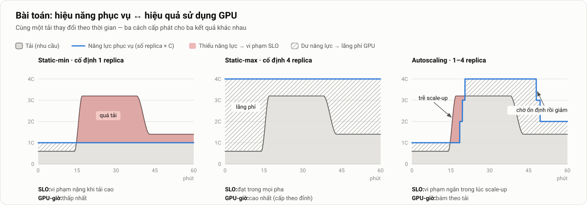
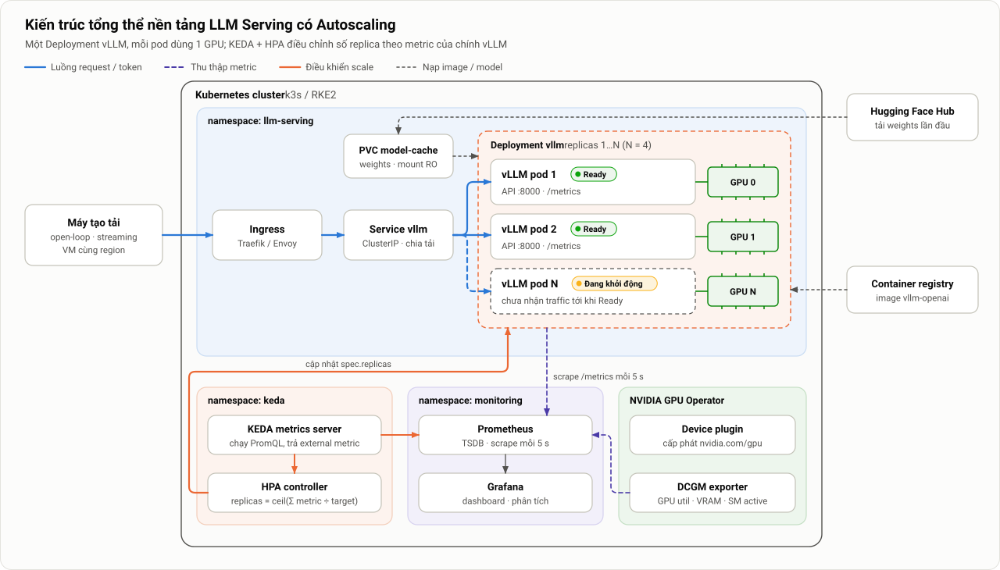
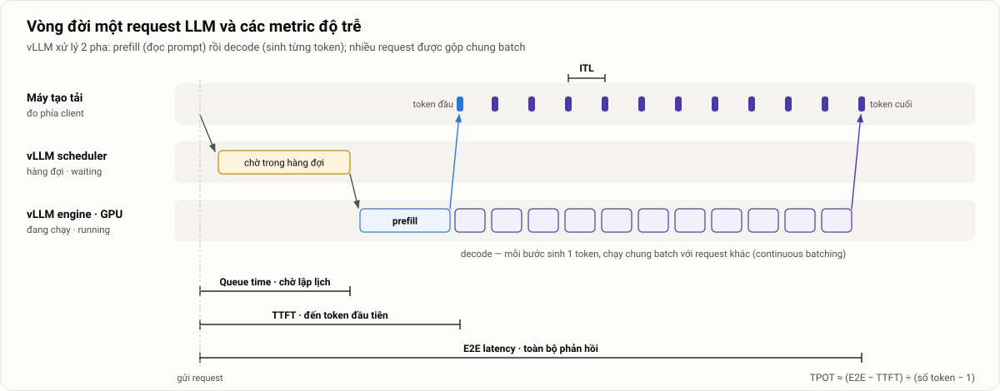
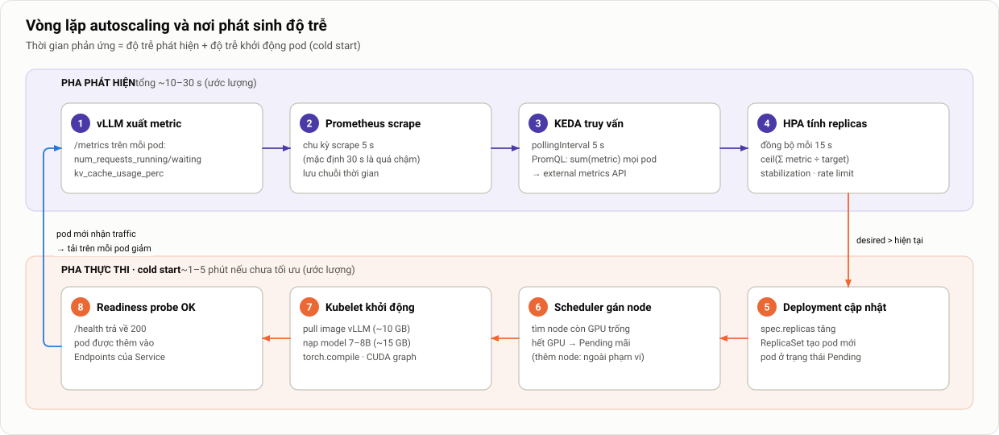
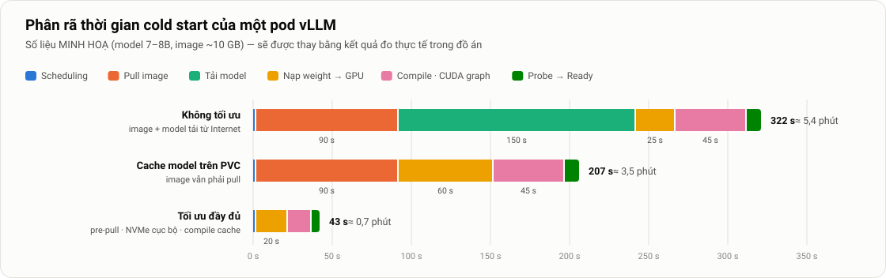
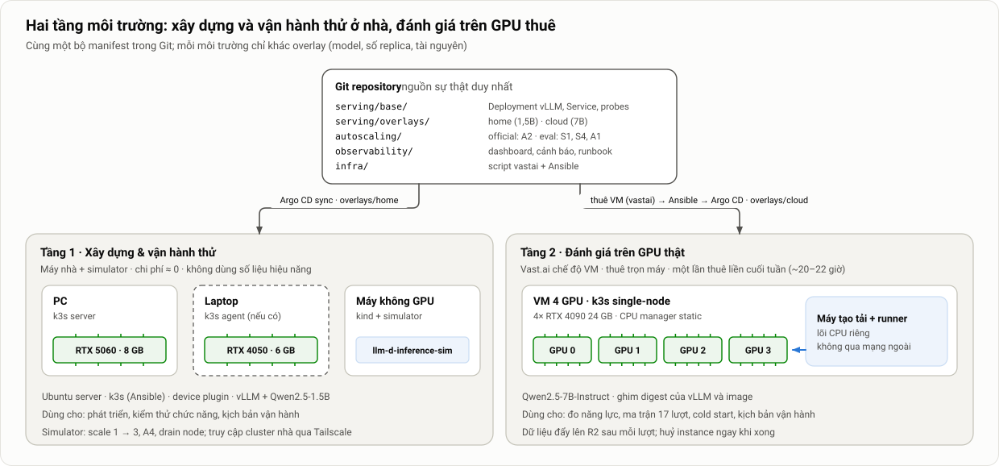
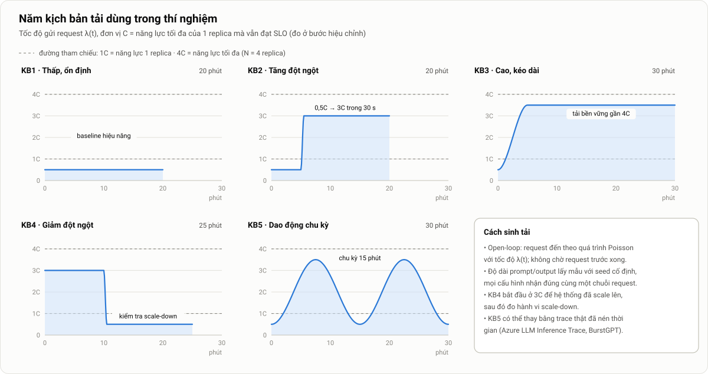
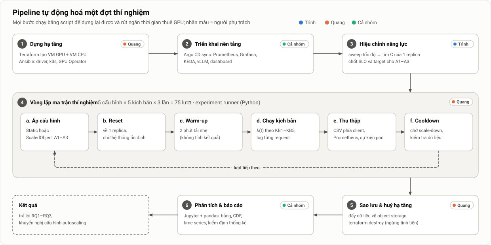
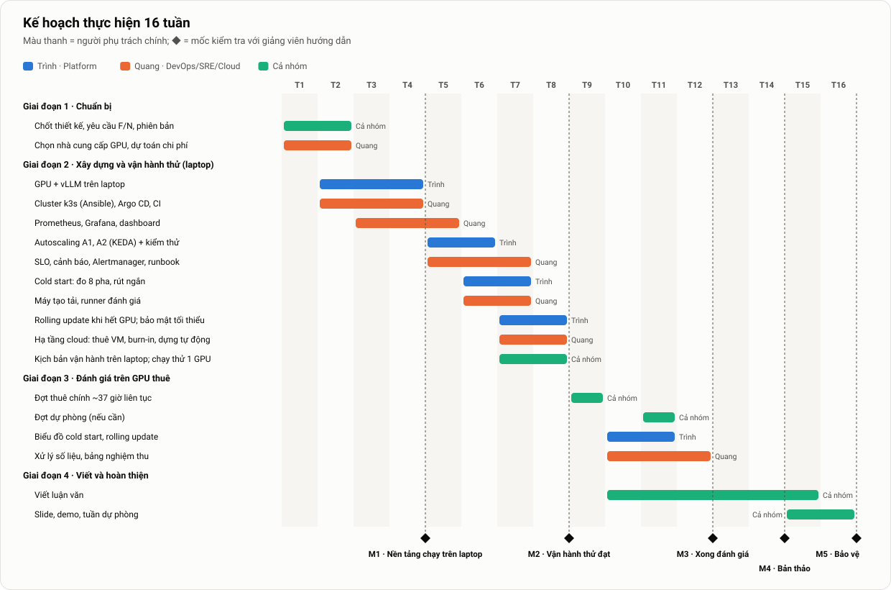

# Thiết kế và Đánh giá Nền tảng LLM Serving trên Kubernetes có Autoscaling

**Tên đề tài đã đăng ký:** *Design and Evaluation of an LLM Serving Platform on Kubernetes with Autoscaling*
**Loại tài liệu:** Bản mô tả chi tiết đồ án tốt nghiệp · phiên bản 1.0 · 26/09/2026
**Thời gian thực hiện:** 16 tuần

| Thành viên | Đơn vị | Vai trò trong đồ án |
|---|---|---|
| Trình | FCI – FPT Smart Cloud | Platform Engineering: Kubernetes, GPU, triển khai vLLM, autoscaling, quản lý tài nguyên |
| Quang | VCS – Viettel Cyber Security | DevOps/SRE: IaC & GitOps, giám sát, sinh tải, tự động hoá thí nghiệm, phân tích dữ liệu |

---

## Tóm tắt

Đồ án xây dựng một nền tảng phục vụ (*serving*) mô hình ngôn ngữ lớn (LLM) mã nguồn mở. Nền tảng dùng **vLLM** chạy trên **Kubernetes** với GPU, và tự động điều chỉnh số replica (*autoscaling*) dựa trên metric của chính vLLM thông qua **KEDA + HPA**.

Nhóm so sánh **hai cấu hình tĩnh** (1 replica và 4 replica) với **ba chiến lược autoscaling**. Ba chiến lược này chỉ khác nhau ở metric dùng để quyết định scale: GPU utilization, số request đồng thời, và mức sử dụng KV-cache. Tất cả được thử dưới **năm kịch bản tải**. Ngoài ra, nhóm đo riêng thời gian khởi động một pod mới (**cold start**) của vLLM và tối ưu nó.

Đồ án kỳ vọng đạt ba kết quả định lượng:
1. Metric nào phù hợp nhất để scale hệ thống LLM inference.
2. Cold start chiếm bao nhiêu phần trong thời gian phản ứng của autoscaling, và tối ưu được bao nhiêu.
3. Autoscaling đổi được bao nhiêu **GPU-giờ** mà vẫn giữ được tỷ lệ request đạt SLO so với cấu hình tĩnh.

Từ các kết quả này, nhóm đưa ra khuyến nghị cấu hình để áp dụng vào thực tế.

## Mục lục

1. [Đặt vấn đề](#1-đặt-vấn-đề)
2. [Mục tiêu và câu hỏi nghiên cứu](#2-mục-tiêu-và-câu-hỏi-nghiên-cứu)
3. [Phạm vi và giả định](#3-phạm-vi-và-giả-định)
4. [Kiến thức nền và các giải pháp liên quan](#4-kiến-thức-nền-và-các-giải-pháp-liên-quan)
5. [Kiến trúc hệ thống](#5-kiến-trúc-hệ-thống)
6. [Môi trường triển khai và dự toán chi phí](#6-môi-trường-triển-khai-và-dự-toán-chi-phí)
7. [Thiết kế các chiến lược autoscaling](#7-thiết-kế-các-chiến-lược-autoscaling)
8. [Thiết kế thí nghiệm](#8-thiết-kế-thí-nghiệm)
9. [Chỉ số đánh giá và cách đo](#9-chỉ-số-đánh-giá-và-cách-đo)
10. [Phân tích và trình bày kết quả](#10-phân-tích-và-trình-bày-kết-quả)
11. [Phân công công việc](#11-phân-công-công-việc)
12. [Kế hoạch thực hiện](#12-kế-hoạch-thực-hiện)
13. [Rủi ro và phương án giảm thiểu](#13-rủi-ro-và-phương-án-giảm-thiểu)
14. [Sản phẩm bàn giao](#14-sản-phẩm-bàn-giao)
15. [Hướng mở rộng](#15-hướng-mở-rộng)
16. [Tài liệu tham khảo](#16-tài-liệu-tham-khảo)
- [Phụ lục A. Đối chiếu với đề cương đã nộp](#phụ-lục-a-đối-chiếu-với-đề-cương-đã-nộp)

---

## 1. Đặt vấn đề

### 1.1. Bối cảnh

Chạy suy luận (*inference*) cho LLM đòi hỏi GPU có dung lượng VRAM lớn. Một model 7–8 tỷ tham số ở định dạng BF16 chiếm khoảng 15 GB VRAM chỉ riêng cho trọng số (*weights*). Phần VRAM còn lại dành cho KV-cache, và dung lượng KV-cache quyết định hệ thống xử lý được bao nhiêu request cùng lúc.

GPU có ba đặc điểm gây khó cho việc cấp phát:
- **Đắt.** Thuê một GPU 24 GB trên cloud tốn vài trăm đến hơn một nghìn USD mỗi tháng nếu chạy liên tục.
- **Rời rạc.** Nếu không chia sẻ GPU, mỗi replica chiếm trọn một GPU.
- **Tải không ổn định.** Tải thực tế của dịch vụ LLM thay đổi theo giờ trong ngày và có những đợt tăng đột biến (*burst*).

### 1.2. Bài toán trade-off



*Hình 1. Cùng một tải thay đổi theo thời gian, ba cách cấp phát cho ba kết quả khác nhau. C là năng lực của một replica.*

- **Static-min**, tức cấp ít tài nguyên cố định: khi tải tăng, request phải xếp hàng, độ trễ tăng vọt và SLO bị vi phạm (vùng đỏ).
- **Static-max**, tức cấp đủ cho mức tải đỉnh: SLO luôn đạt, nhưng phần lớn thời gian GPU nhàn rỗi (vùng gạch chéo).
- **Autoscaling**: năng lực phục vụ bám theo tải, nên dùng ít GPU-giờ hơn Static-max. Đổi lại, có một **khoảng trễ scale-up**, gồm thời gian phát hiện tải tăng cộng với thời gian khởi động pod mới. Trong khoảng này hệ thống vẫn bị quá tải.

Đồ án tập trung **đo và tìm cách thu hẹp khoảng trễ đó**, đồng thời **định lượng lượng tài nguyên tiết kiệm được**.

### 1.3. Vì sao autoscaling cho LLM khó hơn web service thông thường

| Đặc điểm | Web service thông thường | LLM inference trên GPU |
|---|---|---|
| Thời gian khởi động một replica | Vài giây | **1–5 phút**: pull image ~10 GB, nạp weights ~15 GB, compile/CUDA graph |
| Metric phản ánh tải | CPU utilization phản ánh khá tốt | GPU utilization **bão hoà sớm**; VRAM luôn ở mức ~90% vì vLLM cấp phát trước |
| Đơn vị tài nguyên | CPU chia nhỏ được (millicore) | Nguyên một GPU cho mỗi replica |
| Thời gian xử lý một request | Mili-giây, khá đồng đều | Vài giây đến vài chục giây, phụ thuộc độ dài prompt và output |
| Chi phí một replica dư thừa | Thấp | Cao (một GPU mỗi giờ) |

Vì vậy không thể áp nguyên công thức quen thuộc "HPA theo CPU 70%" cho LLM. Đồ án trả lời câu hỏi: **nên scale theo tín hiệu nào, và với độ trễ khởi động lớn như vậy thì autoscaling còn hiệu quả đến đâu?**

---

## 2. Mục tiêu và câu hỏi nghiên cứu

### 2.1. Mục tiêu tổng quát

Xây dựng một nền tảng LLM serving trên Kubernetes có autoscaling, triển khai lại được hoàn toàn bằng code. Sau đó đánh giá bằng thực nghiệm có kiểm soát xem autoscaling ảnh hưởng thế nào tới hiệu năng phục vụ và hiệu quả sử dụng GPU.

### 2.2. Mục tiêu cụ thể và tiêu chí hoàn thành

| # | Mục tiêu (theo đề cương) | Cụ thể hoá và tiêu chí hoàn thành |
|---|---|---|
| 1 | Triển khai LLM mã nguồn mở bằng vLLM trên Kubernetes | Deployment vLLM chạy model 7–8B, có API tương thích OpenAI, có probe và graceful shutdown; triển khai hoàn toàn qua GitOps |
| 2 | Cấu hình GPU cho inference | Cài GPU Operator; mỗi pod request `nvidia.com/gpu: 1`; các tham số vLLM được cố định và ghi lại |
| 3 | Autoscaling theo metric tải/request | Ba chiến lược A1–A3 viết bằng KEDA `ScaledObject`, **chỉ khác nhau ở metric** |
| 4 | Giám sát metric serving và GPU | Prometheus scrape mỗi 5 s; dashboard Grafana cho serving, GPU và autoscaling |
| 5 | Thử nghiệm với nhiều mẫu tải | Máy tạo tải kiểu open-loop và 5 kịch bản KB1–KB5 |
| 6 | So sánh với cấu hình tài nguyên cố định | Hai baseline Static-1 và Static-4; ma trận 75 lượt chạy |
| 7 | Đánh giá trade-off hiệu năng và tài nguyên | Biểu đồ SLO attainment theo GPU-giờ; khuyến nghị cấu hình |

### 2.3. Câu hỏi nghiên cứu (RQ) và giả thuyết (H)

| | Câu hỏi nghiên cứu | Giả thuyết cần kiểm chứng |
|---|---|---|
| **RQ1** | Với LLM inference, scale theo metric nào (GPU utilization, số request đồng thời, hay KV-cache usage) cho tỷ lệ đạt SLO cao nhất và phản ứng nhanh nhất khi tải thay đổi? | **H1:** Metric ở tầng ứng dụng (A2, A3) phản ứng sớm hơn và đạt SLO cao hơn GPU utilization (A1), vì GPU utilization bão hoà ngay khi tải còn thấp. |
| **RQ2** | Cold start chiếm bao nhiêu phần trong thời gian phản ứng của autoscaling, và các kỹ thuật cache hoặc pre-pull giảm được bao nhiêu? | **H2:** Cold start chiếm phần lớn thời gian phản ứng. Cache model và image giảm cold start hơn 50%, qua đó giảm vi phạm SLO trong kịch bản tăng đột ngột. |
| **RQ3** | So với cấu hình tĩnh, autoscaling đổi được bao nhiêu GPU-giờ lấy bao nhiêu tỷ lệ đạt SLO, ở từng mẫu tải? | **H3:** Với tải biến động (KB2, KB4, KB5), autoscaling đạt SLO gần bằng Static-4 mà tốn ít GPU-giờ hơn đáng kể. Với tải cao kéo dài (KB3), lợi ích không đáng kể. |

---

## 3. Phạm vi và giả định

### 3.1. Trong phạm vi

- Phục vụ inference cho **một model** trên Kubernetes bằng vLLM, chạy trên GPU.
- **Autoscaling ở mức pod** (thay đổi số replica) trên một nhóm GPU có số lượng cố định. Mỗi replica dùng một GPU.
- Giám sát metric serving, GPU và autoscaling. Sinh tải và chạy thí nghiệm hiệu năng.
- Đo và tối ưu cold start của pod vLLM.
- Tự động hoá hạ tầng (IaC) và triển khai (GitOps) để thí nghiệm lặp lại được.

### 3.2. Ngoài phạm vi

- Huấn luyện, fine-tuning, và nghiên cứu kiến trúc LLM.
- Chia sẻ hoặc cô lập GPU giữa nhiều tenant (MIG, time-slicing).
- Tensor/pipeline parallelism, tách riêng prefill và decode (*disaggregated serving*).
- Autoscaling ở mức node (Cluster Autoscaler, Karpenter). Mục này được đưa vào hướng mở rộng.
- Định tuyến request có nhận biết đặc thù LLM (LLM-aware routing). Mục này cũng thuộc hướng mở rộng.

### 3.3. Giả định

1. **Chi phí được đo bằng GPU-giờ cấp phát cho các pod vLLM.** Đại lượng này tương ứng với mô hình trả tiền theo mức dùng trên cloud, hoặc với lượng GPU được giải phóng cho workload khác trong cluster dùng chung. Lưu ý: trên một nhóm GPU cố định, việc scale-down **không tự động làm giảm tiền phải trả**. Luận văn sẽ ghi rõ giả định này.
2. Model vừa với một GPU, nên không cần tensor parallelism.
3. Máy tạo tải đặt **cùng region hoặc datacenter** với cluster. Nhờ đó độ trễ mạng (dưới 5 ms) không đáng kể so với TTFT.
4. Mọi phiên bản phần mềm (vLLM, KEDA, driver, model) được **ghim cố định** trong suốt đợt thí nghiệm.

---

## 4. Kiến thức nền và các giải pháp liên quan

### 4.1. vLLM

- **PagedAttention.** vLLM quản lý KV-cache theo từng block, tương tự cách hệ điều hành phân trang bộ nhớ. Cách làm này giảm phân mảnh bộ nhớ và cho phép gộp nhiều request vào cùng một batch [1].
- **Continuous batching.** Ở mỗi bước decode, request mới được chèn vào batch và request đã xong được loại ra. Nhờ đó GPU luôn bận, nhưng các request ảnh hưởng lẫn nhau về độ trễ.
- **Hai pha xử lý:** *prefill* đọc toàn bộ prompt và sinh token đầu tiên; *decode* sinh lần lượt từng token tiếp theo (Hình 3, mục 5.3).
- **Các tham số quyết định năng lực phục vụ:** `--max-model-len`, `--max-num-seqs`, `--max-num-batched-tokens`, `--gpu-memory-utilization`. Các tham số này được **giữ cố định** trong mọi thí nghiệm.

vLLM cung cấp các metric sau qua endpoint `/metrics` (định dạng Prometheus). Tên metric có thể thay đổi giữa các phiên bản, nên sau khi ghim phiên bản cần kiểm tra lại bằng `curl <pod>:8000/metrics`:

| Metric | Loại | Ý nghĩa và cách dùng |
|---|---|---|
| `vllm:num_requests_running` | gauge | Số request đang được xử lý trên GPU. Dùng cho chiến lược A2 |
| `vllm:num_requests_waiting` | gauge | Số request đang chờ trong hàng đợi. Dùng cho A2 và cho việc chẩn đoán |
| `vllm:kv_cache_usage_perc` | gauge (0–1) | Tỷ lệ KV-cache đang dùng. Dùng cho A3 (phiên bản cũ tên là `vllm:gpu_cache_usage_perc`) |
| `vllm:time_to_first_token_seconds` | histogram | TTFT đo phía server |
| `vllm:inter_token_latency_seconds` | histogram | ITL (phiên bản cũ tên là `vllm:time_per_output_token_seconds`) |
| `vllm:e2e_request_latency_seconds` | histogram | Độ trễ end-to-end phía server |
| `vllm:request_queue_time_seconds` | histogram | Thời gian chờ trong hàng đợi |
| `vllm:generation_tokens_total`, `vllm:prompt_tokens_total` | counter | Dùng để tính throughput (token/s) |
| `vllm:num_preemptions_total` | counter | Số lần request bị tạm dừng do hết KV-cache, là dấu hiệu quá tải |

### 4.2. Autoscaling trên Kubernetes

**HPA (Horizontal Pod Autoscaler).** Controller có sẵn của Kubernetes. Mặc định cứ 15 s nó tính lại số replica mong muốn một lần. Với external metric kiểu `AverageValue`:

$$
\text{desiredReplicas} = \left\lceil \frac{\text{giá trị metric (tổng toàn Deployment)}}{\text{target cho mỗi replica}} \right\rceil
$$

HPA bỏ qua các dao động nhỏ hơn 10% (*tolerance*). Tham số `behavior` điều khiển tốc độ và độ "bình tĩnh" khi scale:
- Scale-down mặc định có cửa sổ ổn định (*stabilization window*) 300 s.
- Scale-up mặc định cho phép tăng tới 100% số pod, hoặc thêm 4 pod, mỗi 15 s.

**KEDA.** KEDA gồm hai phần: *operator*, đọc `ScaledObject` và tạo HPA tương ứng; và *metrics API server*, chạy truy vấn tới nguồn metric (ở đây là PromQL tới Prometheus) rồi trả kết quả cho HPA dưới dạng external metric. KEDA còn hỗ trợ scale về 0. Đồ án **không dùng** tính năng này vì cold start dài không phù hợp với dịch vụ tương tác; nó được đưa vào hướng mở rộng.

**Knative KPA / KServe serverless.** Đây là cơ chế scale theo số request đồng thời, có chế độ "panic" khi tải tăng đột ngột. Đồ án dùng nó làm đối chiếu về mặt lý thuyết, còn so sánh thực nghiệm để ở hướng mở rộng.

### 4.3. GPU trên Kubernetes

- **NVIDIA GPU Operator** cài và quản lý các thành phần cần thiết: driver, container toolkit, **device plugin** (công bố tài nguyên `nvidia.com/gpu` cho scheduler), GPU Feature Discovery (gắn nhãn node), và **DCGM exporter**.
- **Các metric DCGM chính:**
  - `DCGM_FI_DEV_GPU_UTIL`: tỷ lệ thời gian có kernel đang chạy. Metric này **không** cho biết GPU bận đến mức nào, nên bão hoà sớm.
  - `DCGM_FI_DEV_FB_USED`: VRAM đã dùng.
  - `DCGM_FI_PROF_SM_ACTIVE`: tỷ lệ SM đang hoạt động, có ý nghĩa hơn. Đây là metric profiling, thường chỉ có trên GPU datacenter.

### 4.4. Các giải pháp liên quan

| Giải pháp | Cách tiếp cận autoscaling / serving | Liên hệ với đồ án |
|---|---|---|
| **KServe** | Chế độ serverless dùng Knative KPA (theo số request đồng thời); chế độ raw deployment dùng HPA/KEDA; có tính năng cache model cục bộ | Cùng các cơ chế nền tảng; đồ án đánh giá cơ chế ở tầng thấp hơn |
| **vLLM Production Stack** | Helm chart cho vLLM, có router, observability, hướng dẫn autoscaling bằng KEDA | Kiến trúc tương tự; đồ án bổ sung đánh giá định lượng |
| **llm-d / Gateway API Inference Extension** | Định tuyến theo trạng thái KV-cache và hàng đợi; tách prefill/decode; autoscaler riêng cho LLM | Thuộc hướng mở rộng (routing) |
| **AIBrix, NVIDIA Dynamo** | Autoscaler và planner chuyên cho LLM; serving phân tán | Tham khảo cho phần thảo luận |
| **ServerlessLLM** [4] | Giảm cold start bằng cách nạp checkpoint nhanh, nhiều tầng lưu trữ | Cơ sở lý thuyết cho RQ2 |
| **DistServe** [2], **Splitwise** [3], **BurstGPT** [5] | Khái niệm *goodput* theo SLO; trace tải thật | Chỉ số goodput; nguồn dữ liệu cho KB5 |

**Định vị của đồ án.** Đồ án **không xây dựng autoscaler mới**. Thay vào đó, nhóm **đánh giá thực nghiệm có kiểm soát** các lựa chọn metric và ảnh hưởng của cold start, dùng các thành phần chuẩn và phổ biến (KEDA/HPA). Vì hầu hết các nền tảng kể trên đều dựa trên HPA, KEDA hoặc KPA, kết quả của đồ án áp dụng trực tiếp được cho chúng.

---

## 5. Kiến trúc hệ thống

### 5.1. Tổng quan



*Hình 2. Kiến trúc tổng thể. Request đi từ máy tạo tải qua Ingress và Service tới các pod vLLM, mỗi pod gắn một GPU. Prometheus thu metric từ vLLM và DCGM. KEDA chạy PromQL và cung cấp external metric cho HPA; HPA cập nhật `spec.replicas` của Deployment. Pod mới chỉ nhận traffic sau khi đã Ready.*

### 5.2. Các thành phần

| Thành phần | Vai trò | Cấu hình chính | Phụ trách |
|---|---|---|---|
| Kubernetes (k3s/RKE2) | Điều phối container | Một node (cloud) hoặc nhiều node (laptop) | Trình |
| NVIDIA GPU Operator | Driver, device plugin, DCGM exporter | Trên laptop dùng `driver.enabled=false` (driver cài sẵn) | Trình |
| vLLM (Deployment) | Phục vụ model qua API OpenAI | 1 GPU/pod; tham số cố định; có probe và `preStop` | Trình |
| PVC `model-cache` | Lưu weights để không phải tải lại | Đọc-ghi dùng chung (NFS) hoặc NVMe cục bộ | Trình |
| Ingress / Service | Điểm vào, chia tải cho các pod | Round-robin mặc định (được ghi nhận là hạn chế) | Trình |
| KEDA | Chuyển metric Prometheus thành external metric, tạo HPA | `pollingInterval: 5`; A1–A3 | Trình |
| Prometheus (kube-prometheus-stack) | Thu và lưu metric | `ServiceMonitor`/`PodMonitor` với scrape mỗi 5 s cho vLLM và DCGM | Quang |
| Grafana | Dashboard, đánh dấu (annotation) từng pha thí nghiệm | 4 dashboard (mục 5.6) | Quang |
| kube-state-metrics | Trạng thái Deployment, HPA, pod | Mặc định | Quang |
| Argo CD | GitOps: đồng bộ cluster theo Git | Mỗi môi trường một overlay | Quang |
| Terraform + Ansible | Tạo VM GPU, cài k3s và driver | Dựng hoặc huỷ trọn bộ trong dưới 30 phút | Quang |
| Máy tạo tải + experiment runner | Sinh tải, điều phối các lượt chạy, thu dữ liệu | Python asyncio, chạy ngoài cluster | Quang |

### 5.3. Luồng xử lý một request



*Hình 3. Vòng đời một request và các metric độ trễ. Khi tải tăng, thời gian chờ trong hàng đợi (queue time) tăng đầu tiên, kéo theo TTFT tăng. Đây là tín hiệu sớm nhất cho biết hệ thống cần scale.*

1. Máy tạo tải gửi `POST /v1/chat/completions` với `stream: true` tới Ingress.
2. Service chọn một pod đang Ready, rồi scheduler của vLLM đưa request vào hàng đợi (*waiting*).
3. Khi còn chỗ trong batch và còn KV-cache, request chuyển sang *running*: prefill rồi decode.
4. Mỗi token sinh ra được gửi về dưới dạng Server-Sent Events. Máy tạo tải ghi lại thời điểm gửi, thời điểm nhận token đầu, token cuối, và số token.
5. Thời điểm vào hàng đợi, token đầu và kết thúc cũng được vLLM ghi vào histogram để đối chiếu với số đo phía client.

### 5.4. Vòng lặp autoscaling



*Hình 4. Vòng lặp autoscaling chia thành pha phát hiện (bước 1–4) và pha thực thi (bước 5–8). Các con số thời gian là ước lượng và sẽ được đo thực tế.*

Thời gian phản ứng của autoscaling được tách thành các thành phần:

$$
T_{\text{phản ứng}} = \underbrace{T_{\text{scrape}} + T_{\text{polling}} + T_{\text{HPA}}}_{\text{phát hiện: } \sim 10\text{–}30\,s} + \underbrace{T_{\text{schedule}} + T_{\text{pull}} + T_{\text{load}} + T_{\text{compile}} + T_{\text{ready}}}_{\text{cold start: } \sim 1\text{–}5\text{ phút}}
$$

**Ví dụ tính số replica.** Chiến lược A2 đặt target 24 request đồng thời cho mỗi replica. Hiện có 1 replica, tổng `running + waiting` là 70. HPA tính ra $\lceil 70/24 \rceil = 3$ replica. Hai pod mới được tạo, và chỉ nhận traffic sau khi cold start xong.

### 5.5. Cold start và tối ưu



*Hình 5. Phân rã cold start. Số liệu chỉ để minh hoạ khung đo; kết quả thực tế sẽ thay vào ở chương thí nghiệm.*

| Mức | Kỹ thuật | Pha được rút ngắn |
|---|---|---|
| L0 | Không tối ưu: image và model tải từ Internet mỗi lần tạo pod | – |
| L1 | Model nằm sẵn trên PVC, pod chỉ mount và đọc | Tải model |
| L2 | L1, cộng: **pre-pull image** (DaemonSet hoặc image dựng sẵn trên node), model trên **NVMe cục bộ**, giữ **compile cache** của vLLM trên volume | Pull image, nạp weights, compile |
| (tuỳ chọn) | `--enforce-eager` (bỏ CUDA graph): khởi động nhanh hơn nhưng decode chậm hơn | Compile, nhưng phải đánh đổi ITL |
| (tuỳ chọn) | Warm pool: đặt `minReplicas` > 1 | Bỏ hẳn cold start cho replica đầu tiên, nhưng tốn thêm GPU-giờ |

### 5.6. Kiến trúc giám sát và thu thập dữ liệu

Có năm nguồn dữ liệu, được ghép với nhau theo **timestamp** (mọi máy đồng bộ giờ bằng NTP):

1. **Log phía client** (máy tạo tải): một dòng cho mỗi request (`id, t_send, t_first, t_last, n_in, n_out, status`). Đây là **nguồn chính** cho TTFT, ITL và E2E.
2. **Metric vLLM**: hàng đợi, request đang chạy, KV-cache, và các histogram độ trễ phía server.
3. **Metric DCGM**: GPU utilization, SM active, VRAM, công suất, nhiệt độ.
4. **kube-state-metrics**: số replica mong muốn và hiện có, trạng thái pod, metric HPA.
5. **Sự kiện Kubernetes**: experiment runner theo dõi `pod.status.conditions` (PodScheduled, Initialized, ContainersReady, Ready) để tính các pha của cold start.

Bốn dashboard Grafana:
- **Serving:** RPS, TTFT/ITL p95, hàng đợi, request đang chạy, token/s.
- **GPU:** utilization, SM active, VRAM, công suất.
- **Autoscaling:** replica mong muốn so với hiện có, metric so với target, pod theo trạng thái.
- **Thí nghiệm:** annotation đánh dấu ranh giới các pha, do runner gửi qua Grafana API.

### 5.7. Cấu hình triển khai mẫu

Deployment vLLM (rút gọn):

```yaml
apiVersion: apps/v1
kind: Deployment
metadata:
  name: vllm
  namespace: llm-serving
spec:
  replicas: 1                          # KEDA/HPA ghi đè khi bật autoscaling
  selector:
    matchLabels: {app: vllm}
  template:
    metadata:
      labels: {app: vllm}
    spec:
      terminationGracePeriodSeconds: 180   # đủ cho request dài nhất hoàn tất
      nodeSelector:
        nvidia.com/gpu.present: "true"
      containers:
        - name: vllm
          image: vllm/vllm-openai:vX.Y.Z      # ghim phiên bản cụ thể
          args:
            - --model=/models/Qwen2.5-7B-Instruct
            - --served-model-name=qwen2.5-7b
            - --max-model-len=8192
            - --max-num-seqs=64
            - --gpu-memory-utilization=0.90
          ports:
            - {name: http, containerPort: 8000}
          resources:
            limits: {nvidia.com/gpu: 1, memory: 32Gi}
            requests: {cpu: "4", memory: 24Gi}
          volumeMounts:
            - {name: models, mountPath: /models, readOnly: true}
            - {name: dshm, mountPath: /dev/shm}
          startupProbe:                     # cho phép tới 10 phút nạp model
            httpGet: {path: /health, port: http}
            periodSeconds: 5
            failureThreshold: 120
          readinessProbe:
            httpGet: {path: /health, port: http}
            periodSeconds: 5
          lifecycle:
            preStop:                        # chờ Endpoints cập nhật rồi mới SIGTERM
              exec: {command: ["sleep", "20"]}
      volumes:
        - name: models
          persistentVolumeClaim: {claimName: model-cache}
        - name: dshm
          emptyDir: {medium: Memory, sizeLimit: 8Gi}
```

---

## 6. Môi trường triển khai và dự toán chi phí

### 6.1. Chiến lược hai tầng



*Hình 6. Phát triển trên laptop (gần như miễn phí), thí nghiệm chính trên GPU thuê theo giờ. Cả hai tầng triển khai từ cùng một Git repository và chỉ khác nhau ở overlay.*

Nhóm hiện có **laptop RTX 4060 (8 GB VRAM)** và dự định **thuê GPU trên các nền tảng trực tuyến**. Tách thành hai tầng giúp hạn chế tối đa thời gian phải trả tiền thuê GPU: mọi thứ có thể làm trên laptop thì làm trên laptop, và chỉ lên cloud khi pipeline đã chạy ổn định (mốc M2, tuần 8).

### 6.2. Tầng 1: laptop RTX 4060

- **Hệ điều hành:** Ubuntu 22.04/24.04 cài trực tiếp (dual-boot). WSL2 không phù hợp để dựng Kubernetes có GPU; chỉ nên dùng nó để chạy thử vLLM bằng Docker.
- **Cluster:** k3s. Nếu có 2–3 laptop thì nối qua mạng LAN để được **cluster nhiều node, mỗi node một GPU**. Như vậy có thể demo autoscaling 1 → 3 replica mà không tốn chi phí.
- **GPU:** cài driver NVIDIA sẵn, rồi cài GPU Operator với `driver.enabled=false` (hoặc chỉ cài device plugin cùng container toolkit). GPU dòng consumer không nằm trong danh sách hỗ trợ chính thức của GPU Operator, nhưng thường vẫn chạy được.
- **Model:** Qwen2.5-1.5B-Instruct (khoảng 3 GB ở BF16) hoặc model 3B đã lượng tử hoá AWQ, với `--max-model-len` 4096.
- **Dùng cho:** viết manifest, dashboard, máy tạo tải, experiment runner; chạy pilot toàn bộ pipeline; **demo trực tiếp khi bảo vệ** mà không phụ thuộc vào cloud.
- **Tuỳ chọn:** `llm-d-inference-sim`, một chương trình giả lập API và metric của vLLM, chạy được trên máy không có GPU. Công cụ này tiện để thử logic autoscaling và dashboard.
- **Hạn chế:** GPU laptop có thể bị giảm xung (*thermal throttling*) và VRAM nhỏ. Vì vậy **số liệu từ laptop không được dùng để rút ra kết luận**.

### 6.3. Tầng 2: GPU thuê theo giờ

**Yêu cầu bắt buộc.** Phải thuê **VM đầy đủ** (có root, systemd, nạp được kernel module) để chạy k3s và GPU Operator, hoặc dùng dịch vụ **managed Kubernetes có GPU node pool**. Các nền tảng chỉ cho thuê *container* (kiểu RunPod Pods hay container instance trên Vast.ai) thường **không chạy được Kubernetes**. Chúng chỉ dùng được để thử vLLM đơn lẻ hoặc đo sơ bộ năng lực.

| Phương án | Cấu hình | Ưu điểm | Nhược điểm |
|---|---|---|---|
| **A (khuyến nghị)** | 1 VM với 4× GPU 24 GB, k3s single-node, cộng 1 VM CPU nhỏ | Đơn giản, rẻ, ít biến số | Không có mạng giữa các node; image chỉ cần pull một lần |
| B | 2 VM × 2 GPU | Gần với thực tế nhiều node hơn (mỗi node pull image riêng) | Phức tạp hơn, cần mạng tốt giữa hai VM |
| C (tiết kiệm) | 4× GPU 16 GB, model 3–4B | Rẻ hơn | Model nhỏ, kém đại diện |

**Tiêu chí chọn nhà cung cấp:**
- Cho thuê VM có GPU passthrough, và có loại VM 4 GPU.
- Tính tiền theo giờ hoặc phút.
- Có ổ NVMe cục bộ từ 200 GB trở lên.
- Băng thông tải xuống tốt.
- Có VM CPU cùng region.
- Có API hoặc Terraform provider.
- Nên ưu tiên GPU có **băng thông bộ nhớ cao** (A10, RTX 4090, L40S), vì pha decode bị giới hạn bởi băng thông. L4 rẻ nhưng chỉ khoảng 300 GB/s nên decode chậm.

**Danh sách tham khảo** (cần kiểm tra giá và tình trạng còn máy tại thời điểm thuê):
- Nhà cung cấp GPU cloud: Lambda, TensorDock, DataCrunch, Hyperstack, Vultr.
- Hyperscaler: GCP (L4, GKE), AWS (g5/g6), Azure. Thường có credit cho sinh viên.
- Trong nước: FPT Cloud / FPT AI Factory, Viettel Cloud. Nên hỏi về chương trình hỗ trợ nội bộ, vì hai thành viên đang làm tại FCI và VCS.

### 6.4. Dự toán chi phí

| Hạng mục | Cách tính | Giờ chạy cluster |
|---|---|---|
| Ma trận thí nghiệm chính | 75 lượt × (~25 phút chạy + ~10 phút reset/warm-up/cooldown) | ≈ 44 giờ |
| Hiệu chỉnh, đo cold start, sửa lỗi trên cloud | Ước lượng | ≈ 20 giờ |
| Dự phòng chạy lại (~30%) | | ≈ 20 giờ |
| **Tổng** | | **≈ 84 giờ × 4 GPU ≈ 340 GPU-giờ** |

Với đơn giá tham khảo khoảng 0,4–0,9 USD/GPU-giờ cho GPU 24 GB, tổng chi phí vào khoảng **135–300 USD**, cộng thêm VM CPU và lưu trữ (không đáng kể). Có ba cách giảm chi phí:
1. **Ma trận rút gọn:** Static-1 chỉ chạy KB1 và KB2 (ở các kịch bản khác nó chắc chắn vi phạm SLO); rút KB3 và KB5 xuống 20 phút. Tổng còn khoảng 55–60 lượt, tương đương ~35 giờ cluster.
2. Runner **chạy tự động qua đêm**, không cần người trực. VM được **huỷ ngay** sau mỗi đợt.
3. Tận dụng credit cho sinh viên hoặc chương trình hỗ trợ của doanh nghiệp.

---

## 7. Thiết kế các chiến lược autoscaling

### 7.1. Các cấu hình được so sánh

| Mã | Tên | Cơ chế | Metric (PromQL) | Target mỗi replica | Vai trò |
|---|---|---|---|---|---|
| **S1** | Static-1 | `replicas: 1` | – | – | Chi phí thấp nhất, hiệu năng kém nhất |
| **S4** | Static-4 | `replicas: 4` | – | – | Cấp theo đỉnh; hiệu năng tốt nhất |
| **A1** | GPU utilization | KEDA Prometheus | `sum(DCGM_FI_DEV_GPU_UTIL{namespace="llm-serving"})` ¹ | 70 (%) | Baseline "truyền thống" |
| **A2** | Số request đồng thời | KEDA Prometheus | `sum(vllm:num_requests_running) + sum(vllm:num_requests_waiting)` | 0,8 × B* | **Đề xuất chính** |
| **A3** | KV-cache usage | KEDA Prometheus | `sum(vllm:kv_cache_usage_perc)` | 0,7 | Đề xuất phụ |

¹ Tên label của pod/namespace trong metric DCGM phụ thuộc cấu hình scrape (có thể là `exported_namespace`); cần kiểm tra lại khi triển khai.

**Nguyên tắc kiểm soát biến.** Mọi cấu hình autoscaling dùng chung `minReplicaCount: 1`, `maxReplicaCount: 4` (bằng Static-4), `pollingInterval: 5` và cùng tham số `behavior`. **Biến độc lập duy nhất là metric.**

### 7.2. Vì sao không scale chỉ theo hàng đợi

Nếu chỉ dùng `num_requests_waiting`, khi hàng đợi về 0 thì HPA tính ra 0 replica mong muốn và sẽ scale-down, dù các replica vẫn đang bận xử lý đầy batch. Kết quả là số replica dao động lên xuống liên tục (*flapping*). A2 cộng thêm `running` để tránh hiện tượng này. Đây là cách đo "tải đồng thời" tương tự Knative KPA. Có thể thêm biến thể A4 (chỉ hàng đợi) để **minh hoạ hiện tượng flapping** nếu còn thời gian.

### 7.3. Cách chọn target

Target được chọn **từ dữ liệu hiệu chỉnh** (mục 8.1), không chọn theo cảm tính:
- **B\*** là số request đồng thời trung bình trên một replica khi tải bằng C (năng lực tối đa mà vẫn đạt SLO). A2 dùng target 0,8 × B\* để chừa 20% dư phòng.
- A3 dùng target bằng mức KV-cache usage đo được tại C, nhân 0,8.
- A1 dùng mức phổ biến 70%. Mục đích là cho thấy GPU utilization không phân biệt được tải vừa với quá tải.

### 7.4. ScaledObject mẫu (A2)

```yaml
apiVersion: keda.sh/v1alpha1
kind: ScaledObject
metadata:
  name: vllm-a2-concurrency
  namespace: llm-serving
spec:
  scaleTargetRef:
    name: vllm
  minReplicaCount: 1
  maxReplicaCount: 4
  pollingInterval: 5
  advanced:
    horizontalPodAutoscalerConfig:
      behavior:
        scaleDown:
          stabilizationWindowSeconds: 300   # chờ 5 phút ổn định rồi mới giảm
          policies:
            - {type: Pods, value: 1, periodSeconds: 60}
        # scaleUp giữ mặc định của HPA: không có cửa sổ chờ, tối đa +100% hoặc +4 pod mỗi 15 s
  triggers:
    - type: prometheus
      metricType: AverageValue
      metadata:
        serverAddress: http://prometheus-operated.monitoring.svc:9090
        query: |
          sum(vllm:num_requests_running{namespace="llm-serving"})
          + sum(vllm:num_requests_waiting{namespace="llm-serving"})
        threshold: "24"                      # = 0,8 × B*, lấy từ bước hiệu chỉnh
```

A1 và A3 chỉ khác ở `query` và `threshold`. Nếu còn thời gian, có thể thêm một nghiên cứu độ nhạy với `stabilizationWindowSeconds` ∈ {60, 300, 600}.

### 7.5. Scale-down an toàn

Khi scale-down, pod bị xoá có thể đang xử lý request. Nhóm xử lý như sau:
- `preStop` chờ khoảng 20 s để Service kịp gỡ pod khỏi danh sách Endpoints.
- vLLM nhận SIGTERM và hoàn tất các request đang chạy trong thời gian `terminationGracePeriodSeconds`.
- **Kịch bản KB4 dùng để kiểm chứng:** số request lỗi (5xx hoặc bị ngắt stream) trong lúc scale-down phải bằng 0. Nếu khác 0, đó là một phát hiện cần báo cáo.

---

## 8. Thiết kế thí nghiệm

### 8.1. Bước hiệu chỉnh năng lực (calibration)

Mục đích là xác định **C**, tốc độ request tối đa mà một replica phục vụ được trong khi vẫn đạt SLO. Mọi kịch bản tải được định nghĩa theo bội số của C.

1. Chạy 1 replica với tải Poisson ở tốc độ cố định λ ∈ {0,5; 1; 1,5; …} req/s, mỗi mức 5 phút. Dùng máy tạo tải của nhóm, đối chiếu thêm với `vllm bench serve` hoặc GuideLLM.
2. Với mỗi λ, ghi lại TTFT p95, ITL p95, B (số request đồng thời trung bình), KV-cache usage và GPU utilization.
3. **C** là λ lớn nhất còn thoả SLO. Từ đó suy ra B\* và các target cho A1–A3 (mục 7.3).

### 8.2. SLO

SLO sơ bộ, sẽ chốt lại sau bước hiệu chỉnh:

- **TTFT p95 ≤ 2 s**: người dùng thấy phản hồi bắt đầu trong vòng 2 giây.
- **ITL p95 ≤ 100 ms**: tương đương khoảng 10 token/s trở lên, nhanh hơn tốc độ đọc.

Một request được coi là **đạt SLO** khi TTFT ≤ 2 s, TPOT ≤ 100 ms và không lỗi.

### 8.3. Mô hình tải

- **Kiểu open-loop.** Request được gửi theo quá trình Poisson với tốc độ λ(t) thay đổi theo thời gian, **không chờ** request trước hoàn thành. Kiểu closed-loop (số "người dùng" cố định, mỗi người chờ xong mới gửi tiếp) sẽ tự giảm tải khi hệ thống chậm, che giấu tình trạng quá tải (*coordinated omission*) [19].
- **Dạng request:** độ dài prompt lấy mẫu trong khoảng 256–1024 token. Output cố định 256 token bằng `max_tokens=256` và `ignore_eos=true` để kiểm soát lượng công việc. Bật `stream: true`.
- **Tái lập được:** chuỗi request (thời điểm gửi, prompt) được sinh từ **seed cố định**, nên mọi cấu hình nhận đúng cùng một tải.
- **Máy tạo tải:** tự viết bằng Python asyncio (httpx hoặc aiohttp, có phân tích SSE), vì các công cụ có sẵn khó sinh tải theo λ(t) tuỳ ý mà vẫn đo được TTFT và ITL. Cần kiểm chứng máy tạo tải **không phải là nút thắt**: CPU dưới 70%, và độ trễ gửi thực tế so với lịch dưới 10 ms.

### 8.4. Các kịch bản tải



*Hình 7. Năm kịch bản tải, đơn vị là C (năng lực của một replica).*

| Kịch bản | Mẫu tải | Thời lượng | Mục đích | Chỉ số trọng tâm |
|---|---|---|---|---|
| **KB1** Thấp, ổn định | 0,5C | 20 phút | Baseline hiệu năng; lượng lãng phí của Static-4 | TTFT, GPU-giờ |
| **KB2** Tăng đột ngột | 0,5C → 3C trong 30 s | 20 phút | Tốc độ phản ứng khi scale-up | Thời gian phản ứng, thời gian hồi phục SLO |
| **KB3** Cao, kéo dài | Tăng dần lên 3,5C rồi giữ | 30 phút | Độ ổn định dưới tải bền vững | SLO attainment, throughput |
| **KB4** Giảm đột ngột | 3C → 0,5C | 25 phút | Scale-down: flapping, request lỗi | Lỗi, số lần scale, GPU-giờ |
| **KB5** Dao động chu kỳ | Hình sin 0,5C–3,5C, chu kỳ 15 phút (hoặc trace thật) | 30 phút | Hành vi trong điều kiện gần với thực tế | Tất cả |

### 8.5. Ma trận thí nghiệm

| Cấu hình \ Kịch bản | KB1 | KB2 | KB3 | KB4 | KB5 |
|---|---|---|---|---|---|
| S1 Static-1 | 3 | 3 | 3 | 3 | 3 |
| S4 Static-4 | 3 | 3 | 3 | 3 | 3 |
| A1 GPU util | 3 | 3 | 3 | 3 | 3 |
| A2 Concurrency | 3 | 3 | 3 | 3 | 3 |
| A3 KV-cache | 3 | 3 | 3 | 3 | 3 |

Tổng cộng **75 lượt** (có phương án rút gọn ở mục 6.4). **Thứ tự các lượt được xáo trộn ngẫu nhiên** để tránh sai lệch do thời điểm chạy, ví dụ hạ tầng cloud chạy chậm hơn vào một số giờ.

**Thí nghiệm cold start riêng (phục vụ RQ2):**
- Với mỗi mức L0, L1, L2, đo phân rã các pha cold start **5 lần**.
- Sau đó chạy lại **KB2 với A2** ở mức L0 và L2 để thấy cold start ảnh hưởng trực tiếp thế nào tới SLO.

### 8.6. Quy trình tự động của một lượt chạy



*Hình 8. Pipeline của một đợt thí nghiệm. Nhãn màu trên mỗi bước cho biết người phụ trách.*

Chi tiết các bước trong một lượt:
- **Reset:** đưa về 1 replica, chờ không còn request đang chạy, rồi chờ thêm 60 s.
- **Warm-up:** 2 phút tải 0,3C, không tính vào kết quả.
- **Chạy:** runner gửi annotation "bắt đầu/kết thúc pha" lên Grafana.
- **Thu thập:** log client (CSV), export các chuỗi Prometheus liên quan (Parquet), sự kiện pod, cùng metadata (phiên bản, cấu hình, seed).
- **Cooldown:** chờ số replica về 1, tối đa 10 phút.
- Dữ liệu được **đẩy ra ngoài VM ngay sau mỗi lượt**.

### 8.7. Kiểm soát biến và độ lặp lại

- **Cố định:** model, phiên bản image, tham số vLLM, loại GPU, dataset, seed, `maxReplicas`, tham số `behavior`.
- **Thay đổi:** cấu hình (S1, S4, A1–A3) và kịch bản (KB1–KB5).
- **Lặp lại:** mỗi ô trong ma trận chạy 3 lần, báo cáo trung bình kèm khoảng tin cậy 95%.
- **Loại trừ:** dữ liệu warm-up; các lượt có sự cố hạ tầng (được ghi rõ trong nhật ký thí nghiệm).

---

## 9. Chỉ số đánh giá và cách đo

| Nhóm | Chỉ số | Định nghĩa | Nguồn |
|---|---|---|---|
| Hiệu năng | **TTFT** p50/p95/p99 | $t_{\text{first}} - t_{\text{send}}$ | Log client (chính), đối chiếu histogram vLLM |
| | **ITL / TPOT** p50/p95/p99 | TPOT $= (t_{\text{last}} - t_{\text{first}})/(n_{\text{out}} - 1)$ | Log client |
| | **E2E latency** | $t_{\text{last}} - t_{\text{send}}$ | Log client |
| | **SLO attainment** | % request đạt đồng thời TTFT ≤ 2 s, TPOT ≤ 100 ms và không lỗi | Log client |
| | **Goodput** | Số request đạt SLO mỗi giây [2] | Log client |
| | **Throughput** | Số token output mỗi giây; số request hoàn thành mỗi giây | `rate(vllm:generation_tokens_total)` |
| | **Tỷ lệ lỗi** | % request lỗi, timeout hoặc bị ngắt stream | Log client |
| Tài nguyên | **GPU-giờ** | $\int$ số pod vLLM đang giữ GPU $\,dt$ (gồm cả pod đang khởi động) | kube-state-metrics |
| | **GPU utilization, SM active** | Trung bình theo thời gian trên các GPU đã cấp | DCGM |
| | **Hiệu quả chi phí** | Số token output / GPU-giờ; số request đạt SLO / GPU-giờ | Tính toán |
| Autoscaling | **Độ trễ phát hiện** | Từ lúc tải đổi đến lúc HPA đổi `desiredReplicas` | kube-state-metrics |
| | **Thời gian cung cấp** | Từ lúc pod được tạo đến lúc pod Ready, tách theo từng pha | Sự kiện pod (runner) |
| | **Thời gian hồi phục SLO** | Từ lúc tải đổi đến khi TTFT p95 (cửa sổ trượt 30 s) ≤ SLO liên tục ≥ 60 s | Log client |
| | **Số lần scale / flapping** | Số lần `desiredReplicas` thay đổi; số lần đảo chiều trong vòng 5 phút | kube-state-metrics |

Một số truy vấn PromQL mẫu:

```promql
# TTFT p95 phía server, cửa sổ 1 phút
histogram_quantile(0.95, sum by (le) (rate(vllm:time_to_first_token_seconds_bucket{namespace="llm-serving"}[1m])))

# Throughput token output
sum(rate(vllm:generation_tokens_total{namespace="llm-serving"}[1m]))

# Số replica mong muốn / hiện có (HPA do KEDA tạo có tên keda-hpa-<scaledobject>)
kube_horizontalpodautoscaler_status_desired_replicas{namespace="llm-serving"}
kube_deployment_status_replicas{namespace="llm-serving", deployment="vllm"}

# GPU-giờ trong một khoảng [range], lấy mẫu mỗi 15 s
sum_over_time(kube_deployment_status_replicas{deployment="vllm"}[1h:15s]) * 15 / 3600
```

---

## 10. Phân tích và trình bày kết quả

Các biểu đồ dự kiến đưa vào luận văn:

1. **Chuỗi thời gian căn theo nhau** cho mỗi kịch bản và cấu hình: λ(t), số replica(t), TTFT p95 (cửa sổ trượt), độ dài hàng đợi. Đây là biểu đồ trung tâm, cho thấy trực tiếp độ trễ scale-up.
2. **Đường CDF của TTFT** cho từng cấu hình trong mỗi kịch bản.
3. **SLO attainment** và **GPU-giờ** của từng cấu hình. Hai đại lượng này được vẽ **thành hai biểu đồ riêng**, không gộp vào một biểu đồ hai trục.
4. **Biểu đồ trade-off**: trục hoành là GPU-giờ, trục tung là SLO attainment; mỗi cấu hình là một điểm (trung bình ± khoảng tin cậy). Biểu đồ này trả lời trực tiếp RQ3.
5. **Phân rã cold start thực tế** ở các mức L0, L1, L2 (dạng như Hình 5), trả lời RQ2.
6. **Bảng tổng hợp** tất cả chỉ số theo từng cấu hình và kịch bản.

**Phương pháp thống kê:**
- Báo cáo trung bình ± khoảng tin cậy 95% (phân phối t, n = 3) cho các đại lượng tổng hợp theo lượt chạy.
- Với các phân vị như p95/p99, dùng **bootstrap** để ước lượng khoảng tin cậy của hiệu số giữa hai cấu hình.
- Chỉ kết luận "A tốt hơn B" khi khoảng tin cậy của hiệu số không chứa 0.

---

## 11. Phân công công việc

| Gói công việc | Nội dung | Trình | Quang |
|---|---|---|---|
| WP1 Hạ tầng GPU & Kubernetes | k3s/RKE2, GPU Operator, cấu hình node và GPU | **Chính** | Hỗ trợ (viết Ansible) |
| WP2 IaC & GitOps | Terraform, Ansible, Argo CD, cấu trúc repo, overlay | Hỗ trợ | **Chính** |
| WP3 vLLM serving | Deployment, tham số, probe, graceful shutdown, model cache | **Chính** | Review |
| WP4 Autoscaling | ScaledObject A1–A3, `behavior`, target từ hiệu chỉnh | **Chính** | Hỗ trợ (PromQL) |
| WP5 Observability | Prometheus, DCGM, dashboard, xuất dữ liệu | Hỗ trợ | **Chính** |
| WP6 Tải & kịch bản | Máy tạo tải open-loop, KB1–KB5, kiểm chứng máy tạo tải | Review | **Chính** |
| WP7 Experiment runner | Tự động hoá vòng lặp, ghi sự kiện pod, annotation | Hỗ trợ | **Chính** |
| WP8 Hiệu chỉnh & cold start | Đo C và B\*; phân rã và tối ưu cold start | **Chính** | Hỗ trợ (đo) |
| WP9 Phân tích | Notebook, thống kê, biểu đồ | Cùng làm | **Chính** |
| WP10 Luận văn & bảo vệ | Mỗi người viết các chương thuộc phần mình phụ trách | Cùng làm | Cùng làm |

**Dự kiến cấu trúc luận văn:**

| Chương | Nội dung | Người viết chính |
|---|---|---|
| 1 | Giới thiệu | Cả nhóm |
| 2 | Cơ sở lý thuyết (vLLM, autoscaling, GPU trên K8s) | Trình |
| 3 | Thiết kế hệ thống | Trình |
| 4 | Triển khai (IaC, GitOps, giám sát, sinh tải) | Quang |
| 5 | Thí nghiệm và đánh giá | Quang, Trình cùng viết |
| 6 | Kết luận | Cả nhóm |

---

## 12. Kế hoạch thực hiện



*Hình 9. Kế hoạch 16 tuần. Màu thanh cho biết người phụ trách chính.*

| Mốc | Tuần | Tiêu chí hoàn thành (kiểm chứng được) |
|---|---|---|
| **M1** | T4 | vLLM chạy trên cluster laptop, triển khai qua Argo CD; gọi được API; dashboard hiển thị metric vLLM và GPU |
| **M2** | T8 | A1–A3 hoạt động; máy tạo tải và runner chạy trọn một lượt tự động trên laptop; có dữ liệu pilot KB2 |
| **M3** | T12 | Hoàn thành ít nhất 90% ma trận thí nghiệm và thí nghiệm cold start trên cloud; dữ liệu đã sao lưu |
| **M4** | T14 | Bản thảo luận văn đầy đủ các chương, đã có kết quả |
| **M5** | T16 | Bảo vệ; demo trực tiếp trên cluster laptop, có video dự phòng |

Đề xuất họp với giảng viên hướng dẫn **2 tuần một lần**, và rà soát kỹ tại mỗi mốc.

---

## 13. Rủi ro và phương án giảm thiểu

| Rủi ro | Khả năng | Ảnh hưởng | Phương án giảm thiểu |
|---|---|---|---|
| Chi phí thuê GPU vượt dự toán | Trung bình | Cao | Phát triển trên laptop; IaC dựng/huỷ nhanh; runner chạy không cần người trực; đặt cảnh báo ngân sách; dùng ma trận rút gọn |
| Không thuê được VM 4 GPU hoặc hết máy | Trung bình | Cao | Chuyển sang phương án B (2 × 2 GPU) hoặc C (GPU 16 GB, model 3–4B); tham số hoá IaC để đổi nhà cung cấp dễ dàng |
| Nền tảng thuê chỉ cho container, không chạy được Kubernetes | Cao nếu chọn sai | Trung bình | Kiểm tra điều kiện (VM, root, kernel module) và thuê thử 1 giờ trước khi chốt |
| Cold start quá dài, autoscaling không kịp phản ứng | Trung bình | Trung bình | Đây cũng là một kết quả nghiên cứu; tối ưu mức L2; thêm biến thể warm pool |
| Tên hoặc ý nghĩa metric vLLM đổi theo phiên bản | Trung bình | Thấp | Ghim phiên bản image; kiểm tra `/metrics`; ghi vào phụ lục |
| Kết quả nhiễu (máy dùng chung, giảm xung) | Trung bình | Trung bình | Chạy 3 lần, xáo trộn thứ tự, báo cáo khoảng tin cậy; không dùng số liệu laptop để kết luận |
| Máy tạo tải thành nút thắt hoặc đo sai | Thấp | Cao | Dùng asyncio open-loop; theo dõi CPU máy tạo tải; đối chiếu với metric phía server |
| Mất dữ liệu khi huỷ VM | Thấp | Cao | Runner đẩy dữ liệu ra ngoài sau mỗi lượt; có checklist trước khi chạy `terraform destroy` |
| Chậm tiến độ do bận công việc ở công ty | Trung bình | Trung bình | Mốc kiểm tra 2 tuần/lần; tuần dự phòng T15–T16; tài liệu hoá để người kia tiếp quản được |

---

## 14. Sản phẩm bàn giao

1. **Git repository** chứa: IaC, manifest, Helm values, ScaledObject, máy tạo tải, experiment runner, dashboard (JSON), notebook phân tích.
2. **Bộ dữ liệu thí nghiệm** (dạng thô và đã xử lý, CSV/Parquet) kèm metadata về phiên bản và cấu hình.
3. **Hướng dẫn tái lập**: dựng lại toàn bộ hệ thống và chạy lại thí nghiệm bằng vài lệnh.
4. **Luận văn, slide và video demo.**

Cấu trúc repository dự kiến:

```text
llm-k8s-autoscaling/
├── infra/             # Terraform (VM GPU/CPU) + Ansible (driver, k3s, GPU Operator)
├── platform/          # Helm values: gpu-operator, kube-prometheus-stack, keda, argocd
├── serving/
│   ├── base/          # Deployment vLLM, Service, PVC, probes
│   └── overlays/      # laptop (model 1,5–3B) · cloud (model 7–8B)
├── autoscaling/       # static-1, static-4, a1-gpu-util, a2-concurrency, a3-kvcache
├── loadgen/           # máy tạo tải open-loop + profile KB1–KB5
├── experiments/       # runner, ma trận thí nghiệm, dữ liệu thô
├── analysis/          # notebook, script vẽ biểu đồ
├── dashboards/        # Grafana JSON
└── docs/              # tài liệu này, sơ đồ (docs/diagrams), ảnh (docs/images)
```

---

## 15. Hướng mở rộng

- **Scale-to-zero** với KEDA hoặc Knative, kết hợp giảm cold start để phục vụ các model ít được dùng.
- **Autoscaling ở mức node** (Cluster Autoscaler hoặc Karpenter trên GKE/EKS): đo thêm thời gian khởi tạo node GPU.
- **Định tuyến có nhận biết LLM** (Gateway API Inference Extension, llm-d): chọn pod theo độ dài hàng đợi và KV-cache thay vì round-robin.
- **So sánh với KServe/Knative KPA** (scale theo số request đồng thời, có chế độ panic).
- **Autoscaling dự báo**: học chu kỳ từ trace để scale trước khi tải tăng.
- **Scale theo SLO** (dùng TTFT p95 làm tín hiệu) và kết hợp nhiều trigger.
- **Chia sẻ GPU** (MIG, time-slicing) và phục vụ nhiều model.

---

## 16. Tài liệu tham khảo

1. W. Kwon et al., "Efficient Memory Management for Large Language Model Serving with PagedAttention," *SOSP*, 2023.
2. Y. Zhong et al., "DistServe: Disaggregating Prefill and Decoding for Goodput-optimized Large Language Model Serving," *OSDI*, 2024.
3. P. Patel et al., "Splitwise: Efficient Generative LLM Inference Using Phase Splitting," *ISCA*, 2024.
4. Y. Fu et al., "ServerlessLLM: Low-Latency Serverless Inference for Large Language Models," *OSDI*, 2024.
5. Y. Wang et al., "BurstGPT: A Real-world Workload Dataset to Optimize LLM Serving Systems," arXiv:2401.17644, 2024.
6. AIBrix Team, "AIBrix: Towards Scalable, Cost-Effective Large Language Model Inference Infrastructure," 2025.
7. Kubernetes Documentation, "Horizontal Pod Autoscaling." https://kubernetes.io/docs/tasks/run-application/horizontal-pod-autoscale/
8. KEDA Documentation, "Prometheus scaler." https://keda.sh/docs/latest/scalers/prometheus/
9. vLLM Documentation (Metrics, Production deployment). https://docs.vllm.ai/
10. NVIDIA GPU Operator Documentation. https://docs.nvidia.com/datacenter/cloud-native/gpu-operator/latest/
11. NVIDIA DCGM Exporter. https://github.com/NVIDIA/dcgm-exporter
12. KServe Documentation. https://kserve.github.io/website/
13. Gateway API Inference Extension. https://gateway-api-inference-extension.sigs.k8s.io/
14. llm-d. https://github.com/llm-d/llm-d
15. vLLM Production Stack. https://github.com/vllm-project/production-stack
16. GuideLLM. https://github.com/vllm-project/guidellm
17. llm-d-inference-sim. https://github.com/llm-d/llm-d-inference-sim
18. Azure Public Dataset (LLM inference traces). https://github.com/Azure/AzurePublicDataset
19. B. Schroeder, A. Wierman, M. Harchol-Balter, "Open Versus Closed: A Cautionary Tale," *NSDI*, 2006.

---

## Phụ lục A. Đối chiếu với đề cương đã nộp

Tên đề tài và các mục tiêu trong đề cương được **giữ nguyên**. Bản mô tả này chỉ **cụ thể hoá** chúng, và mọi bổ sung đều nằm trong phạm vi *"Design and Evaluation … with Autoscaling"*:

| Nội dung trong đề cương | Cụ thể hoá trong bản mô tả |
|---|---|
| "KEDA or KServe" | Chọn **KEDA + Deployment** làm cơ chế chính, vì minh bạch và dễ so sánh nhiều metric; KServe để ở hướng mở rộng |
| "Autoscaling based on workload or request-related metrics" | Ba chiến lược A1–A3, chỉ khác metric (mục 7) |
| Ba kịch bản tải | Thêm KB4 (giảm đột ngột, đánh giá scale-down) và KB5 (dao động, gần thực tế); tải định nghĩa theo C sau bước hiệu chỉnh |
| "Static vs Autoscaling" | Hai baseline Static-1 và Static-4, so với A1–A3 |
| "Autoscaling Response Time" | Tách thành độ trễ phát hiện, cold start (theo từng pha) và thời gian hồi phục SLO; thêm thí nghiệm tối ưu cold start |
| "P95/P99 Latency, TTFT, Throughput, Resource Utilization" | Bổ sung ITL/TPOT, SLO attainment, goodput, tỷ lệ lỗi; "resource utilization" được định nghĩa bằng GPU-giờ và số token/GPU-giờ |
| Phân công | Giữ nguyên định hướng; bổ sung IaC/GitOps và experiment runner cho Quang |
| (chưa có) | Câu hỏi nghiên cứu, giả thuyết, môi trường hai tầng, dự toán chi phí, kế hoạch 16 tuần, quản lý rủi ro |

---

*Toàn bộ sơ đồ trong tài liệu được sinh bằng code. Để tạo lại: `python3 docs/diagrams/build_diagrams.py` (ra SVG), rồi `bash docs/diagrams/export_png.sh` (ra PNG 2× trong `docs/images/png/`, dùng cho Word hoặc slide).*
