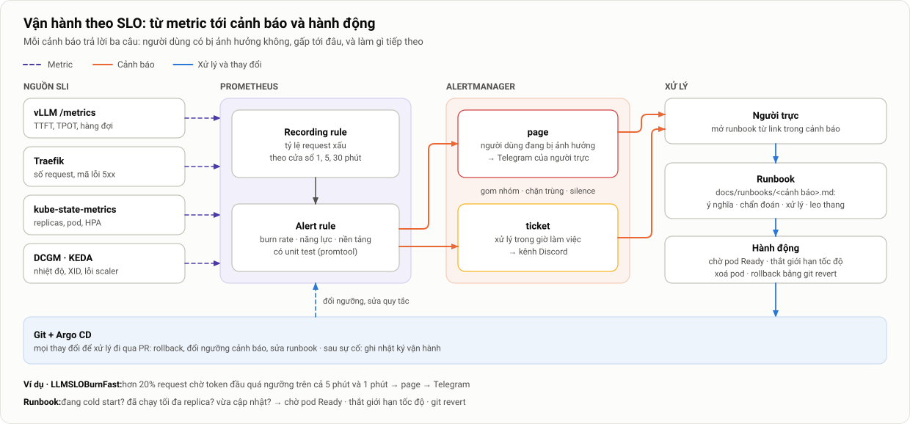

# Thiết kế và Đánh giá Nền tảng LLM Serving trên Kubernetes có Autoscaling

**Tên đề tài đã đăng ký:** *Design and Evaluation of an LLM Serving Platform on Kubernetes with Autoscaling*
**Loại tài liệu:** Bản mô tả chi tiết đồ án tốt nghiệp · phiên bản 2.0 · 04/10/2026 (thay đổi so với bản 1.0: [ADR-002](adr/002-chuyen-trong-tam-sang-van-hanh.md))
**Thời gian thực hiện:** 16 tuần

| Thành viên | Đơn vị | Vai trò trong đồ án |
|---|---|---|
| Trình | FCI – FPT Smart Cloud | Platform Engineering: GPU trên Kubernetes, triển khai vLLM, autoscaling, rút ngắn cold start, cập nhật phiên bản, bảo mật tối thiểu |
| Quang | VCS – Viettel Cyber Security | DevOps/SRE/Cloud: hạ tầng cloud và cluster, IaC & GitOps, giám sát, SLO và cảnh báo, runbook, khôi phục, chi phí, công cụ đánh giá |

---

## Tóm tắt

Đồ án xây dựng và vận hành một nền tảng phục vụ (*serving*) mô hình ngôn ngữ lớn (LLM) mã nguồn mở, cho tình huống một doanh nghiệp **tự host LLM** vì dữ liệu nội bộ không được gửi ra API bên ngoài. Nền tảng dùng **vLLM** chạy trên **Kubernetes** với GPU, tự điều chỉnh số replica (*autoscaling*) theo metric của chính vLLM thông qua **KEDA + HPA**, được dựng và cập nhật hoàn toàn bằng code (**IaC + GitOps với Argo CD**), và có **giám sát, cảnh báo theo SLO và runbook** để vận hành hằng ngày.

Vận hành LLM trên GPU có những khó khăn mà cấu hình mặc định của Kubernetes không giải được:
- GPU utilization không phản ánh tải.
- Một pod mới cần tới vài phút để sẵn sàng (*cold start*).
- Scale-down có thể cắt ngang các request streaming dài.
- Rolling update kiểu web bị kẹt khi mọi GPU đều đang có pod.

Đồ án giải từng vấn đề, rồi **đánh giá** nền tảng để nghiệm thu: so với hai cấu hình tĩnh (1 và 4 replica) dưới ba kịch bản tải của đề cương, và qua sáu kịch bản vận hành (scale-down, cập nhật phiên bản, sự cố, mất nguồn metric, dựng lại từ đầu, cảnh báo).

**Tỷ trọng công việc:** khoảng **70% xây dựng và vận hành**, **30% đánh giá**. Kết quả cuối cùng là một nền tảng dựng lại được bằng vài lệnh, một bộ công cụ vận hành (dashboard, cảnh báo, runbook, quy trình), một **bảng nghiệm thu** cho từng yêu cầu, và khuyến nghị cấu hình.

## Mục lục

1. [Đặt vấn đề](#1-đặt-vấn-đề)
2. [Mục tiêu và yêu cầu hệ thống](#2-mục-tiêu-và-yêu-cầu-hệ-thống)
3. [Phạm vi và giả định](#3-phạm-vi-và-giả-định)
4. [Kiến thức nền và các giải pháp liên quan](#4-kiến-thức-nền-và-các-giải-pháp-liên-quan)
5. [Kiến trúc hệ thống](#5-kiến-trúc-hệ-thống)
6. [Môi trường triển khai và dự toán chi phí](#6-môi-trường-triển-khai-và-dự-toán-chi-phí)
7. [Thiết kế autoscaling](#7-thiết-kế-autoscaling)
8. [Vận hành nền tảng](#8-vận-hành-nền-tảng)
9. [Kiểm thử và đánh giá](#9-kiểm-thử-và-đánh-giá)
10. [Phân công công việc](#10-phân-công-công-việc)
11. [Kế hoạch thực hiện](#11-kế-hoạch-thực-hiện)
12. [Rủi ro và phương án giảm thiểu](#12-rủi-ro-và-phương-án-giảm-thiểu)
13. [Sản phẩm bàn giao](#13-sản-phẩm-bàn-giao)
14. [Hướng mở rộng](#14-hướng-mở-rộng)
15. [Tài liệu tham khảo](#15-tài-liệu-tham-khảo)
- [Phụ lục A. Đối chiếu với đề cương đã nộp](#phụ-lục-a-đối-chiếu-với-đề-cương-đã-nộp)

Mỗi mục 1–14 có một **tài liệu chuyên sâu** riêng; xem danh mục tại [docs/chi-tiet/](chi-tiet/README.md).

---

## 1. Đặt vấn đề

> **Chi tiết:** [docs/chi-tiet/01-dat-van-de.md](chi-tiet/01-dat-van-de.md)

### 1.1. Bối cảnh

Một doanh nghiệp vài nghìn nhân viên muốn có trợ lý AI nội bộ: hỏi đáp tài liệu, soạn thảo, hỗ trợ viết code. Dữ liệu nội bộ không được gửi ra API bên ngoài, nên phải **tự host** một model mã nguồn mở trên GPU của mình hoặc GPU thuê. Đội platform được giao ba yêu cầu: người dùng không phải chờ lâu, kể cả lúc 9 giờ sáng khi mọi người cùng mở trợ lý; không trả tiền cho GPU chạy không vào ban đêm; và đội vận hành ít người nên nền tảng phải tự xử lý phần lớn tình huống.

Chạy suy luận (*inference*) cho LLM đòi hỏi GPU có dung lượng VRAM lớn. Một model 7–8 tỷ tham số ở định dạng BF16 chiếm khoảng 15 GB VRAM chỉ riêng cho trọng số (*weights*). Phần VRAM còn lại dành cho KV-cache, và dung lượng KV-cache quyết định hệ thống xử lý được bao nhiêu request cùng lúc.

GPU có ba đặc điểm gây khó cho việc cấp phát:
- **Đắt.** Thuê một GPU 24 GB trên cloud tốn vài trăm đến hơn một nghìn USD mỗi tháng nếu chạy liên tục.
- **Rời rạc.** Nếu không chia sẻ GPU, mỗi replica chiếm trọn một GPU.
- **Tải không ổn định.** Tải của trợ lý nội bộ cao vào giờ làm việc, gần như bằng 0 ban đêm, và có những đợt tăng đột biến (*burst*).

### 1.2. Bài toán trade-off


*Hình 1. Cùng một tải thay đổi theo thời gian, ba cách cấp phát cho ba kết quả khác nhau. C là năng lực của một replica.*

- **Static-min**, tức cấp ít tài nguyên cố định: khi tải tăng, request phải xếp hàng, độ trễ tăng vọt và SLO bị vi phạm (vùng đỏ).
- **Static-max**, tức cấp đủ cho mức tải đỉnh: SLO luôn đạt, nhưng phần lớn thời gian GPU nhàn rỗi (vùng gạch chéo).
- **Autoscaling**: năng lực phục vụ bám theo tải, nên dùng ít GPU-giờ hơn Static-max. Đổi lại, có một **khoảng trễ scale-up**, gồm thời gian phát hiện tải tăng cộng với thời gian khởi động pod mới. Trong khoảng này hệ thống vẫn bị quá tải.

Với tải 8 giờ cao điểm và 16 giờ thấp điểm mỗi ngày, autoscaling trên giấy tiết kiệm được khoảng **50%** GPU-giờ so với Static-max ([01 §4](chi-tiet/01-dat-van-de.md#4-bối-cảnh-giả-định-và-ba-cách-cấp-phát)). Con số đó chỉ đạt được nếu nền tảng giải quyết được các khó khăn ở §1.3.

### 1.3. Vì sao vận hành LLM trên GPU khó hơn web service thông thường

| Đặc điểm | Web service thông thường | LLM inference trên GPU |
|---|---|---|
| Thời gian khởi động một replica | Vài giây | **1–5 phút**: pull image ~10 GB, nạp weights ~15 GB, compile/CUDA graph |
| Metric phản ánh tải | CPU utilization phản ánh khá tốt | GPU utilization **bão hoà sớm**; VRAM luôn ở mức ~90% vì vLLM cấp phát trước |
| Đơn vị tài nguyên | CPU chia nhỏ được (millicore) | Nguyên một GPU cho mỗi replica |
| Thời gian xử lý một request | Mili-giây, khá đồng đều | Vài giây đến vài chục giây, phụ thuộc độ dài prompt và output |
| Scale-down | Pod tắt gần như ngay | Phải chờ các stream đang mở xong, nếu không request bị cắt |
| Rolling update | `maxSurge: 1, maxUnavailable: 0` là đủ | Pod mới cần thêm một GPU trống; hết GPU thì cập nhật **bị kẹt** |
| Chi phí một replica dư thừa | Thấp | Cao (một GPU mỗi giờ) |

Vì vậy không thể áp nguyên công thức quen thuộc "HPA theo CPU 70%, rolling update mặc định" cho LLM.

### 1.4. Phát biểu bài toán

Xây dựng và vận hành một nền tảng phục vụ LLM tự host trên Kubernetes, với một nhóm N GPU cố định (N = 4), sao cho:
1. **Chất lượng phục vụ:** phần lớn request đạt SLO về độ trễ, kể cả khi tải thay đổi theo giờ hoặc tăng đột ngột.
2. **Hiệu quả tài nguyên:** GPU-giờ chỉ ở mức cần thiết; lúc tải thấp, GPU được giải phóng.
3. **Vận hành được hằng ngày:** cập nhật và scale-down không làm rớt request; có cảnh báo khi chất lượng giảm, mỗi cảnh báo có hướng dẫn xử lý; toàn bộ nền tảng dựng lại được từ Git.

---

## 2. Mục tiêu và yêu cầu hệ thống

> **Chi tiết:** [docs/chi-tiet/02-muc-tieu-yeu-cau.md](chi-tiet/02-muc-tieu-yeu-cau.md)

### 2.1. Mục tiêu tổng quát

Xây dựng và vận hành một nền tảng LLM serving trên Kubernetes có autoscaling, triển khai và cập nhật hoàn toàn bằng code, có giám sát và cảnh báo theo SLO, có quy trình xử lý sự cố. Sau đó đánh giá nền tảng bằng các kịch bản tải và kịch bản vận hành, so với cấu hình tài nguyên cố định.

Bảy mục tiêu cụ thể trong đề cương được **giữ nguyên** và được cụ thể hoá thành các yêu cầu dưới đây (đối chiếu ở [02 §5](chi-tiet/02-muc-tieu-yeu-cau.md#5-đối-chiếu-với-bảy-mục-tiêu-của-đề-cương)).

### 2.2. Yêu cầu chức năng

| # | Yêu cầu |
|---|---|
| **F1** | Phục vụ một model 7–8B qua API tương thích OpenAI, có streaming |
| **F2** | Tự điều chỉnh số replica trong khoảng [1, N] theo tải (N = số GPU) |
| **F3** | Triển khai, cập nhật và rollback hoàn toàn qua Git (Argo CD) |
| **F4** | Dựng toàn bộ hạ tầng từ máy trắng bằng vài lệnh `make` |
| **F5** | Dashboard cho serving, GPU, autoscaling, SLO và chi phí |
| **F6** | Cảnh báo theo SLO và sức khoẻ nền tảng, gửi tới kênh chat; mỗi cảnh báo có runbook |
| **F7** | Bảo vệ tối thiểu: API key, giới hạn tốc độ, NetworkPolicy, bí mật được mã hoá trong Git |

### 2.3. Chỉ tiêu nghiệm thu (sơ bộ, chốt sau bước đo năng lực)

| # | Chỉ tiêu |
|---|---|
| **N1** | Với cấu hình vận hành A2: SLO attainment ≥ 95% ở tải thấp (KB1) và tải cao kéo dài (KB3) |
| **N2** | Khi tải tăng đột ngột (KB2): replica mới Ready ≤ 2 phút; SLO hồi phục ≤ 5 phút |
| **N3** | Ở tải thấp: A2 dùng ≤ 50% GPU-giờ của Static-4, SLO attainment kém không quá 5 điểm phần trăm |
| **N4** | 0 request lỗi do scale-down và do cập nhật phiên bản |
| **N5** | Cold start sau tối ưu ≤ 50% so với chưa tối ưu |
| **N6** | Pod hỏng được thay tự động; mất Prometheus thì autoscaling chuyển sang chế độ dự phòng; dựng lại toàn bộ từ VM trắng ≤ 30 phút |
| **N7** | Cảnh báo SLO kích hoạt ≤ 5 phút sau khi SLO bị vi phạm thật; không có cảnh báo mức page khi hệ thống khoẻ |
| **N8** | Mọi phiên bản được ghim; người thứ hai dựng được cluster laptop theo README trong < 1 giờ; tiền thuê GPU ≤ 150 USD |

Kết quả của đồ án được tổng hợp thành một **bảng nghiệm thu**: mỗi yêu cầu có số đo và kết luận Đạt hoặc Không đạt ([09 §12](chi-tiet/09-kiem-thu-danh-gia.md#12-trình-bày-kết-quả-và-bảng-nghiệm-thu)).

### 2.4. Đóng góp dự kiến

1. Một nền tảng LLM serving hoàn chỉnh, dựng lại được bằng code, chạy trên cả cluster laptop lẫn GPU thuê.
2. Thiết kế autoscaling cho LLM dựa trên metric của vLLM, kèm số đo cho thấy vì sao không nên scale theo GPU utilization.
3. Quy trình rút ngắn cold start của vLLM trên Kubernetes, đo theo từng pha.
4. Bộ công cụ vận hành cho LLM serving: SLO, quy tắc cảnh báo, runbook, quy trình cập nhật khi hết GPU trống, quy trình dựng lại.
5. Kết quả đánh giá so với cấu hình tĩnh, và khuyến nghị cấu hình có ghi rõ điều kiện áp dụng.

---

## 3. Phạm vi và giả định

> **Chi tiết:** [docs/chi-tiet/03-pham-vi-gia-dinh.md](chi-tiet/03-pham-vi-gia-dinh.md)

### 3.1. Trong phạm vi

- Phục vụ inference cho **một model** trên Kubernetes bằng vLLM, chạy trên GPU.
- **Autoscaling ở mức pod** (thay đổi số replica) trên một nhóm GPU có số lượng cố định. Mỗi replica dùng một GPU.
- Rút ngắn cold start của pod vLLM.
- IaC, GitOps và CI để nền tảng dựng lại được.
- Giám sát, SLO, cảnh báo, runbook; cập nhật phiên bản, xử lý sự cố, dựng lại từ đầu; bảo mật ở mức tối thiểu.
- Sinh tải và đánh giá để nghiệm thu yêu cầu.

### 3.2. Ngoài phạm vi

- Huấn luyện, fine-tuning, và nghiên cứu kiến trúc LLM.
- Chia sẻ hoặc cô lập GPU giữa nhiều tenant (MIG, time-slicing).
- Tensor/pipeline parallelism, tách riêng prefill và decode (*disaggregated serving*).
- Autoscaling ở mức node (Cluster Autoscaler, Karpenter), định tuyến có nhận biết đặc thù LLM. Hai mục này thuộc hướng mở rộng.
- Log tập trung và tracing; phân quyền chi tiết, đa người dùng.

### 3.3. Giả định

1. **Chi phí được đo bằng GPU-giờ cấp phát cho các pod vLLM.** Đại lượng này tương ứng với mô hình trả tiền theo mức dùng trên cloud, hoặc với lượng GPU được giải phóng cho workload khác trong cluster dùng chung. Trên một nhóm GPU cố định dành riêng, scale-down **không tự động làm giảm tiền phải trả**; luận văn sẽ ghi rõ điều này.
2. Model vừa với một GPU, nên không cần tensor parallelism.
3. Máy tạo tải chạy **trên cùng VM** với cluster, dưới dạng pod có **lõi CPU riêng**, nên không có độ trễ và dao động mạng giữa máy tạo tải và hệ thống được đo.
4. Mọi phiên bản phần mềm (vLLM, KEDA, driver, model) được **ghim cố định** trong suốt đợt đánh giá.

---

## 4. Kiến thức nền và các giải pháp liên quan

> **Chi tiết:** [docs/chi-tiet/04-kien-thuc-nen.md](chi-tiet/04-kien-thuc-nen.md)

### 4.1. vLLM

- **PagedAttention.** vLLM quản lý KV-cache theo từng block, tương tự cách hệ điều hành phân trang bộ nhớ. Cách làm này giảm phân mảnh bộ nhớ và cho phép gộp nhiều request vào cùng một batch [1].
- **Continuous batching.** Ở mỗi bước decode, request mới được chèn vào batch và request đã xong được loại ra. Nhờ đó GPU luôn bận, nhưng các request ảnh hưởng lẫn nhau về độ trễ.
- **Hai pha xử lý:** *prefill* đọc toàn bộ prompt và sinh token đầu tiên; *decode* sinh lần lượt từng token tiếp theo (Hình 3, mục 5.3).
- **Các tham số quyết định năng lực phục vụ:** `--max-model-len`, `--max-num-seqs`, `--max-num-batched-tokens`, `--gpu-memory-utilization`. Các tham số này được **giữ cố định** trong đợt đánh giá.

vLLM cung cấp các metric sau qua endpoint `/metrics` (định dạng Prometheus). Tên metric có thể thay đổi giữa các phiên bản, nên sau khi ghim phiên bản cần kiểm tra lại bằng `curl <pod>:8000/metrics`:

| Metric | Loại | Ý nghĩa và cách dùng |
|---|---|---|
| `vllm:num_requests_running` | gauge | Số request đang được xử lý trên GPU. Dùng cho A2 |
| `vllm:num_requests_waiting` | gauge | Số request đang chờ trong hàng đợi. Dùng cho A2 và cho chẩn đoán |
| `vllm:kv_cache_usage_perc` | gauge (0–1) | Tỷ lệ KV-cache đang dùng. Dùng cho A3 (phiên bản cũ tên là `vllm:gpu_cache_usage_perc`) |
| `vllm:time_to_first_token_seconds` | histogram | TTFT đo phía server. Dùng cho SLI và cảnh báo |
| `vllm:inter_token_latency_seconds` | histogram | ITL (phiên bản cũ tên là `vllm:time_per_output_token_seconds`) |
| `vllm:e2e_request_latency_seconds` | histogram | Độ trễ end-to-end phía server |
| `vllm:request_queue_time_seconds` | histogram | Thời gian chờ trong hàng đợi |
| `vllm:generation_tokens_total`, `vllm:prompt_tokens_total` | counter | Dùng để tính throughput (token/s) và chi phí trên token |
| `vllm:num_preemptions_total` | counter | Số lần request bị tạm dừng do hết KV-cache, là dấu hiệu quá tải |

### 4.2. Autoscaling trên Kubernetes

**HPA (Horizontal Pod Autoscaler).** Controller có sẵn của Kubernetes. Mặc định cứ 15 s nó tính lại số replica mong muốn một lần. Với external metric kiểu `AverageValue`:

$$
\text{desiredReplicas} = \left\lceil \frac{\text{giá trị metric (tổng toàn Deployment)}}{\text{target cho mỗi replica}} \right\rceil
$$

HPA bỏ qua các dao động nhỏ hơn 10% (*tolerance*). Tham số `behavior` điều khiển tốc độ và độ "bình tĩnh" khi scale: scale-down mặc định có cửa sổ ổn định 300 s; scale-up mặc định cho phép tăng tới 100% số pod, hoặc thêm 4 pod, mỗi 15 s.

**KEDA.** KEDA gồm *operator*, đọc `ScaledObject` và tạo HPA tương ứng, và *metrics API server*, chạy truy vấn PromQL tới Prometheus rồi trả kết quả cho HPA dưới dạng external metric. Khi scale từ 1 lên N, chính **HPA** hỏi metric theo chu kỳ sync của nó (mặc định 15 s; trên k3s chỉnh được xuống 5 s), nên đây mới là tham số quyết định tốc độ phát hiện. KEDA hỗ trợ scale về 0, nhưng đồ án không dùng vì cold start dài không hợp với dịch vụ tương tác.

### 4.3. GPU trên Kubernetes

- **NVIDIA GPU Operator** cài và quản lý driver, container toolkit, **device plugin** (công bố tài nguyên `nvidia.com/gpu`), GPU Feature Discovery và **DCGM exporter**.
- **`DCGM_FI_DEV_GPU_UTIL`** chỉ đo tỷ lệ thời gian có kernel đang chạy, **không** cho biết GPU bận đến mức nào, nên bão hoà sớm. `DCGM_FI_PROF_SM_ACTIVE` có ý nghĩa hơn nhưng chỉ có trên GPU datacenter.

### 4.4. Vận hành theo SLO và GitOps

- **SLI, SLO, ngân sách lỗi** [23]: SLI là tỷ lệ request "tốt" (ví dụ TTFT ≤ 2 s); SLO là mục tiêu cho SLI (ví dụ 95%); ngân sách lỗi là phần còn lại (5%).
- **Cảnh báo theo burn rate**: cảnh báo khi ngân sách lỗi bị tiêu nhanh hơn mức cho phép, xét trên hai cửa sổ thời gian cùng lúc, chia hai mức *page* và *ticket*. Cách này ít báo giả hơn ngưỡng tĩnh trên p95.
- **GitOps với Argo CD** [26]: trạng thái mong muốn nằm trong Git; Argo CD liên tục đưa cluster về đúng như Git; rollback bằng `git revert`.
- **Rolling update** [24]: hai tham số `maxSurge` và `maxUnavailable` quyết định pod mới được tạo trước hay pod cũ bị xoá trước. Đây là điểm mấu chốt khi đã hết GPU trống (mục 8.4).

### 4.5. Các giải pháp liên quan

| Giải pháp | Cách tiếp cận autoscaling / serving | Liên hệ với đồ án |
|---|---|---|
| **KServe** | Chế độ serverless dùng Knative KPA (theo số request đồng thời); chế độ raw deployment dùng HPA/KEDA; có tính năng cache model cục bộ | Cùng các cơ chế nền tảng |
| **vLLM Production Stack** | Helm chart cho vLLM, có router, observability, hướng dẫn autoscaling bằng KEDA | Kiến trúc tương tự; đồ án bổ sung phần vận hành và đánh giá |
| **llm-d / Gateway API Inference Extension** | Định tuyến theo trạng thái KV-cache và hàng đợi; tách prefill/decode | Hướng mở rộng (routing) |
| **AIBrix, NVIDIA Dynamo** | Autoscaler và planner chuyên cho LLM; serving phân tán | Tham khảo cho phần thảo luận |
| **ServerlessLLM** [4] | Giảm cold start bằng cách nạp checkpoint nhanh, nhiều tầng lưu trữ | Cơ sở cho các kỹ thuật rút ngắn cold start |
| **DistServe** [2], **Splitwise** [3], **BurstGPT** [5] | Khái niệm *goodput* theo SLO; trace tải thật | SLO theo request; nguồn trace cho hướng mở rộng |

**Định vị của đồ án.** Đồ án **không xây dựng autoscaler mới** và không tối ưu engine. Đồ án lắp ráp một nền tảng từ các thành phần chuẩn mà doanh nghiệp đang dùng (Kubernetes, KEDA, Prometheus, Argo CD), giải các vấn đề vận hành riêng của GPU và LLM, rồi đo để biết nền tảng đáp ứng được tới đâu. Vì hầu hết các nền tảng kể trên đều dựa trên HPA, KEDA hoặc KPA, cấu hình và quy trình của đồ án áp dụng được cho chúng.

---

## 5. Kiến trúc hệ thống

> **Chi tiết:** [docs/chi-tiet/05-kien-truc-he-thong.md](chi-tiet/05-kien-truc-he-thong.md)

### 5.1. Tổng quan


*Hình 2. Kiến trúc tổng thể. Request đi từ client qua Traefik (API key, giới hạn tốc độ) và Service tới các pod vLLM, mỗi pod gắn một GPU. Prometheus thu metric từ vLLM và DCGM; Alertmanager gửi cảnh báo. KEDA chạy PromQL và cung cấp external metric cho HPA; HPA cập nhật `spec.replicas` của Deployment. Pod mới chỉ nhận traffic sau khi đã Ready.*

### 5.2. Các thành phần

| Thành phần | Vai trò | Cấu hình chính | Phụ trách |
|---|---|---|---|
| Kubernetes (k3s) | Điều phối container | Một node (cloud) hoặc nhiều node (laptop); dựng bằng Ansible | Quang |
| NVIDIA GPU Operator / device plugin | Driver, device plugin, DCGM exporter | Trên laptop dùng `driver.enabled=false` (driver cài sẵn) | Trình |
| vLLM (Deployment) | Phục vụ model qua API OpenAI | 1 GPU/pod; tham số cố định; probe, `preStop`; rolling update `maxSurge: 0` | Trình |
| Lưu trữ model | Lưu weights để không phải tải lại | NVMe cục bộ (máy thuê) hoặc PVC (laptop); Job prefetch, DaemonSet pre-pull | Trình |
| Traefik (Ingress) | Điểm vào, xác thực, giới hạn tốc độ | Có sẵn trong k3s; không dùng ingress-nginx (đã ngừng bảo trì từ 3/2026); bật metric | Trình |
| KEDA | Chuyển metric Prometheus thành external metric, tạo HPA | A2 là cấu hình chính thức; chu kỳ sync HPA 5 s | Trình |
| Prometheus, Alertmanager (kube-prometheus-stack) | Thu metric, tính SLI, gửi cảnh báo | Scrape mỗi 5 s; recording rule; cảnh báo theo burn rate tới Telegram/Discord | Quang |
| Grafana | Dashboard | 5 dashboard (mục 5.6) | Quang |
| Argo CD | GitOps: đồng bộ cluster theo Git | Mỗi môi trường một overlay; sync window cho cập nhật | Quang |
| Sealed Secrets | Bí mật mã hoá trong Git | Khoá riêng của controller sao lưu ngoài Git | Quang |
| Script thuê VM (CLI `vastai`) + Ansible | Thuê/huỷ VM GPU; cài k3s, driver | Dựng trọn bộ trong ≤ 30 phút sau khi thuê | Quang |
| Máy tạo tải + runner | Sinh tải, chạy đánh giá, thu dữ liệu | Python asyncio; máy tạo tải là pod có lõi CPU riêng | Quang |

### 5.3. Luồng xử lý một request


*Hình 3. Vòng đời một request và các metric độ trễ. Khi tải tăng, thời gian chờ trong hàng đợi (queue time) tăng đầu tiên, kéo theo TTFT tăng. Đây là tín hiệu sớm nhất cho biết hệ thống cần scale.*

1. Client gửi `POST /v1/chat/completions` với `stream: true` và khoá API tới Traefik.
2. Traefik kiểm tra khoá và giới hạn tốc độ, Service chọn một pod đang Ready, rồi scheduler của vLLM đưa request vào hàng đợi (*waiting*).
3. Khi còn chỗ trong batch và còn KV-cache, request chuyển sang *running*: prefill rồi decode.
4. Mỗi token sinh ra được gửi về dưới dạng Server-Sent Events.
5. Thời điểm vào hàng đợi, token đầu và kết thúc được vLLM ghi vào histogram; Prometheus dùng chúng để tính SLI.

### 5.4. Vòng lặp autoscaling


*Hình 4. Vòng lặp autoscaling chia thành pha phát hiện (bước 1–4) và pha thực thi (bước 5–8). Các con số thời gian là ước lượng và sẽ được đo thực tế.*

$$
T_{\text{phản ứng}} = \underbrace{T_{\text{scrape}} + T_{\text{HPA sync}} + T_{\text{PromQL}}}_{\text{phát hiện: } \sim 10\text{–}30\,s} + \underbrace{T_{\text{schedule}} + T_{\text{pull}} + T_{\text{load}} + T_{\text{compile}} + T_{\text{ready}}}_{\text{cold start: } \sim 1\text{–}5\text{ phút}}
$$

**Ví dụ tính số replica.** A2 đặt target 24 request đồng thời cho mỗi replica. Hiện có 1 replica, tổng `running + waiting` là 70. HPA tính ra $\lceil 70/24 \rceil = 3$ replica. Hai pod mới được tạo, và chỉ nhận traffic sau khi cold start xong.

### 5.5. Cold start và cách rút ngắn


*Hình 5. Phân rã cold start. Số liệu chỉ để minh hoạ khung đo; kết quả thực tế sẽ thay vào ở chương đánh giá.*

| Mức | Kỹ thuật | Pha được rút ngắn |
|---|---|---|
| L0 | Không tối ưu: image và model tải từ Internet mỗi lần tạo pod | – |
| L1 | Model nằm sẵn trên PVC, pod chỉ mount và đọc | Tải model |
| L2 | L1, cộng: **pre-pull image**, model trên **NVMe cục bộ**, giữ **compile cache** của vLLM trên volume | Pull image, nạp weights, compile |
| (tuỳ chọn) | Warm pool: đặt `minReplicas` > 1 | Bỏ hẳn cold start cho replica đầu tiên, nhưng tốn thêm GPU-giờ |

L2 là cấu hình vận hành; đồ án đo L0 và L2 để biết rút ngắn được bao nhiêu (N5).

### 5.6. Giám sát

Bốn nguồn metric được Prometheus thu mỗi 5 s: vLLM, DCGM (hoặc `nvidia_gpu_exporter`), kube-state-metrics, Traefik. Năm dashboard Grafana:
- **Serving:** RPS, TTFT/ITL p95, hàng đợi, request đang chạy, token/s.
- **GPU:** utilization, VRAM, công suất, nhiệt độ, xung nhịp.
- **Autoscaling:** replica mong muốn so với hiện có, metric so với target, pod theo trạng thái.
- **SLO và chi phí:** SLI so với SLO, ngân sách lỗi còn lại, cảnh báo đang bật, GPU-giờ và chi phí ước tính.
- **Đánh giá:** annotation ranh giới các pha của kịch bản tải, do runner gửi qua Grafana API.

### 5.7. Cấu hình triển khai mẫu

Deployment vLLM (rút gọn):

```yaml
apiVersion: apps/v1
kind: Deployment
metadata:
  name: vllm
  namespace: llm-serving
spec:
  # không có trường replicas: HPA quản lý (xem 05 §10.3)
  strategy:
    type: RollingUpdate
    rollingUpdate: {maxSurge: 0, maxUnavailable: 1}   # không bị kẹt khi hết GPU trống (mục 8.4)
  progressDeadlineSeconds: 900
  selector:
    matchLabels: {app: vllm}
  template:
    metadata:
      labels: {app: vllm}
    spec:
      terminationGracePeriodSeconds: 180   # đủ cho request dài nhất hoàn tất
      nodeSelector:
        nvidia.com/gpu.present: "true"
      containers:
        - name: vllm
          image: vllm/vllm-openai@sha256:…  # ghim theo digest
          args:
            - --model=/models/Qwen2.5-7B-Instruct
            - --served-model-name=qwen2.5-7b
            - --max-model-len=8192
            - --max-num-seqs=64
            - --gpu-memory-utilization=0.90
          ports:
            - {name: http, containerPort: 8000}
          resources:
            limits: {nvidia.com/gpu: 1, cpu: "6", memory: 24Gi}
            requests: {cpu: "6", memory: 24Gi}
          volumeMounts:
            - {name: models, mountPath: /models, readOnly: true}
            - {name: dshm, mountPath: /dev/shm}
          startupProbe:                     # cho phép tới 10 phút nạp model
            httpGet: {path: /health, port: http}
            periodSeconds: 5
            failureThreshold: 120
          readinessProbe:
            httpGet: {path: /health, port: http}
            periodSeconds: 5
          lifecycle:
            preStop:                        # chờ Endpoints cập nhật rồi mới SIGTERM
              exec: {command: ["sleep", "20"]}
      volumes:
        - name: models
          hostPath: {path: /mnt/nvme/models, type: Directory}
        - name: dshm
          emptyDir: {medium: Memory, sizeLimit: 8Gi}
```

---

## 6. Môi trường triển khai và dự toán chi phí

> **Chi tiết:** [docs/chi-tiet/06-moi-truong-chi-phi.md](chi-tiet/06-moi-truong-chi-phi.md)

### 6.1. Chiến lược hai tầng


*Hình 6. Phát triển và vận hành thử trên laptop (gần như miễn phí), đánh giá trên GPU thuê theo giờ. Cả hai tầng triển khai từ cùng một Git repository và chỉ khác nhau ở overlay.*

Nhóm có **laptop RTX 4060 (8 GB VRAM)** và thuê **GPU trên các nền tảng trực tuyến**. Mọi thứ làm được trên laptop thì làm trên laptop, kể cả phần lớn các kịch bản vận hành (cảnh báo, drain node, rolling update). Chỉ lên cloud khi nền tảng đã ổn định (mốc M2, tuần 8).

### 6.2. Tầng 1: laptop RTX 4060

- **Hệ điều hành:** Ubuntu 22.04/24.04 cài trực tiếp (dual-boot). WSL2 không phù hợp để dựng Kubernetes có GPU.
- **Cluster:** k3s, dựng bằng Ansible. Nếu có 2–3 laptop thì nối qua mạng LAN thành **cluster nhiều node, mỗi node một GPU**, để có thể demo autoscaling 1 → 3 replica và thử drain node mà không tốn chi phí.
- **Model:** Qwen2.5-1.5B-Instruct (khoảng 3 GB ở BF16), `--max-model-len` 4096.
- **Dùng cho:** phát triển; kiểm thử chức năng; kịch bản vận hành; **demo trực tiếp khi bảo vệ**.
- **Hạn chế:** GPU laptop có thể giảm xung vì nhiệt và VRAM nhỏ, nên **số liệu hiệu năng từ laptop không dùng trong chương đánh giá**.

### 6.3. Tầng 2: GPU thuê trên marketplace

Lựa chọn đã chốt nằm trong [ADR-001](adr/001-cac-lua-chon-ban-dau.md): thuê **Vast.ai ở chế độ VM** (có systemd để chạy k3s), **1 VM × 4 RTX 4090 24 GB, thuê trọn máy, on-demand**; dự phòng TensorDock. Máy phải qua **burn-in** khoảng 1 giờ (4 GPU chênh nhau ≤ 5%, không giảm xung) trước khi dùng. Toàn bộ phần đánh giá chạy trong **một đợt liên tục khoảng 37 giờ** trên cùng một máy.

### 6.4. Dự toán chi phí

| Hạng mục | Giờ | GPU-giờ |
|---|---|---|
| Chạy thử script trên VM 1 GPU (T8) | 4 | 4 |
| Máy ứng viên trượt burn-in (tối đa 2) | 2 | 8 |
| Đợt chính (T9): dựng từ máy trắng, đo năng lực, cold start, ma trận 28 lượt, kịch bản vận hành, chạy lại | 37 | 148 |
| **Cộng theo kế hoạch** | **43** | **≈ 160** |
| Đợt dự phòng (T11, chỉ khi cần) | ≤ 8 | ≤ 32 |

Với giá RTX 4090 khoảng 0,35–0,50 USD/GPU-giờ, chi phí khoảng **60–105 USD** kể cả đợt dự phòng và tiền ổ đĩa, bằng khoảng một nửa bản 1.0 và nằm trong ngân sách 100–200 USD. Tín dụng trả trước 100 USD là giới hạn cứng; runner báo động khi số dư dưới 30 USD và instance được huỷ ngay khi xong.

---

## 7. Thiết kế autoscaling

> **Chi tiết:** [docs/chi-tiet/07-chien-luoc-autoscaling.md](chi-tiet/07-chien-luoc-autoscaling.md)

### 7.1. Các cấu hình

| Mã | Tên | Cơ chế | Metric (PromQL) | Target mỗi replica | Vai trò |
|---|---|---|---|---|---|
| **S1** | Static-1 | `replicas: 1` | – | – | Cấp thiếu: chi phí thấp nhất |
| **S4** | Static-4 | `replicas: 4` | – | – | Cấp theo đỉnh: hiệu năng tốt nhất |
| **A1** | GPU utilization | KEDA Prometheus | `sum(DCGM_FI_DEV_GPU_UTIL{namespace="llm-serving"})` ¹ | 70 (%) | Đối chứng: cách làm phổ biến |
| **A2** | Tải đồng thời | KEDA Prometheus | `sum(vllm:num_requests_running) + sum(vllm:num_requests_waiting)` | 0,8 × B\* | **Cấu hình vận hành chính thức** |
| A3 | KV-cache usage | KEDA Prometheus | `sum(vllm:kv_cache_usage_perc)` | 0,8 × KV\* | Tuỳ chọn (Could) |

¹ Tên label của pod/namespace trong metric DCGM phụ thuộc cấu hình scrape (có thể là `exported_namespace`); cần kiểm tra lại khi triển khai.

Mọi cấu hình autoscaling dùng chung `minReplicaCount: 1`, `maxReplicaCount: 4` (bằng Static-4), cùng chu kỳ scrape và sync HPA (5 s), và cùng tham số `behavior`. **Chỉ có metric là khác nhau.**

### 7.2. Vì sao không scale chỉ theo hàng đợi

Nếu chỉ dùng `num_requests_waiting`, khi hàng đợi về 0 thì HPA tính ra 0 replica mong muốn và sẽ scale-down, dù các replica vẫn đang bận xử lý đầy batch. Kết quả là số replica dao động lên xuống liên tục (*flapping*). A2 cộng thêm `running` để tránh hiện tượng này; theo định luật Little, tổng `running + waiting` tỷ lệ với tải. Hiện tượng flapping được minh hoạ bằng cấu hình A4 (chỉ hàng đợi) trên cluster laptop.

### 7.3. Cách chọn target

Target được chọn **từ kết quả đo năng lực** (mục 9.2), không chọn theo cảm tính:
- **B\*** là số request đồng thời trung bình trên một replica khi tải bằng C (năng lực tối đa mà vẫn đạt SLO). A2 dùng target 0,8 × B\* để chừa 20% dư phòng cho lúc chờ cold start.
- A1 dùng mức phổ biến 70%, để thấy hành vi thật của cách làm này.
- Khi đổi model, GPU hoặc dạng tải, phải **đo lại** B\*. Quy trình tìm target mới là khuyến nghị, không phải con số cụ thể.

### 7.4. ScaledObject mẫu (A2)

```yaml
apiVersion: keda.sh/v1alpha1
kind: ScaledObject
metadata:
  name: vllm-a2
  namespace: llm-serving
spec:
  scaleTargetRef:
    name: vllm
  minReplicaCount: 1
  maxReplicaCount: 4
  pollingInterval: 5                  # chủ yếu cho kích hoạt 0↔1; tốc độ 1↔N do chu kỳ sync của HPA
  fallback: {failureThreshold: 3, replicas: 4}   # mất Prometheus thì ưu tiên chất lượng
  advanced:
    horizontalPodAutoscalerConfig:
      behavior:
        scaleDown:
          stabilizationWindowSeconds: 300   # chờ 5 phút ổn định rồi mới giảm
          policies:
            - {type: Pods, value: 1, periodSeconds: 60}
        # scaleUp giữ mặc định của HPA: không có cửa sổ chờ
  triggers:
    - type: prometheus
      metricType: AverageValue
      metadata:
        serverAddress: http://prometheus-operated.monitoring.svc:9090
        query: |
          (sum(vllm:num_requests_running{namespace="llm-serving"}) or vector(0))
          + (sum(vllm:num_requests_waiting{namespace="llm-serving"}) or vector(0))
        threshold: "24"                      # = 0,8 × B*, lấy từ bước đo năng lực
```

A1 và A3 chỉ khác ở `query` và `threshold`. Cấu hình A2 nằm trong Git và do Argo CD quản lý; khi đánh giá, runner tạm tắt auto-sync để đổi cấu hình theo từng lượt.

### 7.5. Scale-down an toàn

Khi scale-down, pod bị xoá có thể đang xử lý request streaming. Nhóm xử lý như sau:
- `preStop` chờ khoảng 20 s để Service kịp gỡ pod khỏi danh sách Endpoints.
- vLLM nhận SIGTERM và hoàn tất các request đang chạy trong thời gian `terminationGracePeriodSeconds`.
- **Kiểm chứng** bằng pha giảm tải của KB2 và kịch bản VH1: số request lỗi trong lúc scale-down phải bằng 0 (N4).

---

## 8. Vận hành nền tảng

> **Chi tiết:** [docs/chi-tiet/08-van-hanh.md](chi-tiet/08-van-hanh.md)

### 8.1. Tổng quan



*Hình 7. Đường đi từ metric tới hành động. SLI được tính bằng recording rule; cảnh báo đặt theo burn rate; Alertmanager định tuyến theo mức độ (page, ticket); người trực mở runbook; mọi thay đổi để xử lý đều đi qua Git.*

Vận hành là những việc phải làm sau khi nền tảng đã chạy. Mỗi việc có công cụ, sản phẩm trong repo, và một kịch bản để kiểm chứng:

| Việc | Câu hỏi phải trả lời được | Kiểm chứng |
|---|---|---|
| Quan sát | Người dùng có đang được phục vụ tốt không? | Mọi lượt đánh giá |
| Cảnh báo | Khi nào cần con người vào cuộc, gấp tới đâu? | VH6 |
| Xử lý | Nhận cảnh báo xong thì làm gì? | VH3, VH4, VH6 |
| Thay đổi | Cập nhật phiên bản thế nào cho an toàn, rollback thế nào? | VH1, VH2 |
| Khôi phục | Mất cả cluster thì dựng lại thế nào, mất bao lâu? | VH5 |
| Bảo vệ, chi phí | Ai được gọi API? Đang tốn bao nhiêu GPU-giờ, khi nào cần thêm GPU? | Checklist; dashboard |

### 8.2. SLO và cảnh báo

- **SLO:** 95% request có TTFT ≤ ngưỡng (khoảng 2 s, chốt trùng một biên bucket của histogram vLLM); 99% request không trả lỗi 5xx (đo ở Traefik).
- **Cảnh báo theo burn rate** trên hai cửa sổ, rút ngắn để phù hợp với các lượt đánh giá 20–25 phút:

| Cảnh báo | Điều kiện (rút gọn) | Mức |
|---|---|---|
| `LLMSLOBurnFast` | ≥ 20% request vượt ngưỡng TTFT, trên cả 5 phút và 1 phút | page |
| `LLMSLOBurnSlow` | ≥ 10% request vượt ngưỡng TTFT, trên cả 30 phút và 5 phút | ticket |
| `LLMErrorRateHigh` | Tỷ lệ 5xx ≥ 1% trong 5 phút | page |
| `LLMAtMaxReplicas` | Chạy tối đa replica 15 phút mà vẫn có request phải chờ | ticket |
| `LLMPodPending` | Pod vLLM Pending > 10 phút (thường do hết GPU) | ticket |
| `LLMPodNotReady`, `LLMPodCrashLooping` | Pod không lên được | page |
| `KedaScalerErrors` | Autoscaling không lấy được metric | page |
| `GPUTemperatureHigh`, `GPUXidError` | GPU quá nhiệt; lỗi phần cứng hoặc driver | ticket / page |

Quy tắc cảnh báo có **unit test** bằng `promtool test rules` trong CI. Alertmanager gửi mức page tới nhóm Telegram của người trực, mức ticket tới kênh Discord, có gom nhóm và chặn trùng.

### 8.3. Runbook

Mỗi cảnh báo có một file `docs/runbooks/<TênCảnhBáo>.md` theo cùng một khung: **ý nghĩa, ảnh hưởng, chẩn đoán nhanh (≤ 5 phút), xử lý theo từng nguyên nhân, leo thang, việc sau sự cố**. Runbook được dùng thật trong đợt thuê GPU (hai thành viên trực theo ca), trong các kịch bản vận hành và trong phần demo.

### 8.4. Cập nhật phiên bản khi GPU đã dùng hết

Đổi phiên bản vLLM, revision của model hay tham số đều buộc Deployment thay toàn bộ pod. Cấu hình quen thuộc của web (`maxSurge: 1, maxUnavailable: 0`) tạo pod mới trước. Khi cả 4 GPU đều đang có pod, pod mới nằm Pending và lần cập nhật **bị kẹt** (Hình 16 trong [08 §5](chi-tiet/08-van-hanh.md#5-cập-nhật-phiên-bản-khi-gpu-đã-dùng-hết)).

| Phương án | Ưu | Nhược |
|---|---|---|
| (a) `maxSurge: 1, maxUnavailable: 0` | Không giảm năng lực khi còn GPU trống | Kẹt khi hết GPU |
| **(b) `maxSurge: 0, maxUnavailable: 1`** (chọn) | Không bao giờ kẹt | Giảm một replica trong mỗi lần thay pod (1–2 phút) |
| (c) (a) cộng `maxReplicaCount` = số GPU − 1 | Không giảm năng lực | Mất vĩnh viễn một replica năng lực tối đa |

Đồ án chọn (b), kết hợp **sync window** của Argo CD để cập nhật vào lúc tải thấp. Quy trình cập nhật: prefetch model mới trước → PR đổi digest hoặc tham số → CI → Argo CD sync → theo dõi dashboard và cảnh báo. Rollback bằng `git revert`. Không dùng `kubectl rollout undo`, vì Argo CD sẽ đưa cluster về lại phiên bản trong Git.

### 8.5. Sự cố và khôi phục

- **Tự phục hồi:** container chết thì kubelet khởi động lại; pod bị xoá thì ReplicaSet tạo pod mới; mất Prometheus thì KEDA chuyển sang `fallback` (4 replica); node bảo trì thì pod được tạo lại ở node khác nếu còn GPU trống.
- **Dựng lại từ đầu:** gần như mọi thứ nằm trong Git. Thứ duy nhất phải sao lưu ngoài Git là **khoá riêng của Sealed Secrets controller**; weights tải lại theo revision đã ghim. Chỉ tiêu: từ VM trắng tới khi API phục vụ được ≤ 30 phút (N6), đo bằng kịch bản VH5.

### 8.6. Bảo mật tối thiểu và chi phí

- **Bảo mật:** API chỉ mở trong mạng nội bộ; khoá API; giới hạn tốc độ theo khoá ở Traefik; NetworkPolicy chỉ cho Traefik và Prometheus gọi vào pod vLLM; bí mật mã hoá bằng Sealed Secrets; image ghim theo digest; `gitleaks` trong CI.
- **Chi phí và năng lực:** dashboard hiển thị GPU-giờ theo ngày và chi phí trên 1 triệu token. Số GPU cần có cho đỉnh tải là ⌈λ_đỉnh ÷ (0,8 × C)⌉; cảnh báo `LLMAtMaxReplicas` xuất hiện thường xuyên là tín hiệu cần thêm GPU.

---

## 9. Kiểm thử và đánh giá

> **Chi tiết:** [docs/chi-tiet/09-kiem-thu-danh-gia.md](chi-tiet/09-kiem-thu-danh-gia.md)

### 9.1. Cách tiếp cận

Phần đánh giá dùng để **nghiệm thu** các yêu cầu ở mục 2, không phải một nghiên cứu thống kê. Có ba lớp:

| Lớp | Ở đâu | Nội dung |
|---|---|---|
| Kiểm thử chức năng | Laptop, từ T4 | API, probe, bài kiểm thử autoscaling, unit test cảnh báo, checklist bảo mật |
| Kịch bản vận hành VH1–VH6 | Laptop trước, GPU thuê sau | Mục 9.5 |
| Đánh giá trên GPU thuê ĐG1–ĐG3 | VM 4 × RTX 4090, một đợt ~37 giờ | Đo năng lực, ma trận autoscaling, cold start |

So sánh công bằng nhờ một số điều kiện đơn giản: **cùng máy, cùng chuỗi request (sinh từ seed), cùng phiên bản, cùng trạng thái đầu**, thứ tự các lượt được xáo trộn.

### 9.2. Đo năng lực (ĐG1) và SLO

Chạy 1 replica với tải Poisson ở các mức λ tăng dần, mỗi mức 4 phút đo. **C** là λ lớn nhất còn đạt SLO; từ đó suy ra B\* và target của A1, A2. Đây cũng là bước **capacity planning** của vận hành.

SLO sơ bộ, chốt **một lần** sau bước này và ghi vào ADR-003: **TTFT ≤ 2 s** và **TPOT ≤ 100 ms**. Một request đạt SLO khi cả hai đều đạt và không lỗi.

### 9.3. Mô hình tải và ba kịch bản

- **Open-loop:** request được gửi theo quá trình Poisson với tốc độ λ(t), **không chờ** request trước hoàn thành. Kiểu closed-loop tự giảm tải khi hệ thống chậm và che giấu tình trạng quá tải [19].
- **Request:** prompt 256–1024 token; output cố định 256 token (`max_tokens=256`, `ignore_eos=true`); `stream: true`; đi qua Traefik bằng khoá API riêng.
- **Máy tạo tải:** Python asyncio, chạy dạng pod có lõi CPU riêng, tự kiểm tra độ lệch lịch gửi (p99 < 50 ms) ở mọi lượt.


*Hình 8. Ba kịch bản tải theo đề cương, đơn vị là C (năng lực của một replica).*

| Kịch bản | Mẫu tải | Thời lượng | Kiểm chứng |
|---|---|---|---|
| **KB1** Thấp, ổn định | 0,5C | 20 phút | Chất lượng và lượng GPU lãng phí khi tải thấp (N1, N3) |
| **KB2** Tăng đột ngột rồi giảm | 0,5C → 3C trong 30 s ở phút 5; về 0,5C ở phút 15 | 25 phút | Tốc độ phản ứng (N2); scale-down an toàn (N4) |
| **KB3** Cao, kéo dài | Tăng dần lên 3,5C trong 5 phút rồi giữ | 25 phút | Ổn định dưới tải cao (N1); cảnh báo (N7) |

### 9.4. Ma trận autoscaling (ĐG2) và cold start (ĐG3)

| Cấu hình \ Kịch bản | KB1 | KB2 | KB3 |
|---|---|---|---|
| S1 Static-1 | 2 | 3 | 2 |
| S4 Static-4 | 2 | 3 | 2 |
| A1 GPU util | 2 | 3 | 2 |
| A2 Tải đồng thời | 2 | 3 | 2 |

Tổng **28 lượt**, thứ tự xáo trộn, mọi lượt ở mức cold start L2. Nếu còn thời gian, thêm A3 (6 lượt).

**Cold start:** đo phân rã 8 pha ở mức L0 và L2, mỗi mức 3 lần (xoá image, cache và page cache trước mỗi lần đo ở L0); thêm KB2 × A2 ở mức L0 (2 lượt) để thấy ảnh hưởng của cold start tới thời gian phản ứng.

### 9.5. Kịch bản vận hành

| # | Kịch bản | Tiêu chí đạt |
|---|---|---|
| **VH1** | Scale-down an toàn: tắt tải khi đang có 3–4 replica | 0 request lỗi |
| **VH2** | Cập nhật phiên bản khi hết GPU, rồi rollback bằng `git revert` | Hoàn tất, 0 request lỗi; cấu hình kiểu web bị kẹt và có cảnh báo, đúng như phân tích |
| **VH3** | Sự cố: xoá pod, kill tiến trình vLLM, drain một node laptop | Tự phục hồi; xoá êm thì 0 lỗi; có cảnh báo |
| **VH4** | Mất Prometheus khi đang có tải | KEDA fallback lên 4 replica; SLO không bị ảnh hưởng |
| **VH5** | Dựng lại từ VM trắng; người thứ hai dựng cluster laptop theo README | ≤ 30 phút; < 1 giờ |
| **VH6** | Cảnh báo đúng và không báo giả (ghi lại trong mọi lượt ĐG2) | Cảnh báo SLO ≤ 5 phút ở S1 × KB3; không có page ở A2 × KB1, KB3 |

### 9.6. Chỉ số và cách báo cáo

| Nhóm | Chỉ số | Nguồn |
|---|---|---|
| Hiệu năng | TTFT, TPOT (p50/p95/p99), SLO attainment, throughput, tỷ lệ lỗi | Log máy tạo tải (chính xác tới từng request) |
| Tài nguyên | GPU-giờ (tính cả lúc cold start và drain), GPU-giờ so với S4, token/GPU-giờ | Sự kiện pod, kube-state-metrics |
| Autoscaling | Thời gian phản ứng (phát hiện + cold start), thời gian hồi phục SLO, số lần scale | kube-state-metrics, sự kiện pod, log máy tạo tải |
| Vận hành | Thời gian tới cảnh báo, thời gian cập nhật, thời gian dựng lại, số request lỗi | Alertmanager, runner |

Mỗi ô có 2–3 lượt. Số liệu được báo cáo dạng **trung bình kèm min–max**, có vẽ từng lượt riêng lẻ. Chỉ kết luận "A khác B" khi mọi lượt đều cùng chiều và chênh lệch vượt ngưỡng thực tiễn (5 điểm phần trăm SLO, 10% GPU-giờ, 30 s thời gian). Biểu đồ chính: chuỗi thời gian KB2 (λ, số replica, TTFT p95, hàng đợi), SLO attainment và GPU-giờ theo cấu hình, biểu đồ trade-off GPU-giờ – SLO, cold start 8 pha, dòng thời gian rolling update. Tất cả được tổng hợp vào **bảng nghiệm thu**.

---

## 10. Phân công công việc

> **Chi tiết:** [docs/chi-tiet/10-phan-cong.md](chi-tiet/10-phan-cong.md)

| Gói công việc | Nội dung | Trình | Quang |
|---|---|---|---|
| WP1 Hạ tầng cloud và cluster | Chọn nhà cung cấp, thuê/huỷ VM, burn-in, k3s bằng Ansible, lưu trữ, ngân sách | Hỗ trợ (tham số k3s) | **Chính** |
| WP2 IaC, GitOps, CI | Cấu trúc repo, Argo CD, Sealed Secrets, CI, Makefile | Hỗ trợ | **Chính** |
| WP3 GPU, vLLM serving, cold start | GPU Operator/device plugin, Deployment, lưu trữ model, rút ngắn cold start | **Chính** | Review |
| WP4 Autoscaling | ScaledObject, `behavior`, target, kiểm thử | **Chính** | Hỗ trợ (PromQL) |
| WP5 Giám sát, SLO, cảnh báo | Prometheus, dashboard, recording rule, quy tắc cảnh báo, Alertmanager | Hỗ trợ | **Chính** |
| WP6 Vận hành | Runbook; rolling update khi hết GPU; bảo mật tối thiểu (Trình). Runbook nền tảng; dựng lại; chi phí (Quang) | **Chính** (một phần) | **Chính** (một phần) |
| WP7 Đánh giá | Máy tạo tải, runner, ma trận (Quang); đo năng lực, cold start (Trình); VH1–VH6 (cả hai) | Cùng làm | **Chính** |
| WP8 Luận văn và bảo vệ | Mỗi người viết các mục thuộc phần mình phụ trách | Cùng làm | Cùng làm |

**Dự kiến cấu trúc luận văn:**

| Chương | Nội dung | Người viết chính | Số trang |
|---|---|---|---|
| 1 | Giới thiệu và bài toán | Cả nhóm | 5–7 |
| 2 | Cơ sở lý thuyết (vLLM, autoscaling, GPU trên K8s, SLO và GitOps) | Trình | 10–12 |
| 3 | Phân tích yêu cầu và thiết kế | Trình (serving, autoscaling), Quang (giám sát, vận hành, môi trường) | 12–15 |
| 4 | **Triển khai và vận hành** | Trình (GPU, vLLM, autoscaling, cold start, cập nhật, bảo mật), Quang (hạ tầng cloud, GitOps, giám sát, cảnh báo, runbook, khôi phục, chi phí, công cụ đánh giá) | **22–28** |
| 5 | Đánh giá và bảng nghiệm thu | Quang, Trình cùng viết | 12–15 |
| 6 | Kết luận | Cả nhóm | 3–5 |

Tính trên ba chương 3–5, phần xây dựng và vận hành chiếm khoảng **70–75%**.

---

## 11. Kế hoạch thực hiện

> **Chi tiết:** [docs/chi-tiet/11-ke-hoach.md](chi-tiet/11-ke-hoach.md)


*Hình 9. Kế hoạch 16 tuần. Màu thanh cho biết người phụ trách chính.*

| Mốc | Tuần | Tiêu chí hoàn thành (kiểm chứng được) |
|---|---|---|
| **M1** | T4 | vLLM chạy trên cluster laptop, triển khai qua Argo CD; gọi được API; dashboard hiển thị metric vLLM và GPU; CI xanh |
| **M2** | T8 | Autoscaling A1, A2 qua kiểm thử; dashboard, cảnh báo và runbook đầy đủ; VH1, VH3, VH4, VH6 đạt trên laptop; chạy thử thành công trên VM 1 GPU |
| **M3** | T12 | Xong đánh giá trên GPU thuê; dữ liệu đã sao lưu; bảng nghiệm thu đã điền |
| **M4** | T14 | Bản thảo luận văn đầy đủ các chương |
| **M5** | T16 | Bảo vệ; demo trực tiếp trên cluster laptop (autoscaling, cảnh báo, runbook), có video dự phòng |

Đề xuất họp với giảng viên hướng dẫn **2 tuần một lần**, và rà soát kỹ tại mỗi mốc.

---

## 12. Rủi ro và phương án giảm thiểu

> **Chi tiết:** [docs/chi-tiet/12-rui-ro.md](chi-tiet/12-rui-ro.md)

| Rủi ro | Khả năng | Ảnh hưởng | Phương án giảm thiểu |
|---|---|---|---|
| Chi phí thuê GPU vượt dự toán | Trung bình | Cao | Phát triển và vận hành thử trên laptop; tín dụng trả trước làm giới hạn cứng; một đợt thuê tự động; dự toán chỉ khoảng một nửa ngân sách |
| Không tìm được máy 4 GPU chế độ VM đạt tiêu chí | Trung bình | Cao | Nới sang 4 × RTX 3090 hoặc A5000; chuyển sang TensorDock; chỉ phần thuê/huỷ phụ thuộc nhà cung cấp |
| Máy marketplace kém ổn định | Trung bình | Cao | Thuê trọn máy, máy datacenter, độ tin cậy ≥ 99%; burn-in; toàn bộ đánh giá trên cùng một máy |
| Hội đồng cho rằng đồ án thiên về cài đặt | Trung bình | Trung bình | Trình bày theo cặp vấn đề → cách xử lý → số đo; bảng nghiệm thu; hỏi GVHD sớm |
| Phạm vi vận hành phình to | Trung bình | Trung bình | Tiêu chí vào/ra phạm vi; Must/Should/Could |
| Cold start quá dài, autoscaling không kịp phản ứng | Trung bình | Trung bình | Rút ngắn ở mức L2; ghi rõ nếu N2 không đạt; cân nhắc warm pool |
| Scale-down hoặc cập nhật làm lỗi request | Trung bình | Trung bình | preStop, grace period, `maxSurge: 0`; kiểm thử sớm trên laptop |
| Tên hoặc ý nghĩa metric vLLM đổi theo phiên bản | Trung bình | Thấp | Ghim phiên bản image; kiểm tra `/metrics`; kiểm tra biên bucket |
| Mất dữ liệu khi huỷ VM | Thấp | Cao | Runner đẩy dữ liệu ra ngoài sau mỗi lượt; `make release` từ chối huỷ khi chưa sao lưu xong |
| Chậm tiến độ do bận công việc ở công ty | Trung bình | Trung bình | Mốc kiểm tra 2 tuần/lần; tuần dự phòng T15–T16; tài liệu hoá để người kia tiếp quản được |

---

## 13. Sản phẩm bàn giao

> **Chi tiết:** [docs/chi-tiet/13-san-pham-ban-giao.md](chi-tiet/13-san-pham-ban-giao.md)

1. **Git repository**: IaC, manifest, Helm values, cấu hình autoscaling.
2. **Bộ vận hành**: dashboard (JSON), recording rule, quy tắc cảnh báo có unit test, cấu hình Alertmanager, runbook cho mọi cảnh báo.
3. **Công cụ đánh giá**: máy tạo tải open-loop, runner.
4. **Dữ liệu đánh giá và nhật ký vận hành.**
5. **Hướng dẫn tái lập và vận hành**: dựng lại toàn bộ hệ thống, cập nhật, rollback, xử lý sự cố.
6. **Luận văn**, kèm bảng nghiệm thu.
7. **Slide, demo và video.**

Cấu trúc repository dự kiến:

```text
llm-k8s-autoscaling/
├── infra/             # script thuê/huỷ VM (CLI vastai) + Ansible (k3s, driver, NVMe, firewall)
├── platform/          # Helm values: gpu-operator, kube-prometheus-stack, keda, sealed-secrets, argocd
├── serving/
│   ├── base/          # Deployment vLLM, Service, middleware Traefik, NetworkPolicy, prefetch, pre-pull
│   └── overlays/      # laptop (model 1,5B) · cloud (model 7–8B)
├── autoscaling/       # A2 (chính thức); S1, S4, A1, A3, A4 dùng khi đánh giá
├── observability/     # recording rule, quy tắc cảnh báo + test, dashboard
├── loadgen/           # máy tạo tải open-loop + profile KB1–KB3
├── experiments/       # runner, kịch bản vận hành, file ma trận
├── analysis/          # script tính bảng, notebook, hình
└── docs/              # tài liệu này, runbook, ADR, nhật ký, sơ đồ
```

---

## 14. Hướng mở rộng

> **Chi tiết:** [docs/chi-tiet/14-huong-mo-rong.md](chi-tiet/14-huong-mo-rong.md)

- **Scale-to-zero** với KEDA hoặc Knative, kết hợp giảm cold start để phục vụ các model ít được dùng.
- **Autoscaling ở mức node** (Cluster Autoscaler hoặc Karpenter trên GKE/EKS): đo thêm thời gian khởi tạo node GPU.
- **Định tuyến có nhận biết LLM** (Gateway API Inference Extension, llm-d): chọn pod theo độ dài hàng đợi và KV-cache thay vì round-robin.
- **So sánh với KServe/Knative KPA**.
- **Autoscaling dự báo** và **scale theo SLO** (kết hợp A2 với một trigger theo TTFT).
- **Chiến lược A3 (KV-cache)** và **đánh giá mở rộng**: trace thật, nhiều lượt hơn kèm khoảng tin cậy, độ nhạy tham số.
- **Chia sẻ GPU** (MIG, time-slicing) và phục vụ nhiều model.

---

## 15. Tài liệu tham khảo

1. W. Kwon et al., "Efficient Memory Management for Large Language Model Serving with PagedAttention," *SOSP*, 2023.
2. Y. Zhong et al., "DistServe: Disaggregating Prefill and Decoding for Goodput-optimized Large Language Model Serving," *OSDI*, 2024.
3. P. Patel et al., "Splitwise: Efficient Generative LLM Inference Using Phase Splitting," *ISCA*, 2024.
4. Y. Fu et al., "ServerlessLLM: Low-Latency Serverless Inference for Large Language Models," *OSDI*, 2024.
5. Y. Wang et al., "BurstGPT: A Real-world Workload Dataset to Optimize LLM Serving Systems," arXiv:2401.17644, 2024.
6. AIBrix Team, "AIBrix: Towards Scalable, Cost-Effective Large Language Model Inference Infrastructure," 2025.
7. Kubernetes Documentation, "Horizontal Pod Autoscaling." https://kubernetes.io/docs/tasks/run-application/horizontal-pod-autoscale/
8. KEDA Documentation, "Prometheus scaler." https://keda.sh/docs/latest/scalers/prometheus/
9. vLLM Documentation (Metrics, Production deployment). https://docs.vllm.ai/
10. NVIDIA GPU Operator Documentation. https://docs.nvidia.com/datacenter/cloud-native/gpu-operator/latest/
11. NVIDIA DCGM Exporter. https://github.com/NVIDIA/dcgm-exporter
12. KServe Documentation. https://kserve.github.io/website/
13. Gateway API Inference Extension. https://gateway-api-inference-extension.sigs.k8s.io/
14. llm-d. https://github.com/llm-d/llm-d
15. vLLM Production Stack. https://github.com/vllm-project/production-stack
16. GuideLLM. https://github.com/vllm-project/guidellm
17. llm-d-inference-sim. https://github.com/llm-d/llm-d-inference-sim
18. Azure Public Dataset (LLM inference traces). https://github.com/Azure/AzurePublicDataset
19. B. Schroeder, A. Wierman, M. Harchol-Balter, "Open Versus Closed: A Cautionary Tale," *NSDI*, 2006.
20. G.-I. Yu et al., "Orca: A Distributed Serving System for Transformer-Based Generative Models," *OSDI*, 2022.
21. A. Agrawal et al., "Taming Throughput-Latency Tradeoff in LLM Inference with Sarathi-Serve," *OSDI*, 2024.
22. B. Sun et al., "Llumnix: Dynamic Scheduling for Large Language Model Serving," *OSDI*, 2024.
23. B. Beyer, N. R. Murphy, D. K. Rensin, K. Kawahara, S. Thorne (eds.), *The Site Reliability Workbook*, O'Reilly, 2018, chương "Alerting on SLOs".
24. Kubernetes Documentation, "Deployments" (rolling update). https://kubernetes.io/docs/concepts/workloads/controllers/deployment/
25. Prometheus Documentation, "Alerting rules" và "Alertmanager." https://prometheus.io/docs/alerting/latest/overview/
26. Argo CD Documentation. https://argo-cd.readthedocs.io/
27. Sealed Secrets. https://github.com/bitnami-labs/sealed-secrets

---

## Phụ lục A. Đối chiếu với đề cương đã nộp

Tên đề tài và bảy mục tiêu trong đề cương được **giữ nguyên**. Bản mô tả này chỉ **cụ thể hoá** chúng, và mọi bổ sung đều nằm trong phạm vi *"Design and Evaluation … with Autoscaling"*:

| Nội dung trong đề cương | Cụ thể hoá trong bản mô tả |
|---|---|
| "KEDA or KServe" | Chọn **KEDA + Deployment** làm cơ chế chính, vì minh bạch và ít thành phần phải vận hành; KServe để ở hướng mở rộng |
| "Autoscaling based on workload or request-related metrics" | A2 (tải đồng thời, metric của vLLM) là cấu hình vận hành; A1 (GPU utilization) làm đối chứng (mục 7) |
| Ba kịch bản tải | Giữ đúng ba kịch bản: thấp ổn định, tăng đột ngột, cao kéo dài. KB2 được cho giảm tải trở lại để kiểm tra scale-down; tải định nghĩa theo C sau bước đo năng lực |
| "Static vs Autoscaling" | Hai cấu hình tĩnh Static-1 và Static-4, so với A1, A2 |
| "Autoscaling Response Time" | Tách thành độ trễ phát hiện, cold start (theo từng pha) và thời gian hồi phục SLO; thêm phần rút ngắn cold start |
| "P95/P99 Latency, TTFT, Throughput, Resource Utilization" | Bổ sung TPOT, SLO attainment, tỷ lệ lỗi; "resource utilization" được định nghĩa bằng GPU-giờ và token/GPU-giờ |
| Giám sát metric serving và GPU | Mở rộng thành SLO, cảnh báo theo burn rate và runbook (mục 8) |
| Phân công | Giữ định hướng; vai trò của Quang mở rộng thành DevOps/SRE/Cloud |
| (chưa có) | Yêu cầu F/N và bảng nghiệm thu; phần vận hành (cập nhật khi hết GPU, sự cố, dựng lại, bảo mật, chi phí); môi trường hai tầng; dự toán chi phí; kế hoạch 16 tuần; quản lý rủi ro |

Bản mô tả 1.0 có thêm câu hỏi nghiên cứu, giả thuyết, hai kịch bản tải KB4 và KB5 và một thiết kế thí nghiệm thống kê; bản 2.0 bỏ các phần này để quay về đúng đề cương ([ADR-002](adr/002-chuyen-trong-tam-sang-van-hanh.md)).

---

*Toàn bộ sơ đồ trong tài liệu được sinh bằng code. Để tạo lại: `python3 docs/diagrams/build_diagrams.py` (ra SVG), rồi `bash docs/diagrams/export_png.sh` (ra PNG 2× trong `docs/images/png/`, dùng cho Word hoặc slide).*
